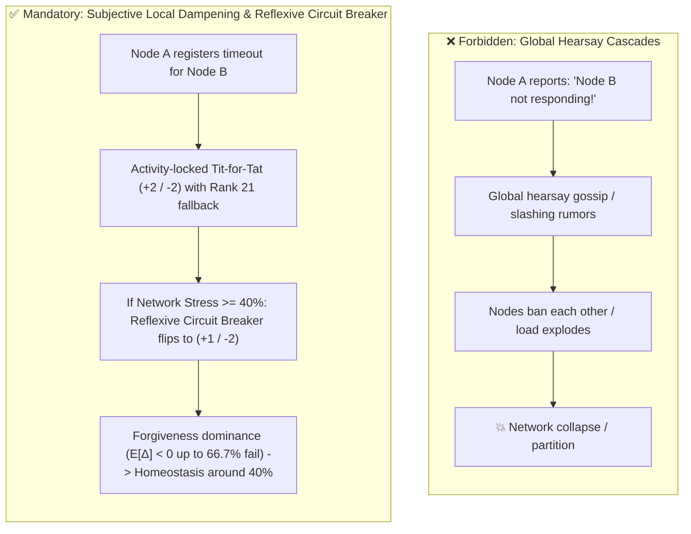
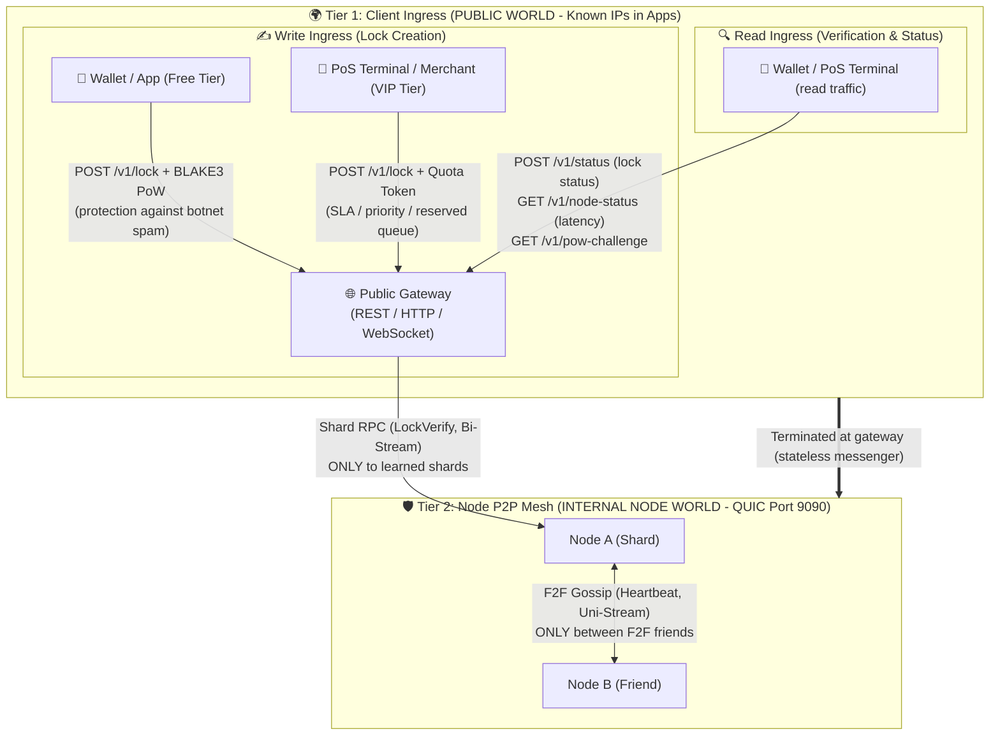

# 🧠 HuMoCo Layer 2 – Master Architecture, Coding Rules & System Context

> **Credo:** *"In decentralization there is no trust, only mathematical proofs."*  
> **Doctrine:** *"Subtraction before Construction – Perfection is achieved when there is nothing left to remove."*  
> **Status:** Phases 0–6 production-ready and implemented (`crates/humoco-sim-core` & `crates/humoco-node`).

This document is automatically loaded on every AI agent startup in the workspace. It defines the immutable **Mental Model**, the **Codebase Structure**, the **subjective local node perspective**, the **KISS Extension Filter**, and the **iron-clad programming rules** for all future coding, refactoring, and bug-fixing tasks.

---

## 🗣️ Bilingual Language Policy & Translation Guide (DE ↔ EN)

> **⚠️ CRITICAL INVARIANT – BILINGUAL POLICY:**
> * **User / Maintainer communication:** The maintainer / user communicates in **German**. Agents **MUST ALWAYS** reply to the user in **German** (`Antworte dem Benutzer immer auf Deutsch`).
> * **Codebase & documentation:** Source code, Rustdoc comments (`///`), Git commits, GitHub issues, pull requests, and official documentation are written in idiomatic **English**.
> * This invariant is non-negotiable and overrides any other language preference.

* **Canonical term mapping:** For user terminology, the dictionary [`docs/TRANSLATION_GLOSSARY.md`](docs/TRANSLATION_GLOSSARY.md) applies strictly:
  * *Sperrregister* $\rightarrow$ `Collision Lock Registry` / `humoco-node` (asynchronous double-spend registry)
  * *Kassenpfad / Hot-Path* $\rightarrow$ `PoS Hot-Path / Checkout Path` (in-RAM filtering $< 1\,\mu\text{s}$, latency $< 5\,\text{ms}$)
  * *Gutschein-Wurzel* $\rightarrow$ `Voucher Root Anchor` (`root.valid_until` as TTL anchor)
  * *Dorf-Merge* $\rightarrow$ `Village Merge / Mesh Merge` (deterministic convergence via $\min(H_{\text{canon}})$)
  * *Knoten-Souveränität* $\rightarrow$ `Node Sovereignty` (no auto-update, absolute operator veto)
  * *Netzwerk-Thermometer* $\rightarrow$ `Network Thermometer` (decentralized load measurement & dynamic PoW)
  * *Byte-Jahre* $\rightarrow$ `Byte-Years` ($144\,\text{Bytes} \times \text{TTL}$ Storage-Time Product)
  * *5x Wal-Bremse* $\rightarrow$ `5x Whale Brake` (exponential dampening under mass ingress)
  * *Hörensagen-Verbot* $\rightarrow$ `Anti-Hearsay Principle` / `First-Party Evidence` (ban only on cryptographic self-proof)
  * *Keine Kautionen* $\rightarrow$ `Zero Financial Deposits / No Staking` (penalty via `NodePubKey` ban, shard-ticket loss, and WoT exclusion)

---


## 🏛️ 1. The HuMoCo Mental Model (The 5 Pillars)

1. **Pure Blind Collision Lock Registry (Blind Service) & HMC Coupling:**
   * Layer 2 knows neither amounts, nor currencies, nor accounts, nor real names.
   * It is an asynchronous, cryptographic bulletin board for double-spend prevention: `parent_lock -> child_lock`.
   * Domain lock formats and causality rules originate from `human-money-core` (`L2LockEntry`, `L2Verdict`). `humoco-node` decouples via DTO adapters and enforces strict collision checks on the hot path.
2. **Smart Client, Dumb Server (Client-Side Custody):**
   * The server does not store dead history. The client (wallet / PoS terminal) custodies its own causality chain (`ProofChain`) and presents it on demand.
   * On the hot path the server only checks the atomic collision on `parent_lock` in the RAM index ($< 1\,\mu\text{s}$).
3. **Cryptographic Identity (NodePubKey) Trumps Network Topology & Sharding Tickets (HrwRoutingId):**
   * IP addresses and ports are ephemeral, untrusted, and dynamic (NAT, mobile networks, ephemeral ports).
   * The permanent identity anchor for F2F friendship edges and TLS is the **NodePubKey (Ed25519 Public Key)** — immutable and bound to the node for its lifetime.
   * The dynamic **HrwRoutingId (Argon2d Shard Ticket)** `HrwRoutingId = Argon2d(NodePubKey || Nonce || T0)` is used exclusively for HRW scoring (`Score = BLAKE3(HrwRoutingId || Shard_ID)`); it is semantically decoupled from the NodePubKey and replaceable via re-mining.
   * **24h Incubation Wall for Shard Tickets:** A new HrwRoutingId is gossiped immediately but only counted as active in HRW after a 24h maturation period — protection against shard-hopping / guerrilla attacks (targeted grinding for lucrative shards).
4. **Physics Trumps Negotiation:**
   * Partitions and isolated networks heal deterministically and timelessly via $\min(H_{\text{canon}})$.
   * In HuMoCo there are Zero Financial Deposits, no staking, and no monetary deposits (blind L2). On equivocation (double-signing), offenders are punished atomically via irrefutable proof (`HUMOCO_V1_EQUIVOCATION`): the losing branch becomes VOID via $\min(H_{\text{canon}})$, the node identity (`NodePubKey`) is permanently banned, the mined Argon2d shard ticket (`HrwRoutingId`) is invalidated, and all F2F friendship edges in the Web-of-Trust are severed entirely (Identity Revocation & WoT Severance).
   * Dynamic network scaling: Small networks ($N=1\dots3$) start immediately with provisional quorums ($Q=1\dots2$); from $N \ge 20$ full HRW sharding applies ($14/20$ `FINAL`).
5. **Dual-Tier Persistence (Spec 12 & 14):**
   * **Tier 1 (RAM):** `RamIndex` with atomic first-seen collision check ($< 1\,\mu\text{s}$) for PoS latencies $< 5\,\text{ms}$.
   * **Tier 2 (Disk):** Asynchronous batch flush into the pure-Rust ACID key-value engine `redb` via bounded Tokio MPSC queues with graceful-shutdown drain.
6. **Zero State Bloat & TTL:**
   * Every lock entry is bound to the validity of the Voucher Root (`root.valid_until`). After expiry plus a 30s grace period, the entry is physically purged from RAM and disk.

---

## 🔭 2. Local Node Perspective, 2-Tier Network & First-Party Evidence (Spec 11, 15, 19)

In distributed systems, global coordination and hearsay lead to cascading network failures (Cascading Death Spirals). For every agent, the following applies strictly:



### 🌐 The Two Separate Network Tiers: Client Ingress (Public) vs. Node P2P (Internal)



1. **Tier 1 – Public Client Ingress (Apps, PoS terminals -> Gateways):**
   * **Visibility:** Public IPs and hostnames, directly embedded in wallets and apps.
   * **Statelessness & Hydra Resilience:** Gateways are interchangeable messengers without their own shard state. If a public IP fails (ISP block, hoster termination), apps seamlessly rotate to the next gateway.
   * **✍️ Write Ingress (`POST /v1/lock`):**
     - *Free Tier:* Open to everyone, protected by dynamic BLAKE3 Hashcash PoW (*Network Thermometer*).
     - *VIP Tier:* Reserved queues & guaranteed SLAs for merchants via Byte-Years tokens.
   * **🔍 Read Ingress (`POST /v1/status`, `GET /v1/node-status`, `GET /v1/pow-challenge`):**
     - Extremely fast RAM-index lookup ($< 1\,\mu\text{s}$), no disk locking, no write-queue reservation.
     - **1-of-20 Shard Randomization (`INV-0310`):** Gateways query exactly 1 deterministically random node from the top-20 shard nodes for status requests. Read capacity scales linearly with shard size ($20 \times 50.000 = 1.000.000\,\text{Reads/day}$).
     - Protected by token-bucket rate limiting against read DDoS; read spam must never block write queues.
   * **Important:** On Tier 1 *every* client is welcome. P2P ban lists or F2F friendship rules do **not** apply here!

2. **Tier 2 – Internal Node P2P Mesh (Gateway <-> Shards <-> F2F):**
   * **Tier 1 (F2F Gossip):** Heartbeats and topology gossip run **exclusively** via direct F2F friends (`f2f.trusted_pubkeys`).
   * **Tier 2 (Shard-Direct):** Shard RPC connections (lock verification, sync) may **only** be established to/from peers previously learned via F2F gossip (`known_network_nodes`).
   * **P2P Rejection:** Unknown IP addresses on the P2P QUIC port (9090) are hard-rejected (`ConnectionRefused`). This applies **exclusively** to the internal P2P network, never to client ingress!

### 🌐 The Internal 2-Tier P2P Model (Gossip Barrier vs. Shard-Direct):

* **⚡ Checkout Hot-Path (PoS / Ingress) is 100% Shard-Direct RPC, 0% Gossip:**
  - Locks are created via client-to-gateway ingress (`POST /v1/lock`), verified via Shard-Direct RPC (`LockVerifyRequest` / `LockVerifyResponse`), and synchronized via Spec 03 Digest Pull (`ShardDigestRequest` / `ActiveSyncRequest`).
  - **Locks are NEVER gossiped.** Epidemic gossip for lock records is completely eliminated to guarantee deterministic latency and zero network amplification.

* **📡 Strict 2-Stream Mesh Gossip:**
  - P2P Mesh Gossip across F2F edges consists **strictly of exactly two streams**:
    1. **Hourly Heartbeat / Presence Gossip (Spec 11):** 1 packet per hour, $\text{TTL} = 16$, Dunbar fan-out $k = \min(d, \lceil\sqrt{d}\rceil + 1)$. Used exclusively for presence discovery, topological awareness, and median clock synchronization.
    2. **Equivocation Proofs (Spec 10):** Cryptographic first-party fraud evidence (`FRAUD_EQUIVOCATION`) forwarded with priority to isolate and ban double-signing offenders immediately.

1. **Tier 1 – F2F Gossip Tier (`f2f_friends`):**
   * Heartbeats and gossip announcements may **exclusively** be received and forwarded via direct F2F friendship connections (`f2f.trusted_pubkeys` / `f2f.peers`).
   * There is **no** open gossip to the rest of the network. A node never floods rumors or heartbeats to arbitrary network nodes.
   * **Gossip Barrier:** Incoming gossip from non-friends is silently discarded (`can_accept_gossip() == false`).

2. **Tier 2 – Shard-Direct Tier (`known_network_nodes`):**
   * Nodes (e.g. gateways or shard nodes) must establish direct P2P connections for verifications (`LockVerifyRequest`) or syncs.
   * **Authorization rule:** A node may establish or accept a direct P2P connection to another node **only if** that node is in its managed list of nodes (`known_network_nodes`) previously learned via F2F gossip heartbeats.
   * Unknown IP addresses or unlearned nodes on the P2P QUIC port are hard-rejected (`ConnectionRefused` / `401/403 unauthorized`).
   * **Connection Pooling & Lifecycle ($N \ge 5.000$):** Only Tier-1 F2F connections hold persistent QUIC sessions with keep-alive. Tier-2 shard-direct connections run as an ephemeral LRU pool (128–256 sockets) with a 15s idle timeout without keep-alive. Automatic idle close is the normal state and must never be counted as a peer failure.

### The 3 Golden Rules of Local Autonomy:
1. **Purely Subjective View:** Each node judges *only* its direct edges (`my_peers.get(peer).on_miss()`). There is no network gossip about "bad peers".
2. **First-Party Evidence Doctrine:** A node is banned or slashed network-wide **only** when irrefutable cryptographic self-proof by the offender exists (`EquivocationProof` with two genuine signatures of the same node for the same slot). Hearsay is forbidden.
3. **Non-Authoritative Telemetry (`INV-1701`):** Telemetry warnings serve the human operator for diagnosis only. No telemetry value ever triggers an automatic ban (`triggers_auto_ban() == false`).

### 🛒 PoS Checkout Latency vs. Internal Node SLA & Quorum Fast-Exit:
* **Internal Node Processing Time ($< 5\,\text{ms}$):** Pure RAM collision check and local attestation must stay $< 5\,\text{ms}$ to prevent local server queuing under high load.
* **End-to-End Checkout Latency ($500\,\text{ms} \dots 1.500\,\text{ms}$):** For the customer at the checkout, up to 1–2 seconds is fully ergonomic and standard in payment processing. Shard verification timeouts may be relaxed to $1.000\,\text{ms}$.
* **Quorum Fast-Exit ($14/20$) & No Cascading Death Spiral on the Checkout Path:**
  - As soon as $14$ shard signatures are present, the gateway immediately sends `200 OK` to the PoS terminal and cleanly aborts stragglers (`join_set.abort_all()`).
  - Aborted tasks due to fulfilled quorum must **never** be counted as peer failures (`record_failure`).
  - On the checkout path (gateway $\rightarrow$ shard) there is **no Cascading Death Spiral**: shard nodes do not communicate with each other during checkout, and the gateway creates no load cascades on timeout ($\Delta \text{Load} \le 0$ is guaranteed).

---

## 🪓 3. KISS & The 3-Stage Extension Filter ("Less Is More")

Before writing new code for a new feature or requirement, apply this test:

1. **Stage 1 – Is the problem already solved mathematically?**
   * *Example High Availability (Cluster):* Do we need Raft/Paxos? **No.** Multiple nodes participate as normal peers in HRW sharding; the smart client uses multi-homing with fallback IPs.
   * *Example Disaster Recovery:* Do we need cluster backups? **No.** Shard replication ($R=3\dots20$) and digest-pull sync recover lost state after restart in $< 500\,\text{ms}$ from peers.
   * *Example Customer Billing:* Do we need billing in the consensus core? **No.** The node stays cryptographically blind; billing happens via Byte-Years token buckets via the control socket.
2. **Stage 2 – Does the server need to know at all?**
   * If the client (PoS terminal / wallet) can provide or custodies the proof (`ProofChain`), the server must not be burdened with it.
3. **Stage 3 – Separation of Consensus Core and Periphery:**
   * Consensus core (`humoco-node`) = QUIC + RAM index + redb + ingress.
   * Administration, billing & dashboards attach externally via the local control socket (`/tmp/humoco.sock`).

### 🚫 Explicit Negative Guard-Rails (Anti-Hallucination Filter):
1. **Zero Financial Deposits / No Staking on Layer 2:**
   * Layer 2 knows no monetary stakes, collateral deposits, or financial liability/bonding for friends or endorsed peers.
   * Equivocation penalties operate purely cryptographically: permanent `NodePubKey` ban, Argon2d shard-ticket invalidation, branch voiding via $\min(H_{\text{canon}})$, and complete Web-of-Trust severance.
2. **Safe Standard Library (`from_le_bytes`) over Unsafe Crates:**
   * Wire header & binary parsing strictly uses safe standard library methods (`from_le_bytes`, `to_le_bytes`, `try_from`, `checked_*`).
   * No external transmutation crates (`bytemuck`, `zerocopy`) are needed; `#![forbid(unsafe_code)]` is strictly preserved.
3. **Non-Authoritative Telemetry (`INV-1701`):**
   * Telemetry, latency measurements, and health probes are purely diagnostic for human operators and dashboards.
   * No telemetry metric or latency value may ever trigger an automated peer ban or network slashing (`triggers_auto_ban() == false`).

---

## 🚨 4. The 10 Iron-Clad Programming Rules

### 1. ⚡ No I/O & No Mutex on the Hot Path:
* On the PoS lock path (`POST /v1/lock`), never write to disk synchronously.
* RAM collision checks use atomic in-memory CAS operations ($< 1\,\mu\text{s}$). Disk writes are batched asynchronously via bounded MPSC channels.
* **Background decoupling:** Background engines (TTL pruning, DB compaction) must never hold locks on the `RamIndex` during a synchronous `fsync` or write operation.

### 2. 🕰️ No Unsanitized OS System Time on the Consensus Path:
* Never use `std::time::SystemTime::now()` naively for consensus or ingress decisions.
* Time windows are validated strictly relative to `root.valid_until` and the decentralized median time derived from F2F neighbors (`P2pClock` / `SimTime` / Spec 07 / INV-1202).

### 3. 🎯 Strict Idempotency & 409 Collision Semantics:
* Identical lock (`lock_id` equal) on the same parent $\rightarrow$ `200 OK` (Verified).
* Diverging lock on the same parent $\rightarrow$ `409 Conflict` (double-spend detected).
* New lock $\rightarrow$ `201 Created` with signed `Attestation`.

### 4. 🛡️ Panic Freedom in Libraries (No unwrap / expect):
* Never use `.unwrap()` or `.expect()` on external network or API input.
* No unchecked `.partial_cmp().unwrap()` calls on floating-point numbers (use `total_cmp` or safe fallbacks).
* Every error must be propagated cleanly via structured error types (`NodeError`) as `Result<T, E>`.

### 5. 🔐 Length-Prefixed BLAKE3 Domain Separation:
* Every hash in the protocol uses canonical domain tags with length prefix from `humoco-sim-core::crypto`:
  ```rust
  hasher.update(&(domain_tag.len() as u8).to_le_bytes());
  hasher.update(domain_tag);
  ```
  This fully prevents preimage collisions and class swapping.

### 6. 🤖 Subagent Principle for Context Conservation:
* Larger refactorings, module implementations, and test runs are delegated to specialized subagents.
* The main agent keeps the bird's-eye view, monitors invariants, and verifies overall results.

### 7. 🛡️ Strict Separation of F2F Gossip and Shard-Direct RPC (Internal P2P):
* **Scope:** These rules apply **exclusively** to the internal P2P QUIC network (port 9090). The public client ingress (REST port 8080 for write and read traffic) is open/permissionless and never rejects clients due to unknown IPs!
* Gossip (heartbeats, announcements) may **exclusively** be received and forwarded via direct F2F friends.
* Direct shard RPC connections (lock verification, sync) may **only** be established to/from peers previously learned via F2F gossip (`known_network_nodes`).
* Unauthorized foreign gossip packets are discarded; unauthorized shard-direct RPCs are rejected (`unauthorized`).

### 8. 🛡️ First-Party Evidence & Anti-Framing:
* A node must never be banned or slashed based on mere claims, hearsay, or gossip.
* Slashing requires irrefutable proof (`EquivocationProof`): Two genuine Ed25519 signatures of the same node on two divergent payloads for the same slot. Both signatures must be cryptographically verified before any penalty or slashing is triggered.

### 9. 🌊 Streaming Frame Allocation & Cheap-Checks-First:
* Never allocate frame buffers blindly based on untrusted header lengths (`Vec::with_capacity(wire_len)` is forbidden). Buffers grow incrementally with bounded chunks to fend off OOM attacks.
* Always run cheap filters (stateless BLAKE3 Hashcash, token bucket, quota limits) **before** expensive asymmetric operations (Ed25519 signature verification/generation, disk lookup).
* **Stateless Time-Window Hashcash (KISS):** The server stores no PoW challenges in RAM (`issued_challenges` is forbidden). PoW is derived directly from `BLAKE3(len || "HUMOCO_V1_POW_STATELESS" || parent_lock || epoch_slot || nonce)` with a 10-minute time window (0 ms pre-latency).
* **Time-Based Instead of Event-Based Dampening:** Moving averages (EMA) for rate limiting and load measurement must never decay per transaction/event, but strictly as a function of physically elapsed time $\Delta t_{\text{sec}}$. This prevents high-frequency spammers from artificially accelerating their own dampening.
* **Adaptive Load Feedback (HTTP 429):** If PoW difficulty is insufficient under load, the gateway responds with `HTTP 429 Too Many Requests` and header `X-Required-Difficulty: <N>`. Computational load is dynamically pushed back to the client ($\Delta \text{Load} \le 0$).

### 10. 🧱 Quota Integrity, Origin-Lock Mandate & Reservation-First:
* **Origin lock determines validity:** Gateways/clients must not dictate arbitrary TTLs for successor locks. Successor locks derive their `root_valid_until` and Byte-Years accounting strictly from the signed genesis lock of the root. If the origin lock is unknown, the lock is rejected with `400 Bad Request`.
* **Reservation-First Backpressure:** Never mutate the `RamIndex` before securing asynchronous disk capacity. Reserve with `tx.try_reserve()` before RAM mutation. If the queue is full, the request is rejected immediately (`RejectedCapacity` / `429 Too Many Requests`) without polluting RAM.
* **Zero State Bloat (No Tombstones):** An expired voucher can never be double-spent, as clients and nodes can mathematically prove and reject its expired `root.valid_until`. Expired locks are purged entirely from RAM and disk; permanent tombstones are forbidden.


---

## 🗺️ 5. Codebase Map & Directory Structure

```text
human-money-node/
├── Cargo.toml               # Workspace Manifest
├── AGENTS.md                # THIS DOCUMENT (Canonical System Context)
├── ROADMAP.md               # Phase Plan & Milestones (Phases 0-6: 100% Complete)
│
├── crates/
│   ├── humoco-sim-core/     # Pure mathematics, state machines, determinism
│   │   ├── src/
│   │   │   ├── crypto.rs    # BLAKE3 domain tags, Ed25519, canon resolver min(H_canon)
│   │   │   ├── storage.rs   # RamIndex (< 1µs CAS), IngressWindow & TTL bucket pruning
│   │   │   ├── quota.rs     # Byte-Years (Storage-Time Product) & 5x Whale Brake
│   │   │   ├── resolver.rs  # Deterministic split-brain resolver
│   │   │   ├── wire.rs      # 32-byte C-aligned WireHeader (INV-1001)
│   │   │   └── types.rs     # Universal types (LockRecord, SimTime, Attestation)
│   │   └── tests/           # 17 deterministic specification test suites
│   │
│   └── humoco-node/         # Real production daemon
│       ├── src/
│       │   ├── config.rs    # humoco.toml configuration engine
│       │   ├── identity.rs  # Ed25519 NodePubKey, POSIX 0600 & Argon2d HrwRoutingId (shard ticket)
│       │   ├── daemon.rs    # Tokio runtime & graceful shutdown (CancellationToken)
│       │   ├── storage/     # redb ACID engine, DualTierEngine & async flush
│       │   ├── network/     # Quinn QUIC P2P transport, TLS 1.3 & PeerManager
│       │   ├── ingress/     # 3-tier access control (VIP quota, F2F, BLAKE3 Hashcash PoW)
│       │   ├── api/         # Axum REST server (/v1/lock, /v1/sync, /metrics)
│       │   ├── control/     # UNIX Domain Socket IPC for local admin CLI
│       │   └── cli.rs       # CLI commands: init, keygen, run, status, peers, quota
│       └── tests/           # Storage, network, API, control & E2E cluster tests
│
├── docs/                    # 21 binding specifications (00 to 20, 99)
└── prompts/                 # 17 specialized AI audit prompts (mutation testing, security, etc.)
```

---

## 🧰 6. Developer Standard Commands

```bash
# Test entire workspace (must always be 100% green)
cargo test --workspace

# Clippy check with strict warnings
cargo clippy --workspace --all-targets -- -D warnings

# Initialize and start node
cargo run -p humoco-node -- init --path ./my-node
cargo run -p humoco-node -- keygen --out ./my-node/node_key.bin
cargo run -p humoco-node -- run --config ./my-node/humoco.toml

# Query status and peers via local control socket
cargo run -p humoco-node -- status
cargo run -p humoco-node -- peers
```
