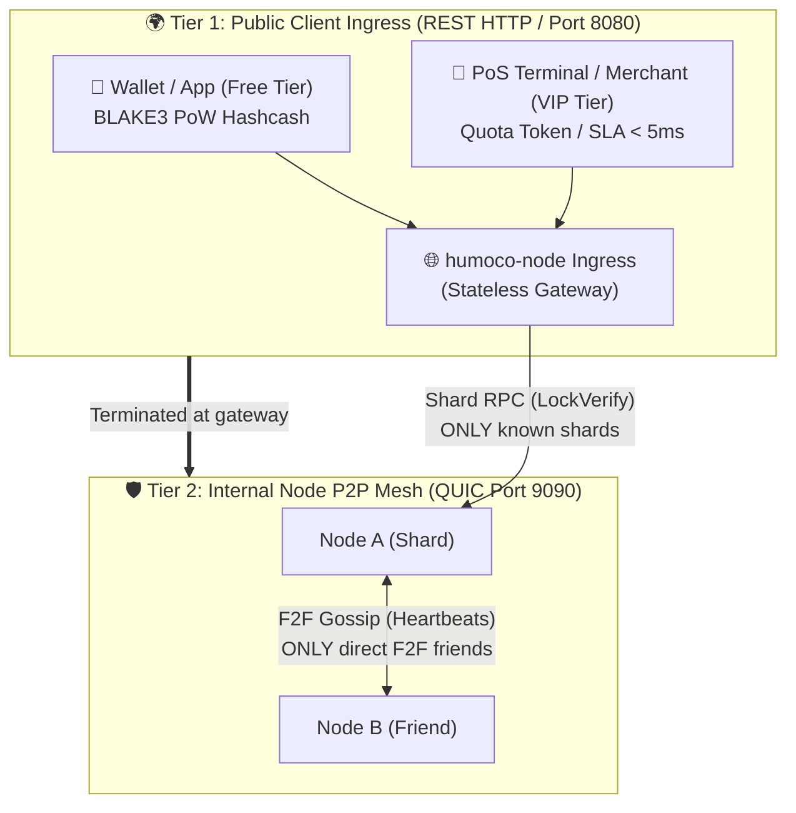

# Human Money Node (`humoco-node`) – Decentralized Collision Lock Registry

> **Credo:** *"In decentralization there is no trust, only mathematical proofs."*  
> **Doctrine:** *"Subtraction before Construction – No I/O on the Hot Path – Strict 409 Collision Semantics"*

> [!IMPORTANT]
> **🚧 Project Status: Active Development / Pre-Testnet**  
> `human-money-node` is currently in the active development and testing phase. The implementation of consensus and node subsystems (Phases 0 through 6) is complete and verified with 100% passing tests, but **no public live network / testnet nodes are operating yet**. The software is currently intended for developers, researchers, and local simulation / integration with [`human-money-core`](https://github.com/humoco/human-money-core).

Human Money Node is **not a blockchain** and **not an account ledger**, but an ultra-fast, asynchronous, stateless **Collision Lock Registry** (Chain of Authority / Layer 2 for Human Money). Its sole purpose is to mathematically guarantee the uniqueness of cryptographic voucher paths (double-spend prevention) via *stealth locking* (`parent_lock -> child_lock`).

---

## ⚡ Quick Start: Run Your Own Node (`humoco-node`)

`humoco-node` is the production-ready daemon in pure Rust. It uses native Quinn QUIC transport, a lock-free in-memory RAM index ($< 1\,\mu\text{s}$), and persists asynchronously to the pure-Rust ACID key-value engine `redb`.

### 1. Installation & Build
```bash
# Clone the repository
git clone https://github.com/humoco/human-money-node.git
cd human-money-node

# Build the node daemon (release mode)
cargo build --release -p humoco-node
```

### 2. Initialize Node & Generate Identity
```bash
# Create working directory and generate default configuration
./target/release/humoco-node init --path ~/.humoco

# Generate Ed25519 key pair for the node (secured with POSIX 0600)
./target/release/humoco-node keygen --out ~/.humoco/node_key.bin
```

### 3. Start the Node
```bash
./target/release/humoco-node run --config ~/.humoco/humoco.toml
```

### 4. Query Status & Peers via Local Control Socket
Control the running node via the local Unix Domain Socket (`/tmp/humoco.sock`):
```bash
./target/release/humoco-node status
./target/release/humoco-node peers
```

---

## 🏛️ Architecture & The Two Network Tiers



1. **Tier 1 – Public Client Ingress (REST / Port 8080):**  
   Open to wallets, PoS terminals, and apps. Supports `POST /v1/lock` (PoS checkout), `POST /v1/status` and `GET /metrics` (Prometheus).
2. **Tier 2 – Internal Node P2P Mesh (QUIC / Port 9090):**  
   Pure node-to-node network. Heartbeats and topology run strictly via **F2F friends**; shard RPC connections are only established to learned shard peers. Unknown external connections on port 9090 are rejected.

---

## 🛡️ Node Sovereignty & Security (Zero Auto-Update)

In HuMoCo there are **no automatic updates and no remote code execution**. The node operator retains full control over their server.

* **No Auto-Update:** Updates are never executed in the background. The operator decides.
* **2-Minute AI Audit:** Before applying an update, any operator (even without programming knowledge) can have an AI review the Git diff. A complete guide with a ready-made prompt is available at:
  * 📖 **[`SECURITY.md`](SECURITY.md)** – Security policy & threat model.
  * 🤖 **[`prompts/17_update_and_supply_chain_verification.md`](prompts/17_update_and_supply_chain_verification.md)** – Copy-paste prompt for Claude, ChatGPT & Gemini.
* **Quorum Immunity (14/20):** Even if malicious updates run on individual nodes, the 14/20 quorum prevents forged locks. Double-spenders are slashed on Layer 1 via `EquivocationProof`.

---

## 🐳 Deployment (Docker & systemd)

Pre-configured production templates are located in [`deploy/`](deploy/):

* **Docker & Docker Compose:**
  ```bash
  cd deploy/docker
  docker compose up -d
  ```
* **Systemd Service Unit:**  
  Templates for systemd at [`deploy/systemd/humoco-node.service`](deploy/systemd/humoco-node.service).
* **Reverse Proxy (Caddy / Nginx):**  
  TLS termination and rate limiting at [`deploy/caddy/`](deploy/caddy/) and [`deploy/nginx/`](deploy/nginx/).
* **Operations Guide:** Detailed documentation in **[`docs/OPERATIONS.md`](docs/OPERATIONS.md)**.

---

## 🗂️ Workspace Structure

```text
human-money-node/
├── Cargo.toml               # Workspace Manifest
├── LICENSE                  # MIT License
├── SECURITY.md              # Node Sovereignty, Threat Model & AI Audit Guide
├── AGENTS.md                # Canonical System Context & Iron-Clad Programming Rules
│
├── crates/
│   ├── humoco-sim-core/     # Pure mathematics, state machines, in-memory simulation & DST tests
│   │   ├── src/             # BLAKE3 domain tags, WireHeader, RamIndex, quotas
│   │   └── tests/           # 17 deterministic specification test suites
│   │
│   └── humoco-node/         # Real production daemon
│       ├── src/
│       │   ├── daemon.rs    # Tokio runtime & graceful lifecycle
│       │   ├── identity.rs  # Ed25519 NodePubKey & Argon2d HrwRoutingId
│       │   ├── storage/     # redb ACID engine, DualTierEngine & async flush
│       │   ├── network/     # Quinn QUIC P2P transport, TLS 1.3 & PeerManager
│       │   ├── ingress/     # 3-tier access control (VIP quota, F2F, BLAKE3 PoW)
│       │   ├── api/         # Axum REST server (/v1/lock, /v1/sync, /metrics)
│       │   └── control/     # UNIX Domain Socket IPC (/tmp/humoco.sock)
│       └── tests/           # E2E cluster, storage, API & network tests
│
├── deploy/                  # Docker, Compose, Caddy, Nginx, systemd
├── docs/                    # 21 specifications (00 to 20, 99)
└── prompts/                 # 17 specialized AI audit prompts
```

---

## 🧪 Tests & Verification

```bash
# Test entire workspace (all unit & integration tests)
cargo test --workspace

# Clippy linter with strict warnings
cargo clippy --workspace --all-targets -- -D warnings
```

---

## 🚀 CLI Simulator (`humoco_sim`)

For educational, demonstration, and research purposes, `humoco-sim-core` includes a standalone simulator:

```bash
cargo run -p humoco-sim-core --bin humoco_sim -- <command>
```

| Command | Description |
|--------|-------------|
| `split-brain` | Simulates 20 nodes with 60/40 partition, $\min(H_{\text{canon}})$ conflict resolution, and automatic merge. |
| `social-defense` | Visualizes botnet detection vs. multi-homed cluster (Dunbar-RED). |
| `chaos` | 30% packet loss + 7/20 node crash with quorum recovery. |
| `topology` | Tabular overview of all nodes, shards, and attestations. |

---

## ⚖️ License

This project is licensed under the **[MIT License](LICENSE)**.
