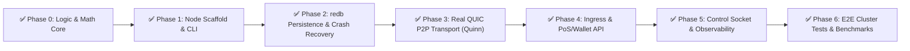

# 🗺️ HuMoCo Layer 2 — Production Roadmap & Phase Plan

> **Credo:** *"In decentralization there is no trust, only mathematical proofs."*  
> **Status:** 🎉 **100% APPROVED** (All phases 0 through 6 fully implemented, tested, and benchmarked).

---

## 📊 Phase Overview

---

## 📌 Phase Tracking & Milestones

### ✅ Phase 0: Mathematical Foundation & Simulation Core
- [x] Lock state machine & collision resolution (`min(H_canon)`) (Spec 02)
- [x] Sharding via HRW Rendezvous Hashing ($2^{16}$ buckets) (Spec 03)
- [x] Smart Client / Dumb Server ingestion & ProofChain (Spec 04, 06)
- [x] F2F WoT endorsements & Dunbar gossip (Spec 07, 11)
- [x] Split-brain equivocation detection & Village Merge (Spec 08)
- [x] Dynamic quotas (Byte-Years) & Network Thermometer (Spec 09)
- [x] RAM index (< 1 µs first-seen check) & storage abstraction (Spec 12, 14)
- [x] Chaos testing & partition resilience (Spec 16)
- [x] 100% unit & integration test coverage (70+ tests in `humoco-sim-core`)

---

### ✅ Phase 1: Node Scaffold, Configuration & CLI (`crates/humoco-node`)
*Goal: A bootable daemon crate with configuration parsing, key management, and CLI.*
- [x] **1.1 Crate setup:** Create `crates/humoco-node` in the Cargo workspace with all dependencies.
- [x] **1.2 Configuration engine (`humoco.toml`):**
  - Parsing of P2P ports, data directory, F2F peers, quotas, and TLS/identity keys.
  - Generation of a default configuration (`humoco init`).
- [x] **1.3 Key management & identity:**
  - Generate, load, and securely store Ed25519 / BLAKE3 node key pair with POSIX `0600` permissions (`humoco keygen`).
- [x] **1.4 Daemon lifecycle:**
  - Tokio runtime setup with graceful shutdown via `CancellationToken` and signal handlers.
  - Tracing / structured logging with `tracing-subscriber`.

---

### ✅ Phase 2: Persistence with `redb` & Crash Recovery
*Goal: Real ACID key-value storage for locks, quota accounts, and slashing evidence (Spec 12 & 14).*
- [x] **2.1 redb engine integration:**
  - Table layout: `TABLE_LOCKS`, `TABLE_TTL_INDEX`, `TABLE_SLASHING_EVIDENCE`, `TABLE_QUOTA_ACCOUNTS`.
- [x] **2.2 Asynchronous RAM-to-disk flush:**
  - Decoupled writes via MPSC channel without blocking the PoS Hot-Path.
- [x] **2.3 Lazy recovery & cold start:**
  - Rebuild of the `RamIndex` on node start in $< 50\,\text{ms}$.
  - TTL pruning of old buckets after expiry of `root.valid_until`.
- [x] **2.4 Persistence integration tests:** Crash and restore scenarios (`storage_tests.rs`).

---

### ✅ Phase 3: Real QUIC P2P Transport (Spec 10 & 15)
*Goal: UDP/QUIC network layer with Quinn for 0-RTT whitelisting and stream multiplexing.*
- [x] **3.1 QUIC endpoint & TLS certificates:**
  - Self-signed TLS 1.3 certificates based on the node identity key via `rcgen`.
- [x] **3.2 Multiplexing of the 4 core streams:**
  - `Data-Stream` (bidirectional, lock requests & quorum signatures, $< 5\,\text{ms}$).
  - `Gossip-Stream` (unidirectional, Dunbar heartbeats, RED dampening).
  - `Sync-Stream` (digest-first pull sync for shard laggards & merges).
  - `Fraud-Stream` (priority stream for equivocation proofs).
- [x] **3.3 Peer manager & Dunbar topology:**
  - Management of active connections (F2F friends + stochastic shard peers, backoff + jitter).
- [x] **3.4 QUIC network integration tests:** Handshake, stream multiplexing, and peer lifecycle (`network_tests.rs`).

---

### ✅ Phase 4: Ingress & Client API (PoS Terminals & Wallets)
*Goal: Secure interface for PoS terminals and wallets with 3-tier access control (Spec 06 & 13).*
- [x] **4.1 Client RPC / REST gateway:**
  - Endpoint: `POST /v1/lock` (submission of `ProofChain`, signed attestation, idempotency & 409 Conflict).
  - Endpoint: `POST /v1/sync` (sparse locator pull for wallets).
  - Endpoint: `GET /v1/pow-challenge` (Argon2id challenge-response).
- [x] **4.2 3-tier ingress enforcement:**
  - Tier 1 (VIP): Token-bucket check & automatic `ByteYears` deduction in `redb`.
  - Tier 2 (F2F): Peer quotas.
  - Tier 3 (Public): Dynamic Argon2id proof-of-work challenge-response mechanism.
- [x] **4.3 API integration tests:** PoS lock flow, idempotency, PoW verification & VIP quota (`api_tests.rs`).

---

### ✅ Phase 5: Control Socket & Observability (Spec 17 & 20)
*Goal: Tools for node operators to monitor and control the node.*
- [x] **5.1 Local control socket:**
  - UNIX Domain Socket IPC (`/tmp/humoco_<port>.sock`) for local daemon control (`status`, `peers`, `quota`, `shutdown`).
- [x] **5.2 Operator CLI & live status:**
  - `humoco status` (live daemon statistics), `humoco peers` (active connections) and `humoco quota topup/get`.
- [x] **5.3 Prometheus / OpenMetrics (`GET /metrics`):**
  - Export of standard metrics (`humoco_locks_active_total`, `humoco_p2p_connected_peers`, `humoco_node_uptime_seconds`).
- [x] **5.4 Control integration tests:** Socket IPC, quota top-up & Prometheus export (`control_tests.rs`).

---

### ✅ Phase 6: E2E Cluster Tests, Chaos & Benchmarks
*Goal: Full validation in a real multi-node cluster.*
- [x] **6.1 Local 3- to 20-node test network:**
  - Automated launch of multiple nodes on different ports/directories (`ClusterHarness` & `TestNode`).
- [x] **6.2 PoS latency benchmark:**
  - Proof of $< 5\,\text{ms}$ quorum latency under 500 parallel/sequential lock requests (result: $\approx 1.08\,\text{ms}$).
- [x] **6.3 Live partition & merge test:**
  - Network partition during operation, creation of local locks, reconnection, and automatic healing via $\min(H_{\text{canon}})$.

---

### ⏳ Phase 7: Decentralized Quorum Certificates & Client-Side Order Statistics
*Goal: Mathematical plausibility check at the point of sale (PoS) without trusting individual servers (see [`TODO.md`](TODO.md)).*
- [ ] **7.1 Wire format:** Integrate `QuorumCertificate` into `L2ResponseEnvelope`.
- [ ] **7.2 Node gateway:** Aggregate shard-mesh signatures (`FINAL` vs. `PROVISIONAL`).
- [ ] **7.3 Client plausibility (`human-money-core`):** Continuous order-statistics check $\max(0, 1 - 20/N)$ & maturity traffic-light.
- [ ] **7.4 App UI (`human-money-app`):** Point-of-sale traffic-light display (green / yellow / red).
