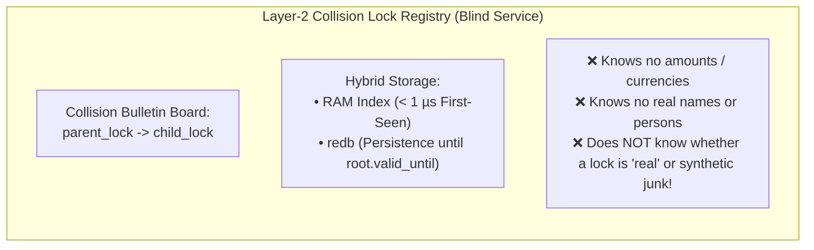
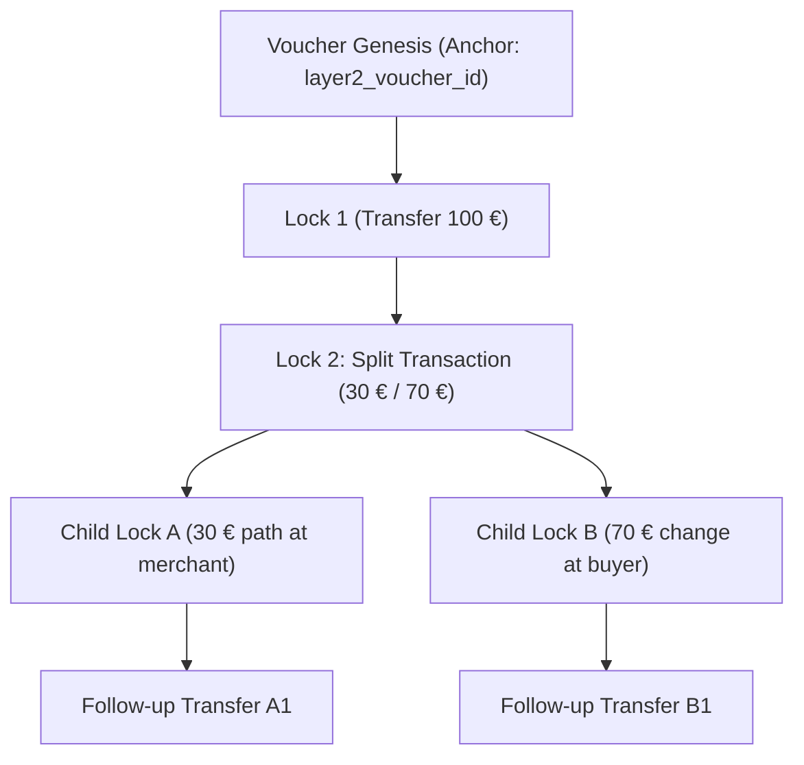
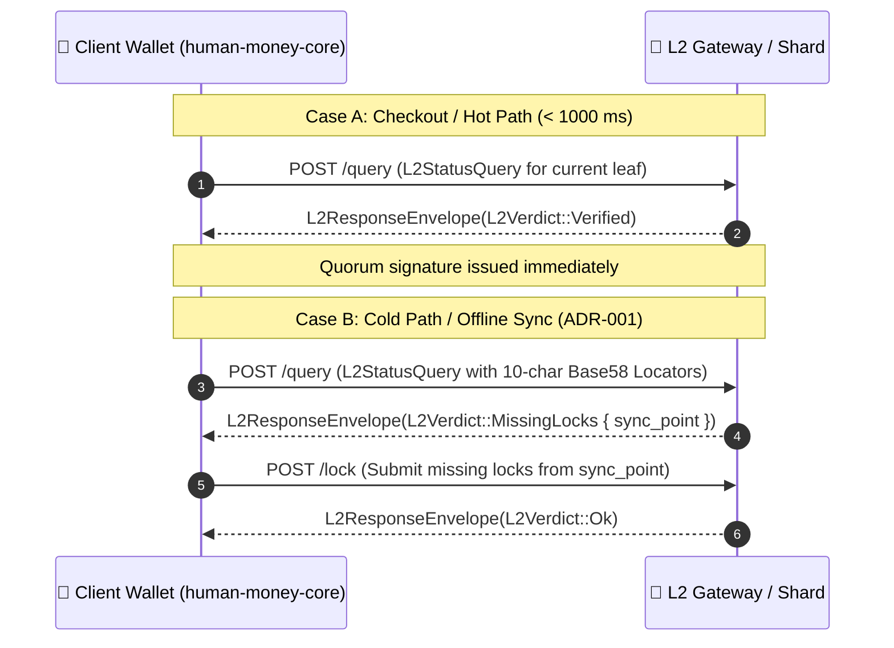

# 00. Architecture Foundation & Binding Mental Model

> **Status:** Canonical Architecture Doctrine  
> **Validity:** Authoritative for all subsequent chapters (`docs/01` through `docs/17`, `docs/99`)

This document defines the foundational **Mental Model** of the HuMoCo Layer-2 Collision Lock Registry. It serves as the binding reference for humans and AI agents to preemptively exclude misconceptions from the traditional blockchain world (e.g., staking pools, mempools, UTXO pruning on L1).

---

## 1. The Nature of the Voucher (Layer-1 Voucher as Mini-Blockchain)

1. **Autonomous State Container:** A voucher on Layer 1 (`human-money-core`) is not a mere balance in a centralized database, but a **self-contained mini-blockchain** (`Voucher.transactions`).
2. **Fixed Lifetime (`valid_until`):** The expiration date defined in the genesis/root certificate (`valid_until`, typically **1 to 10 years**) is immutable. There is **no premature deletion**.
3. **Complete History on L1:** The transaction chain (`Voucher.transactions`) is **never truncated or purged** in the wallet. The full chain from `init` to the current leaf is mandatory for mathematical integrity and fraud detection.

---

## 2. The Role of Layer 2: A Blind Collision Lock Registry

Layer 2 is **not a blockchain**, has **no smart contracts**, and maintains **no balances**.

* **Semantic Blindness of the Server (Crucial Mental Model):**  
  The server has **no access to Layer-1 state** and does not know whether a lock is backed by a real voucher worth 50 € owned by a person or by an offline, purely mathematically generated key pair (synthetic junk). To the server, every lock is merely a cryptographic 144-byte constraint (`parent_lock` $\rightarrow$ `child_lock`).
* **Protection via Protocol Barriers Only:** The server defends against junk exclusively through **ingress quotas ($\mu\text{BJ}$)**, **144-byte RAM limits**, **TTL purging (`valid_until`)**, and **14/20 BFT quorum certificates**, never through substantive voucher validation.
* **Function:** Prevents double-spending by atomically registering, for each consumed state (`parent_lock`), which new stealth lock (`child_lock`) consumed it.
* **Lifecycle:** L2 retains the lock state exactly as long as the Voucher Root remains valid (`root.valid_until`). After expiry, the entire tree is physically purged in $O(1)$ (*Zero State Bloat*).

---

## 3. Voucher Splits: The Lock Tree (DAG on L2)

When a voucher is split (e.g., 30 € to the merchant, 70 € change to the buyer), the transaction creates two new stealth outputs (`receiver_ephemeral_pub_hash` and `change_ephemeral_pub_hash`).

* **Tree Structure:** On L2, the history of a voucher is **not a linear chain but a tree (DAG)**.
* **Attachment Points:** The split creates **two new, independent attachment points** on the same voucher anchor (`layer2_voucher_id`) for future lock entries.

---

## 4. Point-of-Sale (Fast Path) vs. Wallet Sync (Cold Path via ADR-001)

The system strictly separates sub-second checkout from asynchronous catch-up of missed state:

1. **Hot Path (Checkout):** When the registry knows the current state, it returns `Verified` in $< 5\,\text{ms}$.
2. **Cold Path (Sync):** When the registry does not know the leaf, it compares the logarithmically thinned **10-character Base58 prefixes** (`locator_prefixes`: $1, 2, 4, 8, \dots$), finds the Last Common Ancestor (`sync_point`) in $O(1)$, and requests the missing intermediate locks.

---

## 5. Tiered Finality: Security Boundaries & Quorums

| Tier | Condition | Quorum Formula $Q(R)$ | Status | Meaning |
| :--- | :--- | :--- | :--- | :--- |
| **Island Network / Village** | $N_{\text{active}} < 20$ | $\left\lfloor \frac{2R}{3} \right\rfloor + 1$ | `PROVISIONAL` (Yellow, `0x00`) | Full BFT ordering within the local network; warning to checkout for large amounts |
| **Global Shard Network** | $N_{\text{active}} \ge 20$ (stable for $\ge 24\text{h}$) | $\ge 14$ of $20$ ($70\%$) | `FINAL` (Green, `0x01`) | Global irreversibility and protection against cross-partition fraud |
| **High Assurance** | $N_{\text{active}} \ge 100$ (stable for $\ge 24\text{h}$) | $\ge 16$ of $20$ ($80\%$) | `HIGH_ASSURANCE` (Dark Green, `0x02`) | Elevated security requirement for institutional transactions / large amounts |

* **Closed Quorum Formula:** For all $R \in [1, 20]$:
  $$Q(R) = \left\lfloor \frac{2}{3} R \right\rfloor + 1$$
  *(Yields exactly $R=1 \rightarrow 1/1$, $R=2 \rightarrow 2/2$, $R=3 \rightarrow 3/3$, $R=10 \rightarrow 7/10$, $R=20 \rightarrow 14/20$).*

---

## 6. Collision Resolution & Layer-1 Slashing Reality

1. **Live Checkout:** Atomic first-seen check on `parent_lock`. First arrival locks the parent. Second attempts are immediately rejected with `409 Conflict`.
2. **Partition Merge:** When two offline branches that diverged meet, $\min(H_{\text{canon}})$ acts as the deterministic arbiter.
3. **Slashing on Layer 1:**
   - The resulting `ProofOfDoubleSpend` (two colliding signatures) is handed to Layer 1.
   - **Consequences on L1:**
     1. The affected voucher is atomically set to `VoucherStatus::Quarantined`.
     2. Via **Shared-Signature Trap (SST)** the perpetrator is mathematically de-anonymized (`did:key`).
     3. The perpetrator is permanently ostracized in the Web of Trust as `KnownOffender` and held civilly liable.

---

## 7. The Reference Codebase: `human-money-core`

* The Layer-1 source code resides in directory `../human-money-core`.
* For any implementation or specification question regarding voucher formats, wire models (`L2LockRequest`, `L2StatusQuery`, `L2ResponseEnvelope`), or hashing schemes (`HMC_TX_AUTH_V3`), this source code is the **Single Source of Truth**.

---

## 8. The Doctrine of Systemic Simplicity (Occam's Razor & Emergent Safety)

A central architectural guiding principle of HuMoCo is: **Less is more — Holistic physics beats special-case code.**

1. **Apparent Obstacles as Emergent Safety Functions:**  
   When apparent obstacles arise in theoretical edge cases (e.g., *"A 5-node village cannot ingest all heartbeats of a 10,000-node network over a single edge"*), the reflex must **never** be to immediately add new special rules, dynamic exception switches, or complex protocol paths.  
   In a bio-mimetic system, this apparent "bottleneck" is often the **intended physical safety barrier**: it protects the small village from flooding, fends off 10,000-node botnets behind a bridge node, and rewards the natural incentive for true decentralization (**multi-homing over $\ge 3\text{--}5$ edges**).
2. **Intellectual Discipline for New Ideas & Refactorings:**  
   Before any new idea or exception enters the specification or code, three screening questions must always be asked:
    * *Is the observed behavior, from the perspective of the overall system, actually already a sensible, protective invariant?*
    * *Does a local special rule create unforeseeable side effects, flapping risks, or new attack vectors?*
    * *Can the behavior be resolved more simply and robustly through existing physical topology and time laws (Dunbar-RED, maturation hysteresis, small-world fan-out)?*
3. **KISS & YAGNI as Security Guarantee:**  
   Every line of code we *do not* have to write contains no bug, no latency, and no attack vector.
