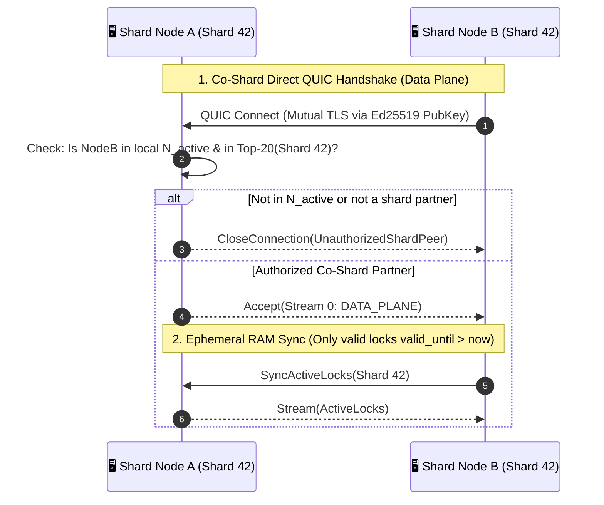

# 01. Organic Network Bootstrap & Topology

> **Status:** Standard  
> **Model:** Logic & State Graph First  

This document describes how the HuMoCo L2 network starts without central servers, without master keys, and without coordination at $N=1$, and organically coalesces village by village into a global mesh.

---

## 1. The Genesis Model: Mathematical Zero Point ($T_0$)

There is **no genesis ceremony** and **no privileged servers**. Every node instance deterministically computes the identical root state purely from the source code:

$$\text{GENESIS\_ROOT} = \text{BLAKE3}\Big(\text{ASCII}("HuMoCo-L2") \mathbin{\Vert} \text{VERSION\_U32} \mathbin{\Vert} T_0\Big)$$

* $T_0$: Fixed Unix timestamp embedded in the binary (e.g., $1770000000 = \text{2026-02-01 00:00:00 UTC}$).
* Serves as global time base for longevity and decay calculations.
* **Autonomous Island Time:** Village networks without internet/NTP use *P2P Network-Adjusted Time* ($\text{net\_time} = \text{local\_clock} + \text{Median}(\Delta t_{\text{WoT}})$) to operate as a coherent time island without external time servers and to synchronize seamlessly upon reconnection.
* Bootstrap servers shipped with the release are **not authorities**, but purely optional relay/discovery points (*"Here you will likely find peers"*).

---

## 2. Topology Evolution: From Island Network to Global Mesh

```mermaid
flowchart TD
    subgraph Phase1["Phase 1: Autonomous Village Network (N < 20)"]
        DorfA_Node1["Node 1 (Village A)"] <--> DorfA_Node2["Node 2 (Village A)"]
        DorfA_Node2 <--> DorfA_Node3["Node 3 (Village A)"]
        DorfA_Client["Smart Client A"] -->|Lock Request| DorfA_Node1
        DorfA_Node1 -->|Local Quorum 3/3 (Q=3)| DorfA_Prov["Lock Status: PROVISIONAL (Yellow)"]
    end

    subgraph Phase2["Phase 2: Autonomous Neighbor Village (N < 20)"]
        DorfB_Node1["Node 1 (Village B)"] <--> DorfB_Node2["Node 2 (Village B)"]
        DorfB_Client["Smart Client B"] -->|Lock Request| DorfB_Node1
        DorfB_Node1 -->|Local Quorum 2/2 (Q=2)| DorfB_Prov["Lock Status: PROVISIONAL (Yellow)"]
    end

    subgraph Phase3["Phase 3: Social First Contact & Technical Merge"]
        DorfA_Node1 -.->|P2P Discovery: QR / BLE / Willow| DorfB_Node1
        DorfB_Node1 -.->|Mutual F2F Peering| DorfA_Node1
        Unified["Unified HRW Node Pool (N = N_A + N_B)"]
    end

    Phase1 --> Phase3
    Phase2 --> Phase3
```

---

## 3. The Two Connection Layers: F2F Overlay & Direct Co-Shard Mesh

The HuMoCo network strictly distinguishes between the **gossip/topology layer** (epidemic dissemination) and the **data plane** (transaction locks within the shard):

```mermaid
flowchart TD
    subgraph Ebene1["1. F2F Gossip Overlay (Friendship Edges)"]
        direction TB
        F1["Friend A"] <-->|Dunbar Gossip & Heartbeats| F2["Friend B"]
        F2 <-->|F2F Peering & Gossip| F3["Friend C"]
        NoteF["• Persistent F2F peering channels only to known partners<br>• Protection against eclipse attacks & routing poisoning"]
    end

    subgraph Ebene2["2. Direct Co-Shard Mesh (HRW Rendezvous Data Plane)"]
        direction TB
        ShardNodeA["Shard Node #1 (Shard 42)"] <-->|Direct QUIC Session (mTLS)| ShardNodeB["Shard Node #2 (Shard 42)"]
        ShardNodeB <-->|Active Lock Sync & Quorum Votes| ShardNodeC["Shard Node #3 (Shard 42)"]
        NoteS["• Direct point-to-point connection between Top-20 shard partners<br>• Gate: Peer MUST be in local N_active set (PoW + Heartbeat presence)"]
    end
```

### 3.1 The Friend-to-Friend (F2F) Gossip Overlay
* **No open foreign gossip peers:** A node opens its persistent P2P gossip and topology channels **exclusively to nodes with which a mutual F2F peering (friendship edge)** exists.
* **Function:** Transports heartbeats and fraud alerts once per hour via small-world percolation.

### 3.2 Direct Co-Shard QUIC Connections (Data Plane)
* **Responsibility Peering:** Each node computes, based on its $N_{\text{active}}$ list, the shards for which it ranks in the Top-20 ($S \in \text{ResponsibleShards}$).
* **Point-to-Point Communication:** To other nodes of the same shard it establishes direct, encrypted **QUIC sessions (mutual TLS Ed25519)** to replicate locks in $< 50\,\text{ms}$ and to reconcile active RAM locks during network merges.
* **Security Gate:** An incoming co-shard connection attempt is accepted only if:
  1. The `NodeID` of the counterpart exists in the local active node set $N_{\text{active}}$ (proven Argon2d PoW $\ge D_{\text{min\_floor}}$ + heartbeat hysteresis), and
  2. The counterpart indeed belongs to the Top-20 nodes of that shard according to HRW.



---

## 4. Invariants of Network Bootstrap

1. **[INV-0101] Keyless Root:** No instance in the network possesses a private key that could authorize or manipulate the genesis root.
2. **[INV-0102] Symmetric Handshake:** A node at $N=1$ behaves protocol-identically to a node in a 10,000-node cluster.
3. **[INV-0103] Strict F2F Gossip Peering:** Persistent P2P gossip and topology connections may be established exclusively along verified F2F friendship edges (eclipse immunity).
4. **[INV-0104] Authorized Co-Shard Connections:** Direct data-plane connections between shard quorum nodes are permissible only between nodes that are both qualified in $N_{\text{active}}$ and lie within the HRW quorum for the same shard.
5. **[INV-0105] Throttling via F2F Edges & PoW:** New peers cannot flood the network with mass Sybil instances, since each identity requires at least the Argon2d minimum floor $D_{\text{min\_floor}}$ ($\ge 1\,\text{h}$ server / $\ge 4\,\text{h}$ Raspberry Pi) and is bound to F2F edges.
