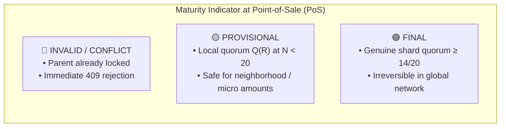
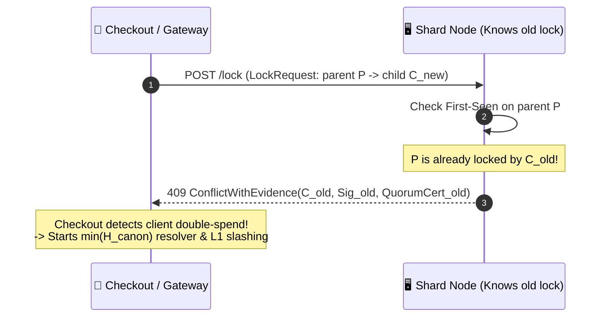

# 02. Lock State Machine & Conflict Resolution

> **Status:** Standard  
> **Model:** Logic & State Graph First  

This document defines the lifecycle of lock entries (*stealth locks*), the maturity indicator (`PROVISIONAL` vs. `FINAL`), and deterministic partition healing via the canonical resolver $\min(H_{\text{canon}})$.

---

## 1. The Lock State Machine

```mermaid
stateDiagram-v2
    direction TB

    [*] --> EphemeralPending: Client sends Lock Request

    state EphemeralPending {
        [*] --> CheckFirstSeen: Shard Ingress
        CheckFirstSeen --> LocalAttestation: First-Seen on parent_lock OK
        CheckFirstSeen --> RejectImmediate: parent_lock already locked
    }

    RejectImmediate --> [*]: 409 Conflict

    state "PROVISIONAL (Yellow)" as Provisional {
        LocalAttestation --> ProvActive: Local quorum Q(R) at N < 20
        ProvActive --> ProvActive: Local neighborhood payments
    }

    state "FINAL (Green)" as Final {
        ProvActive --> FinalActive: Global quorum (>= 14/20 Nodes)
        LocalAttestation --> FinalActive: Direct shard quorum (N >= 20)
    }

    state "VOID / EQUIVOCATION" as Void {
        ProvActive --> SplitBrainDetected: Merge with foreign network
        FinalActive --> SplitBrainDetected: Extreme case long-term partition merge
        SplitBrainDetected --> LoserBranch: min(H_canon) lost
        LoserBranch --> CollisionLoser: Marked null-valued & neutralized
    }

    state "EXPIRED (Purged)" as Expired {
        FinalActive --> ExpiredVoucherPurge: root.valid_until reached
        ProvActive --> ExpiredVoucherPurge: root.valid_until reached
        CollisionLoser --> ExpiredVoucherPurge: root.valid_until reached
    }

    ExpiredVoucherPurge --> [*]: Physical deletion (Zero State Bloat)
```

---

## 2. The Maturity Indicator (Economic Risk Management)

Since isolated sub-networks (villages, offline communities) cannot know whether a voucher is being spent simultaneously in the rest of the world network, L2 communicates the security level as a clear traffic light to the client wallet:



### 2.1 Normative Quorum Tiers

| Status | Mathematical Condition | Permitted Economic Action | Security Guarantee & Risk |
| :--- | :--- | :--- | :--- |
| **`PROVISIONAL` (Yellow)** | $N_{\text{active}} < 20 \wedge \text{sigs} \ge Q(R)$ | Micro-transactions, neighborhood trade, local PoS | BFT safety within the island network; risk of malicious offline cross-spending. Wallet warns user transparently. |
| **`FINAL` (Green)** | $N_{\text{active}} \ge 20 \text{ (stable for } \ge 24\text{h)} \wedge \text{sigs} \ge 14$ | Global merchants, large amounts, long-distance trade | Full global BFT finality ($\ge 14/20$ = 70%). |
| **`VOID` (`KollisionsVerlierer`)** | Losing branch after $\min(H_{\text{canon}})$ | None (transaction is void) | Total failure of the losing path; compensation via Layer-1 equivocation slashing of the perpetrator. |

---

## 3. Deterministic Resolver on Split-Brain ($\min(H_{\text{canon}})$)

When two isolated networks merge and the same `parent_lock` $P$ was bound differently in both networks (double-spend $A$ vs. $B$):

```mermaid
flowchart TD
    Parent["Parent Lock P"] --> LockA["Branch A (Network 1)<br>Recipient A<br>H_canon(A) = BLAKE3(Domain || P || PubA || SigA)"]
    Parent --> LockB["Branch B (Network 2)<br>Recipient B<br>H_canon(B) = BLAKE3(Domain || P || PubB || SigB)"]

    LockA --> Resolver{"Canonical Resolver<br>min( H_canon(A), H_canon(B) )"}
    LockB --> Resolver

    Resolver -->|H_canon(A) < H_canon(B)| WinnerA["Branch A wins:<br>Status = FINAL"]
    Resolver -->|H_canon(B) > H_canon(A)| LoserB["Branch B loses:<br>Status = VOID (KollisionsVerlierer)"]

    LoserB --> EquivocationBan["Equivocation proof (P + SigA + SigB):<br>Permanent P2P ban & WoT exclusion of perpetrator"]
```

### Mathematical Formula of the Resolver
$$H_{\text{canon}}(\text{Lock}) = \text{BLAKE3}\Big(\text{len} \mathbin{\Vert} \text{ASCII}("HUMOCO\_V1\_CANON\_RESOLVER") \mathbin{\Vert} \text{Parent\_Hash} \mathbin{\Vert} \text{Receiver\_Ephemeral\_Pub\_Hash} \mathbin{\Vert} \text{Signature}\Big)$$

* **Order-Independent:** Regardless of which node processes the merge first, the result is bit-identical.
* **Deterministic Arbiter:** $\min(H_{\text{canon}})$ serves as the mathematical arbiter so that all partitioned nodes converge on the same winner without voting.
* **10:10 Quorum Split at Point-of-Sale:** If an exact 10:10 tie occurs in live operation between two parallel branches, neither branch reaches the required quorum ($10 < 14$). Both checkouts immediately receive `409 ConflictWithEvidence`. Only in the subsequent deterministic merge pass does $\min(H_{\text{canon}})$ elect the canonical winning branch.
* **Fraud Protection via Identity Revocation & WoT Severance:** Security against double-spending does not rely on hash "randomness", but on the **complete devaluation and banishment of the perpetrator**: Since the perpetrator signed both branches themselves, an irrefutable *equivocation proof* (`HUMOCO_V1_EQUIVOCATION`) is created, leading to an immediate permanent P2P ban of the node identity (`NodePubKey`), invalidation of the mined Argon2d shard ticket (`HrwRoutingId`), and severance of all F2F friendship edges in the Web of Trust (on L1, de-anonymization via Shared-Signature Trap and permanent ostracism as `KnownOffender` follows).

---

## 4. Server Double-Signing & Fraud Exclusion (`ServerBann`)

What happens if a malicious server node issues a signed quorum OK to two different clients for the same `parent_lock`?

1. **Strict 2-Stream Mesh & Hot-Path Shard-Direct Processing:**
   * Hot-path checkout locks are processed 100% via Shard-Direct RPC and synchronized via Spec 03 Digest Pull (`ShardDigestRequest` / `ActiveSyncRequest`). Locks are NEVER gossiped across the P2P mesh.
   * P2P gossip across F2F edges is strictly confined to (1) Hourly Heartbeats (presence and clock sync) and (2) high-priority `EquivocationProof` fraud packets.
2. **Mathematical Fraud Proof (`HUMOCO_V1_EQUIVOCATION`):**
   * As soon as two signed statements by the same node key for the same slot / `parent_lock` meet anywhere in the network (e.g., presented by smart clients during PoS checkout or discovered via sync digest), the mathematically irrefutable first-party fraud proof exists.
3. **Consequence (`ServerBann`):**
   * The node is instantly banned for life across the entire P2P network (`ServerBann`).
   * Its mined Argon2d shard ticket (`HrwRoutingId`) is immediately invalidated and all F2F friendship edges in the Web of Trust are irrevocably severed (complete Identity Revocation & WoT Severance).

---

## 5. Conflict Reporting with Evidence (`ConflictWithEvidence`) vs. Server Misbehavior

When a shard node receives a lock request for a `parent_lock` already locked in its local RAM index by a prior transaction (e.g., from a preceding island phase):



* **No Server Misbehavior:** The node does not refuse to sign without justification, but provides the irrefutable cryptographic counter-proof (`ConflictWithEvidence`).
* **Immediate Fraud Detection:** The requesting gateway or checkout immediately holds both competing signatures of the issuer. $\min(H_{\text{canon}})$ heals the conflict in $< 1\,\text{ms}$, while the perpetrator is slashed on Layer 1.

---

## 6. Automatic Smart-Client Maturity Upgrade (`PROVISIONAL` $\rightarrow$ `FINAL`)

Locks created in an island network ($N < 20$) carry maturity `PROVISIONAL` (Yellow):
1. **Autonomous Wallet Detection:** As soon as the user's smartphone regains connectivity to the world network ($N_{\text{active}} \ge 20$), the wallet silently sends a background upgrade request in the background:
   $$\text{POST } /\text{promote\_lock} \quad (\text{LockEntry} \parallel Q_{\text{prov}})$$
2. **Free Quorum Upgrade:** The shard quorum of the world network verifies the entry, collects $\ge 14/20$ signatures, and returns the green `FINAL` certificate to the smartphone (0 additional quota cost to the user).

---

## 7. Invariants of Lock Logic

1. **[INV-0201] First-Seen on `parent_lock`:** A shard always accepts only the first valid signature chain for the same `parent_lock`.
2. **[INV-0202] No Resurrection:** A lock once set to `VOID` (`CollisionLoser`) can never become `FINAL` or `PROVISIONAL` again.
3. **[INV-0203] Deterministic Slashing:** Two valid signatures for the same `parent_lock` form a stateless proof that destroys the issuer's key on Layer 1.
4. **[INV-0204] Physical Purge on Root Expiry:** After expiry of `root.valid_until`, active locks and `CollisionLoser` entries are physically and completely purged during `ExpiredVoucherPurge`.
5. **[INV-0205] Evidence-Backed Conflict Reporter:** Rejection of a lock request while presenting a valid counter-signature (`ConflictWithEvidence`) is a legitimate proof and must never be counted as server misbehavior or shard blocking.
6. **[INV-0206] Idempotent Promotion & Hysteresis Binding:** A promotion upgrade from `PROVISIONAL` to `FINAL` (`POST /promote_lock`) is strictly idempotent. It is free of charge only for an identical `lock_hash` without TTL extension and requires satisfying the 24h stability window of the world network ($N_{\text{active}} \ge 20$). Monotonic maturity progress is guaranteed (`0x00` $\rightarrow$ `0x01`).

