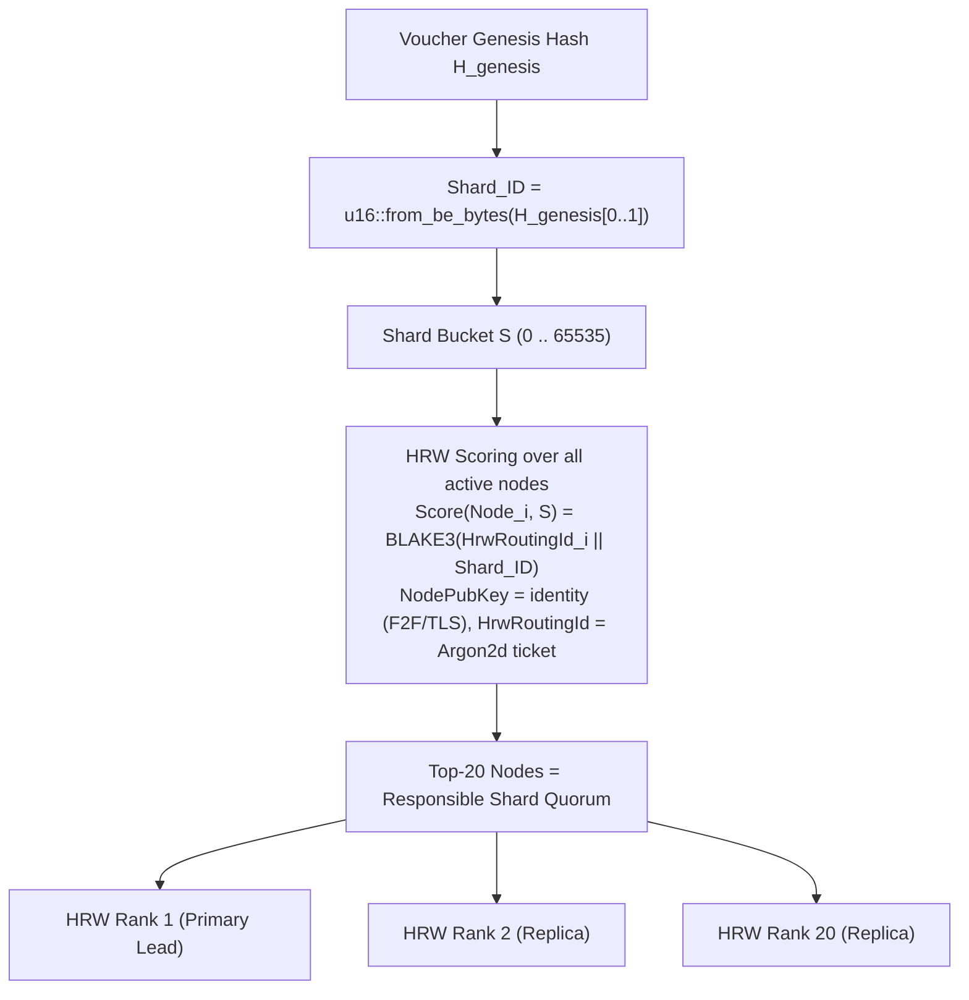
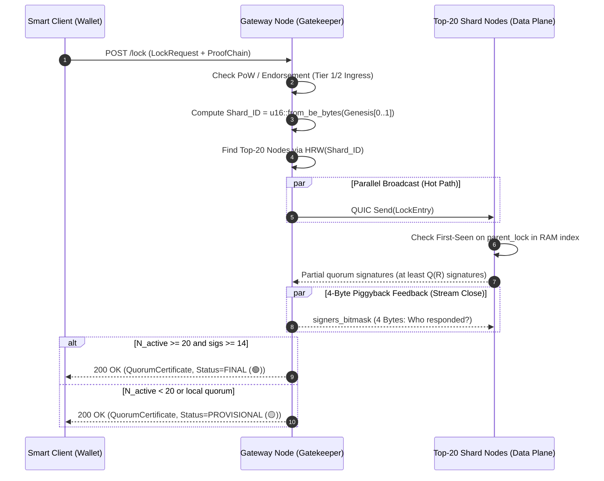
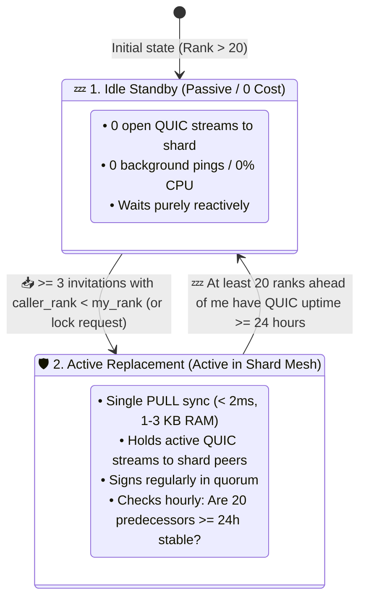

# 03. Routing & Sharding (Static Rendezvous & Lazy Ingest)

> **Status:** Standard  
> **Model:** Logic & State Graph First  

This document describes deterministic $O(1)$ routing via Highest Random Weight (HRW) hashing and the principle of **Lazy History Ingestion**, which prevents foreign networks from dumping spam histories into the system.

---

## 1. The Sharding Model ($2^{16} = 65.536$ Buckets)

The system uses **static rendezvous sharding**. The shard of a voucher is permanently fixed at the day of its creation (genesis) by its genesis hash and never changes:

$$\text{Shard\_ID} = \text{u16::from\_be\_bytes}([\text{Genesis\_Hash}[0], \text{Genesis\_Hash}[1]])$$



---

## 2. Ingress & Shard Routing Path (< 500 ms)



### 2.1 Seamless Quorum & Order-Statistic Verification (KISS Principle)

Both gateway and client verify signer legitimacy via a closed quantile threshold (zero special-case branches in code) and the **$O(1)$ Top-$Q$ pivot method**:

1. **Determine minimum count $Q(R)$:**
   $$R = \min(20, \; N_{\text{active}}), \quad Q(R) = \left\lfloor \frac{2}{3} \times R \right\rfloor + 1$$
2. **Descending HRW score sort:**
   The normalized scores $\text{Score}_i = \frac{\text{BLAKE3}(\text{HrwRoutingId}_i \parallel \text{Shard\_ID})}{2^{256}}$ of all distinct supplied signatures are sorted descending (best rank first). HRW uses exclusively the `HrwRoutingId` (Argon2d ticket); the permanent `NodePubKey` (Ed25519) is used only for F2F/TLS.
3. **Pivot comparison at the $Q$-th element (index $Q-1$):**
   $$\text{Score}_Q \;\ge\; \max\left(0.0, \; 1.0 - \frac{K_{\text{max}}}{N_{\text{active}}}\right) \quad (\text{with } K_{\text{max}} = 40)$$

* **Poisoning Immunity:** If the $Q$-th best signer satisfies the threshold, all $Q-1$ better signers are automatically legitimized. Any junk signatures (e.g., at rank 500) beyond the $Q$ best votes are silently ignored and can never destroy a valid quorum (*Zero Griefing Attack Vector*).
* **Bootstrap & Village Networks ($N \le 40$):** The threshold is $0.0$. All known active nodes are eligible; only the base cardinality $Q(R)$ matters.
* **Large Networks ($N \ge 1.000$):** The threshold automatically filters the top $\approx 40$ HRW candidates of this shard. If individual Top-20 nodes fail, deterministic successors (ranks 21..40) absorb large failures without latency, while fake identities fail with $P > 99{,}9999999999999\%$ mathematical certainty.

### 2.2 Semantic Decoupling & 24h Incubation Wall for HrwRoutingId

> **Decoupling:** `NodePubKey` (Ed25519) = permanent identity for F2F friendship edges and TLS. `HrwRoutingId` (Argon2d ticket) = dynamic shard ticket for HRW. Both are cryptographically bound (`HrwRoutingId = Argon2d(NodePubKey || Nonce || T0)`), but semantically decoupled and replaceable via re-mining.

**24h Incubation Wall (Shard-Hopping Protection):** A new `HrwRoutingId` — whether the first minting of a newcomer or re-mining of an existing node — is immediately propagated via F2F gossip and verified/cached by all peers, but is only counted as active in HRW scoring after a **24h maturation period**. Until the wall expires, only the previous active ticket applies (for newcomers: no HRW rank). This prevents guerrilla attacks via targeted grinding for lucrative shards: an attacker cannot re-roll a shard target at the last second through massive PoW.

---

## 3. Resilience Against Lazy Shard Nodes (Lazy Node Defense)

If a shard node repeatedly fails to respond to lock requests (timeout / work refusal), a 3-stage, jury-free self-healing mechanism triggers:

```mermaid
flowchart TD
    subgraph ShardExecution["1. Parallel Broadcast & Quorum Gathering"]
        G["Gateway"] -->|Send LockEntry to Top-20| Q["Top-20 Shard Nodes"]
        Q --> SigFast["19 fast partial signatures"]
        Q -.-> SigLazy["Node 7: Timeout / Unresponsive"]
    end

    subgraph PiggybackFeedback["2. 4-Byte Feedback (Zero Global Gossip)"]
        G -->|Stream Close with signers_bitmask (4 Bytes)| ActiveNodes["19 active shard nodes"]
        ActiveNodes --> Accounting["Local RAM counter:<br>missing_count[Node_7] += 1"]
    end

    subgraph SelfHealing["3. Shard Repair & HRW Rank 21"]
        Accounting --> Check{"missing_count > Threshold?"}
        Check -->|Yes| Evict["Node 7 locally suspended in shard"]
        Evict --> Promote["HRW rank 21 steps in in 0 ms & syncs locks"]
    end
```

1. **Parallel Broadcast Without Blocking & Local Backoff Cache (Gateway View):**  
   The gateway does not wait for stragglers, but assembles the `QuorumCertificate` as soon as the first $14$ of $20$ signatures are present.  
   * **Local Exponential Backoff Cache ($< 16\,\text{KB}$ RAM):** If a shard node repeatedly fails to respond ($100\,\text{ms}$ timeout), it is marked in the local gateway cache as `UNREACHABLE` with an exponential minute-based backoff (e.g., 1m, 2m, 4m, 8m, etc.). On subsequent locks the gateway no longer queries that node at all, but contacts the succeeding HRW ranks 21..24 directly ($0\,\text{ms}$ wait time for clients).
2. **The 4-Byte Piggyback Ack:** The gateway sends the $4$-byte `signers_bitmask` back to the shard nodes when closing the QUIC streams.
3. **[INV-0310] Stochastic Read Routing (`StatusQuery`) & Read Backoff:**
   * **Uniform Random Load Balancing:** For read queries (`L2StatusQuery` / `StatusQuery`) the gateway does not rigidly query rank 1 (to avoid hotspotting), but uniformly at random selects an unsuspended node from the shard's Top-20:
     $$\text{Target-Node} = \text{UniformRandom}\Big(\big\{ N \in \text{Top20}(\text{Shard\_ID}) \;\big|\; \text{!is\_suspended}(N) \big\}\Big)$$
   * **Read Timeout & Fast Failover:** If the selected shard node does not respond within $100\,\text{ms}$ timeout:
     * The faulty node is penalized with $\text{malus\_score} += 8$ (`record_missing()`) and locally suspended with minute-based backoff.
     * The gateway performs an immediate **fast failover** to an alternative unsuspended shard node from the Top-20 ($< 100\,\text{ms}$ total delay for the client).
     * If the node responds successfully, its malus decreases by $-1$ (`record_success()`).
4. **[INV-0309] Gateway Target-Quorum Difference Check & 8:1 Ratio-Credit Lazy-Node Detection:**
   * **Target comparison against Top-20:** The gateway compares the signers contained in the quorum certificate exactly against the primary HRW ranks $1 \dots 20$ of the shard.
   * **8:1 Asymmetric Ratio-Credit Accounting (Purely Event-Based):**
     * **Missing node (rank $i \in 1..20$ without signature / timeout / unjustified 429):** $\text{malus\_score} = \min(255, \text{malus\_score} + 8)$.
       * Suspension level $k = \text{malus\_score} \gg 3$.
       * Suspension duration in minutes $\text{backoff\_minutes\_left} = \min(65.535, 1 \ll (k - 1)) \text{ minutes}$ ($1\text{m} \to 2\text{m} \to 4\text{m} \to 8\text{m} \to 16\text{m} \dots \to 65.535\text{m} \approx 45{,}5\text{ days}$).
     * **Successful node (valid signature):** $\text{malus\_score} = \max(0, \text{malus\_score} - 1)$ and $\text{backoff\_minutes\_left} = 0$.
     * **Plausible quota rejection (`429 QuotaExceeded`, `INV-0909`):** If a `429` response falls within the tolerant margin ($75\dots 125\,\%$) or the quota overflow is confirmed by the quorum ($\ge 14$ rejections), it counts as proper participation: $\text{malus\_score} += 0$ (no penalty). Only `429` messages in the fraud zone ($< 75\,\%$ of the limit) incur $\text{malus\_score} += 8$.
     * **No automatic time decay:** The malus score decays exclusively through demonstrably successful work (no score reset by merely waiting).
     * **Mathematical error-tolerance threshold ($p^* = \frac{1}{9} \approx 11{,}1\,\%$):** Nodes with up to $10\,\%$ transient line jitter decay statistically toward 0; nodes with $\ge 12{,}5\dots 20\,\%$ failure rate inevitably escalate into multi-day suspensions.
   * **Data-Plane "Skip & Replace":** While $\text{backoff\_minutes\_left} > 0$ the gateway sends no shard locks or queries to that node, but queries HRW successors directly (ranks 21..24) ($0\,\text{ms}$ client delay). Its gossips are locally discarded.
   * **Probe on Expiry:** As soon as $\text{backoff\_minutes\_left} == 0$, the node is queried again as a regular candidate on the next shard request (probation).
   * **Dormant Transition & Memory Retention:** On transition to `DORMANT` ($> 21\text{--}24\,\text{h}$ offline) only $\text{backoff\_minutes\_left} = 0$ is set so the node can be probed upon re-entry. The $\text{malus\_score}$ remains fully preserved (no trust advance through absence).
5. **[INV-0308] Stochastic Gossip Percolation & Starvation Threshold (The 73.1% Weibull Formula):**  
   * **Censorship immunity under partial blocking ($\le 50\,\%$):** Passive non-forwarding of heartbeats by small censorship cartels ($\le 50\,\%$) **cannot isolate** an honest node. Thanks to high triadic closure and small-world paths, gossip reaches $> 99{,}8\,\%$ of all honest nodes.
   * **The exact percolation decay equation (Weibull model, $R^2 = 99{,}90\,\%$):**
     $$\Large R(x) = 100 \cdot \exp\left(-\left(\frac{x}{73{,}1}\right)^{19}\right)$$
     where $x$ is the percentage of suspending/blocking nodes in the overall network and $R(x)$ is the remaining honest gossip reach in percent.
   * **The physical tipping point ($x_c = 73{,}1\,\%$):**
     * **$x \le 64\,\%$:** The network remains $> 90\,\%$ fully connected (giant component).
     * **$x \in [71\,\%, 74\,\%]$:** **Steep phase transition** (the maximum drop of $-17{,}7\,\%$ occurs between $73\,\%$ and $74\,\%$).
     * **$x \ge 78\,\% \dots 80\,\%$:** Gossip physically collapses ($< 1{,}5\,\%$ reach, $\le 7$ hops). The lazy node starves organically and falls to `DORMANT` / purging after 24–48h.
   * **The two cleanup paths:**
     1. **Genuine crash faults:** Starve organically and completely after 24–48h due to the physical absence of fresh cryptographic signatures.
     2. **Lazy nodes (lazy workers):** Are immediately bypassed by gateways at shard level (ranks 21+). If local timeouts in the active network reach the percolation threshold of $\approx 73{,}1\,\%$, their heartbeat gossip also chokes network-wide. Definitive revocation of network presence occurs when direct F2F friends cut the edges ($k \to 0$).

---

### 3.1 The Successor Protocol (Dynamic Shard Healing)

A shard normally consists of the **Top-20 nodes** (ranks 1..20). If shard nodes fail ($> 6$ failures), the next ranks deterministically step in ($21, 22, 23 \dots$):



1. **The incorruptible rank filter ($r_{\text{caller}} < r_{\text{me}}$):**  
   A node at rank $r$ accepts invitations or requests only from nodes whose **HRW rank is strictly smaller** than its own ($r_{\text{caller}} < r$). This excludes spam from deeper ranks at $100\,\%$.
2. **On-Demand PULL Sync (< 2 ms):**  
   When a successor is activated, it loads the current state of active locks (`valid_until > now`, typically 1–3 KB) from reachable shard peers in $< 2\,\text{ms}$ and immediately co-signs.
3. **24h Dwell Time & Anti-Flapping via QUIC Uptime + Cooperation Filter:**  
   An activated successor downgrades back to passive `Idle Standby` only when **at least 20 predecessor nodes ($r < \text{my\_rank}$)** simultaneously satisfy two conditions:
   * They exhibit **uninterrupted QUIC connection uptime of $\ge 24\,\text{hours}$** (any reconnect/flap resets uptime to 0).
   * They are **not suspended as lazy** (`!is_suspended`, i.e., `missing_count < 3` via 4-byte piggyback bitmask). Nodes that remain connected but refuse to cooperate are not counted as stable.

---

## 4. Lazy Ingestion: Defense Against Monster Histories on Network Merges

```mermaid
flowchart TD
    subgraph BadNode["Attacker / Fake Island"]
        MonsterDB["10.000.000 generated fake locks"]
    end

    subgraph ProactiveDump["❌ Proactive Sync (Forbidden)"]
        MonsterDB -.->|Gossip Dump| RejectSync["Shard Node: 'I do not know this shard/quorum' -> REJECT"]
    end

    subgraph LazyIngest["✅ Smart Client Lazy Ingestion (Allowed)"]
        User["Real user"] -->|Wants to spend voucher| Wallet["Smart Client"]
        Wallet -->|Sends lock + 3-element proof chain| LiveNode["Shard Node"]
        LiveNode -->|Checks chain on-the-fly (2 ms)| AcceptLock["Lock accepted & recorded"]
    end
```

### Invariants of Shard Resilience
1. **[INV-0301] No blind replication junk syncing:** A shard node never downloads historical data chains unsolicited for which no active quorum certificate or direct client proof exists.
2. **[INV-0302] Trust-Tree Locality:** All transfers and splits of a voucher remain permanently on the same shard $\text{Shard\_ID}$. Cross-shard transactions do not exist.
3. **[INV-0303] Zero-Gossip Shard Self-Healing:** Departure of uncooperative shard nodes is regulated exclusively shard-internally via piggyback bitmasks and HRW rank-21 promotion; there is no global gossip about faulty shard peers.
4. **[INV-0304] Quorum-verified PULL Sync:** Joining shard nodes may request active state via PULL (`RequestActiveLocks`), but accept only entries with a verified quorum certificate ($\ge 14/20$ signatures or $Q(R)$ at $N < 20$).
5. **[INV-0305] Shard Sync Barrier & Asymmetric Isolation:** A node participates in global $N \ge 20$ shard quorums (`status_tag = 0x01 (FINAL)`) only when its local state is `IN_SYNC` according to the $N_{\text{median}}$ filter. While the node is in state `SYNCING`, it rejects requests for foreign shards with `503 NodeSyncing`, while local `PROVISIONAL` transactions ($N < 20$) continue stably within the autonomous village view.
6. **[INV-0306] Dynamic Succession via Rank Filter:** A node at rank $r$ activates responsibility for shard $S$ (`Active Replacement`) and performs a PULL sync as soon as it receives at least 3 cryptographically verified invitations from nodes with a better rank ($r_{\text{caller}} < r$) or serves a valid lock request.
7. **[INV-0307] 24h QUIC Uptime & Cooperation Invariance:** An activated successor downgrades to passive `Idle Standby` only when at least 20 predecessor ranks exhibit uninterrupted QUIC connection uptime of $\ge 24\,\text{hours}$ AND remain continuously cooperative (`!is_suspended` / `missing_count < 3`). Lazy nodes that keep sockets open but refuse signatures keep the successor permanently active.

---

## 5. Self-Initiated Digest-First PULL Sync for Shard Nodes

A PULL sync is performed **exclusively self-initiated** by nodes that restart (cold start) or must refresh their local RAM index for shard $S$ after a connection loss.

Instead of blindly replicating huge data volumes, the node uses the **2-phase digest-first procedure**:

```mermaid
sequenceDiagram
    autonumber
    participant NodeX as 🆕 Syncing Node X
    participant Top20 as 🌐 Incumbent Top-20 Shard Peers (HRW)
    participant Primary as 📦 Selected Quorum Peer

    Note over NodeX,Top20: Phase 1: 32-Byte Fingerprint Query
    par Parallel to all Top-20 peers
        NodeX->>Top20: GetShardDigest(shard_id = S)
    end
    Top20-->>NodeX: 20x Response: { digest: [u8; 32], lock_count: u32, max_valid_until: u64 }

    Note over NodeX: Phase 2: Majority Clustering (BFT Quorum Q = 14/20)<br/>1. Group responses by digest<br/>2. Find dominant cluster C_max

    alt Cluster >= 14 (Unambiguous BFT Quorum)
        Note over NodeX: Unambiguous majority truth TargetDigest = D*
    else Cluster < 14 (No BFT Quorum / In-Flight Live Traffic)
        Note over NodeX: 500 ms backoff & re-query (no unsafe 11..13 compromises).
    end

    Note over NodeX,Primary: Phase 3: Single Data Stream (Zero Spam)
    NodeX->>Primary: StreamShardLocks(shard_id = S, expected_digest = D*)
    Primary-->>NodeX: Stream(ActiveLocksChunk: [LockEntry_1, LockEntry_2, ...])

    Note over NodeX: Phase 4: O(1) Verification & RAM Commit<br/>1. Filter: valid_until > now<br/>2. Compute BLAKE3 digest over stream == D*?<br/>3. Atomic insert into RAM index
```

### Core Principles of Shard Sync:
1. **Minimal bandwidth:** First only $20 \times 32\,\text{Bytes} = 640\,\text{Bytes}$ of fingerprints are transferred. The actual data stream is loaded from **a single peer** only.
2. **Spam immunity:** A malicious peer cannot inject junk data — if the received stream deviates by even 1 bit from the confirmed majority digest $D^*$, the stream is immediately discarded and the peer isolated.
3. **Deterministic shard computation:**
   $$\text{ShardDigest}(S) = \text{BLAKE3}\Big(0\text{x01} \mathbin{\Vert} \text{Shard\_ID} \mathbin{\Vert} \text{Lock}_1 \mathbin{\Vert} \dots \mathbin{\Vert} \text{Lock}_m\Big)$$
   (over all active locks with $\text{valid\_until} > \text{now}$, lexicographically sorted by `parent_lock`).

---

### 5.1 Baton Principle & 1-Byte Status Level

Since L2 servers are ephemeral and semantically blind, the system does not rely on historical witnesses from years ago, but on the **incumbent Top-20 shard custodians of the current generation**:

1. **Baton Liability:** The incumbent Top-20 peers (from $N_{\text{active}}$) collectively vouch for the current shard state.
2. **Compact 1-Byte Status Tiers in Canonical Signature Digest:**
   When signing a lock, the status is embedded directly into the canonical `SigDigest` via the domain tag and the `status_tag` field (`docs/10:3.2` & `docs/04:224`):
   $$\text{SigDigest} = \text{BLAKE3}\Big(\text{len}(\text{DOMAIN\_TAG}) \parallel \text{DOMAIN\_TAG} \parallel \text{epoch\_id}_{\text{le}} \parallel \text{session\_seq}_{\text{le}} \parallel \text{flags}_{\text{le}} \parallel \text{shard\_id}_{\text{le}} \parallel \text{status\_tag} \parallel \text{payload\_digest}\Big)$$
   * `status_tag = 0x00` (`HUMOCO_V1_APPROVE_PROV`) $\implies$ **`PROVISIONAL` (Yellow):** Tiny networks ($N_{\text{active}} < 20$).
   * `status_tag = 0x01` (`HUMOCO_V1_APPROVE_FINAL`) $\implies$ **`FINAL` (Green):** $N_{\text{active}} \ge 20$ (stable for $\ge 24\text{h}$) and $\ge 14/20$ signatures.
   * `status_tag = 0x02` (`HUMOCO_V1_APPROVE_HIGH`) $\implies$ **`HIGH_ASSURANCE` (Blue/Gold):** $N_{\text{active}} \ge 100$ (large transactions).
3. **Cryptographic Self-Protection:** Honest nodes sign with `status_tag = 0x01` only when their local heartbeat presence indicates $N_{\text{active}} \ge 20$ for at least 24h. A small 14-node network can therefore never produce a valid `FINAL` signature.


