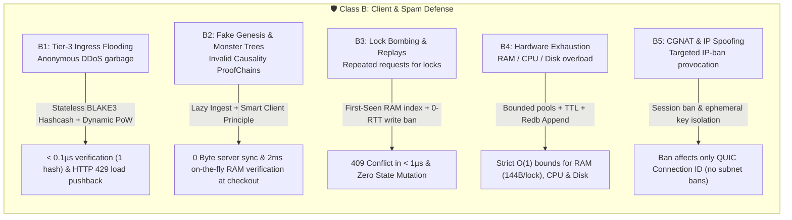
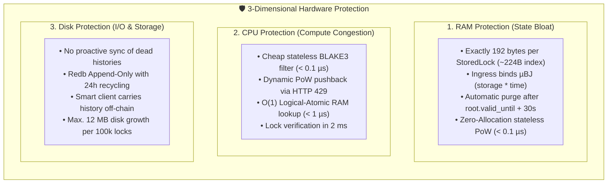
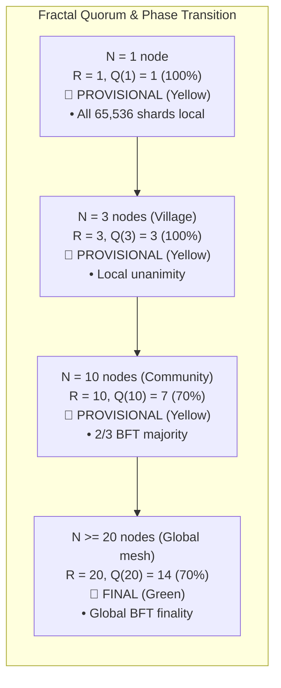
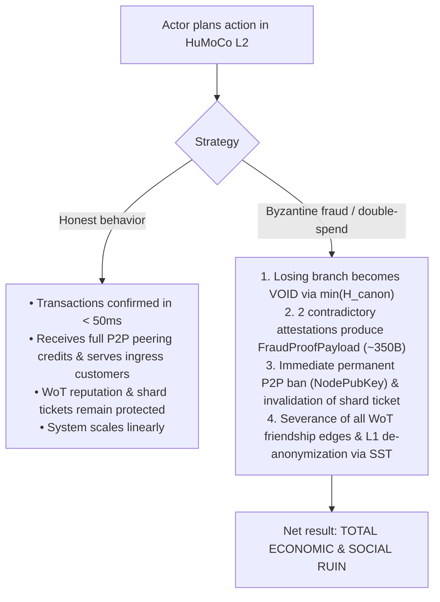

# 05. Game Theory & 360° Attack Matrix

> **Status:** Standard  
> **Model:** Logic & State Graph First  

This document specifies the **systematic, exhaustive 360° fault and attack vector matrix** for the HuMoCo Layer-2 Collision Lock Registry. It strictly separates **Class A (Node Misbehavior / Byzantine Servers)** from **Class B (Client Attacks / Spam & Brute-Force)** and proves why every conceivable attack vector is either mathematically impossible or economically suicidal.

---

## 1. Class A: Byzantine Server & Shard Behavior

Class-A attacks originate from full network participants (gateways, shard nodes, malicious server operators) attempting to manipulate quorums, censor transactions, issue double confirmations, or partition networks.

```mermaid
flowchart TD
    subgraph ClassA["🛡️ Class A: Byzantine Server Defense"]
        direction TB
        A1["A1: Lazy Shard Nodes<br>Refusal to serve quorums"] -->|4-Byte Piggyback + HRW Rank 21| S1["Rank 21 promotion, P2P throttling & client churn"]
        A2["A2: Shard Equivocation (Double-Signing)<br>2 partial signatures for same parent_lock"] -->|Pillar 1 proof in < 50µs| S2["FRAUD_SHARD_EQUIVOCATION -> L1 Slashing & ServerBan"]
        A3["A3: Censorship & Selective Drop<br>Blocking transactions"] -->|14/20 BFT + Hedged Multi-Homing| S3["Smart client contacts co-shard replicas / failover gateway"]
        A4["A4: Eclipse & Botnet Broom<br>Isolating node via 1 bridge"] -->|m >= min(3, deg) + Dunbar-RED| S4["Stochastic edge throttling & edge REVOKE (Social Defense)"]
        A5["A5: Ingress Counter Collision & Load Fraud<br>Contradiction heartbeat vs. shard writes"] -->|Pillar 2 Monotonic Invariance| S5["FRAUD_INGRESS_COUNTER_CONFLICT -> L1 Slashing"]
        A6["A6: Shard Preemption & Grinding<br>Targeted shard takeover"] -->|1-3h Argon2d PoW + 24h Incubation Wall| S6["Astronomical hardware cost (years of compute)"]
        A7["A7: Heartbeat Flooding & Displacement<br>Blocking edge budget via spam"] -->|Pillar 3 (< 50min) + ±60s Freshness Filter| S7["FRAUD_HEARTBEAT_SPAM -> Collision Lock Registry & PoW destruction"]
    end
```

### 360° Matrix: Class A (Node Misbehavior)

| Vector ID | Attack Vector | Attack Goal / Method | Defense Mechanism & Invariant | Error Code / Protocol Reaction | Resulting Damage to Attacker |
| :--- | :--- | :--- | :--- | :--- | :--- |
| **A1** | **Lazy Shard Nodes** | Fails to answer lock requests; wants to collect ingress fees without doing quorum work. | **Parallel broadcast & HRW Rank 21 ([`INV-0303`](docs/03_routing_und_sharding.md)):** Gateway closes quorum at 14 sigs. Silent nodes are isolated locally via 4-byte `signers_bitmask`; rank 21 promotes in 0 ms. **Reciprocal P2P throttling ([`INV-1008`](docs/10_p2p_wire_format_und_session_framing.md), [`INV-1306`](docs/13_client_ingress_und_access_tiering.md)):** On persistent work refusal (`missing_count >= 3`), local suspension applies; smart clients churn in $< 200\,\text{ms}$ due to latency. | QUIC Stream Backoff<br>`429 QuotaExhausted`<br>Client Timeout $\rightarrow$ Failover | Operator loses P2P credits & ingress customers to honest gateways; 0 revenue. |
| **A2** | **Shard Equivocation & Double-Signing** | Signs two competing partial signatures ($L_{3A} \neq L_{3B}$) for the same `parent_lock` to enable double-spend quorums. | **Pillar 1 fraud proof ([`INV-0203`](docs/02_lock_zustandsautomat_und_konflikte.md), [`INV-1007`](docs/10_p2p_wire_format_und_session_framing.md)):** Presenting both partial certificates proves betrayal statelessly in $< 50\,\mu\text{s}$. Shared-Signature Trap (SST) de-anonymizes perpetrator. | `FRAUD_SHARD_EQUIVOCATION`<br>`MsgType::FraudProof` | Permanent P2P ban (`ServerBan`); invalidation of shard ticket; severance of all WoT friendship edges (Identity Revocation & WoT Severance). |
| **A3** | **Censorship / Selective Transaction Dropping** | Gateway or shard node ignores transactions of specific clients/vouchers. | **BFT tolerance & smart client hedging ([`INV-0802`](docs/08_topologie_dynamik_und_netz_merge.md)):** $14/20$ majority tolerates up to 6 malicious shard nodes. Client sends hedged requests to multiple co-shard peers or switches gateway after $200\,\text{ms}$ timeout. | Timeout / HTTP 504 $\rightarrow$ Client failover to replica / backup gateway | Censorship attempt fails; customer switches to honest node; censoring node loses reputation. |
| **A4** | **Eclipse Attack / Botnet Broom** | Attempts to surround an honest node with a network of fake identities via 1 edge. | **Dunbar-RED & 24h incubation ([`INV-1101`](docs/11_organische_praesenz_und_dunbar_gossip.md), [`INV-1703`](docs/17_topologie_telemetrie_und_social_defense.md)):** Single-bridge traffic is stochastically dropped to $\ge 99{,}9\%$ via edge budget $R_{\text{soft}}$; bots never reach $\ge 8/24$ heartbeats. Operator severs toxic edge via `REVOKE`. | `WARN_SINGLE_BRIDGE_BOTNET`<br>Dunbar-RED Packet Drop | Botnet remains in sandbox ($M = 0{,}0$); gains 0 quorum votes; edge is terminated by human. |
| **A5** | **Ingress Counter Collision & Load Fraud** | Gateway reports forged timestamps, rewinds cumulative load, or omits traffic in heartbeat. | **Pillar 2 monotonic invariance ([`INV-1007`](docs/10_p2p_wire_format_und_session_framing.md)):** Counter in heartbeat must match shard writes. Stochastic receipt gossip ($p = 0{,}02\,\%$) catches contradictions within $2{,}2\,\text{Min}$. | `FRAUD_INGRESS_COUNTER_CONFLICT`<br>`400 InvalidEnvelopeSequence` | Immediate classification as causality violation $\rightarrow$ Permanent ServerBan + WoT exclusion. |
| **A6** | **Shard Preemption & HRW Grinding** | Attacker aims to occupy 14 of the top-20 slots of a shard with own nodes. | **Hardware minting & hysteresis ([`INV-0105`](docs/01_organischer_netzstart_und_topologie.md)):** Each Node ID binds $1\text{--}3\,\text{h}$ Argon2d PoW. Shard assignment via $\text{BLAKE3}(\text{NodeID} \parallel \text{Shard\_ID})$ is unpredictable. 24h incubation wall before active admission. | Rejection of immature heartbeats | Attacker would need to mint millions of nodes ($> 100.000\,\text{years}$ CPU time); economically impossible. |
| **A7** | **Heartbeat Flooding & Edge Displacement** | Sends high-frequency heartbeats (e.g., every 2 min) to exhaust edge budget $R_{\text{soft}}$ and displace honest peers. | **Pillar 3 fraud proof ([`INV-1102`](docs/11_organische_praesenz_und_dunbar_gossip.md)):** Heartbeats with $|\Delta t| > 60\,\text{s}$ are silently dropped at ingress (consume no $R_{\text{soft}}$). Two signed heartbeats with $|\Delta t| < 50\,\text{min}$ form a Pillar 3 proof. 1h reboot grace period. | `FRAUD_HEARTBEAT_SPAM`<br>Ingress Silent Drop ($|\Delta t| > 60\,\text{s}$) | Irrevocable entry in Collision Lock Registry; total loss of the expensive Argon2d PoW of the identity. |

---

## 2. Class B: Client Attacks, Spam & Brute-Force

Class-B attacks originate from unregistered clients, manipulated wallets, or external attackers attempting to cripple the network with unauthorized traffic, fabricated Causality ProofChains, or massive replays.



### 360° Matrix: Class B (Client & Spam Attacks)

| Vector ID | Attack Vector | Attack Goal / Method | Defense Mechanism & Invariant | Error Code / Protocol Reaction | Resulting Damage to Attacker |
| :--- | :--- | :--- | :--- | :--- | :--- |
| **B1** | **Unregistered Ingress Flooding (Tier 3 DDoS)** | Sends millions of forged lock requests without account token to overload shard CPUs. | **Stateless BLAKE3 Hashcash & Dynamic Difficulty ([`INV-1304`](docs/13_client_ingress_und_access_tiering.md), [`pow.rs`](crates/humoco-node/src/ingress/pow.rs)):** Server verifies in $< 0{,}1\,\mu\text{s}$ (1 hash) with zero RAM allocation. Under load, server responds with `HTTP 429` and `X-Required-Difficulty`, shifting compute entirely to the client ($\Delta\text{Load} \le 0$). Argon2d (64 MiB) protects P2P mesh shard tickets separately. | `429 Too Many Requests`<br>`401 PoWRequired`<br>QUIC Connection Drop | Attacker burns CPU on exponential difficulty; server remains idle. |
| **B2** | **Fake Genesis & Invalid Lock Proof Chains** | Invents fictitious vouchers or presents 10,000-link fake chains. | **Lazy ingest & smart client ([`INV-0301`](docs/03_routing_und_sharding.md), [`INV-0601`](docs/06_dumb_server_smart_client_flow.md)):** Servers never proactively sync foreign histories. Proof chain travels in wallet and is verified atomically in RAM at the PoS in $2\,\text{ms}$ against L1 genesis. | `400 InvalidProofChain`<br>`404 UnknownGenesisRoot` | Fake chain fails in 2 ms; goods are not dispensed; 0 bytes persisted on servers. |
| **B3** | **Lock Bombing & Replay Attacks** | Sends the same valid lock 1,000× in parallel to all shard nodes to force race conditions. | **First-seen RAM index & 0-RTT write ban ([`INV-0201`](docs/02_lock_zustandsautomat_und_konflikte.md), [`INV-1004`](docs/10_p2p_wire_format_und_session_framing.md)):** First valid signature wins atomically in RAM. Duplicates return idempotent status or `409 Conflict` without state mutation. 0-RTT forbidden for write accesses. | `409 Conflict`<br>`ERR_ZERO_RTT_WRITE_FORBIDDEN` | Replay fizzles in $< 1\,\mu\text{s}$; produces zero additional system state. |
| **B4** | **Hardware Exhaustion (RAM, CPU & Disk)** | Attempts to crash servers via lock flooding (OOM / Disk Full). | **3-dimensional protection cascade ([`INV-1201`](docs/12_lock_storage_und_ram_index.md), [`INV-1401`](docs/14_node_persistenz_und_redb_speicher.md)):** Fixed $144\,\text{Byte}$ per lock; Storage-Time accounting ($\mu\text{BJ}$); automatic TTL purge after `root.valid_until` + 30s grace period; Zero-Copy `rkyv`; Append-Only storage with 24h epoch recycling. | `413 PayloadTooLarge`<br>`429 QuotaExhausted` | Attacker budget exhausted in minutes; server resources remain strictly within budget. |
| **B5** | **CGNAT & IP-Spoofing Abuse** | Attacker sends garbage from mobile IPs hoping the node bans the entire subnet. | **Session ban instead of IP ban ([`INV-1302`](docs/13_client_ingress_und_access_tiering.md)):** Node never bans blanket IPv4 prefixes. Sanctions isolate only the specific QUIC Connection ID and ephemeral client key. | `ERR_QUIC_CONNECTION_RESET` | Honest mobile users on same CGNAT address remain completely unaffected. |

---

## 3. The 3-Dimensional Resource Exhaustion Model (RAM / CPU / Disk)



1. **RAM invariance:** No client can occupy unlimited RAM. Each lock costs the gateway measurable credit in $\mu\text{BJ}$ ($\text{size} \times \text{TTL}$). After expiry of `root.valid_until` plus 30s grace period the RAM entry is physically freed entirely.
2. **CPU asymmetry:** Parsing a header (`rkyv`) requires $0\,\mu\text{s}$ allocation. Stateless BLAKE3 verification filters spam in $< 0{,}1\,\mu\text{s}$ before any expensive verification path can be entered.
3. **Disk immunity:** Since servers do not retain old transaction trees, disk usage grows only proportionally to vouchers still active.

---

## 4. Bootstrap Resilience ($N = 1 \dots 20$) & Fractal Phase Transition

A central security requirement is that all defense mechanisms remain mathematically stable even during network ramp-up from $1$ to $20$ nodes:



### Properties of the Bootstrap Phase ($N < 20$):
1. **No shard fragmentation:** At $N < 20$ all $N$ nodes are responsible for all $65.536$ shards ($R = N$). Each node replicates all active locks.
2. **Fractal quorum $Q(R) = \lfloor \frac{2}{3} R \rfloor + 1$:**
   * $N=1$: $Q=1$ ($100\%$)
   * $N=2$: $Q=2$ ($100\%$)
   * $N=3$: $Q=3$ ($100\%$)
   * $N=10$: $Q=7$ ($70\%$)
   * $N=19$: $Q=13$ ($68{,}4\%$)
   * $N \ge 20$: $Q=14$ ($70\%$) $\rightarrow$ **Phase transition to `FINAL` (Green)**.

---

## 5. The Economic Nash Equilibrium & Slashing Asymmetry



* **Asymmetry of the damage function:** The maximum gain of a double-spend is the value of a single voucher. The guaranteed loss comprises complete loss of node identity, hardware and mining costs of the Argon2d shard ticket, and permanent social banishment from the Web of Trust.
* **Mathematical convergence:** Honest behavior is the **strictly dominant strategy** for every rational and irrational actor.

---

## 6. Normative Invariants of Game Theory & Attack Defense

1. **[INV-0501] Deterministic 3-pillar slashing guilt:** Every fraud proof of the 3 pillars (`FRAUD_SHARD_EQUIVOCATION`, `FRAUD_INGRESS_COUNTER_CONFLICT`, `FRAUD_HEARTBEAT_SPAM`) is verifiable statelessly in $< 100\,\mu\text{s}$ and leads directly to permanent ban in the Collision Lock Registry, invalidation of the shard ticket, and complete severance of all F2F friendship edges in the Web of Trust (Zero Financial Deposits, but Identity Revocation & WoT Severance).
2. **[INV-0502] Censorship immunity via BFT & hedging:** A shard quorum is quorate from 14 of 20 votes; censorship attempts by $\le 6$ nodes fizzle without effect. Smart clients have the right to contact co-shard replicas directly.
3. **[INV-0503] Edge saturation against botnets:** Edge traffic is capped by biomimetic Dunbar-RED; isolated Botnet Broom topologies over single bottlenecks are dropped to $\ge 99{,}9\%$.
4. **[INV-0504] Asymmetric ingress brake:** Unregistered ingress requires stateless BLAKE3 Hashcash ([`pow.rs`](crates/humoco-node/src/ingress/pow.rs)) whose difficulty dynamically scales under load (`HTTP 429` + `X-Required-Difficulty`), shifting computation entirely to the client ($\Delta\text{Load} \le 0$) while server verifies in $< 0{,}1\,\mu\text{s}$.
5. **[INV-0505] Zero sync for garbage histories:** Shard nodes categorically reject unsolicited history dumps; Causality ProofChains travel exclusively in the user's wallet.
6. **[INV-0506] Idempotency on replays:** Repeated requests for already locked entries mutate no state and answer in $< 1\,\mu\text{s}$ with `409 Conflict` or the existing certificate.
7. **[INV-0507] Fractal bootstrap invariance:** All quorum and shard rules scale seamlessly from $N=1$ to $N \ge 20$ via $R = \min(20, N_{\text{active}})$ and $Q(R) = \lfloor \frac{2}{3} R \rfloor + 1$ without special-case code.
8. **[INV-0508] Anti-collateral sanction:** Network sanctions on faulty client puzzles isolate targeted ephemeral sessions and keys, never global IPv4/CGNAT subnets.
9. **[INV-0509] Heartbeat spam immunity & Pillar-3 slashing:** Incoming heartbeats with time deviation $|\Delta t| > 60\,\text{s}$ are silently discarded without burdening the edge budget $R_{\text{soft}}$ of honest nodes. Two signed heartbeats of the same Node ID with time distance $< 50\,\text{minutes}$ form an irrefutable Pillar-3 fraud proof (`FRAUD_HEARTBEAT_SPAM`) leading to immediate termination and permanent banishment to the Collision Lock Registry.
