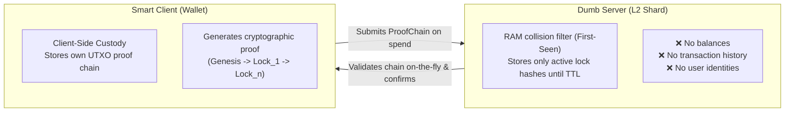
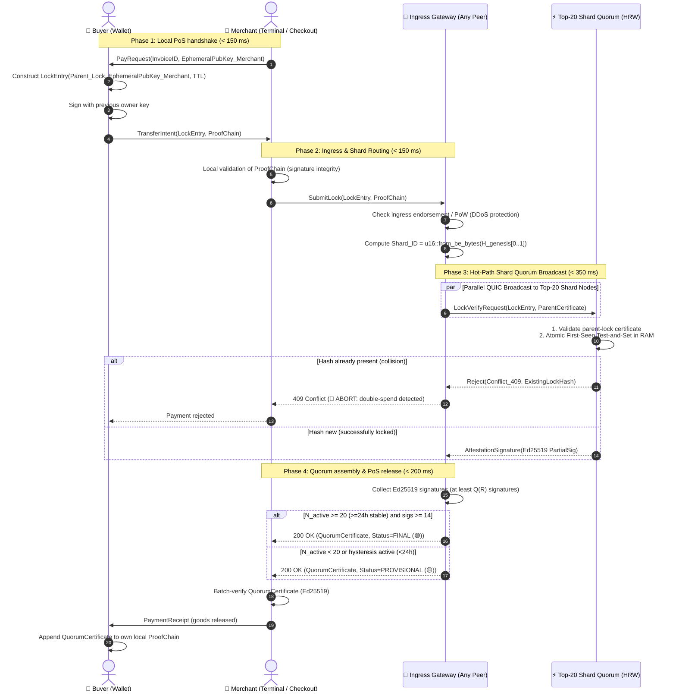
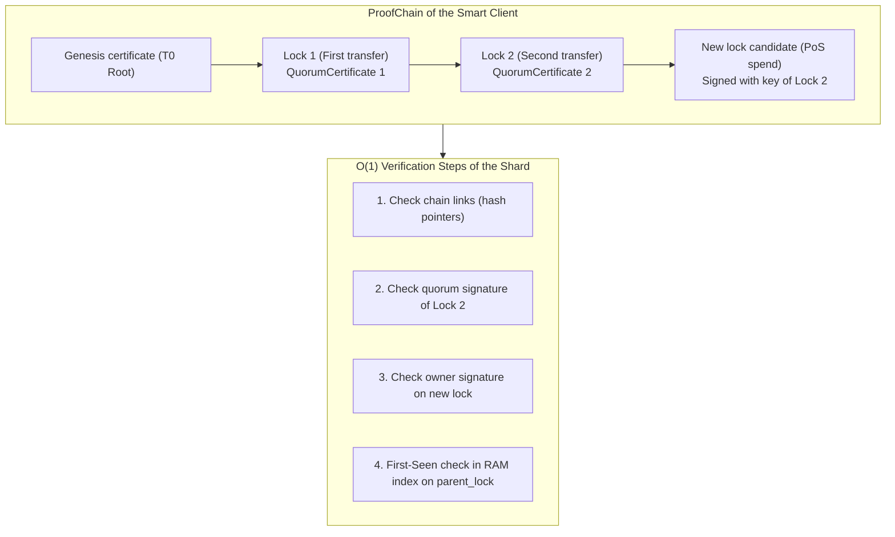
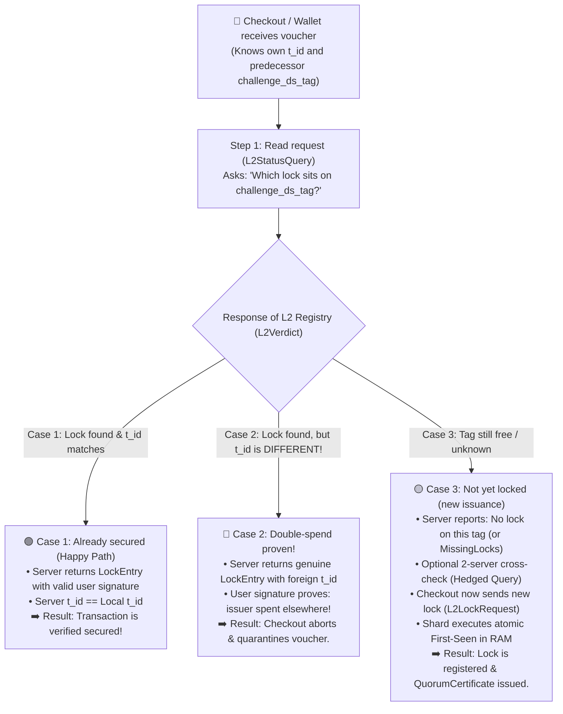
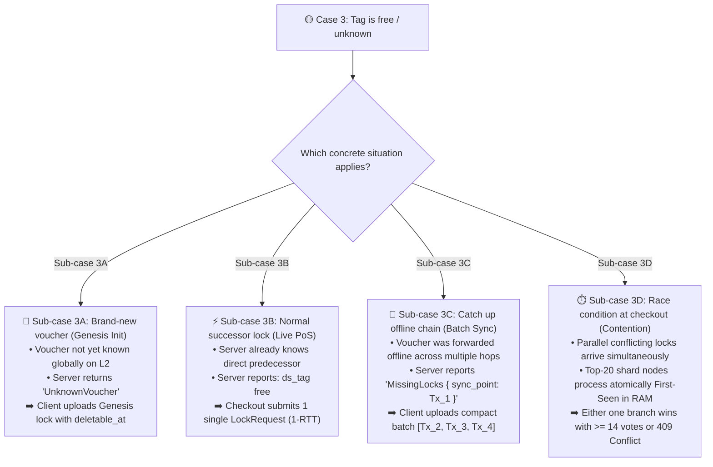
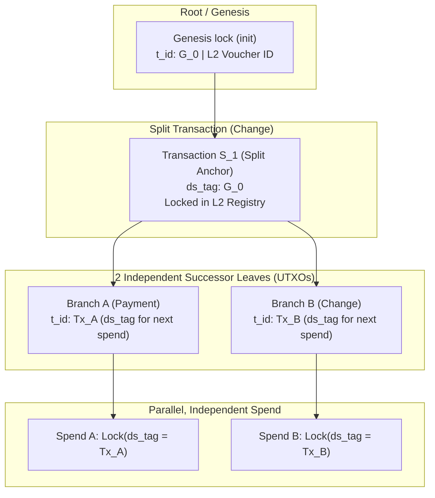
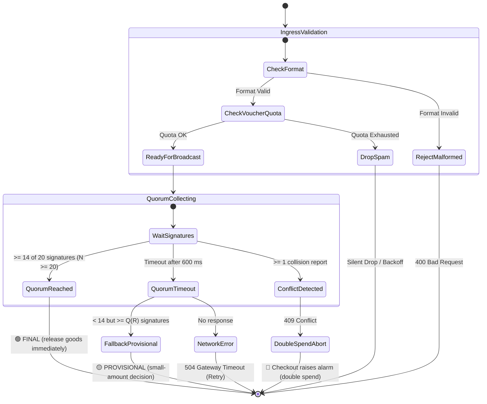

# 06. Dumb Server / Smart Client Lock Flow

> **Status:** Standard  
> **Model:** Logic & State Graph First  

This document specifies the complete flow of a transaction at the Point-of-Sale (PoS). It formalizes the principle **"Smart Client, Dumb Server"**: the L2 server stores no histories and only checks $O(1)$ collisions; the proof chain (*ProofChain*) is fully custodied by the client (*Client-Side Custody*).

---

## 1. The Core Paradigm: Asymmetry of Data Custody



### 1.1 Role Distribution & Economic Incentives in Practice

In real economic scenarios there is a natural asymmetry in risk profile between the parties involved:

1. **Merchant-driven ingress (merchant bears failure risk):**
   * The merchant hands over physical goods or services. Once the customer leaves the store, the merchant bears the full risk of a subsequent double-spend.
   * **Consequence:** The **merchant (recipient)** has the primary economic incentive to establish the connection to the L2 Collision Lock Registry, query status (`L2StatusQuery`), and irreversibly lock the transaction (`L2LockRequest`).
2. **Zero-connectivity client experience (pure proximity transfer):**
   * The **buyer (customer)** requires **no internet connection** at checkout (no mobile data, no roaming, no Wi-Fi).
   * The customer hands the signed transaction locally via **NFC, Bluetooth Low Energy (BLE) or QR code** to the merchant's checkout terminal.
   * The checkout terminal (stable fiber, LTE, or Wi-Fi link) handles locking in the shard quorum in $< 50\,\text{ms}$ (total PoS budget $< 1000\,\text{ms}$) in the background.
3. **P2P offline grace (private trade / flea market):**
   * For direct transfers between private individuals without internet access (e.g., at a flea market) the recipient wallet shows status `UNKNOWN (Offline-Pending ⚪)`.
   * The transaction is cryptographically valid but not yet anchored in the Collision Lock Registry.
   * As soon as either party regains internet connectivity, the wallet automatically resubmits the lock via `L2LockRequest`.
4. **Idempotency on concurrent submission:**
   * If buyer and merchant accidentally submit the same lock simultaneously, this causes no collision: the server recognizes the identical signatures/hashes and acknowledges the lock idempotently with `200 OK`.

---

## 2. The Point-of-Sale (PoS) Transaction and Sequence Graph

The entire payment process is divided into **three logical phases**:
1. **Local PoS handshake** (buyer $\leftrightarrow$ merchant, offline-capable via QR/NFC/BLE)
2. **Network locking (Hot Path)** (merchant $\rightarrow$ gateway $\rightarrow$ shard quorum)
3. **Certificate & release** (merchant receives cryptographic quorum certificate and releases goods)



---

## 3. The ProofChain & Lazy Ingestion

So the server does not need to load history, the client supplies the mathematical origin proof with every spend.



* **No DB lookup for legacy data:** The shard node does not need to search its disk for old blocks. It checks the chain signatures on the fly in RAM (duration: $< 3\,\text{ms}$).
* **Compactness:** The wallet custodies the gapless chain (`Voucher.transactions`).

### 3.1 The 3 Elementary Protocol Cases (Read & Write Flow)

Due to information asymmetry (customer only queries predecessor `challenge_ds_tag` without revealing own `t_id` in advance) and mathematical unforgeability of `layer2_signature`, the client-server interaction divides into **three elementary, deterministic cases**.

> [!NOTE]
> **Gateway-side read routing (`docs/03:INV-0310`):**  
> The gateway does not rigidly forward `L2StatusQuery` to rank 1, but stochastically selects an active, non-suspended node uniformly at random from the shard's Top-20. If it does not respond within $100\,\text{ms}$, it accrues $+8$ demerit points (`record_missing()`) and the gateway switches via fast failover immediately to an alternative shard node ($< 100\,\text{ms}$ client latency).



#### Case 1: Voucher Already Secured Online (`Verified` - Match)
* **Situation:** Customer pays with a transaction previously locked online in L2.
* **Flow:**
  1. Checkout sends `L2StatusQuery(challenge_ds_tag)`.
  2. Server responds with `L2Verdict::Verified { lock_entry }`.
  3. Checkout validates:
     - Is `layer2_signature` in `lock_entry` valid? $\rightarrow$ **Yes** (server cannot forge signature).
     - Does `lock_entry.t_id` match local `t_id`? $\rightarrow$ **Yes, identical!**
* **Result:** Goods released immediately (status: green).

#### Case 2: Fraud Attempt / Double-Spend Detected (`Verified` - Mismatch)
* **Situation:** A fraudster previously spent the same voucher elsewhere; that foreign lock already sits on L2.
* **Flow:**
  1. Checkout sends `L2StatusQuery(challenge_ds_tag)`.
  2. Server responds with `L2Verdict::Verified { lock_entry }`.
  3. Checkout validates:
     - Is `layer2_signature` valid? $\rightarrow$ **Yes** (proof of authorized foreign spend by fraudster).
     - Does `lock_entry.t_id` match local `t_id`? $\rightarrow$ **No, mismatch!**
* **Result:** Transaction immediately rejected, checkout raises alarm, voucher moved to quarantine (status: red).

#### Case 3: First-Time Registration / Fresh Issuance (`Unknown` / `MissingLocks`)
* **Situation:** Voucher was created offline, forwarded, or a new payment lock is to be set. No active lock exists on this `challenge_ds_tag` in the registry.



##### Sub-case 3A: Genesis Registration (Fresh Voucher)
* **Flow:**
  1. `L2StatusQuery` returns `UnknownVoucher`.
  2. Client sends `L2LockRequest` with `is_genesis: true`, `ds_tag: None` and expiry `deletable_at` (`root.valid_until`).
  3. Server validates issuer signature and initializes root timer for subsequent `ExpiredVoucherPurge`.

##### Sub-case 3B: Normal 1-Step Transfer at PoS (Standard Live Payment)
* **Flow:**
  1. `L2StatusQuery(challenge_ds_tag)` returns: *"No lock on this tag present"*.
  2. Checkout sends exactly **one** `L2LockRequest` with the new transaction.
  3. The 20 shard nodes execute their atomic First-Seen in RAM ($< 1\,\mu\text{s}$) and send partial signatures.
  4. Checkout receives aggregated `QuorumCertificate` (duration: $< 50\,\text{ms}$).

##### Sub-case 3C: Catch Up Offline Chain (Batch Reconciliation)
* **Flow:**
  1. Voucher was forwarded offline multiple times (Buyer A $\rightarrow$ B $\rightarrow$ C $\rightarrow$ D).
  2. `L2StatusQuery` contains `locator_prefixes` (breadcrumbs).
  3. Server reports: `MissingLocks { sync_point: "Hash_of_A" }`.
  4. Wallet of D forms an `L2BatchLockRequest` with missing chain links `[Lock_B, Lock_C, Lock_D]`.
  5. Server checks chain links on the fly in RAM ($< 2\,\text{ms}$) and locks final leaf `Lock_D`.

##### Sub-case 3D: Parallel Contending Locks (Hot-Path Race Condition)
* **Flow:**
  1. A malicious actor submits two different successors for the same `challenge_ds_tag` at two checkouts in the same second.
  2. Top-20 shard nodes process both requests atomically via First-Seen in RAM.
  3. **Resolution:**
     * *Clear winner:* One lock reaches $\ge 14$ votes $\rightarrow$ `FINAL (Green)`. The losing branch receives `409 Conflict`.
     * *Split (e.g., 10:10):* Neither lock reaches 14 votes $\rightarrow$ No final quorum. Both checkouts refuse to release goods.
  4. **Hedged 2-server check:** To guard against briefly desynchronized single nodes, the wallet can send requests in parallel to two nodes (`FLAG_HEDGED`).

### 3.2 Voucher Splits (DAG) & Independence of Child Branches

When a voucher is split (e.g., payment + change), the linear history branches into a directed acyclic graph (DAG).



* **Atomic independence in L2 registry:**
  1. The split itself locks predecessor `G_0` with transaction ID `S_1`.
  2. The two resulting child branches have distinct hashes `Tx_A` and `Tx_B`.
  3. If branches A and B are later spent simultaneously by different owners, they address **two completely distinct keys in the L2 registry (`parent_lock = Tx_A` vs. `parent_lock = Tx_B`)**.
  4. There is **no mutual blocking**: Both branches are locked in parallel in $O(1)$ in RAM and receive their own quorum certificate.
* **Efficient reconciliation via locator prefixes:**
  If a branch was forwarded offline multiple times, the wallet sends `locator_prefixes` on next online check (`L2StatusQuery`). The L2 node finds the common split node (`S_1`) in nanoseconds and reports `MissingLocks { sync_point: S_1 }`, so only missing intermediate steps of the respective branch need to be uploaded.

---

## 4. Point-of-Sale Latency Budget (Target: $< 1000\,\text{ms}$)

The system is strictly designed for sub-second response times at the checkout terminal:

| Step | Action | Transport / Algorithm | Maximum Latency Budget |
| :--- | :--- | :--- | :--- |
| **1. PoS Transfer** | Terminal $\leftrightarrow$ Phone | NFC / BLE / QR (Zero Roundtrip) | $\le 150\,\text{ms}$ |
| **2. Gateway Ingress** | Merchant $\rightarrow$ Gateway Node | QUIC 0-RTT Stream | $\le 100\,\text{ms}$ |
| **3. Ingress Check** | Gateway checks WoT voucher | Local cache lookup | $\le 10\,\text{ms}$ |
| **4. Shard Broadcast** | Gateway $\rightarrow$ 20 Shard Nodes | QUIC UDP parallel | $\le 150\,\text{ms}$ |
| **5. Atomic RAM Lock** | Shard node Test-and-Set | Lockless atomic concurrent map | $\le 5\,\text{ms}$ |
| **6. Quorum Response** | Shard Nodes $\rightarrow$ Gateway | Partial Ed25519 signatures | $\le 150\,\text{ms}$ |
| **7. Aggregation** | Gateway assembles certificate | Bitmask & Ed25519 signatures | $\le 20\,\text{ms}$ |
| **8. PoS Confirmation** | Gateway $\rightarrow$ Merchant Terminal | QUIC Stream Response | $\le 100\,\text{ms}$ |
| **Buffer** | Jitter & packet loss | QUIC Loss Recovery | $\le 200\,\text{ms}$ |
| **TOTAL** | **Complete PoS finality** | **Status: FINAL (🟢)** | **$\approx 885\,\text{ms} < 1000\,\text{ms}$** |

---

## 5. Error and Conflict Handling at PoS



---

---


## 6. Zero-Trust Quorum Verification for Smart Clients (Minimal Effort, Maximum Benefit)

### 6.1 Motivation & Primary Attack Vector (The "Potemkin Village" / Fake-Committee Problem)
When a client (e.g., smartphone or checkout terminal) receives a `QuorumCertificate` via an ingress gateway, the fundamental security question arises:
> **"How does the client know that the supplied signatures originate from the genuine, authorized shard nodes and not from 14 fake identities invented by a malicious gateway in a millisecond in RAM?"**

An attacker could spin up 14 own key pairs (or 14 own servers), issue a formally valid quorum, and make the checkout believe the lock is anchored in the Collision Lock Registry — while the voucher never actually reached the genuine shard.

### 6.2 The 4-Pillar Architecture (Zero-Trust at < 1 ms Local Compute)

To solve this problem with **minimal data overhead (2 KB sync per day) and maximum mathematical security**, the smart client uses a 4-stage verification model:

```
  ┌─────────────────────────────────────────────────────────────────────────┐
  │ Pillar 1: Deterministic Consensus Bloom Filter (2 KB)                   │
  │ • Client downloads 2-KB filter from 3 independent seed nodes            │
  │ • Bitwise 2-of-3 voting filters out malicious single servers entirely:  │
  │   Consensus_Filter[i] = (A[i] ∧ B[i]) ∨ (B[i] ∧ C[i]) ∨ (A[i] ∧ C[i])   │
  │ • O(1) check: Is BLAKE3(NodeID || PubKey) in the genuine network?      │
  └────────────────────────────────────┬────────────────────────────────────┘
                                       │
  ┌────────────────────────────────────▼────────────────────────────────────┐
  │ Pillar 2: Dynamic N Estimation from Filter Bit Density (Popcount)       │
  │ • N ≈ - (M / k) * ln(1 - popcount / M)    (< 1 µs)                      │
  │ • Client computes exact network size N without manual config            │
  └────────────────────────────────────┬────────────────────────────────────┘
                                       │
  ┌────────────────────────────────────▼────────────────────────────────────┐
  │ Pillar 3: Seamless Quantile Threshold (Fractal Order Statistics)        │
  │ • Score_i = BLAKE3(NodeID_i || Shard_ID) / 2^256                        │
  │ • Uniform threshold: Score_i >= max(0.0, 1.0 - K_max / N)                │
  │ • K_max = 40 (deterministic successor horizon)                          │
  │ • Scales seamlessly: N <= 40 -> 0.0 (Bootstrap), N = 10k -> 0.996       │
  │ • Proves with P > 99.9999999999999% that signers are genuine Top-K     │
  │   nodes of this shard (Sybil chance < 1 in a quadrillion!)              │
  └────────────────────────────────────┬────────────────────────────────────┘
                                       │
  ┌────────────────────────────────────▼────────────────────────────────────┐
  │ Pillar 4: Ed25519 Batch Verification (Zero-Copy & SIMD-accelerated)     │
  │ • Gateway delivers QuorumCertificate with signer_bitmap + partial sigs  │
  │ • Smart client verifies via ed25519_dalek::verify_batch all >= 14 sigs  │
  │ • Atomic check in < 0.5 ms on mobile device                             │
  └─────────────────────────────────────────────────────────────────────────┘
```

### 6.3 QuorumCertificate Wire Layout (Compact < 1 KB)
The quorum certificate uses a 32-bit signer bitmap and Ed25519 partial signatures:
$$\big( \text{lock\_hash} \,[32\,\text{B}], \; \text{shard\_id} \,[2\,\text{B}], \; \text{status} \,[1\,\text{B}], \; \text{signer\_bitmap} \,[4\,\text{B}], \; \text{signatures} \,[\text{popcount} \times 64\,\text{B}] \big)$$
* **At 14 quorum signatures:** $32 + 2 + 1 + 1 + 4 + (14 \times 64) = \mathbf{936\,\text{Byte}}$.
* **Network guarantee:** Fits entirely in a single unfragmented UDP/QUIC packet ($\le 1.472\,\text{Byte}$ standard MTU).
* **Zero-overhead NodeID resolution:** NodeIDs and public keys need not be transmitted in the packet; the client deterministically reconstructs the 14 public keys from the bits set in `signer_bitmap` via the shard's HRW ranking.

---

## 7. Invariants of the Lock Flow

1. **[INV-0601] Zero history retention:** After generating the quorum certificate, the shard node stores **only** the `StoredLock` (192 bytes) in RAM and persists it asynchronously to `TABLE_ACTIVE_LOCKS`. The supplied `ProofChain` is discarded immediately after validation.
2. **[INV-0602] Atomic First-Seen:** Setting the lock entry in a shard node's RAM is performed via atomic Compare-and-Swap (CAS) operations on `parent_lock`. There is no time window for race conditions.
3. **[INV-0603] Merchant-centric safety:** Final confirmation always goes primarily to the merchant/recipient. The buyer cannot prevent release of goods by blocking own internet connectivity.
4. **[INV-0604] Unforgeable causality:** A `LockEntry` is valid only if its `parent_lock` matches bit-exactly the target hash of the preceding `QuorumCertificate` in the `ProofChain`.
5. **[INV-0605] Zero-trust quorum verification:** A smart client accepts a `QuorumCertificate` only if (1) all signer identities `BLAKE3(NodeID || PubKey)` exist in the bitwise 2-of-3 consensus Bloom filter, (2) all signers exceed the statistical HRW order threshold $\text{Score}_i \ge \max\left(0.0, \; 1.0 - \frac{K_{\text{max}}}{N_{\text{active}}}\right)$ (with $K_{\text{max}} = 40$) for `Shard_ID`, and (3) the cryptographic Ed25519 batch signature on `lock_hash` is mathematically valid.
