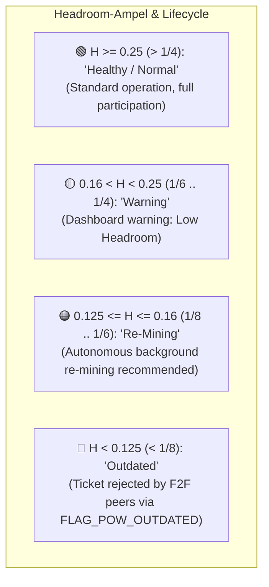
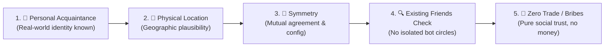
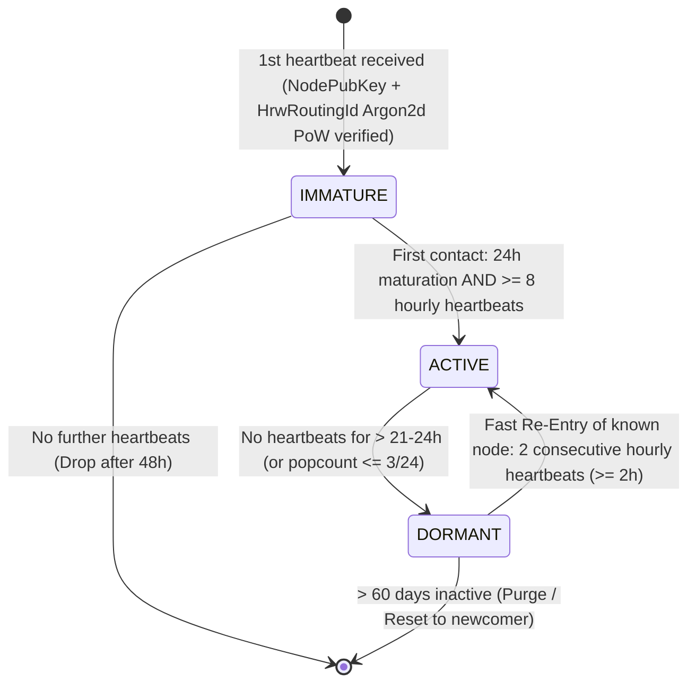
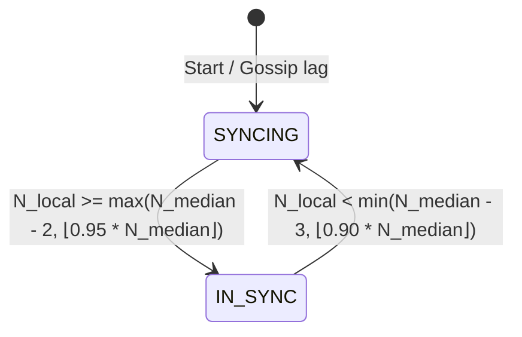

# 07. Admission, F2F Peering & Sybil Resilience

> **Status:** Standard  
> **Model:** Logic & State Graph First  

This document specifies the **organic admission procedure for nodes**, the **Friend-to-Friend (F2F) peering model**, **multi-homing resilience**, and protection against **sleeper botnets** and **sycophant circle attacks**. It unites universal hardware cost (Argon2d) with biological maturation and maintenance laws.

---

## 1. Universal Foundation: 2-Stage Argon2d Minting & Whitening for ALL Nodes

Every node in the network solves a memory- and compute-intensive **Argon2d PoW challenge** upon creation to cryptographically bind its dynamic shard ticket `HrwRoutingId` to its permanent `NodePubKey` (Ed25519) in two stages:

1. **Stage 1 – Work Proof ($\text{PoW\_Proof}$):**
   $$\text{PoW\_Proof} = \text{Argon2d}\Big(m=64\,\text{MiB}, t=3, p=1\Big)\Big(\text{NodePubKey}_{\text{Ed25519}} \mathbin{\Vert} \text{Nonce} \mathbin{\Vert} T_0\Big)$$
   * Deterministic work score calculation: $W = \text{compute\_work\_from\_hash}(\text{PoW\_Proof})$.

2. **Stage 2 – Uniform Shard Ticket ($\text{HrwRoutingId}$ via BLAKE3 Whitening):**
   $$\text{HrwRoutingId} = \text{BLAKE3}\Big(\text{len} \mathbin{\Vert} \text{DOMAIN\_HRW\_ROUTING\_TICKET} \mathbin{\Vert} \text{NodePubKey} \mathbin{\Vert} \text{Nonce}_{\text{LE}} \mathbin{\Vert} T0_{\text{LE}} \mathbin{\Vert} \text{PoW\_Proof}\Big)$$
   * Full 256-bit entropy without leading zeros, providing uniform distribution across all 65,536 shards in HRW rendezvous hashing.

> **Semantic decoupling:** `NodePubKey` (Ed25519) = permanent identity for F2F friendship edges and TLS (lifetime). `HrwRoutingId` (Argon2d ticket) = dynamic PoW ticket exclusively for HRW sharding. Re-mining renews only the `HrwRoutingId`, never the `NodePubKey`.

> [!NOTE]
> **Why Argon2d instead of Argon2id?**  
> `HrwRoutingId` tickets contain no secret passwords that must be protected against side-channel timing attacks (all inputs — `NodePubKey`, `Nonce`, `T0` — are public). **Argon2d** uses data-dependent memory accesses and thus provides the physically maximal resistance against GPU and ASIC mining clusters.

---

### 1.1 The Fixed Minimum Floor (Hard Floor)

Immutable in protocol code:
* **Absolute minimum ($W_{\text{min\_floor}} \ge 1$):** A valid `HrwRoutingId` PoW requires at least the code-level minimum floor.
* **Admission Threshold ($W_{\text{min\_admission}}$):** $W_{\text{min\_admission}} = \max(W_{\text{min\_floor}}, \; W_{\text{net\_median}} \gg 3)$ (1/8 = 12.5% of network median).
* **Zero downward tolerance:** No peer in the network accepts an `HrwRoutingId` whose PoW lies below this threshold.

---

### 1.2 The Monotonicity Ratchet ($W_{\text{new}} > \max(W_{\text{active}}, W_{\text{pending}})$)

* **Rule:** On ticket migration / re-mining on an existing `NodePubKey`, the new ticket **MUST** have a strictly higher work score than all previous (active and still incubating) tickets:
  $$W_{\text{new}} > \max(W_{\text{active}}, W_{\text{pending}})$$
* **Effect:** Lateral shard-hopping and downgrades are mathematically impossible.

---

### 1.3 The Headroom Metric, 4-Stage Traffic Light & F2F Direct Feedback

Each node continuously compares its own PoW value ($W_{\text{own}}$) with the decentralized network median ($W_{\text{net\_median}}$):

$$H = \frac{W_{\text{own}}}{W_{\text{net\_median}}}$$



#### F2F Direct Feedback (`FLAG_POW_OUTDATED`):
* When a direct F2F friend ($\text{hops} = 0$) sends a heartbeat with an outdated ticket ($H < 0{,}125$), the receiving node replies with a `HeartbeatAck` containing `FLAG_POW_OUTDATED`.
* Multi-hop forwarded gossip ($\text{hops} > 0$) with outdated PoW is silently dropped without feedback.
* The TLS/QUIC F2F friendship connection remains 100% open and active (friendship is bound to `NodePubKey`, not the shard ticket).

#### NodePubKey Invariance on Re-Mining (Friendships Remain Intact!):
* **`NodePubKey` remains permanent:** F2F friendship edges and peering certificates refer exclusively to the immutable `NodePubKey` (Ed25519). Friends do **not need to reconnect** on re-mining!
* **`HrwRoutingIdMigrationNotice`:** Node signs its new, stronger `HrwRoutingId` with its existing `NodePrivKey`.
* **Zero downtime:** Re-mining runs at lowest system priority (`nice 19`, 1 CPU thread). Node continues serving transactions and quorums uninterrupted. After completion it deterministically switches to the new HRW shard after the 24h incubation wall expires.

#### 24h Incubation Wall for Shard Tickets (Shard-Hopping Protection):
* A new `HrwRoutingId` (initial minting or re-mining) is immediately propagated via F2F gossip so all peers can verify and cache it.
* In HRW scoring, however, it is only counted as active after a **24h maturation period**; until then only the previous active ticket counts (for newcomers: no HRW rank).
* Guerrilla protection: Targeted grinding for lucrative shards is futile — the PoW advantage takes effect only with delay, the network has 24h advance warning.

---

## 2. The Organic F2F Admission Model (Friend Entry Barrier)

Instead of complex numerical trust-mass calculations ($M \ge 1.0$) or bureaucratic admission lists, the system relies on a fundamental **human entry barrier**:

1. **At least 1 friend (F2F edge):** A new node needs at least a single verified F2F friendship edge ($d=1$) to an existing node in the network for its heartbeats to be injected into the gossip channel.
   > [!IMPORTANT]
   > **Clarification: 1 friend suffices for worldwide full activation!**  
   > * A new node requires only **1 single F2F friendship edge ($d=1$)** to be admitted to the worldwide network.
   > * **Percolation in mesh:** The heartbeat of node $A$ is forwarded by its friend into the mesh and fans out epidemically. Every node receiving the heartbeat registers it for 24h incubation.
   > * **Multi-homing ($d \ge 3$) is pure failure resilience:** Multiple friends protect node $A$ against censorship or failure of its single friend, but are not an entry blockade.
   > 
   > [!WARNING]
   > **Censorship risk at $d=1$ (`WARN_SINGLE_EDGE_CENSORSHIP_RISK`):**  
   > If a node has only a single F2F connection ($d=1$), that single neighbor can maliciously filter its heartbeats (selective censorship at cost 0), causing the isolated node to fall to `DORMANT` after 24h.  
   > **Operational recommendation:** Node dashboard explicitly warns operators with $d=1$ (`WARN_SINGLE_EDGE_CENSORSHIP_RISK`) and strongly recommends **multi-homing ($d \ge 3$)** with at least 3 independent neighbors/friends.
2. **Edge throttling as Sybil barrier:** If an attacker injects hundreds of fake nodes behind a single bridge node, the biomimetic edge budget ($R_{\text{soft}}$, see `docs/11`) stochastically throttles $> 99{,}9\%$ of unauthorized heartbeats.
3. **Human gatekeeper:** There is no autonomous admission via pure uptime without human attachment (no over-complex Proof-of-Longevity). Every node in the network has a real human origin.

### 2.1 The "5-Finger Rule" for F2F Edges (Peering Checklist)

To prevent social engineering, sycophant clusters, and unvetted cloud-botnet injection, every node operator must verify the **5-Finger Rule** before adding any peer to `[f2f].peers`:



1. 👤 **Personal Acquaintance (1st Finger):** The node operator is known personally in the real world (or through a verified cryptographic Web-of-Trust interaction). Never peer with anonymous internet strangers.
2. 📍 **Physical Location Knowledge (2nd Finger):** You know the approximate physical municipality or region where the node operates. This ensures topological grounding and fends off virtual cloud sybil farms.
3. 🔄 **Symmetry & Reciprocity (3rd Finger):** Peering is strictly bidirectional. Both operators explicitly agree and register each other's `NodePubKey` and endpoint in `[f2f].peers`. Unilateral peering requests are rejected.
4. 🔍 **Existing Friends Check (4th Finger):** Cross-examine the candidate's existing peering connections to verify that they are integrated into diverse, genuine community subgraphs rather than an isolated sycophant circle.
5. 🚫 **Zero Trade / Bribe Policy (5th Finger):** F2F friendship slots must **never be bought, sold, rented, or bartered** for money, tokens, or collateral deposits. The network operates under Zero Financial Deposits; trust is purely social.

---

## 3. The Node Presence State Machine (`NodePresence`)

Each node locally maintains in memory a lightweight table of all known identities ($\approx 48\,\text{Byte}$ per node):



### 3.1 The Three Life Phases:

1. **`IMMATURE` (Incubation / 24h Wall for Newcomers):**
   - **Condition:** First contact of a never-before-seen node. It must be known in the network for at least **24 hours** and deliver at least **8 valid hourly heartbeats** ($\ge 8/24$) during that period.
   - **Role:** **Not yet** counted in active node set $N_{\text{active}}$ and does not participate in any shard quorums.
   - **Protection:** Prevents spontaneous botnets from immediately hijacking sharding votes.

2. **`ACTIVE` (Full Consensus Node):**
   - **Role:** Included in active node set $N_{\text{active}}$, fully computed in HRW rendezvous sharding for quorum signatures, and serves transactions.
   - **Interval:** Sends in discrete epoch cadence exactly **1 heartbeat per hour** ($60\,\text{minutes}$). Pillar-3 slashing penalizes multiple heartbeats within the same hourly epoch.
  
3. **`DORMANT` (Sleeping / Maintenance / Failure) & Fast Re-Entry:**
   - **Failure condition:** Heartbeat counter drops to $\le 3/24$ hours (only after $\ge 21\text{--}24\,\text{hours}$ inactivity).
   - **Effect on failure:** Node immediately drops out of $N_{\text{active}}$, so quorum votes are not blocked by dead nodes.
   - **Fast Re-Entry for known peers (2 heartbeats = $\ge 2\,\text{hours}$):**
      - Since the node is already known to the network (`NodePubKey` + `HrwRoutingId` Argon2d PoW and F2F edges are validated in peer store), it does **not** need to wait another 24h after returning from internet outages, router reboots, or maintenance.
     - **2 consecutive hourly heartbeats** ($\ge 2\,\text{hours}$ continuous reachability) suffice to jump back to `ACTIVE`.
     - **Network resilience:** During large-scale ISP disruptions or power outages, the shard network thus reconsolidates after just **2 hours**, instead of being blocked for a full working day.

> [!NOTE]
> **Architecture guarantee (Anti-flapping & Zero-HRW-thrashing on Fast Re-Entry):**  
> 2 heartbeats mean, thanks to hourly cadence, a physical time span of **at least 2 hours**. Since going offline requires at least **21–24 hours**, a full cycle (`ACTIVE` $\to$ `DORMANT` $\to$ `ACTIVE`) always takes **at least ~24 to 26 hours**.  
> Fast oscillation/flapping on minute or second granularity is thus excluded.  
> **Pragmatic flap damping (edge-case protection):** Should an extremely unstable node still flip more than 2 times within 48 hours between `ACTIVE` and `DORMANT` (e.g., chronic flaky contact), it temporarily loses Fast Re-Entry rights and must satisfy the regular 8h threshold ($\ge 8/24$ heartbeats) for reactivation.

### 3.2 The Knowledge & Synchronization Filter (`NodeSyncStatus`)

To prevent a node with partial network knowledge (e.g., freshly joined or behind a slow edge) from computing faulty HRW shard assignments, each node hourly reconciles its view via the **median of its direct F2F friends**:

$$N_{\text{median}} = \text{Median}\Big(N_{\text{peer}_1}, N_{\text{peer}_2}, \dots, N_{\text{peer}_k}\Big)$$



1. **Entry threshold (`SYNCING` $\to$ `IN_SYNC`):**
   $$N_{\text{local}} \ge \max\Big(N_{\text{median}} - 2, \; \lfloor 0{,}95 \times N_{\text{median}} \rfloor\Big)$$
   Only in state `IN_SYNC` does the node arm its shard responsibility for the worldwide $N \ge 20$ quorum.
2. **Hysteresis fallback threshold (`IN_SYNC` $\to$ `SYNCING`):**
   $$N_{\text{local}} < \min\Big(N_{\text{median}} - 3, \; \lfloor 0{,}90 \times N_{\text{median}} \rfloor\Big)$$
   The combination of $90\,\%$-threshold and absolute $-3$-buffer prevents any oscillation/flapping both in global networks and in autonomous micro-villages ($N < 20$).
3. **Behavior in `SYNCING`:**
   * Foreign global shard requests are rejected with `503 Service Unavailable / NodeSyncing`.
   * Local `PROVISIONAL` village locks remain unaffected, as they are served purely via the local cluster state.

---

## 4. Retention Periods & List Management

### 4.1 General Peer Table (Remote Nodes)
* **60 days inactivity tolerance:** If a known node goes offline for days or weeks (e.g., 3 weeks summer vacation, repair), its entry remains stored for up to **60 days** in state `DORMANT`.
* **Purge after 60 days:** After 60 days without sign of life the entry is deleted. If the node returns afterwards, it traverses the 24h `IMMATURE` phase like a newcomer.

### 4.2 Direct F2F Friend List (Own Neighbor Edges)
* **1 year tolerance:** Direct F2F peering certificates of friends remain for **1 year**.
* **Deactivation after 1 year:** If a friend node has been continuously offline for over 1 year, it is not silently reconnected but marked as **deactivated**. Operator must **manually reactivate** the friendship edge in the node dashboard to prevent accidental reactivation of stale/abandoned devices.

---

## 5. The Sycophant Isolation Theorem, Punishment & Equivocation Ban

1. **Sycophant isolation theorem:** A cluster of thousands of bots mutually confirming each other fails at the edge throttling of the single transition node to the main network ($R_{\text{soft}}$) and the 24h incubation. They never reach $\ge 8/24$ hourly heartbeats to be admitted to $N_{\text{active}}$.
2. **Pinpoint perpetrator slashing (No guilt by association for F2F friends):**
   * The 3 fraud-proof pillars ([`docs/10:5.3`](docs/10_p2p_wire_format_und_session_framing.md#53-die-3-mathematischen-betrugsbeweis-säulen-in-o1-slashing-evidence)) are based on cryptographic self-incrimination by the perpetrator.
   * **Friends bear no financial liability:** To physically exclude griefing, extortion, and chilling effects (no one peers with friends for fear of foreign hardware hacks), friends are **not** co-slashed. F2F edges are purely topological peering paths.
3. **Stateless immediate ban (`ServerBan`):**
   If a node signs two contradictory quorum certificates (equivocation / Byzantine double-sign), presenting the two colliding signatures (`EquivocationProof`) suffices to ban the node worldwide, permanently, and statelessly from all peer lists.

---

## 6. Node Departure (Graceful Leave, Silent Dropout & HRW Successor)

In a decentralized shard network nodes depart in three ways:

```mermaid
flowchart TD
    ExitType["Node leaves the network"] --> Case{"Cause of departure"}

    %% Case A: Orderly
    Case -->|1. Planned (maintenance / shutdown)| Graceful["🚪 Orderly departure (Graceful Exit)"]
    Graceful --> Msg["Sends native QUIC CONNECTION_CLOSE(0x00, 'Shutdown')"]
    Msg --> HRWShift1["Peers close socket in < 5 ms.<br>HRW rank 21 promotes to rank 20 in 0 ms!"]

    %% Case B: Unplanned
    Case -->|2. Unexpected (crash / power failure)| Crash["💥 Silent failure (Silent Dropout)"]
    Crash --> PingMiss["QUIC Keepalive timeout (10s) or 50ms shard timeout<br>-> HRW rank 21 immediately steps in as fallback"]
    PingMiss --> HRWShift2["After 24h without heartbeats -> Status: DORMANT<br>DORMANT node ignored in HRW."]

    %% Case C: Ban
    Case -->|3. Enforced (fraud attempt)| Banned["⚡ Malicious fraud (ServerBan)"]
    Banned --> Slash["Double-signature proof erases node worldwide for life"]

    %% Successor sync
    HRWShift1 & HRWShift2 --> Catchup["🔄 Successor sync:<br>New rank-20 node fetches active RAM locks<br>(only valid locks valid_until > now) from remaining 19 shard peers."]
```

* **HRW successor invariance:** When a shard node fails, no lock is lost, as remaining shard nodes hold the active RAM state. Node at rank 21 deterministically promotes and synchronizes active locks in $< 5\,\text{ms}$ (`valid_until > now`).

---

## 7. Invariants of Admission & F2F Logic

1. **[INV-0701] Universal Argon2d minting & minimum floor:** No `HrwRoutingId` exists without a valid Argon2d computation bound to `NodePubKey`, `Nonce` and $T_0$ (`HrwRoutingId = Argon2d(NodePubKey || Nonce || T0)`). Every accepted PoW must satisfy at least the immutable code minimum floor $D_{\text{min\_floor}}$ ($\ge 1\,\text{h}$ server / $\ge 4\,\text{h}$ Pi).
2. **[INV-0702] Human entry barrier:** A node is injected into the gossip network only via a verified F2F friendship edge.
3. **[INV-0703] 24h incubation duty & 24h shard ticket wall:** A newly arrived node remains in status `IMMATURE` for at least 24 hours and requires $\ge 8$ hourly heartbeats before admission to $N_{\text{active}}$. Every new `HrwRoutingId` (initial minting or re-mining) is immediately propagated via gossip but counted as active in HRW sharding only after 24h maturation — protection against shard-hopping / guerrilla grinding.
4. **[INV-0704] Reactivation via sliding window (`DORMANT`):** Known nodes reactivate after outages deterministically via the universal 24h bitmask hysteresis ($\ge 8/24$ hourly heartbeats). No additional flapping special states exist (KISS principle).
5. **[INV-0705] 60-day / 1-year retention:** `DORMANT` nodes are purged after 60 days inactivity; inactive F2F friends after 1 year are deactivated for manual reactivation.
6. **[INV-0706] Stateless immediate ban:** A cryptographic double-signature proof (`EquivocationProof` over `NodePubKey`) bans the involved `NodePubKey` for life and statelessly from further network participation (`ServerBan`); the `HrwRoutingId` is bound to it and co-banned.
7. **[INV-0707] Seamless successor guarantee:** Departure of a node changes shard quorums deterministically via HRW ranking; successors load exclusively active locks from RAM of remaining shard nodes.
8. **[INV-0708] Transport-native departure (Zero gossip flood):** Orderly node departures occur exclusively transport-natively via QUIC `CONNECTION_CLOSE (0x00)` to 1-hop peers. No global application gossip leave message exists, which physically excludes gossip flooding and flapping attacks.
9. **[INV-0709] NodePubKey stability & autonomous re-mining with 24h wall:** F2F friendships and peering certificates are permanently bound to `NodePubKey` (Ed25519). Re-mining to increase security margin ($H \ge 4{,}0$) renews exclusively the `HrwRoutingId` via `HrwRoutingIdMigrationNotice` (signed with `NodePrivKey`) without rebuilding friendship edges and without downtime; the new `HrwRoutingId` is subject to the 24h incubation wall (propagated immediately, active in HRW after 24h).
10. **[INV-0710] 5-Finger Social Peering Doctrine:** F2F peering requires strict adherence to the 5-Finger Rule (personal acquaintance, physical location knowledge, symmetry, existing friends check, zero trade/bribe policy) to preserve genuine social topology and eliminate unvetted botnet clusters.
