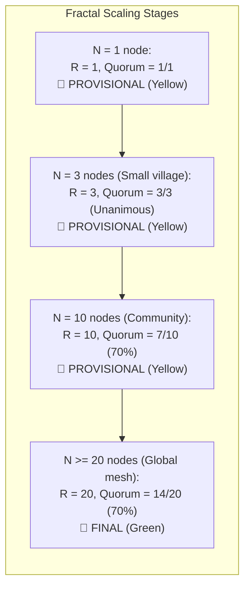
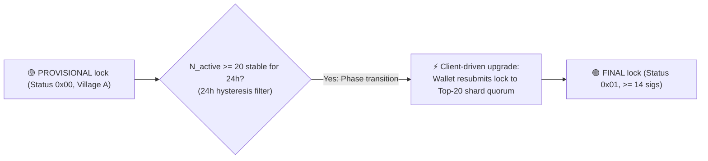
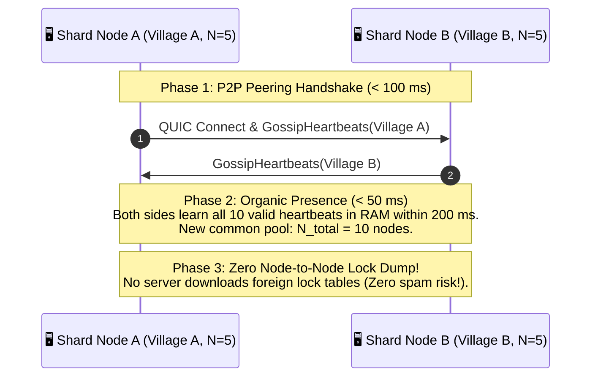
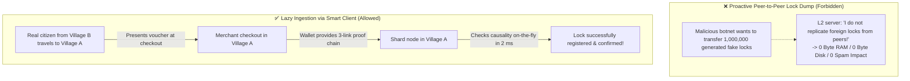

# 08. Topology Dynamics & Network Merge

> **Status:** Standard  
> **Model:** Logic & State Graph First  

This document specifies the **fractal shard dynamics** from micro-networks ($N < 20$) to the global federation ($N \ge 20$), the mathematical phase transition of the maturity indicator (`PROVISIONAL` $\rightarrow$ `FINAL`), and the flow of a **500-ms network merge** when two autonomous networks meet (e.g., Village A and Village B).

---

## 1. The Fractal Shard Formula (Zero Special Cases in Code)

Regardless of whether 2 phones in the forest or 1,000,000 servers worldwide are running, the same seamless mathematical formula applies for each of the 65,536 shards for replication size $R$ and required BFT quorum $Q$:

$$\text{Shard replication factor } R = \min\Big(20, \; N_{\text{active}}\Big)$$

$$\text{Required quorum } Q(R) = \left\lfloor \frac{2}{3} \times R \right\rfloor + 1$$

---

## 2. The Maturity Indicator Phase Transition (1-Byte Status)

The maturity indicator is controlled via a compact **1-byte status field** (`0x00`, `0x01`, `0x02`) in the `QuorumCertificate` and in the signature preimage:

| Active nodes $N$ | Status byte | Status name | Quorum condition | Economic significance |
| :--- | :--- | :--- | :--- | :--- |
| **$N < 20$** | `0x00` | `PROVISIONAL` (Yellow) | $\text{sigs} \ge \lfloor \frac{2}{3} N \rfloor + 1$ | Local trial operation, village trade, neighborhood café |
| **$N \ge 20$** | `0x01` | `FINAL` (Green) | $\ge 14/20$ sigs ($70\%$, after 24h hysteresis) | **Global finality & irreversibility** (supermarket, PoS) |
| **$N \ge 100$** | `0x02` | `HIGH_ASSURANCE` (Gold) | $\ge 16/20$ sigs ($80\%$, at $N \ge 100$) | Large transactions (vehicle purchase, B2B long-distance trade) |

* **Why `FINAL` only from $N \ge 20$?**  
  In a federation with $15\%$ Byzantine nodes, the probability that HRW randomly rolls a $\ge 2/3$ majority of bad nodes into one shard is less than $10^{-6}$ ($< 0{,}0001\%$) at $R=20$. Below $N=20$ the system honestly protects merchants with status **Yellow (`PROVISIONAL`)**.

### 2.1 The 24h Hysteresis Upgrade (Client-Driven)

To ensure provisional locks from small bootstrap networks ($N < 20$) do not remain provisional forever, the **client-driven upgrade** triggers upon reaching $N \ge 20$:

1. **24h hysteresis against flapping:** Only when $N_{\text{active}} \ge 20$ has been held stable for at least 24 consecutive hours do honest nodes sign with `status_tag = 0x01 (FINAL)` and domain tag `HUMOCO_V1_APPROVE_FINAL`.
2. **Cryptographic domain binding (Canonical `SigDigest`):**
   $$\text{SigDigest} = \text{BLAKE3}\Big(\text{len}(\text{DOMAIN\_TAG}) \parallel \text{DOMAIN\_TAG} \parallel \text{epoch\_id}_{\text{le}} \parallel \text{session\_seq}_{\text{le}} \parallel \text{flags}_{\text{le}} \parallel \text{shard\_id}_{\text{le}} \parallel \text{status\_tag} \parallel \text{payload\_digest}\Big)$$
   A small 14-node network can mathematically never produce a `FINAL` signature, as honest nodes sign exclusively with `status_tag = 0x00` (`HUMOCO_V1_APPROVE_PROV`) (SSOT: `docs/10:3.2` & `docs/04:224`).

---

## 3. The P2P Heartbeat Merge (Topology Convergence)

When two separate networks meet (e.g., Village A with $N_A=5$ and Village B with $N_B=5$), **no cumbersome database dump between servers** takes place:

### 3.1 Asymmetric Merge Transition (Village-to-World Network)

When a small village network ($N_A=5$) docks to a large federation ($N_{\text{world}}=10.000$), first contact occurs via one or more bridge edges:

1. **Organic gossip flow via bridge edge:**  
   The bridge node receives hourly heartbeats from the large network and forwards them along its dynamic edge budget ($R_{\text{soft}}$, see `docs/11`) to the village. There is **no unfiltered mass dump of node tables**.
2. **Local village continuity (No transaction disruption):**  
   * As long as new nodes in the village are still incubating in status `IMMATURE`, $N_{\text{local\_active}} = 5$ remains.
   * **Local locks (`status_tag = 0x00 / PROVISIONAL` 🟡):** Transactions of local village clients (e.g., bakery) continue completely undisturbed, as the 5 village nodes hold all active village locks in RAM and satisfy the local quorum $Q(5) = 4/5$ without the outside world.
3. **Convergence after 24 hours (Phase transition to `FINAL`):**  
   After 24 hours the large-network nodes have delivered $\ge 8/24$ heartbeats and switch to `ACTIVE` in the village. Only now does the village network arm its $N \ge 20$ shard quorum and sign global locks with `status_tag = 0x01 (FINAL)` 🟢.

---

## 4. Lazy History Ingestion: Protection Against Garbage Data on Merge

* **Zero State Bloat:** Servers never synchronize historical or foreign lock states speculatively.
* **Causality ProofChains** travel in the citizen's wallet and are validated only at payment time in ingress.

---

## 5. Deterministic Conflict Resolution on Double-Spend ($\min(H_{\text{canon}})$)

If a voucher was spent differently in two isolated networks during a partition (double-spend $A$ vs. $B$):

1. As soon as both transactions arrive at a common node or merchant terminal, the decision is deterministic:
   $$\min\Big(H_{\text{canon}}(\text{Lock}_A), \; H_{\text{canon}}(\text{Lock}_B)\Big)$$
2. The mathematically smaller hash becomes `FINAL`, the losing branch becomes irrevocably `VOID`.
3. The two colliding signatures form the complete fraud proof (`HUMOCO_V1_EQUIVOCATION`) for permanent P2P ban, invalidation of the mined shard ticket, and severance of all friendship edges in the Web of Trust (Zero Financial Deposits, but Identity Revocation & WoT Severance).

---

## 6. Invariants of Topology Dynamics

1. **[INV-0801] Fractal shard size:** Shard replication size $R$ is strictly defined by $\min(20, N_{\text{active}})$.
2. **[INV-0802] 1-byte status minting:** Status `FINAL` (`0x01`) may be signed by nodes only when $N_{\text{active}} \ge 20$ has been held stable for at least 24 consecutive hours.
3. **[INV-0803] Zero node-to-node lock replication:** Shard servers perform no proactive database dumps on topology merges. State synchronization occurs purely via client ingress and self-initiated digest-first PULL.
4. **[INV-0804] Symmetric conflict resolution:** On double-spends all nodes decide deterministically via $\min(H_{\text{canon}})$.
5. **[INV-0805] Bitmask self-proof:** A certificate counts as `FINAL` when its status is `0x01` and `signer_bitmap.count_ones() >= 14” is satisfied.
