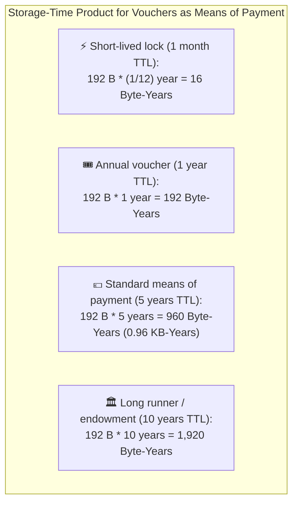
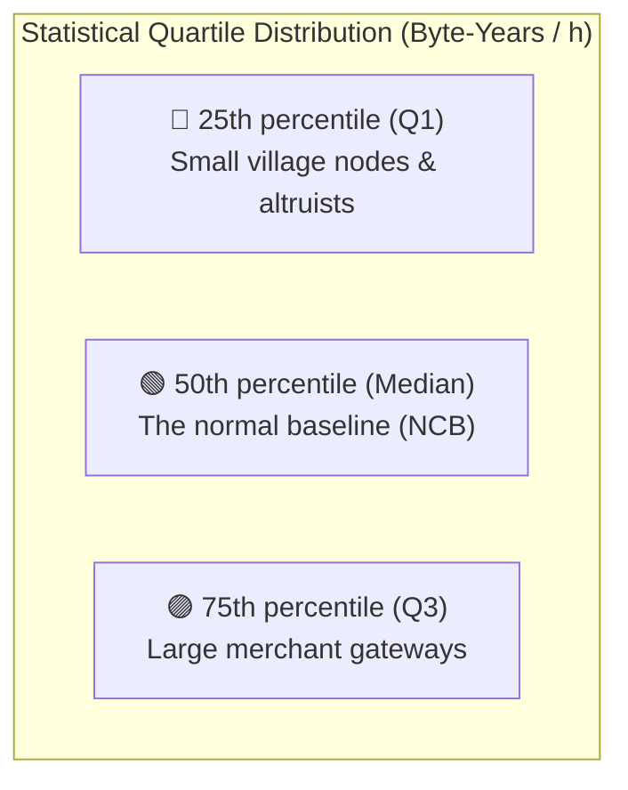

# 09. Network Thermometer, Byte-Years & Dynamic Quotas

> **Status:** Standard  
> **Model:** Logic & State Graph First  

This document specifies the **decentralized Network Thermometer**, the fundamental accounting unit of **Byte-Years (Storage-Time Product)**, the **organic quartile damping** and the **Whale Brake**. It prevents centralization via super-servers (oligarchies), protects small village nodes, and dynamically adapts system capacity to real worldwide transaction volume.

---

## 1. The Physical Currency: Storage-Time Product (Byte-Years)

Layer 2 holds no balances or monetary transaction fees. Vouchers circulate as fully-fledged decentralized means of payment and store of value **over periods of several months to several years (mean: approx. 5 years)**.

The actual hardware cost of a shard node arises from **retaining this active ownership and collision state in RAM over the entire voucher lifetime**.

### 1.1 Mathematical Definition

Since each `StoredLock` in RAM is $192\,\text{Bytes}$ in size (144 B wire `LockEntry` + 32 B Canon Hash + 8 B `valid_until` + shard/padding) or approx. $224\,\text{Bytes}$ including index overhead, the real footprint is deterministically computed from size and validity duration ($\Delta t = \text{valid\_until} - \text{now}$):

$$\text{Footprint}_{\text{Byte}\cdot\text{s}} = 192\,\text{Bytes} \times \Delta t_{\text{sec}}$$

In the standardized accounting unit **Byte-Years** ($1\,\text{year} = 31.536.000\,\text{seconds}$):

$$\text{Footprint}_{\text{Byte-Years}} = 192 \times \Delta t_{\text{years}}$$

### 1.2 Economic Incentive & Anti-Spam Brake
* **Real payment usage:** A 5-year voucher occupies $960\,\text{Byte-Years}$.
* **Physical protection:** A spammer wanting to dump millions of artificial 5-year locks into the network requires gigantic ingress budgets physically capped by the Network Thermometer.

---

## 2. Decentralized Quartile Capture ($Q1$ and $Q3$) & Cold Start ($N < 4$)

Each shard node continuously aggregates the consumed Byte-Years volume of all incoming locks.

### 2.1 Cold Start & Absolute Minimum (Hard Floor Baseline)

To guarantee the network never stalls even in idle periods and micro-networks ($N < 4$):

* **Unbreachable hard-floor baseline:**
  $$\text{NCB}_{\text{min}} = 960.000\,\text{Byte-Years / day} \quad (40.000\,\text{Byte-Years / hour})$$
* **Guaranteed minimum capacity:** Even if the computed median in the network arithmetically tends to 0, every node is **always guaranteed at least this base quota** ($\text{NCB}_{\text{eff}} = \max(\text{NCB}_{\text{calc}}, \text{NCB}_{\text{min}})$).
* **Practical meaning:** 
  A single village node can reliably ingest **1,000 new five-year vouchers** per day (or **5,000 one-year vouchers** or **60,000 monthly locks**) with the base quota. This is guaranteed sufficient for normal daily needs of a kiosk, village shop, or association.

### 2.2 Regular Federation ($N \ge 4$), 24-Hour Integral & 28-Day Smoothing

Once $N \ge 4$ active nodes are present in the mesh:
1. **Quartile capture ($Q1$, Median, $Q3$):** From heartbeats received via Dunbar gossip, each node locally computes quartiles.
2. **24-hour hourly ring buffer (`HourlySlottedRingBuffer`):**
   * To fully eliminate diurnal sampling bias, hourly medians are entered into a ring buffer of **24 hourly slots**.
   * The sum or average of these 24 slots yields at any arbitrary point in time the **exact, unweighted 24-hour integral** (e.g., from yesterday 07:00 to today 06:00).
3. **28-day sliding median (Slotted ring buffer):**
   * The daily 24h sum integral is written into a ring buffer of **28 daily slots**.
   * The effective reference value $\text{NCB}_{\text{day}}$ is the 28-day moving average of this median.
   * **Effect:** Neither diurnal fluctuations nor short-term traffic spikes (e.g., a 2-day botnet attack) can distort the Network Thermometer.

---

## 3. Physical Inertia (24h Daily Cycle & Time-Based Integer EMA)

Real economic traffic fluctuates over the day:
1. **24-hour daily epoch (`epoch_day`):** Quotas are allocated as **daily budgets**.
2. **Time-based integer EMA for burst damping:** To avoid millisecond spikes, the gateway computes the Exponential Moving Average time-based in $\mu\text{BJ}$ ($10^6$ fixed-point):
   $$\text{decay} = \frac{\text{old\_ema} \times \min(\Delta t_{\text{sec}}, 86.400)}{86.400}, \quad \text{new\_ema} = (\text{old\_ema} - \text{decay}) + \text{footprint}$$
   At $\Delta t = 0$ (burst in same second) no decay occurs; after 24h inactivity the value decays to 0.
3. **Organic inertia ($\tau$):** Smoothed via the 28-day low-pass filter.

---

## 4. The Zipf Spread Damper (Protection of Small Village Nodes)

In a healthy network $Q1$ and $Q3$ stand in natural ratio ($Q1 / Q3 \approx 0{,}33$):

$$\text{Spread\_Damper} = \max\left(0{,}5, \; \min\left(1{,}0, \; \frac{1 - \frac{Q1}{Q3}}{0{,}66}\right)\right)$$

---

## 5. The Deterministic 2-Stage Quota Model & Whale Brake

Instead of an unverifiable age curve (which would break on network merges), a clear, partition-safe 2-stage model applies to all nodes:

$$\text{Daily quota}(N) = \text{NCB}_{\text{eff}} \times K(N) \times \text{Spread\_Damper}$$

$$K(N) = \begin{cases} 
0{,}05 & \text{if unconfirmed / sandbox / incubation } (\text{Status IMMATURE}) \\
1{,}0 & \text{if fully active after 24h } (\text{Status ACTIVE})
\end{cases}$$

* **Absolute Whale Brake ($K \le 5{,}0$):** Even with merchant clusters operating multiple networked nodes or maximal multipliers, no single node may ingest more than **5× the 28-day moving-average median ($\text{NCB}_{\text{eff}}$)** ($K \le 5{,}0$).
* **Scaling via network growth:** If an economic region needs more ingress volume, it connects additional honest nodes $\rightarrow$ the global thermometer ($\text{NCB}$) rises honestly for all.
* **Silent dropping on overload:** Shard nodes silently discard excess locks at ingress without alert spam. Their heartbeats are deprioritized in Dunbar gossip; the violator dies organically and silently at the network edge.

### 5.2 Active Quota Feedback (`429 QuotaExceeded`) & 3-Zone Plausibility

To distinguish honest shard node timeouts on quota exhaustion from work refusal (lazy nodes):
1. **Active `429 QuotaExceeded` instead of silent timeout:** A shard node whose ingress budget for a sender is exhausted actively responds with `429 QuotaExceeded`.
2. **[INV-0909] The 3-zone plausibility check (honest frontrunner vs. fraud):**  
   The gateway (and every verifying peer) evaluates a `429` response against its own ingress counter for the sender relative to the quota limit:
   * **Zone 1: Clear fraud & laziness zone ($< 75\,\%$ of limit):**  
     Sender has consumed only a fraction of the limit (e.g., $2\times \text{NCB}$). A shard node already reporting `429` here refuses work. $\rightarrow$ **$\text{missing\_count} += 1$ (Failure counted)**.
   * **Zone 2: Tolerant border / cutoff zone ($75\,\%$ to $125\,\%$ of limit):**  
     Sender is scraping the 5× limit. A shard node hitting the limit first due to minimal packet ordering is an **honest frontrunner**. $\rightarrow$ **$\text{missing\_count} += 0$ (No penalty)**.
   * **Zone 3: Genuine overload zone ($> 125\,\%$ of limit):**  
     Sender is far beyond the limit. All nodes reject. $\rightarrow$ **$\text{missing\_count} += 0$ (Regular rate-limit protection)**.

### 5.3 [INV-0907] New-Node Bootstrap & Seed Initialization (Anti-Deadlock)

When a new node joins an existing large network:
* **Seed initialization (Day 0):** New node determines the current daily median of known peers $\text{Median}_{\text{start}}$ and immediately initializes **all 28 slots** of its ring buffer with this value:
  $$\text{slots}[0 \dots 27] = \max(\text{Median}_{\text{start}}, \; \text{NCB}_{\text{min}})$$
* **Rolling transition (Day 1 to 28):** Each day one seed slot is replaced by own locally measured daily truth. After 28 days buffer is 100 % autonomous.
* **24h grace period (`IMMATURE`):** On first day a new node imposes no peer penalties to fully exclude cold-start deadlocks.

### 5.4 [INV-0908] Network Merge & Fast Re-Seed (Merge Hysteresis)

When a small village network ($N=5$) merges with a global large network ($N=50.000$):
* **Merge detection:** If a node detects a jump in network size ($N_{\text{new}} \ge 2 \times N_{\text{old}}$ or $\Delta N \ge 20$), it switches to merge mode.
* **Fast re-seed:** Node immediately overwrites all 28 slots of its ring buffer with the new globally aggregated median of the total system.
* **24h quota moratorium (`INV-0802`):** During the 24-hour merge hysteresis window no peer bans due to quota discrepancies are imposed, to prevent cascade bans and death loops.

---

## 6. The Decentralized Network Read Thermometer (5:1 Read-Load Coupling)

While write locks bind persistent State Bloat in RAM and on disk (Storage-Time Product in Byte-Years), read queries (`POST /v1/status`, P2P `StatusQuery`, `POST /v1/sync`) burden ephemeral resources: CPU (Ed25519 signature generation of `L2Verdict`), CAS lookups, and socket bandwidth.

### 6.1 Read Credits & Weighting
Since $\Delta t = 0$ for read requests, the read thermometer measures **read operations (credits)**:
* **Simple status check (`/status`, `StatusQuery`):** $1\,\text{Read-Credit}$.
* **`ShardDigestRequest`:** $2\,\text{Read-Credits}$.
* **`POST /v1/sync` / `ActiveSyncRequest`:** $1 + \left\lceil \frac{\text{Locks}}{10} \right\rceil\,\text{Credits}$ (weighted chunk compensation).

### 6.2 The 5:1 Ratio & Hard Floor ($50.000\,\text{Reads/day}$)
* **5:1 ratio:** In real payment traffic a voucher is typically checked multiple times before being locked. The ratio of read load to write load in healthy equilibrium is designed at approx. $5 : 1$.
* **Read hard floor:** Analogous to write hard floor ($1.000$ locks/day = $960.000\,\text{BJ/day}$) the network guarantees every node and smart client **always at least $50.000\,\text{reads / day}$** ($\approx 2.083\,\text{reads/h}$):
  $$\text{NCB}_{\text{read, eff}} = \max\left(\text{MovingAverage28}(\text{DailyReadMedians}), \; 50.000\right)$$
  Since read operations are served toll-free from RAM and gateways distribute read load across Top-20 shard nodes (`UniformRandom` per `INV-0310`), this floor guarantees aggregating gateways at least $1.000.000$ reads/day per shard.
* **Read Whale Brake:** For read operations too the absolute cap $K \le 5{,}0$ ($500\,\%$ of 28-day median) applies.

---

## 7. Invariants of the Network Thermometer

1. **[INV-0901] Byte-Years accounting unit:** Ingress and storage capacity for write locks is measured exclusively in the Storage-Time Product $\text{Byte} \times \Delta t_{\text{TTL}}$ (standard: Byte-Years).
2. **[INV-0902] Hard floor baseline ($960.000\,\text{BJ/day}$):** Effective write baseline $\text{NCB}_{\text{eff}}$ must never fall below the fixed minimum of $960.000\,\text{Byte-Years/day}$ ($40.000\,\text{BJ/h}$).
3. **[INV-0903] 28-day median smoothing:** Median is smoothed via a 28-day slotted ring buffer to absorb sudden hypes or short-lived botnet spikes.
4. **[INV-0904] 24h daily budget:** Quotas are computed per 24-hour epoch (`epoch_day`) to absorb intraday load peaks (e.g., lunch rush) without throttling.
5. **[INV-0905] Whale cap:** Multiplier $K$ is invariantly capped at $5{,}0$ ($K \le 5{,}0$).
6. **[INV-0906] Silent enforcement:** Quota exceedances are enforced exclusively via local silent dropping or `429 QuotaExceeded`; no global pillory or alarm broadcasts exist.
7. **[INV-0907] Seed initialization for new nodes:** New nodes fill all 28 slots of their ring buffer on joining with the current peer median to prevent cold-start deadlocks in large networks.
8. **[INV-0908] Fast re-seed on network merges:** On abrupt network growth ($N_{\text{new}} \ge 2\times N_{\text{old}}$) the 28-day buffer is immediately re-seeded with the new global median; during 24h merge hysteresis a quota moratorium applies.
9. **[INV-0909] 3-zone plausibility check for `429 QuotaExceeded`:** Rejections below $75\,\%$ of limit are punished as fraud/laziness with $\text{missing\_count} += 1$; in border zone ($75\dots 125\,\%$) a node counts as honest frontrunner with $\text{missing\_count} += 0$.
10. **[INV-0910] Read hard floor ($50.000\,\text{reads/day}$):** Every node and smart client has a guaranteed minimum read capacity of $50.000$ read credits per day ($\approx 2.083\,\text{reads/h}$).
11. **[INV-0911] 28-day read median smoothing:** Read queries are smoothed via a separate 28-day slotted ring buffer to cushion scraping and crawler attacks.
12. **[INV-0912] Read Whale Brake ($K \le 5{,}0$):** No single node may fetch more than $5\times$ the smoothed read median per 24h epoch.
13. **[INV-0913] Pre-filter quota check for read CPU:** Quota check for `/status` occurs before CAS lookup and before Ed25519 signature computation to fend off signing DDoS attacks in $0\,\mu\text{s}$.
