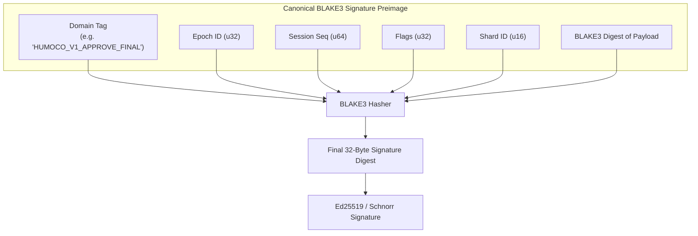
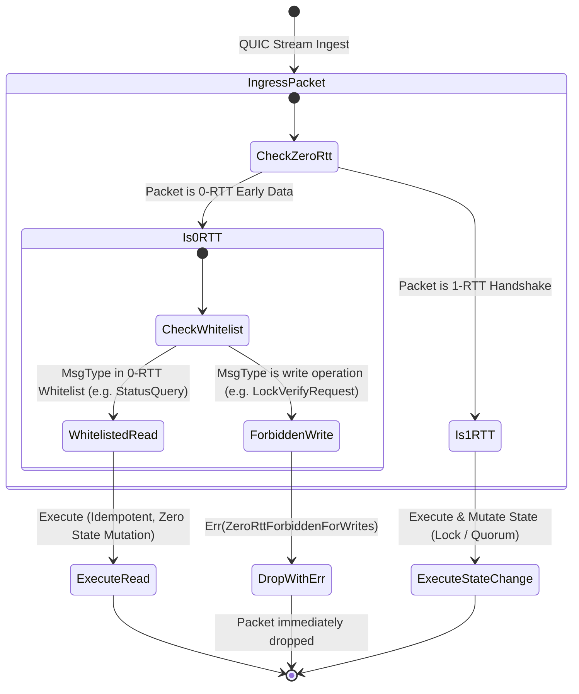
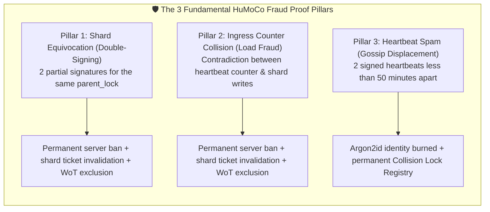

# 10. P2P Wire Format, Session Framing & 0-RTT Whitelist

> **Status:** Standard  
> **Model:** Logic & State Graph First  

This document specifies the **binary wire format**, the **session framing** over QUIC streams, as well as the cryptographic **domain separation** and **0-RTT whitelist**. It guarantees zero-copy deserialization (`rkyv`), replay protection, and sub-millisecond parsing at the Point-of-Sale (PoS).

---

## 1. The 32-Byte C-Aligned `WireHeader`

Every P2P message on a QUIC connection begins with an exactly **32-byte**, 8-byte-aligned header. It strictly separates routing, causality, and framing metadata from the payload (`rkyv` payload).

### 1.1 Binary Byte Layout (Hex / C Layout)

```
 0                   1                   2                   3
 0 1 2 3 4 5 6 7 8 9 0 1 2 3 4 5 6 7 8 9 0 1 2 3 4 5 6 7 8 9 0 1
+-+-+-+-+-+-+-+-+-+-+-+-+-+-+-+-+-+-+-+-+-+-+-+-+-+-+-+-+-+-+-+-+
|                       Magic: "HUMO"                           |  [0..4]
+-+-+-+-+-+-+-+-+-+-+-+-+-+-+-+-+-+-+-+-+-+-+-+-+-+-+-+-+-+-+-+-+
|       Protocol Version        |          MsgType              |  [4..8]
+-+-+-+-+-+-+-+-+-+-+-+-+-+-+-+-+-+-+-+-+-+-+-+-+-+-+-+-+-+-+-+-+
|                                                               |
+                       Session Sequence                        +  [8..16]
|                                                               |
+-+-+-+-+-+-+-+-+-+-+-+-+-+-+-+-+-+-+-+-+-+-+-+-+-+-+-+-+-+-+-+-+
|                           Epoch ID                            |  [16..20]
+-+-+-+-+-+-+-+-+-+-+-+-+-+-+-+-+-+-+-+-+-+-+-+-+-+-+-+-+-+-+-+-+
|                            Flags                              |  [20..24]
+-+-+-+-+-+-+-+-+-+-+-+-+-+-+-+-+-+-+-+-+-+-+-+-+-+-+-+-+-+-+-+-+
|                         Payload Length                        |  [24..28]
+-+-+-+-+-+-+-+-+-+-+-+-+-+-+-+-+-+-+-+-+-+-+-+-+-+-+-+-+-+-+-+-+
| Crypto Suite  | Min Compat Ver|           Reserved            |  [28..32]
+-+-+-+-+-+-+-+-+-+-+-+-+-+-+-+-+-+-+-+-+-+-+-+-+-+-+-+-+-+-+-+-+
|                   Payload (rkyv, 0..N Bytes)                  |  [32..32+N]
+-+-+-+-+-+-+-+-+-+-+-+-+-+-+-+-+-+-+-+-+-+-+-+-+-+-+-+-+-+-+-+-+
```

### 1.2 Rust Type Definition

```rust
use rkyv::{Archive, Deserialize, Serialize};

pub const WIRE_MAGIC: [u8; 4] = *b"HUMO";
pub const CURRENT_PROTOCOL_VERSION: u16 = 1;

/// 32-Byte C-Aligned Framing Header
#[derive(Clone, Copy, Debug, PartialEq, Eq, Archive, Serialize, Deserialize)]
#[archive(check_bytes)]
#[repr(C, align(8))]
pub struct WireHeader {
    /// Protocol identifier: Always b"HUMO" (0x48, 0x55, 0x4D, 0x4F)
    pub magic: [u8; 4],
    
    /// Protocol version (currently 1)
    pub protocol_version: u16,
    
    /// Message type (e.g. LOCK_REQUEST, STATUS_QUERY)
    pub msg_type: u16,
    
    /// Monotonically increasing sequence number of the QUIC session (replay & gap detection)
    pub session_seq: u64,
    
    /// Current 24h epoch ID (T_0 reference)
    pub epoch_id: u32,
    
    /// Bitflags for control (FINAL, PROVISIONAL, TOMBSTONE, etc.)
    pub flags: u32,
    
    /// Exact byte size of the following rkyv payload
    pub payload_len: u32,
    
    /// Crypto suite identifier (0 = Ed25519Blake3 default, 1 = Ed25519Blake3, 2 = Hybrid/PQC)
    pub crypto_suite: u8,

    /// Minimum protocol version compatibility
    pub min_compat_ver: u8,

    /// 8-byte alignment padding / reserved for future protocol extensions
    pub reserved: u16,
}

impl WireHeader {
    pub const SIZE: usize = 32;

    #[inline(always)]
    pub fn is_valid_magic(&self) -> bool {
        self.magic == WIRE_MAGIC
    }
}
```

---

## 2. Message Types & Flag Definitions

### 2.1 Message Types (`msg_type`)

```rust
#[repr(u16)]
#[derive(Clone, Copy, Debug, PartialEq, Eq)]
pub enum MsgType {
    // --- Read operations (0-RTT Whitelist) ---
    StatusQuery          = 0x0001,
    StatusResponse       = 0x0002,
    LatencyProbe         = 0x0003,
    LatencyProbeAck      = 0x0004,

    // --- Write & verification operations (1-RTT Only) ---
    LockVerifyRequest    = 0x0101,
    LockVerifyResponse   = 0x0102,
    EquivocationProof    = 0x0105, // Fraud proof -> leads to permanent server ban
    EquivocationAck      = 0x0106,
    ActiveSyncRequest    = 0x0107, // PULL-sync request for active shard locks (0-RTT whitelisted)
    ActiveSyncDone       = 0x0109, // Completion marker of the PULL-sync
    ShardDigestRequest   = 0x010A, // Shard digest range request
    ShardDigestResponse  = 0x010B, // Shard digest response

    // --- Peer & sync control ---
    Heartbeat            = 0x0201,
    HeartbeatAck         = 0x0202,
}
```

### 2.2 Header Flags (`flags`)

| Bit Mask | Identifier | Meaning |
| :--- | :--- | :--- |
| `0x0000_0001` | `FLAG_PROVISIONAL` | Lock request is in provisional mode ($q_{\text{prov}}$) |
| `0x0000_0002` | `FLAG_FINAL` | Binding finality request ($q_{\text{final}} \ge 14/20$) |
| `0x0000_0004` | `FLAG_EXPIRED_CLEANUP` | Marks garbage collection of an expired voucher (Expired Voucher Cleanup) |
| `0x0000_0008` | `FLAG_HEDGED` | Redundant request to backup nodes for latency stabilization |
| `0x0000_0010` | `FLAG_COMPRESSED` | Payload is LZ4/ZSTD-compressed (only for bulk/cold path) |

### 2.3 The 64-Byte `EpochHeartbeat` Payload (`MsgType::Heartbeat`)

Every active node sends exactly one 64-byte heartbeat payload per hour for presence and horizon synchronization:

```rust
#[repr(C)]
pub struct EpochHeartbeatPayload {
    pub epoch_hour: u32,            // 4 bytes: Hour epoch since network genesis
    pub timestamp_unix: u32,        // 4 bytes: Local Unix epoch system time
    pub node_id: [u8; 32],          // 32 bytes: Ed25519 public key of the sending node
    pub seen_24h_count: u32,        // 4 bytes: Actual number of locally active peers (popcount >= 8)
    pub horizon_state: u8,          // 1 byte: 0 = EXPANDING (partial view), 1 = CONVERGED (full view)
    pub _reserved: [u8; 3],         // 3 bytes: C-alignment padding
    pub pow_nonce: u64,             // 8 bytes: Argon2id stamp / liveness proof
    pub signature: [u8; 64],        // 64 bytes: Ed25519 signature over all header fields
}
```

---

## 3. Cryptographic Domain Separation

To make **class-swapping attacks** (e.g. maliciously presenting a provisional signature as a final quorum signature) mathematically impossible, HuMoCo Layer 2 enforces strict preimage prefixes before every hash and signature step.



### 3.1 Domain Separation Table

| Domain Tag String | Tag Length | Prefix | Purpose | Sanction on Double-Signing |
| :--- | :--- | :--- | :--- | :--- |
| `HUMOCO_V1_RAW` | 13 bytes | `0x01` | General P2P messages | None |
| `HUMOCO_V1_APPROVE_FINAL` | 23 bytes | `0xA1` | Binding $q_{\text{final}}$ lock certificate ($N \ge 20$, $\ge 24\text{h}$) | **Permanent server ban & L1 slashing** |
| `HUMOCO_V1_APPROVE_PROV` | 22 bytes | `0xA2` | Provisional $q_{\text{prov}}$ lock certificate ($N < 20$) | No sanction under partition |
| `HUMOCO_V1_APPROVE_HIGH` | 22 bytes | `0xA3` | High-assurance lock certificate ($N \ge 100$) | **Permanent server ban & L1 slashing** |
| `HUMOCO_V1_EXPIRY_CLEANUP` | 23 bytes | `0xA4` | Garbage collection of expired entries (TTL) | Local drop on invalidity |
| `HUMOCO_V1_EQUIVOCATION` | 22 bytes | `0xEF` | Fraud proof (evidence packet) | Immediate server ban of perpetrator |
| `HUMOCO_V1_CANON_RESOLVER` | 24 bytes | `0xC1` | Split-brain arbiter $\min(H_{\text{canon}})$ | N/A (deterministic hash) |
| `HUMOCO_V1_GENESIS` | 17 bytes | `0x00` | Deterministic root genesis | N/A |

### 3.2 Normative Computation Procedure (SSOT)

$$\text{SigDigest} = \text{BLAKE3}\Big(\text{len}(\text{DOMAIN\_TAG}) \parallel \text{DOMAIN\_TAG} \parallel \text{epoch\_id}_{\text{le}} \parallel \text{session\_seq}_{\text{le}} \parallel \text{flags}_{\text{le}} \parallel \text{shard\_id}_{\text{le}} \parallel \text{status\_tag} \parallel \text{payload\_digest}\Big)$$

```rust
pub fn calculate_signature_digest(
    domain_tag: &[u8],
    epoch_id: u32,
    session_seq: u64,
    flags: u32,
    shard_id: u16,
    status_tag: u8,
    payload_digest: &[u8; 32],
) -> [u8; 32] {
    let mut hasher = blake3::Hasher::new();
    hasher.update(&(domain_tag.len() as u8).to_le_bytes());
    hasher.update(domain_tag);
    hasher.update(&epoch_id.to_le_bytes());
    hasher.update(&session_seq.to_le_bytes());
    hasher.update(&flags.to_le_bytes());
    hasher.update(&shard_id.to_le_bytes());
    hasher.update(&[status_tag]);
    hasher.update(payload_digest);
    *hasher.finalize().as_bytes()
}
```

* **Mathematical invariance:** Since the hash prefix is an integral part of signature verification (including explicit length binding and `status_tag`), verification fails if an attacker tries to submit an `APPROVE_PROV` signature inside an `APPROVE_FINAL` quorum.

---

## 4. QUIC 0-RTT Whitelist & Replay Protection

QUIC 0-RTT allows a client to send payload already in the first handshake packet (`Initial + 0-RTT`). This eliminates a full network round-trip ($0\,\text{ms}$ connection-setup overhead). 

However, 0-RTT carries the inherent risk of **network replays** (an attacker intercepts the 0-RTT packet and replays it).



### 4.1 The 0-RTT Whitelist Matrix

| Message Type | 0-RTT Allowed? | Rationale & Security Analysis |
| :--- | :--- | :--- |
| `StatusQuery` | **YES (🟢)** | Fully idempotent; replay merely returns the same RAM status. |
| `LatencyProbe` | **YES (🟢)** | Pure RTT measurement packet; modifies no system state. |
| `ActiveSyncRequest` | **YES (🟢)** | **Idempotent PULL-sync.** Merely returns already-quorated active locks; mutates no state. |
| `LockVerifyRequest` | **NO (🔴)** | **State mutation.** 0-RTT replay could create artificial race conditions. **1-RTT strictly required.** |
| `EquivocationProof` | **NO (🔴)** | Slashing trigger; requires 1-RTT nonce binding. |

### 4.2 Replay Protection for Write Operations

For all write messages:

1. **1-RTT Handshake:** The server processes `LockVerifyRequest` only after successful completion of the cryptographic TLS 1.3 1-RTT handshake.
2. **Session sequencing:** Every message on a QUIC stream must have a strictly monotonic `session_seq` ($\text{seq}_{n+1} = \text{seq}_n + 1$).
3. **Automatic drop:** If a writing request arrives in the 0-RTT stream, the shard node immediately closes the stream with error code `ERR_ZERO_RTT_WRITE_FORBIDDEN` (`0x0018`).

---

---

## 5. Jury-Free Ingress Accounting & Strict 2-Stream Mesh Gossip

In earlier drafts (ADR-011) an assigned auditor jury randomly sampled whether gateways truthfully declared their ingress traffic. In the current HuMoCo Layer 2 architecture, auditor juries and epidemic lock gossip are **fully eliminated**:
- **Checkout Hot-Path (PoS / Ingress) is 100% Shard-Direct RPC, 0% Gossip:** Locks are created via client-to-gateway ingress (`POST /v1/lock`), verified via Shard-Direct RPC (`LockVerifyRequest` / `LockVerifyResponse`), and synchronized via Spec 03 Digest Pull (`ShardDigestRequest` / `ActiveSyncRequest`). Locks are NEVER gossiped.
- **Strict 2-Stream Mesh Gossip:** P2P Mesh Gossip across F2F edges consists strictly of exactly two streams:
  1. **Hourly Heartbeat / Presence Gossip (Spec 11):** 1 packet per hour, $\text{TTL} = 16$, Dunbar fan-out $k = \min(d, \lceil\sqrt{d}\rceil + 1)$. Used exclusively for presence discovery, topological awareness, and median clock synchronization.
  2. **Equivocation Proofs (Spec 10):** Cryptographic first-party fraud evidence (`FRAUD_EQUIVOCATION`) forwarded with priority to isolate and ban double-signing offenders immediately.

```mermaid
flowchart TD
    subgraph GatewayIngress["1. Ingress Declaration (Hot Path)"]
        G["Gateway G signs SignedIngressEnvelope<br>(monotone gateway_seq + timestamp_ms)"]
        G -->|QUIC 1-RTT Stream| Shard["Top-20 Shard Nodes (Shard-Direct RPC)"]
    end

    subgraph ShardProcessing["2. Local Processing & Hot-Path Resolution"]
        Shard -->|O(1) First-Seen Lock in RAM| Success["Lock successfully verified (< 5ms)"]
        Shard -->|Direct RPC Response| G
    end

    subgraph MeshGossip["3. Strict 2-Stream F2F Mesh Gossip"]
        H["1. Hourly Heartbeat / Presence Gossip (1 pkt/hour)"] --> Mesh["F2F Mesh"]
        E["2. Equivocation Proofs (HUMOCO_V1_EQUIVOCATION)"] --> Mesh
    end

    subgraph FraudDetection["4. O(1) Collision Trap & Fraud Exclusion"]
        Mesh --> Peer["F2F Neighbor Node"]
        Peer --> Collision{"Equivocation Detected?<br>1. Double-signing (same slot/parent_lock)<br>2. Time-warp / sequence regression"}
        Collision -->|Fraud proven| Evidence["HUMOCO_V1_EQUIVOCATION (160B)"]
        Evidence --> Slash["🔴 Permanent P2P ban & WoT exclusion (Identity Revocation)"]
    end
```

### 5.0 The Global Time Hierarchy, Units & Tolerance Windows

To deterministically exclude time divergences and time-jacking across the entire network, a strict unit and validity hierarchy applies:

| Time Base | Rust Type | Unit | Purpose & Scope | Tolerance Window |
| :--- | :--- | :--- | :--- | :--- |
| **$T_0$** | `u64` | seconds (UTC) | Fixed genesis zero point in source code. | Exact ($0\,\text{s}$) |
| **`epoch_day`** | `u32` | days (24h) | $(t_{\text{unix\_sec}} - T_0) / 86400$ for quota and epoch rollover. | Exactly deterministic |
| **`valid_until` & heartbeats** | `u64` | seconds (UTC) | All lock expiry dates, voucher deadlines, and heartbeat timestamps. | $\pm 60\,\text{s}$ ingress filter |
| **`timestamp_ms`** | `u64` | milliseconds (UTC) | **Exclusively** in `SignedIngressEnvelope` for latency and relay telemetry. | Saturating ($\pm 30\,\text{s}$ skew) |

* **Ingress minimum lead time:** Every new lock must lie at least $30\,\text{s}$ in the future ($\text{valid\_until} > \text{now} + 30\,\text{s}$).
* **Grace period on deletion:** Physical deletion from RAM occurs only at $\text{now} > \text{valid\_until} + 30\,\text{s}$ (protection against resurrection races on clock drift).
* **P2P Network-Adjusted Time (disaster fallback):** If NTP fails globally or locally (island operation in the village), the node computes its logical network time via $\text{net\_time} = \text{local\_clock} + \text{Median}(\Delta t_{\text{WoT}})$. Upon reconnection to the world network, the island network automatically and smoothly converges back to world time via the new gossip median.

### 5.1 The Signed Ingress Envelope (`SignedIngressEnvelope`)

Each lock request is encapsulated by the forwarding gateway into an incontestable, signed envelope. It contains the **current 24-hour day epoch (`epoch_day`)**, the **monotonically accumulated storage-time counter (`cumulative_micro_byte_years`)**, and the **current continuous-time EMA heat value (`current_anl_24h`)**:

```rust
#[derive(Clone, Copy, Debug, PartialEq, Eq, Archive, Serialize, Deserialize)]
#[archive(check_bytes)]
#[repr(C, align(8))]
pub struct SignedIngressEnvelope {
    /// Public key of the forwarding gateway
    pub gateway_pubkey: [u8; 32],
    
    /// Consecutive day epoch since T0: (unix_sec - T0) / 86400 (24h smoothing)
    pub epoch_day: u32,
    
    /// Shard bucket (0..65535)
    pub shard_id: u16,
    
    /// 2-byte alignment padding
    pub _padding: [u8; 2],
    
    /// Monotonically increasing storage-time counter within THIS day in µBJ (1 BJ = 1,000,000 µBJ)
    pub cumulative_micro_byte_years: u64,
    
    /// Binding final counter of the previous day (epoch_day - 1) in µBJ (Zero State Bloat chaining)
    pub prev_day_final_bytes: u64,
    
    /// Current time-based integer EMA value (24h heat) of the gateway in µBJ (burst dampening)
    pub current_anl_24h: u64,
    
    /// Monotonically increasing packet sequence number of the gateway within this day (1, 2, 3...)
    pub epoch_seq: u32,
    
    /// 4-byte alignment padding
    pub _padding2: [u8; 4],
    
    /// Unix timestamp in milliseconds (saturating arithmetic against NTP jumps)
    pub timestamp_ms: u64,
    
    /// BLAKE3 digest of the contained LockEntry
    pub lock_hash: [u8; 32],
    
    /// Ed25519 signature of the gateway over the above fields (Domain: HUMOCO_V1_INGRESS_DECL)
    pub signature: [u8; 64],
}
```

### 5.2 Strict 2-Stream Mesh Gossip Principle

Epidemic gossip for individual lock transactions is completely eliminated. The P2P network operates strictly on two streams:
1. **Presence & Time Sync Stream:** 1 heartbeat packet per node per hour across direct F2F edges.
2. **Equivocation Fraud Proof Stream:** Immediate, high-priority forwarding of cryptographically verified `EquivocationProof` packets.

### 5.3 The 3 Mathematical Fraud Proof Pillars in $O(1)$ (Slashing Evidence)

Each fraud proof follows the mathematical invariant: **Two signed structures of the same author whose combination proves a physical or cryptographic impossibility.** It requires neither witnesses, nor quorum votes, nor historic blockchain downloads, but is autonomously verifiable by every node in **$< 100\,\mu\text{s}$**:



| Pillar | Type Identifier | Data Structure | Protective Effect & Fraud Scenario | Consequence |
| :--- | :--- | :--- | :--- | :--- |
| **Pillar 1** | `FRAUD_SHARD_EQUIVOCATION` | $T_1 \parallel T_2$ (2 partial certificates) | **UTXO double-spend protection:** A shard node signs partial signatures for two different successor locks ($L_{3A} \neq L_{3B}$) referencing the same `parent_lock`. | Permanent `server ban`, invalidation of the shard ticket & severance of all WoT edges |
| **Pillar 2** | `FRAUD_INGRESS_COUNTER_CONFLICT` | $P_1 \parallel P_2$ (heartbeat $\parallel$ write or write $\parallel$ write) | **Ingress & quota authenticity:** Counter runs backwards, heartbeat contradicts actual shard writes, or mathematical addition of $144\,\text{B} \times \text{TTL}$ is forged. | Permanent `server ban`, invalidation of the shard ticket & severance of all WoT edges |
| **Pillar 3** | `FRAUD_HEARTBEAT_SPAM` | $H_1 \parallel H_2$ (2 heartbeats) | **Edge spam protection:** A node sends two heartbeats within $< 50\,\text{minutes}$ to capture edge budgets $R_{\text{soft}}$ and displace honest peers. | Permanent entry in the **Collision Lock Registry** + Argon2id PoW burned |

---

#### 1. Pillar 1: Shard Equivocation & Double-Signing (UTXO Conflict)
A shard node tries to enable a double-spend by certifying two different successor transactions for the same `parent_lock` (violation of the first-seen principle):
$$\text{Evidence}_{\text{equivocation}} = (T_1 \parallel T_2) \implies (T_1.\text{signer} == T_2.\text{signer}) \land (T_1.\text{parent\_lock} == T_2.\text{parent\_lock}) \land (T_1.\text{new\_lock\_hash} \neq T_2.\text{new\_lock\_hash})$$
* **Why is a fake quorum from a single node not enough?** A smart client at the checkout strictly requires $Q \ge 14/20$ Ed25519 signatures. A single lying node is ignored. The fraud lies in the node helping to build two competing quorums through double-signing.
* **Parallel shard broadcast:** Sending identical ingress envelopes for the same lock hash to multiple shard nodes in parallel (e.g. for latency minimization during routing) does **not** constitute equivocation, since $\text{new\_lock\_hash}$ is identical.

#### 2. Pillar 2: Ingress Counter Collision & Load Fraud (Unified Ingress Invariance & 8-Path Matrix)
Each `SignedIngressEnvelope` bindingly declares the day counter (`cumulative_micro_byte_years`), the sequence number (`epoch_seq`), the day (`epoch_day`), and the previous-day final value (`prev_day_final_bytes`).

Verification of two packets $P_1, P_2$ of the same gateway follows the formal **8-path trichotomy matrix** (with $P_1 \le P_2$ w.r.t. time/epoch):
* **Path 1 (Same day, same seq, same hash):** `LEGAL` (idempotent duplicate).
* **Path 2 (Same day, same seq, different hash):** `FRAUD` (sequence fork $\to$ immediate L1 slashing).
* **Path 3 (Same day, seq2 > seq1, cum2 >= cum1):** `LEGAL` (monotonic growth).
* **Path 4 (Same day, seq2 > seq1, cum2 < cum1):** `FRAUD` (counter regression $\to$ immediate L1 slashing).
* **Path 5 (Same day, seq2 < seq1):** `LEGAL` (packet reordering due to UDP/QUIC jitter).
* **Path 6 (Next day D2 = D1 + 1, cum1 <= prev_final2):** `LEGAL` (honest midnight day transition).
* **Path 7 (Next day D2 = D1 + 1, cum1 > prev_final2):** `FRAUD` (previous-day concealment $\to$ immediate L1 slashing).
* **Path 8 (Gap D2 > D1 + 1):** `LEGAL` (rest day / gap $\ge 2$ days, Zero State Bloat).

$$\text{Evidence}_{\text{counter\_conflict}} = (P_1 \parallel P_2) \implies \text{Violation of one of paths 2, 4, or 7}$$

#### 3. Pillar 3: Heartbeat Spamming & Edge Displacement (Gossip Flooding)
A node emits two validly signed heartbeats $H_1$ and $H_2$ within the same 50-minute minimum interval ($3{,}000\,\text{s}$) to capture edge budgets $R_{\text{soft}}$:
$$\text{Evidence}_{\text{heartbeat\_spam}} = (H_1 \parallel H_2) \implies (H_1.\text{node\_id} == H_2.\text{node\_id}) \land (|H_2.\text{timestamp\_unix} - H_1.\text{timestamp\_unix}| < 3{,}000\,\text{s})$$

---

### 5.4 The Fraud Proof Packet (`FraudProofPayload`) & Wire Format

```rust
#[repr(u8)]
#[derive(Clone, Copy, Debug, PartialEq, Eq, Archive, Serialize, Deserialize)]
pub enum FraudProofPillar {
    ShardEquivocation     = 0x01, // Pillar 1: Double-signing for the same parent_lock
    IngressCounterConflict = 0x02, // Pillar 2: Load counter regression / heartbeat discrepancy
    HeartbeatSpam         = 0x03, // Pillar 3: Heartbeat spam (interval < 50 minutes)
}

#[derive(Clone, Debug, Archive, Serialize, Deserialize)]
#[archive(check_bytes)]
#[repr(C, align(8))]
pub struct FraudProofPayload {
    /// NodeID / public key of the convicted perpetrator (32 bytes)
    pub perpetrator_node_id: [u8; 32],
    
    /// Fraud pillar (1..3)
    pub proof_pillar: FraudProofPillar,
    
    /// 7-byte alignment padding
    pub _padding: [u8; 7],
    
    /// First signed original packet (full wire format)
    pub evidence_packet_a: Vec<u8>,
    
    /// Second signed original packet (full wire format)
    pub evidence_packet_b: Vec<u8>,
    
    /// Optional: NodeID of the discoverer / reporter (for rewards / audit log)
    pub reporter_node_id: [u8; 32],
    
    /// Signature of the reporter over (perpetrator_node_id || proof_pillar || hash(A) || hash(B))
    pub reporter_signature: [u8; 64],
}
```

---

### 5.5 Propagation Rules in P2P Gossip: High Priority & Redundancy

A fraud proof is a **time-critical security emergency alert**. It follows special propagation rules to immunize the worldwide network within milliseconds:

```
[ Discoverer Node (Generates FraudProof) ]
                     │
    ┌────────────────┼────────────────┐  (Redundant fan-out: k_alert >= 3..5)
    ▼                ▼                ▼
[ Neighbor A ]  [ Neighbor B ]    [ Neighbor C ]
  (Priority-0)   (Priority-0)     (Priority-0)
```

1. **Priority-0 Urgency Queue (Express Forwarding):**
   * Fraud proofs take precedence over all other messages (locks, heartbeats, syncs).
   * They are processed **immediately and unthrottled** at the head of the send queue.
2. **Edge Budget Bypass:**
   * Fraud proofs are **not** subject to stochastic edge throttling ($R_{\text{soft}}$). They are forwarded at 100% on every edge without exception.
3. **Redundant 3–5-Way Fan-Out ($k_{\text{alert}} \ge 3 \dots 5$):**
   * The discoverer sends the proof packet in parallel to **at least 3 to 5 independent neighbor edges** (or to all direct friends) to bridge failures of individual edges.
4. **Deterministic Enforcement at Receiver:**
   * As soon as a node validates the proof in $< 100\,\mu\text{s}$:
     1. **Edge severance:** All QUIC streams to the perpetrator $\text{NodeID}$ are immediately torn down with `ERR_NODE_PERMANENTLY_BANNED`.
     2. **Permanent Collision Lock Registry:** The $\text{NodeID}$ is entered into the local O(1) RAM and disk ban filter (`BannedNodes`).
     3. **Layer-1 Relay & SST:** The proof is relayed to Layer 1 to mathematically de-anonymize the perpetrator via Shared-Signature Trap (SST) and permanently brand them as `KnownOffender` in the Web of Trust.

---

### 5.5 P2P Stream Integrity & Reciprocity Feedback

To reliably feed ingress traffic to foreign shards with minimal latency, the network uses no cumbersome token attestation system but direct **P2P reciprocity (tit-for-tat)** and **zero-gossip 4-byte bitmask feedback**:

* **Zero-Gossip Shard Feedback (4-Byte Piggyback):** When closing the QUIC streams after successful quorum, the gateway sends a 4-byte `signers_bitmask`. Participating shard nodes increment missing signatures locally in RAM (`missing_count`).
* **Local Isolation & HRW Rank 21:** If a shard node reaches `missing_count >= 3`, it is locally suspended. Deterministically the node at **HRW rank 21** steps in in $0\,\text{ms}$.
* **Reciprocal P2P Throttling & Suspension:** Nodes that refuse work in their shards lose their peering credits on direct QUIC connections. Incoming ingress streams are throttled (`429 QuotaExhausted`).
* **Smart-Client Failover:** Since censoring or lazy gateways suffer latencies and timeouts, end clients automatically switch to active, performant gateways in $< 200\,\text{ms}$.

---

## 6. Zero-Copy Ingestion Pipeline in Rust

```rust
use rkyv::access;

#[derive(Debug)]
pub enum WireError {
    InvalidMagic,
    UnsupportedVersion(u16),
    ZeroRttForbiddenForWrites,
    SequenceGapDetected { expected: u64, got: u64 },
    PayloadTooLarge { limit: u32, got: u32 },
    CorruptedPayload,
}

pub fn parse_and_validate_wire_header(
    raw_header_bytes: &[u8; 32],
    expected_seq: u64,
    is_0rtt_packet: bool,
) -> Result<WireHeader, WireError> {
    // Zero-copy re-interpretation of the 32 bytes
    let header: &WireHeader = unsafe { &*(raw_header_bytes.as_ptr() as *const WireHeader) };

    if !header.is_valid_magic() {
        return Err(WireError::InvalidMagic);
    }

    if header.protocol_version != CURRENT_PROTOCOL_VERSION {
        return Err(WireError::UnsupportedVersion(header.protocol_version));
    }

    // 0-RTT whitelist enforcement
    if is_0rtt_packet {
        match header.msg_type {
            x if x == MsgType::StatusQuery as u16 
              || x == MsgType::LatencyProbe as u16 
              || x == MsgType::ActiveSyncRequest as u16 => {}
              _ => return Err(WireError::ZeroRttForbiddenForWrites),
        }
    }

    // Monotone sequence check
    if header.session_seq != expected_seq {
        return Err(WireError::SequenceGapDetected {
            expected: expected_seq,
            got: header.session_seq,
        });
    }

    Ok(*header)
}
```

---

## 7. Invariants of Wire Format and Session Framing

1. **[INV-1001] Fixed Header Dimension:** The `WireHeader` is invariantly exactly 32 bytes in size and aligned to an 8-byte memory boundary (`#[repr(C, align(8))]`).
2. **[INV-1002] Magic Constant:** Every valid HuMoCo framing packet must start with the 4 ASCII bytes `b"HUMO"`.
3. **[INV-1003] Domain Separation Invariance:** All signatures bind the system-specific `DOMAIN_TAG` in the BLAKE3 preimage. Class-swapping between provisional and final confirmations is mathematically excluded.
4. **[INV-1004] 0-RTT Write Protection:** State-changing operations (`LockVerifyRequest`, `EquivocationProof`) must never be accepted in QUIC 0-RTT early data.
5. **[INV-1005] Jury-Free Ingress Verification:** Ingress accounting is performed exclusively directly and objectively by the receiving shard nodes; no control juries exist for load declarations.
6. **[INV-1006] Strict 2-Stream Mesh Gossip:** P2P gossip across F2F friendship edges is strictly restricted to exactly two streams: (1) Hourly Heartbeats for presence and clock sync, and (2) first-party `EquivocationProof` packets. Checkout hot-path locks are never gossiped.
7. **[INV-1007] Non-Repudiation Ingress:** Every lock forwarding requires a validly signed `SignedIngressEnvelope` of the gateway; sequence splits constitute an incontestable fraud proof.
8. **[INV-1008] Reciprocal Shard & Stream Integrity:** Gateways secure their P2P ingress priority through active participation in assigned shard quorums; on persistent refusal (`missing_count >= 3`) local stream suspension applies without need for circular epoch attestations.
9. **[INV-1009] PULL-Sync Replay Safety:** `ActiveSyncRequest` is permitted in QUIC 0-RTT early data because requesting quorated lock lists is strictly idempotent and triggers no state mutations on the server.
