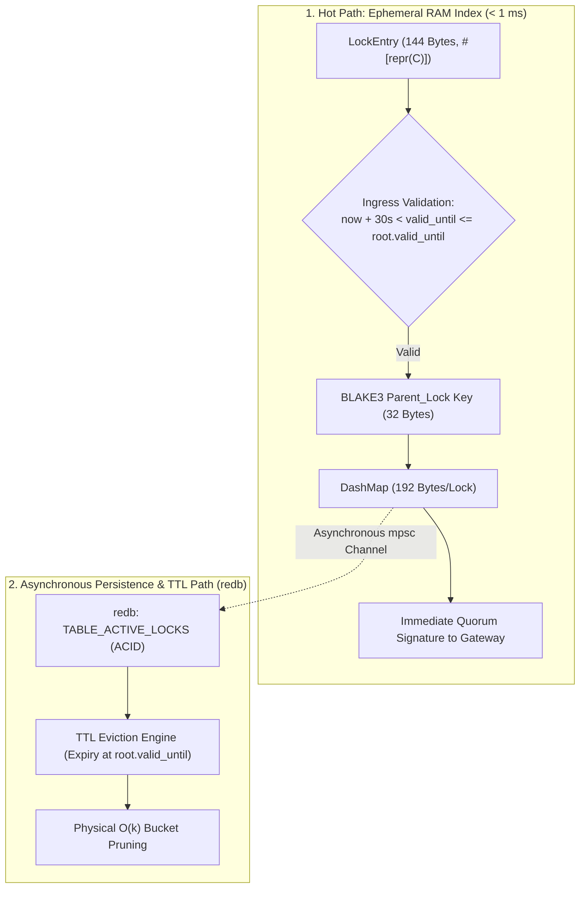
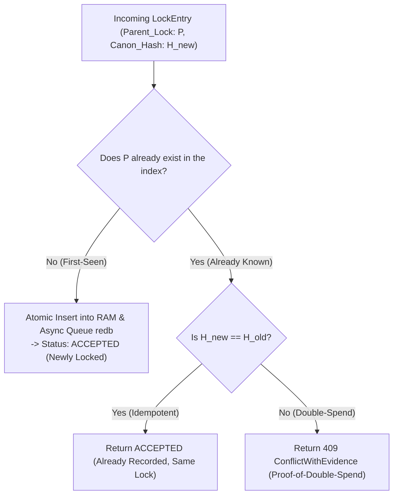

# 12. Lock Storage & RAM Index Architecture

> **Status:** Standard  
> **Model:** Logic & State Graph First  

This document specifies the **High-Performance Hybrid Storage Engine** of a Layer-2 shard node. It defines the **lockless concurrent RAM index as PoS Fast-Path ($< 1\,\mu\text{s}$)**, the **asynchronous persistence layer (redb)** for multi-year vouchers (1–10 years), and the **deterministic eviction after expiry of the Voucher Root (`root.valid_until`)** via time-based bucket indexes ($O(k)$ over expiring buckets).

---

## 1. The Hybrid Storage Paradigm (RAM Fast-Path + Disk Persistence)

Layer 2 is a blind Collision Lock Registry. To deterministically guarantee Point-of-Sale latency of $< 1000\,\text{ms}$ (typically $< 50\,\text{ms}$), there is **no blocking disk I/O on the hot path**.



* **Hot Path (< 1 ms):** Atomic check and insertion into the in-memory `DashMap`.
* **Cold Path (Background):** Asynchronous, non-blocking write to the local `redb` database for crash resilience and restart safety.
* **Zero Serialization Overhead:** Direct zero-copy in-place validation via `rkyv::archived_root::<LockEntry>()`.

---

## 2. The Atomic First-Seen Check ($< 1\,\mu\text{s}$) & Ingress Validation

### 2.1 Normative Ingress Validation
Before a lock enters the index, the shard node validates:
1. **Clock Skew & Minimum Validity:** $\text{now} + 30\,\text{s} < \text{valid\_until} \le \text{root.valid\_until}$ (Every new lock must lie at least $30\,\text{s}$ in the future).
2. **Causality Binding:** `parent_lock` corresponds to the consumed output of the preceding `ProofChain` (Causality ProofChain).

### 2.2 First-Seen Flow


---

## 3. The Lifecycle of Vouchers & TTL Bucket Eviction

Vouchers circulate over periods ranging from several months up to **10 years** (foundations, long-term balances).

1. **Root Lifetime (`root.valid_until`):** The expiry date defined in the voucher's genesis/root certificate defines the absolute upper bound of the entire voucher tree.
2. **Consistent Child Locks:** Each subsequent collision lock inherits the validity bound of the root.
3. **Physical Bucket Eviction with 30s Grace Period (Zero State Bloat & Anti-Resurrection):**
   - Once $\text{now} > \text{root.valid\_until} + 30\,\text{s}$ is exceeded (30-second safety grace period after official expiry), the corresponding buckets are physically purged from the RAM index and the `redb` table in an $O(k)$ interval.
   - The combination of the **30s ingress minimum lead time** ($\text{valid\_until} > \text{now} + 30\,\text{s}$) and the **30s eviction grace period** mathematically rules out any resurrection or inconsistency during network merges, even under slight server clock drift.

---

## 4. Rust Core Structures & RAM Footprint

```rust
use std::sync::atomic::{AtomicU64, Ordering};
use dashmap::DashMap;

/// 32-Byte Parent Lock Hash (Unique Identifier of the Predecessor Voucher)
pub type ParentLockKey = [u8; 32];

/// Main Storage Engine of a Shard Node
pub struct LockStorageEngine {
    /// Lockless Concurrent Index for O(1) Hot-Path Lookup
    index: DashMap<ParentLockKey, StoredLock>,
    /// Asynchronous Sender for the redb Persistence Pipeline
    persist_tx: tokio::sync::mpsc::Sender<StoredLock>,
    /// Total Consumed Footprint in Byte-Seconds
    total_byte_seconds: AtomicU64,
}

/// In-RAM Lock Entry (Exactly 192 Bytes)
#[repr(C, align(8))]
#[derive(Clone, Copy, Debug)]
pub struct StoredLock {
    /// Exact 144-Byte LockEntry
    pub entry: [u8; 144],
    /// Deterministic Canon Hash for Conflict Resolution min(H_canon)
    pub canon_hash: [u8; 32],
    /// Unix Timestamp in Seconds Until Which the Root Voucher Remains Valid
    pub valid_until: u64,
    /// Shard ID (0..65535)
    pub shard_id: u16,
    pub _padding: [u8; 6],
}

impl StoredLock {
    pub const RAM_FOOTPRINT_BYTES: usize = 192;
    pub const ESTIMATED_TOTAL_OVERHEAD_BYTES: usize = 224; // incl. DashMap Bucket
}
```

---

## 5. Storage Engine Invariants

1. **[INV-1201] Zero Disk I/O on the Hot Path:** First-seen check and lock attestation generation execute 100% in ephemeral RAM; disk writes run asynchronously and do not block PoS latency.
2. **[INV-1202] Atomic First-Seen on `parent_lock`:** Insertion of a new lock and collision detection on `parent_lock` is an indivisible, thread-safe atomic operation ($< 1\,\mu\text{s}$).
3. **[INV-1203] Deterministic Eviction via Root Expiry:** Expired locks are physically purged from RAM and disk after `root.valid_until` is exceeded.
4. **[INV-1204] Space-Time Accounting:** Each incoming lock is accounted against quotas with its actual storage-time footprint ($\approx 224\,\text{Bytes} \times \Delta t_{\text{sec}}$) for quotas.
5. **[INV-1205] Idempotency Guarantee:** Repeated submission of the same identical `LockEntry` immediately returns the confirming attestation without state change.
6. **[INV-1206] Ingress Time Window:** Locks with $\text{valid\_until} \le \text{now} + 30\,\text{s}$ (minimum lead time) or $\text{valid\_until} > \text{root.valid\_until}$ are unconditionally rejected.
