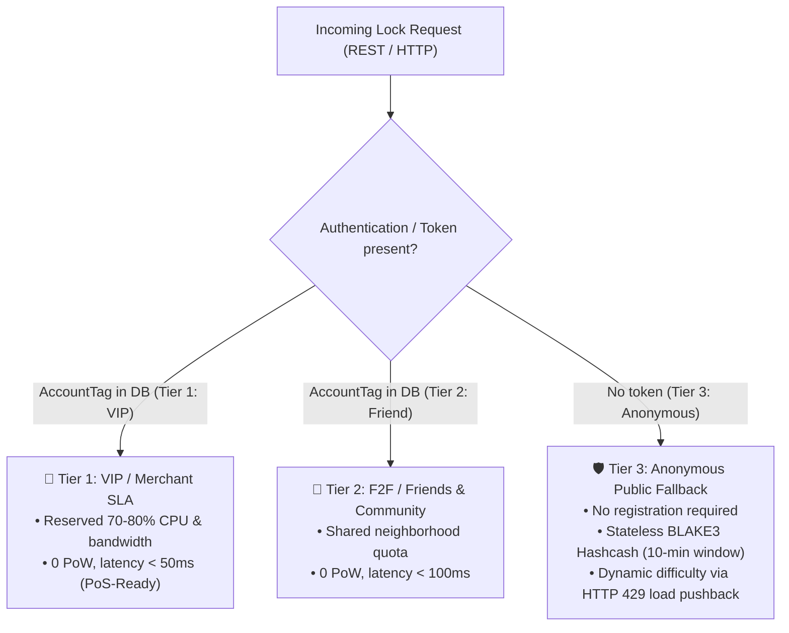
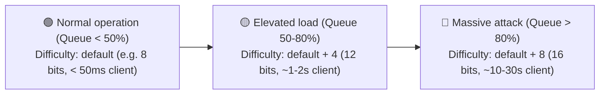
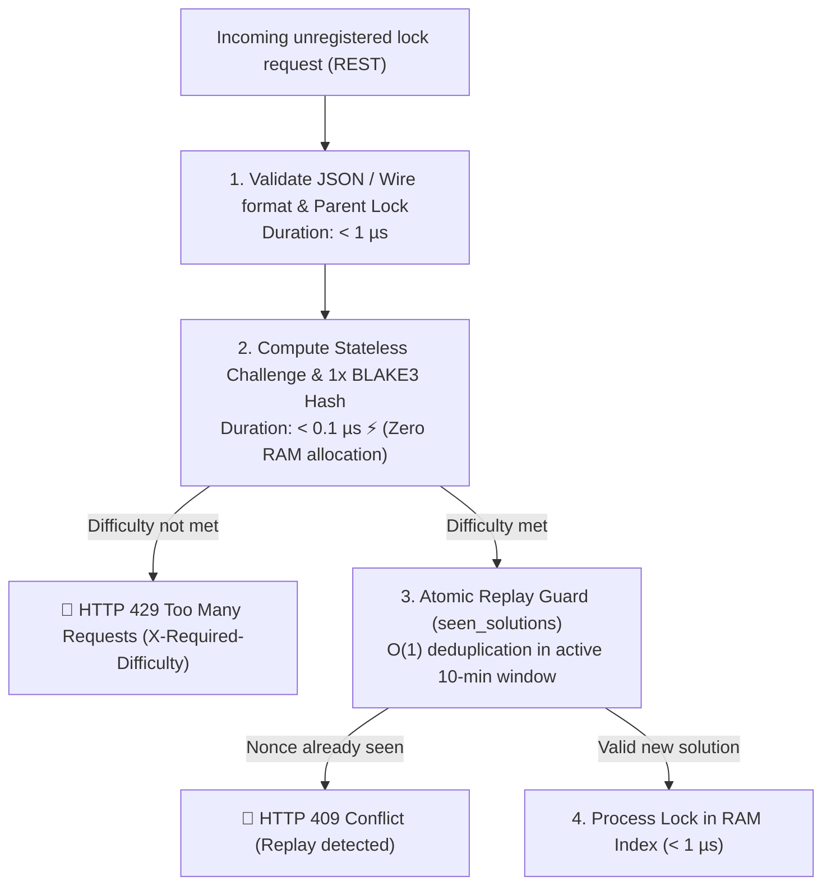

# 13. Client Ingress, 3-Tier Access Control & Dynamic Botnet Protection

> **Status:** Standard  
> **Model:** Logic & State Graph First  

This document specifies the **Client Ingress and Access Model** of a Layer-2 shard node. It defines the **3-tier access categorization** (VIP/Merchant, F2F/Friends, Anonymous Public Fallback), the **privacy-preserving local client registry**, and the **stateless, dynamically scaling BLAKE3 Hashcash brake (Cheap-Checks-First)** for complete neutralization of botnet and Sybil flooding without server-side memory exhaustion.

---

## 1. The Economic Reality at the Point-of-Sale (PoS)

In the practice of a value-transfer and checkout system, a fundamental asymmetry of economic incentives exists:

```mermaid
flowchart LR
    subgraph POS_Handshake["Point-of-Sale (Shop / Checkout)"]
        direction TB
        Customer["📱 Customer (Smartphone)<br>Signs transfer intent via NFC / BLE / QR<br>(Requires neither server nor internet!)"]
        -->|Local handover| Merchant["🏪 Merchant (PoS Terminal)<br>Bears the double-spend risk &<br>has professional Node SLA access"]
    end

    Merchant -->|Tier 1: VIP Data-Plane (< 50ms)| CollisionLockRegistry["⚡ HuMoCo Layer-2 Collision Lock Registry<br>(Delivers atomically binding lock certificate)"]
```

1. **The customer only hands over the intent:** The payer signs the transfer to the merchant's ephemeral key offline. At the PoS the payer requires no network access of their own.
2. **The merchant executes the lock:** The merchant releases goods or services only once the Collision Lock Registry confirms that the predecessor voucher was unlocked. The merchant therefore books a reliable Node provider or operates its own Node.
3. **The anonymous path is an emergency / citizen channel:** Fully unregistered accesses without acquaintance or contract serve private P2P transactions or as a barrier-free emergency access.

---

## 2. The 3-Tier Ingress Model

Each Layer-2 Node strictly partitions incoming client traffic into three classes:



### Overview of Ingress Tier Properties

| Tier | Target Group | Identification / Registration | PoW Requirement | Latency Target | Quota Accounting |
| :--- | :--- | :--- | :--- | :--- | :--- |
| **Tier 1: VIP / Merchant SLA** | Merchants, PoS terminals, commercial providers | `AccountTag` (Hashed Token in Node DB) | **0 PoW** | $< 50\,\text{ms}$ | Booked quota ($\mu\text{BJ}$) |
| **Tier 2: F2F / Friends** | Friends, family, neighborhood | `AccountTag` (Hashed Token in Node DB) | **0 PoW** | $< 100\,\text{ms}$ | F2F free quota ($M \le 1.0$) |
| **Tier 3: Anonymous Public** | Unknown clients, P2P emergency | **None** (Entirely stateless) | **BLAKE3 Hashcash** (`pow.rs`) | $< 0{,}1\,\mu\text{s}$ check | Dynamic daily base quota |

---

## 3. The Privacy-Preserving Local Client Registry

For Tier 1 and Tier 2, the Node maintains a local registry. To maximally protect user privacy, the server stores **neither plain names, IP addresses nor raw public keys**.

### 3.1 Blind Account Tagging
A client registers with the Node using a blind token:

$$\text{AccountTag} = \text{BLAKE3}(\text{"HUMOCO\_V1\_ACCOUNT\_TAG"} \parallel \text{Client\_PubKey} \parallel \text{Node\_Secret\_Salt})$$

* The Node only knows the 32-byte `AccountTag`.
* The client authenticates in the QUIC handshake by presenting a fast Ed25519 signature over a one-time session nonce.

### 3.2 Rust Data Structure for the Ingress Registry

```rust
use std::sync::atomic::{AtomicU64, AtomicU32};

/// 32-byte blind client identifier
pub type AccountTag = [u8; 32];

#[repr(u8)]
#[derive(Clone, Copy, Debug, PartialEq, Eq)]
pub enum AccessTier {
    VipMerchant = 1,
    FriendCommunity = 2,
}

/// Local client/friend entry in Node memory
#[repr(C, align(8))]
pub struct IngressAccount {
    /// 32-byte blind hash of the account
    pub tag: AccountTag,
    /// Access tier
    pub tier: AccessTier,
    pub _padding: [u8; 7],
    /// Valid until (Unix timestamp seconds)
    pub valid_until: u64,
    /// Remaining quota budget in micro Byte-Years (µBJ)
    pub remaining_micro_bj: AtomicU64,
    /// Maximum allowed locks per minute (rate limit)
    pub max_locks_per_min: AtomicU32,
    /// Locks consumed in current time window
    pub current_locks_window: AtomicU32,
}
```

---

## 4. Tier 3: Stateless BLAKE3 Hashcash (Cheap-Checks-First)

For fully unregistered requests, the Node uses a **stateless, time-windowed BLAKE3 client puzzle** ([`pow.rs`](crates/humoco-node/src/ingress/pow.rs)).

### 4.1 Why Stateless BLAKE3 Hashcash (Iron Rule 9)?
Memory-hard algorithms (Argon2) require allocating memory pools on the server during verification. Under extreme DoS attacks, thousands of forged nonces would force the server into expensive memory-verification bottlenecks.
* **Stateless BLAKE3 Hashcash** allows the server to verify any submitted solution in **$< 0{,}1\,\mu\text{s}$ with exactly 1 hash computation** and **$0\,\text{bytes}$ memory allocation**.
* The server stores no issued challenges in RAM (`issued_challenges` is forbidden).
* Challenges are deterministically bound to the 10-minute epoch window (`slot = now_sec / 600`) and the `parent_lock`:

$$\text{Challenge} = \text{BLAKE3}(\text{len} \parallel \text{"HUMOCO\_V1\_POW\_STATELESS"} \parallel \text{parent\_lock} \parallel \text{epoch\_slot})$$

The client finds a `nonce` such that:
$$\text{LeadingZeros}\left(\text{BLAKE3}(\text{len} \parallel \text{"HUMOCO\_POW\_SOLUTION"} \parallel \text{Challenge} \parallel \text{nonce})\right) \ge \text{Difficulty}$$

### 4.2 Dynamic Difficulty Scaling & HTTP 429 Pushback

The Node continuously measures its local ingress queue utilization and scales difficulty dynamically:



* **Adaptive Load Feedback (HTTP 429):** If difficulty is insufficient under load, the server responds with `HTTP 429 Too Many Requests` and header `X-Required-Difficulty: <N>`.
* **$\Delta\text{Load} \le 0$ Invariant:** Computational load is pushed entirely back to the client; the server remains in idle.

### 4.3 Server Protection Cascade & Atomic Replay Guard



1. **Stage 1: Stateless Validation ($< 1\,\mu\text{s}$):** Deterministic challenge regeneration without DB access.
2. **Stage 2: Cheap 1-Hash Verification ($< 0{,}1\,\mu\text{s}$):** Single BLAKE3 hash filters millions of illegitimate packets instantly.
3. **Stage 3: Atomic Replay Guard ($O(1)$):** Deduplicates used nonces within the active 10-minute epoch window.
4. **Complete Tier-1 Data-Plane Isolation ([INV-1301]):** Shard consensus and Tier-1 merchant ingress run on dedicated worker channels. Public spam cannot affect merchant checkouts.

---

### 4.4 Reciprocal Gateway Ingress Throttling upon Shard Inactivity

To prevent lazy gateway nodes from earning ingress fees from end clients without participating in shard quorums themselves:
* **Reciprocal Peer Reputation (Tit-for-Tat):** Shard nodes measure the collaboration of directly connected gateways on their shard responsibilities via the 4-byte bitmask feedback.
* **Automatic Exclusion of Free-Riders:** Gateways that refuse work in their own shard responsibilities (`missing_count >= 3`) suffer local suspension at the direct peering edges. Their ingress streams are throttled (`429 QuotaExhausted`).
* **Market Cleanup:** Clients of the throttled gateway experience timeouts and automatically migrate to fully cooperating gateways within $< 200\,\text{ms}$.

---

## 5. Invariants of the Ingress and Protection Model

1. **[INV-1301] VIP Data-Plane Isolation:** Overload or botnet attacks on Tier 3 (Anonymous) must never impair the latency and bandwidth of Tier 1 (VIP / Merchant).
2. **[INV-1302] Zero-Knowledge Account Tagging:** The local registry stores exclusively hashed account tags (`BLAKE3(PubKey || Salt)`), no plaintext identities or persistent IP addresses.
3. **[INV-1303] Stateless Tier-3 Challenges:** Generation and verification of Tier-3 PoW puzzles requires no persistent storage on the server ($O(1)$ memory overhead).
4. **[INV-1304] Asymmetric Cost Barrier:** The cost of verifying a BLAKE3 Hashcash solution on the server is exactly 1 hash ($< 0{,}1\,\mu\text{s}$); the cost for mass attacks scales exponentially with $2^{\text{Difficulty}}$ for the attacker.
5. **[INV-1305] Autonomous Emergency Brake:** Each Node operator can locally raise the PoW difficulty for Tier 3 without network consensus or temporarily throttle anonymous ingress under extreme flooding.
6. **[INV-1306] Reciprocal Ingress Prioritization:** Gateway ingress into foreign shards is tied to continuous reciprocity; inactive nodes are deprioritized at the peering edges via local suspension (`missing_count >= 3`).
