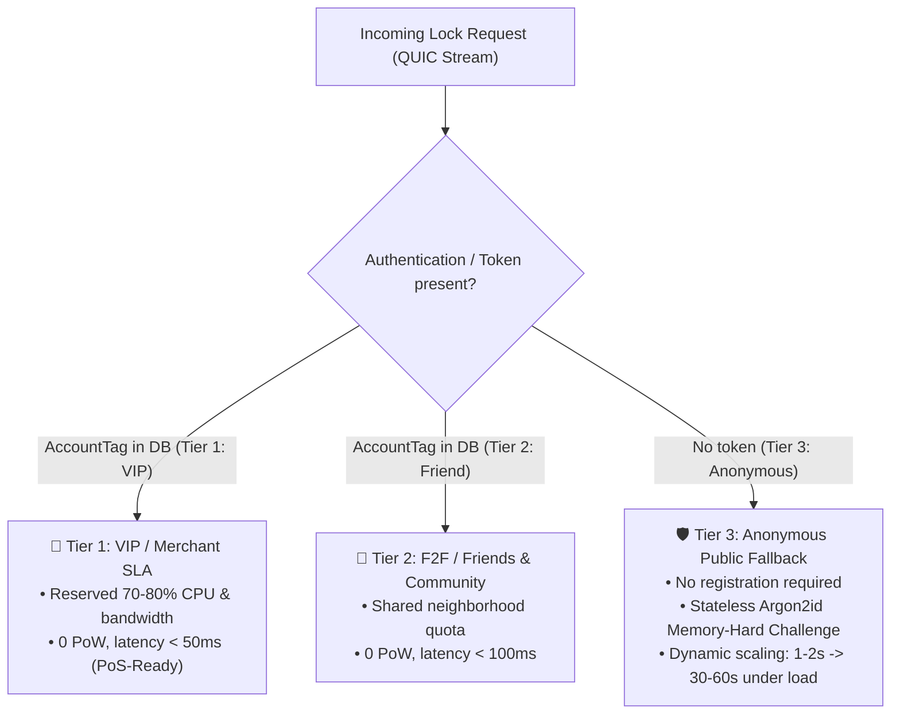
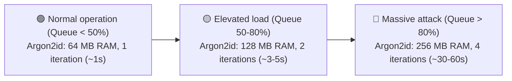
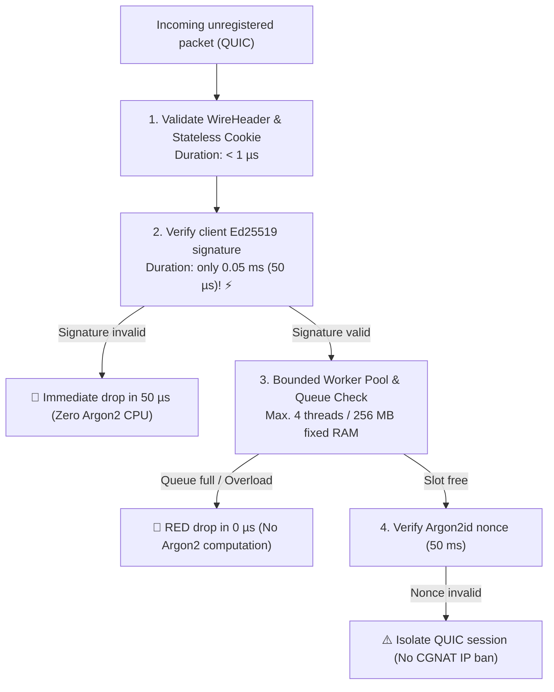

# 13. Client Ingress, 3-Tier Access Control & Dynamic Botnet Protection

> **Status:** Standard  
> **Model:** Logic & State Graph First  

This document specifies the **Client Ingress and Access Model** of a Layer-2 shard node. It defines the **3-tier access categorization** (VIP/Merchant, F2F/Friends, Anonymous Public Fallback), the **privacy-preserving local client registry**, and the **dynamically scaling, memory-hard Argon2id brake** for complete neutralization of botnet and Sybil flooding.

---

## 1. The Economic Reality at the Point-of-Sale (PoS)

In the practice of a value-transfer and checkout system, a fundamental asymmetry of economic incentives exists:

```mermaid
flowchart LR
    subgraph POS_Handshake["Point-of-Sale (Shop / Checkout)"]
        direction TB
        Customer["📱 Customer (Smartphone)<br>Signs transfer intent via NFC / BLE / QR<br>(Requires neither server nor internet!)"]
        -->|Local handover| Merchant["🏪 Merchant (PoS Terminal)<br>Bears the double-spend risk &<br>has professional Node SLA access"]
    end

    Merchant -->|Tier 1: VIP Data-Plane (< 50ms)| CollisionLockRegistry["⚡ HuMoCo Layer-2 Collision Lock Registry<br>(Delivers atomically binding lock certificate)"]
```

1. **The customer only hands over the intent:** The payer signs the transfer to the merchant's ephemeral key offline. At the PoS the payer requires no network access of their own.
2. **The merchant executes the lock:** The merchant releases goods or services only once the Collision Lock Registry confirms that the predecessor voucher was unlocked. The merchant therefore books a reliable Node provider or operates its own Node.
3. **The anonymous path is an emergency / citizen channel:** Fully unregistered accesses without acquaintance or contract serve private P2P transactions or as a barrier-free emergency access.

---

## 2. The 3-Tier Ingress Model

Each Layer-2 Node strictly partitions incoming client traffic into three classes:



### Overview of Ingress Tier Properties

| Tier | Target Group | Identification / Registration | PoW Requirement | Latency Target | Quota Accounting |
| :--- | :--- | :--- | :--- | :--- | :--- |
| **Tier 1: VIP / Merchant SLA** | Merchants, PoS terminals, commercial providers | `AccountTag` (Hashed Token in Node DB) | **0 PoW** | $< 50\,\text{ms}$ | Booked quota ($\mu\text{BJ}$) |
| **Tier 2: F2F / Friends** | Friends, family, neighborhood | `AccountTag` (Hashed Token in Node DB) | **0 PoW** | $< 100\,\text{ms}$ | F2F free quota ($M \le 1.0$) |
| **Tier 3: Anonymous Public** | Unknown clients, P2P emergency | **None** (Entirely stateless) | **Argon2id** ($64\text{--}128\,\text{MB}$) | $1\text{--}2\,\text{s}$ (Scales up to $60\,\text{s}$) | Dynamic daily base quota |

---

## 3. The Privacy-Preserving Local Client Registry

For Tier 1 and Tier 2, the Node maintains a local registry. To maximally protect user privacy, the server stores **neither plain names, IP addresses nor raw public keys**.

### 3.1 Blind Account Tagging
A client registers with the Node using a blind token:

$$\text{AccountTag} = \text{BLAKE3}(\text{"HUMOCO\_V1\_ACCOUNT\_TAG"} \parallel \text{Client\_PubKey} \parallel \text{Node\_Secret\_Salt})$$

* The Node only knows the 32-byte `AccountTag`.
* The client authenticates in the QUIC handshake by presenting a fast Ed25519 signature over a one-time session nonce.

### 3.2 Rust Data Structure for the Ingress Registry

```rust
use std::sync::atomic::{AtomicU64, AtomicU32};

/// 32-byte blind client identifier
pub type AccountTag = [u8; 32];

#[repr(u8)]
#[derive(Clone, Copy, Debug, PartialEq, Eq)]
pub enum AccessTier {
    VipMerchant = 1,
    FriendCommunity = 2,
}

/// Local client/friend entry in Node memory
#[repr(C, align(8))]
pub struct IngressAccount {
    /// 32-byte blind hash of the account
    pub tag: AccountTag,
    /// Access tier
    pub tier: AccessTier,
    pub _padding: [u8; 7],
    /// Valid until (Unix timestamp seconds)
    pub valid_until: u64,
    /// Remaining quota budget in micro Byte-Years (µBJ)
    pub remaining_micro_bj: AtomicU64,
    /// Maximum allowed locks per minute (rate limit)
    pub max_locks_per_min: AtomicU32,
    /// Locks consumed in current time window
    pub current_locks_window: AtomicU32,
}
```

---

## 4. Tier 3: Memory-Hard Botnet Protection (Argon2id Challenge)

For fully unregistered requests, the Node uses a **stateless, memory-hard client puzzle**.

### 4.1 Why Memory-Hardness (Argon2id)?
Pure compute hashes (SHA-256, BLAKE3) can be parallelized millions of times by attackers with GPU or ASIC clusters. 
* **Argon2id forces each thread to occupy 64 to 128 MB of RAM.**
* On a smartphone, occupying 64 MB RAM for **1 to 2 seconds** consumes negligible resources.
* A botnet attempting to send $100{,}000$ spam requests/second would need to provide $100{,}000 \times 64\,\text{MB} = \mathbf{6{,}4\,\text{Terabytes}}$ of ultra-fast memory bandwidth per second. The attack collapses physically and economically.

### 4.2 Dynamic Difficulty Scaling

The Node continuously measures its local utilization of the unregistered ingress queue and scales the challenge deterministically:



$$\text{Challenge} = \text{BLAKE3}(\text{"HUMOCO\_V1\_CHALLENGE"} \parallel \text{Client\_IP\_Prefix} \parallel \text{Epoch\_Minute} \parallel \text{Difficulty} \parallel \text{Node\_Secret})$$

The client must find a `nonce` such that:
$$\text{Argon2id}(\text{Challenge} \parallel \text{nonce}, \text{mem} = M, \text{time} = T) < \text{Target}(\text{Difficulty})$$

### 4.3 Server Protection against Memory Exhaustion & Pre-Filter Cascade (DoS Tradeoff)

Under a DoS attack there are two attack vectors:
1. **Mass invalid signatures:** Cheap for the attacker, but discardable via Ed25519 in $50\,\mu\text{s}$.
2. **Mass forged Argon2id nonces:** The attacker sends valid signatures but random nonces to force the 50 ms Argon2id verification on the server.

To fend off both attack vectors without CPU or RAM exhaustion of the overall system, a strict cascade with resource isolation applies:



1. **Stage 1: Stateless Cookie & WireHeader ($<1\,\mu\text{s}$):** Prevents IP spoofing and filters unstructured wire garbage immediately.
2. **Stage 2: Ed25519 Pre-Filter ($50\,\mu\text{s}$):** Prevents arbitrary random bits without cryptographic authorship from ever reaching the worker pool.
3. **Stage 3: Isolated Bounded Worker Pool with RED ($10\text{--}50\,\text{ms}$):**
   * The compute- and memory-intensive Argon2id verification is strictly confined to an **isolated worker pool** (e.g., 4 threads with fixed 256 MB RAM).
   * **Queue Limit & RED (Random Early Drop):** When the worker pool is saturated, excess alleged Tier-3 proofs are **immediately discarded in $0\,\mu\text{s}$** without executing the Argon2id check.
   * **Complete Tier-1/Data-Plane Isolation ([INV-1301]):** Shard consensus, quorum signatures and Tier-1 merchant ingress run on entirely separate threads and cores. A massive Tier-3 Argon2id spam can never bring the node down.
4. **Session Ban instead of IP Ban (Anti-CGNAT Collateral Protection):** 
   * Since in mobile networks thousands of smartphones share the same Carrier-Grade NAT (CGNAT) IPv4, the Node **never bans broad IP ranges** on invalid nonces.
   * Instead, the **specific QUIC Connection ID and the ephemeral key** are isolated in a targeted manner.

---

### 4.4 Reciprocal Gateway Ingress Throttling upon Shard Inactivity

To prevent lazy gateway nodes from earning ingress fees from end clients without participating in shard quorums themselves:
* **Reciprocal Peer Reputation (Tit-for-Tat):** Shard nodes measure the collaboration of directly connected gateways on their shard responsibilities via the 4-byte bitmask feedback.
* **Automatic Exclusion of Free-Riders:** Gateways that refuse work in their own shard responsibilities (`missing_count >= 3`) suffer an 8:1 ratio-credit backoff at the direct peering edges. Their ingress streams are throttled (`429 QuotaExhausted`).
* **Market Cleanup:** Clients of the throttled gateway experience timeouts and automatically migrate to fully cooperating gateways within $< 200\,\text{ms}$.

---

## 5. Invariants of the Ingress and Protection Model

1. **[INV-1301] VIP Data-Plane Isolation:** Overload or botnet attacks on Tier 3 (Anonymous) must never impair the latency and bandwidth of Tier 1 (VIP / Merchant).
2. **[INV-1302] Zero-Knowledge Account Tagging:** The local registry stores exclusively hashed account tags (`BLAKE3(PubKey || Salt)`), no plaintext identities or persistent IP addresses.
3. **[INV-1303] Stateless Tier-3 Challenges:** Generation and verification of Tier-3 PoW puzzles requires no persistent storage on the server ($O(1)$ memory overhead).
4. **[INV-1304] Asymmetric Cost Barrier:** The cost of verifying an Argon2id solution on the server is strictly capped by fixed worker slots; the cost for mass attacks scales linearly with $N \times 64\,\text{MB}$.
5. **[INV-1305] Autonomous Emergency Brake:** Each Node operator can locally raise the Argon2id difficulty for Tier 3 without network consensus up to 60 seconds or temporarily throttle the anonymous port under extreme flooding.
6. **[INV-1306] Reciprocal Ingress Prioritization:** Gateway ingress into foreign shards is tied to continuous reciprocity; inactive nodes are deprioritized at the peering edges via ratio-credit throttling (8:1 backoff).
