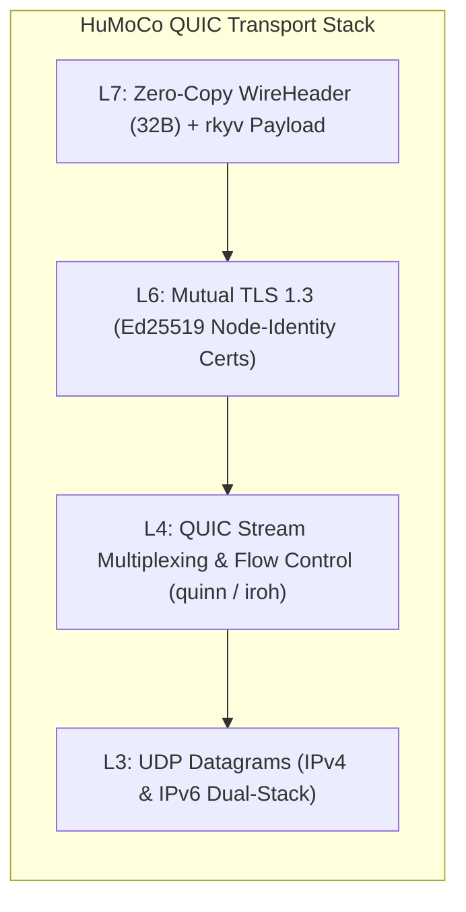
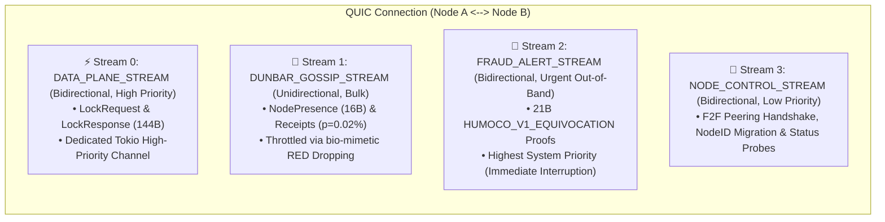
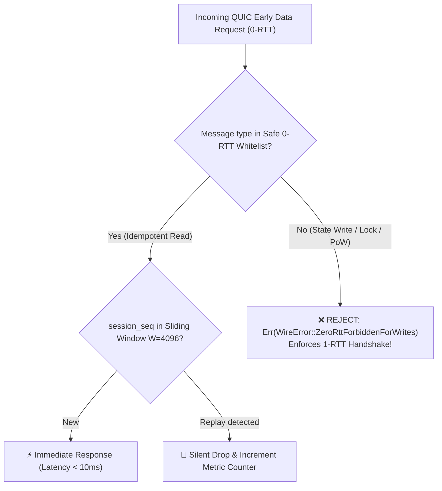
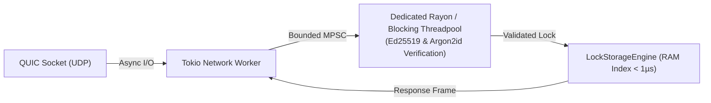

# 15. P2P Transport & Connection Management

> **Status:** Standard  
> **Model:** Logic & State Graph First  

> [!TIP]
> **💡 Idea List / Future Thought (SLA Evaluation: Active QUIC Teardown vs. Silent Work Refusal):**  
> A clean, explicit teardown of a QUIC connection with an active disconnect signal (`CONNECTION_CLOSE` / `DRAINING` e.g. due to maintenance, reboot or regular shutdown) must systemically be evaluated as **far more benign / non-critical** than a node that actively maintains a QUIC session (pings/keepalives are flowing) but silently ignores submitted shard read/write requests or quorum signatures.  
> * **Honest Failure (Clean Close):** "I am offline / under maintenance" $\to$ Immediate, clean failover of neighbors, 0% fraud suspicion.  
> * **Silent Refusal (Silent Zombie / Lazy Peer):** The connection is physically up, but the substantive work in the shard is refused $\to$ Suspicion of malicious free-riding, griefing or sabotage. This is an important building block for future SLA metrics and automatic social slashing / edge severance by direct F2F friends.

This document specifies the **P2P transport layer** and **connection management** for the HuMoCo Layer-2 Collision Lock Registry. It defines the native **QUIC connection architecture** (via `quinn` / `iroh-net`), **stream multiplexing to prevent control-plane starvation**, the **0-RTT whitelist security architecture**, and the **asynchronous Tokio actor pipeline**.

---

## 1. Transport Fundamentals: Native QUIC via UDP

To deterministically guarantee Point-of-Sale latency $< 1000\,\text{ms}$ (typically $< 50\,\text{ms}$), the HuMoCo Layer-2 exclusively uses **QUIC over UDP** (RFC 9000).

### Core Transport Properties:
1. **No Head-of-Line Blocking:** Packet loss on a gossip stream never blocks parallel transaction locks on the data-plane stream.
2. **Mutual TLS 1.3 & Argon2id Identity Verification:** Each node authenticates itself in the TLS 1.3 handshake via its Ed25519 key. Cryptographic peer admission in the network (`NodeID`) requires proof of valid PoW ($\text{NodeID} = \text{Argon2id}(\text{PubKey}_{\text{Ed25519}} \mathbin{\Vert} \text{Nonce} \mathbin{\Vert} T_0)$, see `docs/07`).
3. **Connection Migration:** Mobile wallets and PoS terminals can seamlessly switch between Wi-Fi, LTE and 5G without dropping the QUIC session.

---

## 2. QUIC Stream Multiplexing & Anti-Starvation

As identified in the threat analysis, byzantine-overloaded nodes tend to silently discard data-plane traffic during network floods. To physically prevent this, each peer connection is divided into **4 isolated stream classes**:

### Prioritization and Flow-Control Matrix

| Stream ID | Name | Direction | Priority | Tokio Buffer | Behavior on Overload |
| :--- | :--- | :--- | :--- | :--- | :--- |
| **Stream 0** | `DataPlane` | Bidirectional | **HIGH** | Bounded (10,000) | Backpressure to ingress |
| **Stream 1** | `DunbarGossip` | Unidirectional | **LOW** | Bounded (1,000) | Bio-mimetic RED drop |
| **Stream 2** | `FraudAlert` | Bidirectional | **URGENT** | Unbounded | Immediate processing |
| **Stream 3** | `NodeControl` | Bidirectional | **NORMAL** | Bounded (500) | Cooldown & Retry |

---

## 3. QUIC 0-RTT Whitelist & Replay Protection

QUIC 0-RTT (Early Data) saves a full network round-trip ($\approx 40\text{--}60\,\text{ms}$ on mobile), but harbors the risk of replay attacks.

### 3.1 The 0-RTT Whitelist Table (Single Source of Truth: docs/10)

| Message Type | 0-RTT Allowed? | Rationale |
| :--- | :---: | :--- |
| `StatusQuery` / Ping | ✅ **YES** | Idempotent, returns pure RAM status without side effects |
| `LatencyProbe` / `ShardMapPing` | ✅ **YES** | Pure latency and topology snapshots |
| `ActiveSyncRequest` | ✅ **YES** | **Idempotent PULL Sync:** Requests quorated active locks; 0 state mutation |
| `LockVerifyRequest` / Init | ❌ **NO** | **State change: 1-RTT TLS 1.3 strictly enforced** |
| `EquivocationProof` / `FraudAlert` | ❌ **NO** | **Slashing Trigger:** Requires 1-RTT Nonce binding for replay protection |
| `Argon2id PoW Submission` | ❌ **NO** | One-shot protection against PoW replays |

### 3.2 Anti-Replay & QUIC Delegation
Since QUIC (RFC 9000) and TLS 1.3 natively provide packet ordering, stream multiplexing and replay protection at the transport layer, the application-level `session_seq` in the `WireHeader` (docs/10) serves for intra-stream causality checking. For 0-RTT Early Data, a volatile sliding window ($W = 4096$) protects against interceptable replay floods before the handshake.

---

## 4. Asynchronous Tokio Actor Pipeline

To protect Tokio worker threads from blocking due to computationally intensive cryptography (Argon2id, Ed25519 batch verification), I/O is strictly separated from CPU work:

* **Network I/O:** Runs on non-blocking Tokio event loops.
* **CPU Pool:** Verification runs in a fixed Rayon/blocking pool with a fixed core count.
* **Bounded Channels:** Prevent uncontrolled growth of RAM under DDoS attacks.

---

## 5. Keep-Alive, Ping Intervals & Connection Lifecycle

1. **P2P Inter-Node Keep-Alive (Shard Peers):**
   * Shard partners and direct gossip neighbors send a native QUIC `PING` frame (or `ShardMapPing 0x0005`) every **10 seconds**.
   * The QUIC `max_idle_timeout` is configured to **30 seconds**. If a peer does not respond within 30 seconds, the connection is considered terminated.
2. **Hot-Path Shard Failure Detection ($50\,\text{ms}$):**
   * In the transaction path (PoS/Gateway $\rightarrow$ Top-20 Shard Nodes) an aggressive shard request timeout of **$50\,\text{ms}$** applies (with redundant hedged requests after $25\,\text{ms}$).
   * If a shard node does not respond within this window, it is skipped for the current transaction and HRW rank 21 steps in in $0\,\text{ms}$.
3. **Client / PoS NAT Keep-Alive:**
   * Mobile wallets and PoS terminals send a tiny `Ping` frame every **20 to 25 seconds** to keep stateful NAT routers and mobile firewalls open (`max_idle_timeout = 60s`).
4. **Ordered Node Exit (Graceful Leave via `CONNECTION_CLOSE`):**
   * On node termination (`SIGTERM`/`SIGINT`) `quinn` immediately sends a QUIC `CONNECTION_CLOSE (ErrorCode::NoError = 0x00)` frame to all active 1-hop peers.
   * The receiver closes the session within $< 5\,\text{ms}$ without waiting; shard partners immediately remove the node and bind rank 21.
5. **Session Resumption:** After connection drops, clients use TLS 1.3 session tickets to reconnect in a single round-trip (1-RTT or 0-RTT for read operations).

---

## 6. Transport Invariants

1. **[INV-1501] Zero 0-RTT Writes:** No shard node may accept a state-changing `LockRequest` via QUIC 0-RTT; write operations require 1-RTT without exception.
2. **[INV-1502] Data-Plane Priority:** The `DATA_PLANE_STREAM` is strictly processed before gossip and control streams in the local task queue.
3. **[INV-1503] Non-Blocking Network Threads:** Computationally intensive crypto operations (Argon2id, bulk signatures) must never be executed directly on Tokio I/O threads.
4. **[INV-1504] Replay Immunity:** Incoming 0-RTT messages are deduplicated in $O(1)$ via the 4096-bit sliding-window bitmap.
5. **[INV-1505] Transport-Native Connection Teardown:** Node exits and timeout detections are handled purely at the transport layer (QUIC frames & $50\,\text{ms}$ request timeouts); no application gossip overhead.
