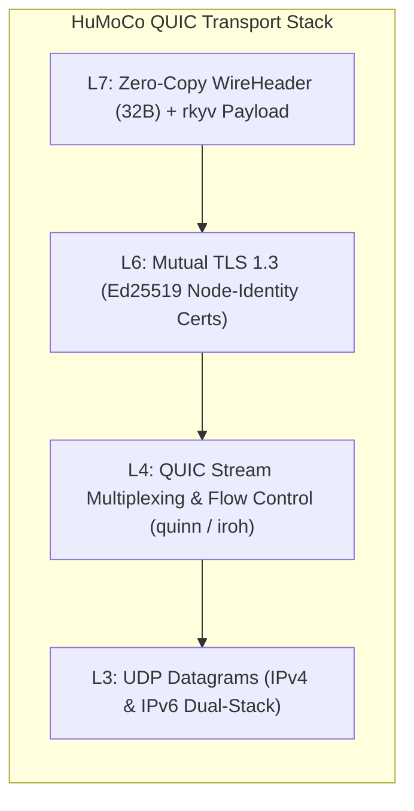
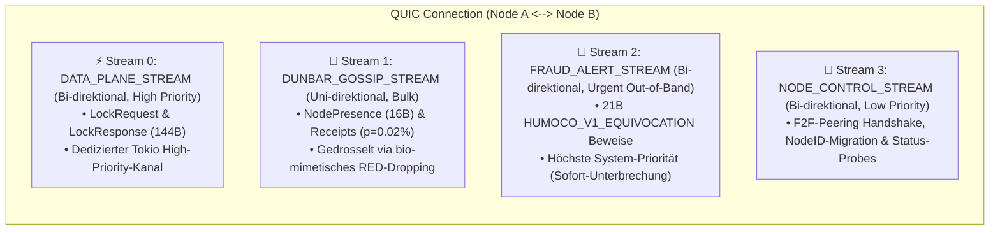
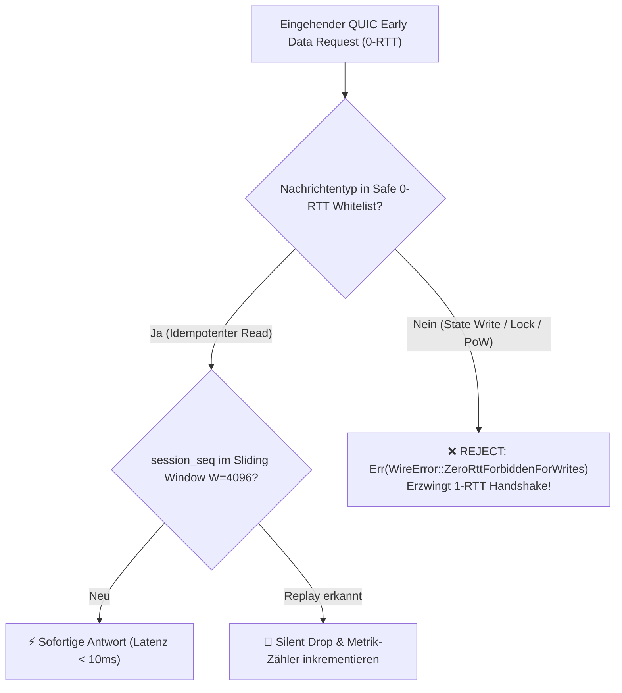
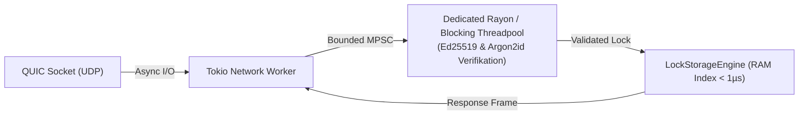

# 15. P2P-Transport & Verbindungsmanagement

> **Status:** Standard  
> **Modell:** Logic & State Graph First  

> [!TIP]
> **💡 Ideenliste / Zukunfts-Gedanke (SLA-Bewertung: Aktiver QUIC-Teardown vs. Stumme Arbeitsverweigerung):**  
> Eine saubere, explizite Trennung einer QUIC-Verbindung mit aktivem Trennsignal (`CONNECTION_CLOSE` / `DRAINING` z. B. wegen Wartung, Reboot oder regulärem Shutdown) muss systemisch **weitaus wohlwollender / unkritischer bewertet werden** als ein Knoten, der eine QUIC-Session aktiv aufrechterhält (Pings/Keepalives fließen), aber übergebene Shard-Lese-/Schreibanfragen oder Quorum-Signaturen stumm ignoriert.  
> * **Ehrlicher Ausfall (Clean Close):** „Ich bin offline / mache Wartung“ $\to$ Sofortiges, sauberes Failover der Nachbarn, 0 % Betrugsverdacht.  
> * **Stumme Verweigerung (Silent Zombie / Lazy Peer):** Die Verbindung steht physisch, aber die fachliche Arbeit im Shard wird verweigert $\to$ Verdacht auf böswilliges Freeriding, Griefing oder Sabotage. Dies ist ein wichtiger Baustein für zukünftige SLA-Metriken und automatisches Social Slashing / Kanten-Kappen durch direkte F2F-Freunde.

Dieses Dokument spezifiziert die **P2P-Transportschicht** und das **Verbindungsmanagement** für das HuMoCo Layer-2 Sperrregister. Es definiert die native **QUIC-Verbindungsarchitektur** (via `quinn` / `iroh-net`), das **Stream-Multiplexing zur Verhinderung von Control-Plane-Starvation**, die **0-RTT-Whitelist-Sicherheitsarchitektur** sowie die **asynchrone Tokio-Actor-Pipeline**.

---

## 1. Transport-Grundlagen: Native QUIC via UDP

Um die Point-of-Sale-Latenz $< 1000\,\text{ms}$ (typisch $< 50\,\text{ms}$) deterministisch zu garantieren, nutzt das HuMoCo Layer-2 ausschließlich **QUIC über UDP** (RFC 9000).

### Kern-Eigenschaften des Transports:
1. **Kein Head-of-Line Blocking:** Paketverluste auf einem Gossip-Stream blockieren niemals parallele Transaktions-Locks auf dem Data-Plane-Stream.
2. **Mutual TLS 1.3 & Argon2id-Identitätsverifikation:** Jeder Knoten authentifiziert sich im TLS 1.3 Handshake über seinen Ed25519-Schlüssel. Die kryptografische Peer-Zulassung im Netzwerk (`NodeID`) erfordert den Nachweis des gültigen PoW ($\text{NodeID} = \text{Argon2id}(\text{PubKey}_{\text{Ed25519}} \mathbin{\Vert} \text{Nonce} \mathbin{\Vert} T_0)$, siehe `docs/07`).
3. **Verbindungs-Migration:** Mobile Wallets und Kassen können nahtlos zwischen WLAN, LTE und 5G wechseln, ohne dass die QUIC-Session abbricht.

---

## 2. QUIC-Stream-Multiplexing & Anti-Starvation

Wie in der Bedrohungsanalyse festgestellt, neigen byzantinisch-überlastete Knoten dazu, bei Netzflutungen unbemerkt Data-Plane-Traffic zu verwerfen. Um dies physikalisch zu verhindern, wird jede Peer-Verbindung in **4 isolierte Stream-Klassen** unterteilt:

### Priorisierungs- und Flusskontroll-Matrix

| Stream-ID | Name | Richtung | Priorität | Tokio-Puffer | Verhalten bei Überlastung |
| :--- | :--- | :--- | :--- | :--- | :--- |
| **Stream 0** | `DataPlane` | Bi-direktional | **HOCH** | Bounded (10.000) | Backpressure an Ingress |
| **Stream 1** | `DunbarGossip` | Uni-direktional | **NIEDRIG** | Bounded (1.000) | Bio-mimetisches RED-Drop |
| **Stream 2** | `FraudAlert` | Bi-direktional | **DRINGEND** | Unbounded | Sofortige Abarbeitung |
| **Stream 3** | `NodeControl` | Bi-direktional | **NORMAL** | Bounded (500) | Cooldown & Retry |

---

## 3. QUIC 0-RTT Whitelist & Replay-Schutz

QUIC 0-RTT (Early Data) spart eine vollständige Netzwerk-Roundtrip-Zeit ($\approx 40\text{--}60\,\text{ms}$ auf Mobilfunk), birgt jedoch das Risiko von Replay-Angriffen.

### 3.1 Die 0-RTT Whitelist-Tabelle (Single Source of Truth: docs/10)

| Nachrichtentyp | 0-RTT zugelassen? | Begründung |
| :--- | :---: | :--- |
| `StatusQuery` / Ping | ✅ **JA** | Idempotent, liefert reinen RAM-Status ohne Seiteneffekte |
| `LatencyProbe` / `ShardMapPing` | ✅ **JA** | Reine Latenz- und Topologie-Snapshots |
| `ActiveSyncRequest` | ✅ **JA** | **Idempotenter PULL-Sync:** Fordert quorierte aktive Locks an; 0 Zustandsmutation |
| `LockVerifyRequest` / Init | ❌ **NEIN** | **Zustandsänderung: 1-RTT TLS 1.3 zwingend erzwungen** |
| `TombstoneBroadcast` | ❌ **NEIN** | Zustandsmutation; erfordert 1-RTT Nonce-Binding |
| `EquivocationProof` / `FraudAlert` | ❌ **NEIN** | **Slashing-Trigger:** Erfordert 1-RTT Nonce-Binding zur Replay-Abwehr |
| `Argon2id PoW Submission` | ❌ **NEIN** | One-Shot-Schutz vor PoW-Replays |

### 3.2 Anti-Replay & QUIC-Delegation
Da QUIC (RFC 9000) und TLS 1.3 Paketreihenfolge, Stream-Multiplexing und Replay-Schutz auf Transportebene nativ bereitstellen, dient die applikatorische `session_seq` im `WireHeader` (docs/10) der stream-internen Kausalitätsprüfung. Für 0-RTT Early Data schützt ein flüchtiges Sliding-Window ($W = 4096$) vor abfangbaren Replay-Fluten vor dem Handshake.

---

## 4. Asynchrone Tokio Actor-Pipeline

Um Tokio-Worker-Threads vor Blockaden durch rechenintensive Kryptografie (Argon2id, Ed25519 Batch-Verifikation) zu schützen, ist I/O strikt von CPU-Arbeit getrennt:

* **Network I/O:** Läuft auf nicht-blockierenden Tokio-Event-Loops.
* **CPU Pool:** Verifikation läuft in einem festen Rayon/Blocking-Pool mit fixierter Kernanzahl.
* **Bounded Channels:** Verhindern unkontrolliertes Anwachsen des RAMs bei DDoS-Angriffen.

---

## 5. Keep-Alive, Ping-Intervalle & Verbindungs-Lebenszyklus

1. **P2P Inter-Node Keep-Alive (Shard-Peers):**
   * Shard-Partner und direkte Gossip-Nachbarn senden alle **10 Sekunden** einen nativen QUIC `PING`-Frame (bzw. `ShardMapPing 0x0005`).
   * Der QUIC `max_idle_timeout` ist auf **30 Sekunden** konfiguriert. Antwortet ein Peer binnen 30 Sekunden nicht, gilt die Verbindung als getrennt.
2. **Hot-Path Shard-Ausfallerkennung ($50\,\text{ms}$):**
   * Im Transaktionspfad (Kasse/Gateway $\rightarrow$ Top-20 Shard-Nodes) gilt ein aggressiver Shard-Request-Timeout von **$50\,\text{ms}$** (mit redundanten Hedged Requests nach $25\,\text{ms}$).
   * Antwortet ein Shard-Node innerhalb dieses Fensters nicht, wird er für die aktuelle Transaktion übersprungen und HRW-Rang 21 rückt in $0\,\text{ms}$ nach.
3. **Client / PoS NAT-Keep-Alive:**
   * Mobile Wallets und Kassen-Terminals senden alle **20 bis 25 Sekunden** einen winzigen `Ping`-Frame, um zustandsbehaftete NAT-Router und Mobilfunk-Firewalls offen zu halten (`max_idle_timeout = 60s`).
4. **Geordneter Knotenaustritt (Graceful Leave via `CONNECTION_CLOSE`):**
   * Beim Beenden eines Knotens (`SIGTERM`/`SIGINT`) sendet `quinn` unmittelbar einen QUIC `CONNECTION_CLOSE (ErrorCode::NoError = 0x00)` Frame an alle aktiven 1-Hop-Peers.
   * Der Empfänger schließt die Session binnen $< 5\,\text{ms}$ ohne Wartezeit; Shard-Partner streichen den Knoten sofort und binden Rang 21 ein.
5. **Session Resumption:** Nach Verbindungsabbrüchen nutzen Clients TLS 1.3 Session Tickets zur Wiederverbindung in einem einzigen Roundtrip (1-RTT bzw. 0-RTT für Leseoperationen).

---

## 6. Invarianten des Transports

1. **[INV-1501] Zero 0-RTT Writes:** Kein Shard-Knoten darf einen zustandsverändernden `LockRequest` über QUIC 0-RTT annehmen; Schreiboperationen erfordern ausnahmslos 1-RTT.
2. **[INV-1502] Data-Plane Priorität:** Der `DATA_PLANE_STREAM` wird in der lokalen Task-Queue strikt vor Gossip- und Control-Streams abgearbeitet.
3. **[INV-1503] Non-Blocking Network Threads:** Rechenintensive Krypto-Operationen (Argon2id, Massen-Signaturen) dürfen niemals direkt auf Tokio-I/O-Threads ausgeführt werden.
4. **[INV-1504] Replay-Immunität:** Eingehende 0-RTT-Nachrichten werden durch die 4096-Bit Sliding-Window-Bitmap in $O(1)$ entprellt.
5. **[INV-1505] Transport-Natives Connection Teardown:** Knotenaustritte und Timeout-Erkennungen werden rein auf Transportebene (QUIC Frames & $50\,\text{ms}$ Request-Timeouts) abgewickelt; kein Applikations-Gossip-Overhead.
