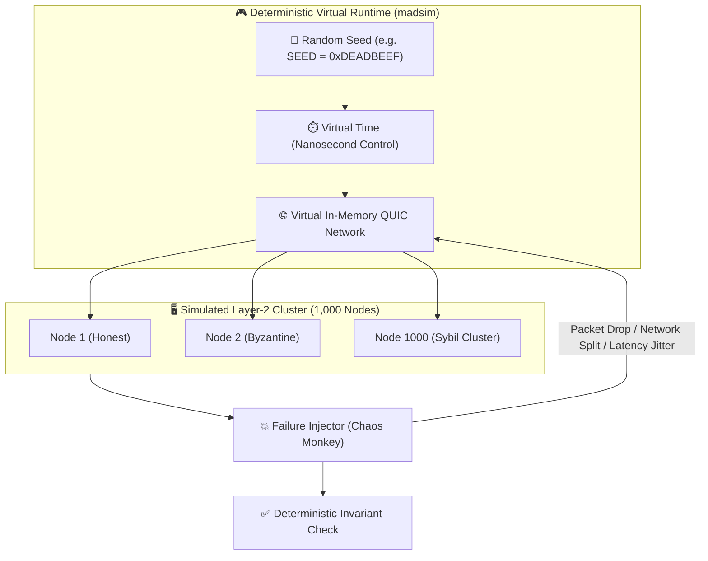

# 16. Chaos Testing & Deterministic BFT Simulation

> **Status:** Informative (Testing & Validation)  
> **Model:** Logic & State Graph First  

This document specifies the **deterministic simulation and chaos testing framework** for the HuMoCo Layer-2 Collision Lock Registry. According to Guiding Filter 3 (*Fractal Invariance*) and Guiding Filter 5 (*Physics Beats Protocol*) all consensus, routing and equivocation logic must be verified without real hardware clusters in 100% deterministic in-memory simulations under extreme network disruptions.

---

## 1. Philosophy & Test Design: No Flaky Tests

Traditional integration tests with real socket connections and real time (`tokio::time::sleep`) are unreliable, slow and not reproducible.

HuMoCo uses **deterministic simulation** (e.g. via `madsim`) for all P2P and BFT tests:



* **Bit-Identical Reproducibility:** If a race condition occurs at seed `0x42` after 10,000 virtual seconds, exactly this fault can be debugged bit-exactly on any developer machine by entering the same seed.
* **Time-Lapse Execution:** 24 hours of network operation with 100,000 transactions are computed in the simulator in a few seconds of CPU time.

---

## 2. The 4 Core Test Matrices

### Matrix 1: Partition Healing & Deterministic Merge ($\min(H_{\text{canon}})$)

* **Scenario:** A shard of 100 nodes is split by a submarine cable cut into two halves ($A$ with 60 nodes, $B$ with 40 nodes). Both halves process local locks independently for 12 hours.
* **Test Procedure:**
  1. Partitioning of the virtual network at time $t = 100\,\text{s}$.
  2. Generation of 5,000 disjoint locks in half $A$ and 3,000 locks in half $B$.
  3. Restoration of the network connection at time $t = 43,300\,\text{s}$.
* **Expected Invariant (`INV-1601`):**  
  Without manual intervention or master key, all 100 nodes converge deterministically on the canonical state via $\min(H_{\text{canon}})$ within an $O(1)$ time window. No data is lost, except in the case of double spends (equivocation).

---

### Matrix 2: Equivocation Slashing & Double-Spend Detection

* **Scenario:** A malicious client or a colluding gateway attempts to issue the same `parent_lock` simultaneously to two different shard nodes (*double spend*).
* **Test Procedure:**
  1. Client $C$ signs `LockEntry_1` (predecessor $P$) to node $N_1$ in shard $S_1$.
  2. Client $C$ signs `LockEntry_2` (predecessor $P$, recipient ephemeral key differing) to node $N_2$ in shard $S_2$.
  3. Stochastic receipt gossip ($p = 0{,}02\,\%$) disseminates the receipts through the P2P swarm.
* **Expected Invariant (`INV-1602`):**  
  Within statistical bounds ($< 3\,\text{minutes}$) the two proofs collide in at least one peer cache. An irrefutable `SignedEquivocationProof` is automatically generated, which leads to immediate permanent P2P ban, shard-ticket loss and WoT exclusion of the offender (Zero Financial Deposits / No Staking, but Identity Revocation & WoT Severance).

```mermaid
flowchart LR
    MaliciousClient["🦹 Malicious Client C"] -->|Lock 1 (Parent P)| Node1["Shard Node N1"]
    MaliciousClient -->|Lock 2 (Parent P)| Node2["Shard Node N2"]

    Node1 -->|Gossip Receipt p=0.02%| PeerCache["🔍 Random Peer Cache"]
    Node2 -->|Gossip Receipt p=0.02%| PeerCache

    PeerCache -->|Collision!| SlashingProof["🔴 SignedEquivocationProof<br>(Permanent Ban & WoT Exclusion)"]
```

---

### Matrix 3: Sybil & Sycophant Circle Isolation

* **Scenario:** An attacker computes 500 Argon2id identities on a server farm and has them mutually vouch for each other in a circular graph (*botnet island* / Broom Topology), attached via a single bridge node.
* **Test Procedure:**
  1. The simulator injects 500 synthetic nodes into the gossip network via 1 bridge edge.
  2. The botnet sends heartbeats and attempts to claim ingress priority.
* **Expected Invariant (`INV-1603`):**  
  Stochastic edge throttling ($R_{\text{soft}}$) discards $> 99{,}9\%$ of bot heartbeats at the bridge edge. No bot reaches $\ge 8/24$ heartbeats over 24 hours. All 500 bots remain at `IMMATURE` and never contribute to $N_{\text{active}}$.

---

### Matrix 4: Ingress Flooding & Rate Limiting (Tier 1 vs. Tier 3)

* **Scenario:** A botnet sends 100,000 unvouchered requests/second to a shard node (Tier 3), while simultaneously a merchant at the checkout (Tier 1) requests a lock.
* **Test Procedure:**
  1. Flooding of node $N$'s socket with anonymous Tier-3 traffic.
  2. Activation of continuous slew-rate limiters & Argon2id memory-hard challenges for Tier 3.
  3. Injection of a genuine merchant request with valid `AccountTag` (Tier 1).
* **Expected Invariant (`INV-1604`):**  
  The Tier-1 merchant request is processed through the isolated VIP/priority quota pipeline in $< 50\,\text{ms}$. The Tier-3 traffic backs up at the attacker's memory-hard Argon2id hurdles without exceeding the server node's RAM or CPU limits.

---

### Matrix 5: Digest-First PULL-Sync & Anti-Entropy Convergence

* **Scenario:** 100 shard nodes process 5,000 locks under stochastic packet loss ($15\%$) and temporary jitter. A new shard node $N_{\text{new}}$ joins the shard (cold start) and performs a Digest-First PULL-Sync.
* **Test Procedure:**
  1. Cluster generates 5,000 valid locks under chaos jitter. Individual replicas miss up to $5\%$ of locks (in-flight difference).
  2. $N_{\text{new}}$ sends parallel `GetShardDigest` to all 20 incumbent shard peers.
  3. $N_{\text{new}}$ forms a cluster and determines the quorum digest $D^*$ ($\ge 14$ votes).
  4. Injection of 500 forged lock entries by a Byzantine peer during the stream request.
* **Expected Invariant (`INV-1605`):**  
  The stream delivered by the malicious peer fails to match the confirmed $D^*$ hash and is immediately rejected in $< 1\,\mu\text{s}$ (zero-garbage integrity). $N_{\text{new}}$ pulls the stream from the next honest quorum peer, validates $D^*$ and converges bit-identically to the correct shard state.


---

## 3. Rust Test Skeleton (`tests/simulation/`)

An exemplary test in the Rust test suite repository looks as follows:

```rust
#[cfg(test)]
mod chaos_tests {
    use crate::core::FixedQ64_64;
    use crate::network::SimulatedNetwork;

    #[madsim::test]
    async fn test_sybil_sycophant_isolation() {
        let handle = madsim::runtime::Handle::current();
        let sim_net = SimulatedNetwork::new(0xDEADBEEF_u64);

        // 1. Create 10 honest nodes
        let honest_nodes = sim_net.spawn_honest_cluster(10).await;
        
        // 2. Create 500 sycophant bot nodes with circular vouching
        let bot_nodes = sim_net.spawn_sycophant_cluster(500).await;

        // 3. Simulate 1 hour of P2P gossip
        sim_net.advance_time_secs(3600).await;

        // 4. Check invariant: All bots MUST have M_eff == 0.0
        for bot_id in bot_nodes {
            let m_eff = sim_net.get_effective_trust_mass(&bot_id).await;
            assert_eq!(
                m_eff,
                FixedQ64_64::ZERO,
                "Sycophant bot {:?} broke WoT isolation!",
                bot_id
            );
        }
    }
}
```

---

## 4. Summary of Test Invariants

| Invariant | Name | Goal | Success Criterion |
| :--- | :--- | :--- | :--- |
| **`INV-1601`** | Partition Healing | Deterministic Merge | Identical root hash $\min(H_{\text{canon}})$ after reconnect |
| **`INV-1602`** | Double-Spend Detection | Equivocation Slashing | Proof generation & L1 penalty $< 3\,\text{minutes}$ |
| **`INV-1603`** | Sycophant Isolation | Botnet Protection | Effective Trust Mass $M_{\text{eff}} == 0.0$ for unvouchered circles |
| **`INV-1604`** | Ingress Tiering | Point-of-Sale Latency Guarantee | Tier-1 latency $< 50\,\text{ms}$ even under $100\times$ Tier-3 flooding |
| **`INV-1605`** | Multi-Replica PULL-Sync | Zero-Garbage & Completeness | $100\%$ convergence of 14/20 locks, 0 unconfirmed entries in RAM |
