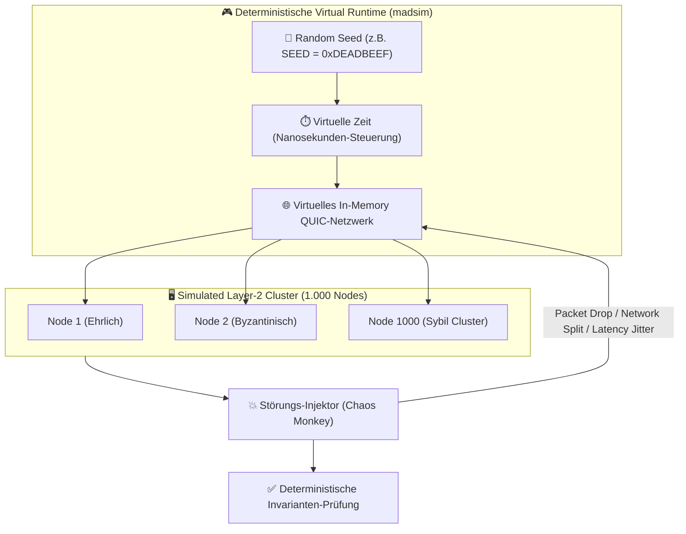

# 16. Chaos-Testing & Deterministische BFT-Simulation

> **Status:** Informativ (Testing & Validierung)  
> **Modell:** Logic & State Graph First  

Dieses Dokument spezifiziert das **deterministische Simulations- und Chaos-Testing-Framework** für das HuMoCo Layer-2 Sperrregister. Gemäß Leitfilter 3 (*Fraktale Invarianz*) und Leitfilter 5 (*Physik schlägt Protokoll*) müssen alle Konsens-, Routing- und Equivocation-Logiken ohne echte Hardware-Cluster in 100% deterministischen in-memory Simulationen unter extremen Netzwerk-Störungen verifiziert werden.

---

## 1. Philosophie & Test-Design: Keine Flaky Tests

Traditionelle Integrationstests mit realen Socket-Verbindungen und realer Zeit (`tokio::time::sleep`) sind unzuverlässig, langsam und nicht reproduzierbar. 

HuMoCo nutzt für alle P2P- und BFT-Tests **deterministische Simulation** (z. B. via `madsim`):



* **Bit-Identische Reproduzierbarkeit:** Tritt bei Seed `0x42` nach 10.000 virtuellen Sekunden eine Race Condition auf, lässt sich genau dieser Fehler durch Eingabe desselben Seeds auf jedem Entwickler-Rechner bit-exakt debuggen.
* **Zeitraffer-Ausführung:** 24 Stunden Netzwerk-Betrieb mit 100.000 Transaktionen werden im Simulator in wenigen Sekunden CPU-Zeit durchgerechnet.

---

## 2. Die 4 Kern-Testmatrizen

### Matrix 1: Partition Healing & Deterministischer Merge ($\min(H_{\text{canon}})$)

* **Szenario:** Ein Shard aus 100 Knoten wird durch eine Seekabel-Trennung in zwei Hälften ($A$ mit 60 Nodes, $B$ mit 40 Nodes) gespalten. Beide Hälften verarbeiten unabhängig voneinander lokale Locks für 12 Stunden.
* **Test-Ablauf:**
  1. Spaltung des virtuellen Netzwerks zur Zeit $t = 100\,\text{s}$.
  2. Generierung von 5.000 unzusammenhängenden Locks in Hälfte $A$ und 3.000 Locks in Hälfte $B$.
  3. Wiederherstellung der Netzwerkverbindung zur Zeit $t = 43.300\,\text{s}$.
* **Erwartete Invariante (`INV-1601`):**  
  Ohne manuellen Eingriff oder Master-Key einigen sich alle 100 Knoten binnen $O(1)$ Zeitfenster deterministisch auf den kanonischen Zustand via $\min(H_{\text{canon}})$. Keine Daten gehen verloren, außer bei doppelten Ausgaben (Equivocation).

---

### Matrix 2: Equivocation Slashing & Double-Spend Detection

* **Szenario:** Ein bösartiger Client oder ein kolludierendes Gateway versucht, denselben `parent_lock` zeitgleich an zwei verschiedene Shard-Knoten auszugeben (*Double Spend*).
* **Test-Ablauf:**
  1. Client $C$ signiert `LockEntry_1` (Vorgänger $P$) an Node $N_1$ in Shard $S_1$.
  2. Client $C$ signiert `LockEntry_2` (Vorgänger $P$, empfänger-ephemerer Key abweichend) an Node $N_2$ in Shard $S_2$.
  3. Stochastischer Receipt-Gossip ($p = 0{,}02\,\%$) streut die Receipts durch den P2P-Swarm.
* **Erwartete Invariante (`INV-1602`):**  
  Innerhalb statistischer Grenzen ($< 3\,\text{Minuten}$) kollidieren die beiden Beweise in mindestens einem Peer-Cache. Es wird automatisch ein unanfechtbares `SignedEquivocationProof` generiert, welches zum sofortigen permanenten P2P-Bann, Shard-Ticket-Verlust und WoT-Ausschluss des Täters führt (keine Kautionen, sondern Identitäts- und Reputationsvernichtung).

```mermaid
flowchart LR
    MaliciousClient["🦹 Bösartiger Client C"] -->|Lock 1 (Parent P)| Node1["Shard-Node N1"]
    MaliciousClient -->|Lock 2 (Parent P)| Node2["Shard-Node N2"]

    Node1 -->|Gossip Receipt p=0.02%| PeerCache["🔍 Random Peer Cache"]
    Node2 -->|Gossip Receipt p=0.02%| PeerCache

    PeerCache -->|Kollision!| SlashingProof["🔴 SignedEquivocationProof<br>(Permanenter Bann & WoT-Ausschluss)"]
```

---

### Matrix 3: Sybil & Sycophant Circle Isolation

* **Szenario:** Ein Angreifer rechnet auf einer Serverfarm 500 Argon2id-Identitäten und lässt diese sich in einem zirkulären Graph gegenseitig als Freunde verbinden (*Botnetz-Insel*), angebunden über einen einzelnen Brückenknoten.
* **Test-Ablauf:**
  1. Der Simulator injiziert 500 synthetische Knoten in das Gossip-Netzwerk über 1 Brückenkante.
  2. Das Botnetz sendet Heartbeats und versucht Ingress-Priorität einzufordern.
* **Erwartete Invariante (`INV-1603`):**  
  Die stochastische Kanten-Drosselung ($R_{\text{soft}}$) verwirft $> 99{,}9\%$ der Bot-Heartbeats an der Brückenkante. Kein Bot erreicht $\ge 8/24$ Heartbeats über 24 Stunden. Alle 500 Bots verharren auf `IMMATURE` und fließen niemals in $N_{\text{aktiv}}$ ein.

---

### Matrix 4: Ingress Flooding & Rate Limiting (Tier 1 vs. Tier 3)

* **Szenario:** Ein Botnetz sendet 100.000 ungebürgte Anfragen/Sekunde an einen Shard-Node (Tier 3), während zeitgleich ein Händler an der Kasse (Tier 1) eine Sperre anfordert.
* **Test-Ablauf:**
  1. Flutung des Sockets von Node $N$ mit anonymem Tier-3 Traffic.
  2. Aktivierung der stufenlosen Slew-Rate-Limiter & Argon2id-Memory-Hard Challenges für Tier 3.
  3. Injizieren eines echten Händler-Requests mit gültigem `AccountTag` (Tier 1).
* **Erwartete Invariante (`INV-1604`):**  
  Der Tier-1 Händler-Request wird durch die isolierte VIP-Pipeline in $< 50\,\text{ms}$ verarbeitet. Der Tier-3 Traffic staut sich in den speicherharten Argon2id-Hürden des Angreifers, ohne die RAM- oder CPU-Grenzwerte des Server-Nodes zu überschreiten.

---

### Matrix 5: Digest-First PULL-Sync & Anti-Entropy Konvergenz

* **Szenario:** 100 Shard-Knoten verarbeiten 5.000 Locks unter stochastischen Paketverlusten ($15\%$) und temporärem Jitter. Ein neuer Shard-Knoten $N_{\text{neu}}$ tritt dem Shard bei (Cold Start) und führt einen Digest-First PULL-Sync durch.
* **Test-Ablauf:**
  1. Cluster generiert 5.000 valide Locks unter Chaos-Jitter. Einzelne Replicas verpassen bis zu $5\%$ der Locks (In-Flight Differenz).
  2. $N_{\text{neu}}$ sendet parallele `GetShardDigest` an alle 20 amtierenden Shard-Peers.
  3. $N_{\text{neu}}$ bildet Cluster und ermittelt den Quorum-Digest $D^*$ ($\ge 14$ Stimmen).
  4. Injektion von 500 gefälschten Lock-Einträgen durch einen byzantinischen Peer bei der Stream-Anforderung.
* **Erwartete Invariante (`INV-1605`):**  
  Der vom bösartigen Peer gelieferte Stream verfehlt den bestätigten $D^*$-Hash und wird sofort in $< 1\,\mu\text{s}$ abgewiesen (Zero-Müll-Integrität). $N_{\text{neu}}$ zieht den Stream vom nächsten ehrlichen Quorum-Peer, validiert $D^*$ und konvergiert bit-identisch zum korrekten Shard-Zustand.


---

## 3. Rust Test-Skelett (`tests/simulation/`)

Ein exemplarischer Test im Rust-Testsuite-Repository sieht wie folgt aus:

```rust
#[cfg(test)]
mod chaos_tests {
    use crate::core::FixedQ64_64;
    use crate::network::SimulatedNetwork;

    #[madsim::test]
    async fn test_sybil_sycophant_isolation() {
        let handle = madsim::runtime::Handle::current();
        let sim_net = SimulatedNetwork::new(0xDEADBEEF_u64);

        // 1. Erstelle 10 ehrliche Knoten
        let honest_nodes = sim_net.spawn_honest_cluster(10).await;
        
        // 2. Erstelle 500 Sycophant-Bot-Knoten mit Zirkel-Bürgschaft
        let bot_nodes = sim_net.spawn_sycophant_cluster(500).await;

        // 3. Simuliere 1 Stunde P2P-Gossip
        sim_net.advance_time_secs(3600).await;

        // 4. Invariante prüfen: Alle Bots MÜSSEN M_eff == 0.0 aufweisen
        for bot_id in bot_nodes {
            let m_eff = sim_net.get_effective_trust_mass(&bot_id).await;
            assert_eq!(
                m_eff,
                FixedQ64_64::ZERO,
                "Sycophant bot {:?} broke WoT isolation!",
                bot_id
            );
        }
    }
}
```

---

## 4. Zusammenfassung der Test-Invarianten

| Invariante | Name | Ziel | Erfolgskriterium |
| :--- | :--- | :--- | :--- |
| **`INV-1601`** | Partition Healing | Deterministisches Mergen | Identischer Wurzelhash $\min(H_{\text{canon}})$ nach Re-Connect |
| **`INV-1602`** | Double-Spend Detection | Equivocation Slashing | Proof-Generierung & L1-Penalty $< 3\,\text{Minuten}$ |
| **`INV-1603`** | Sycophant Isolation | Botnet-Schutz | Effective Trust Mass $M_{\text{eff}} == 0.0$ für ungebürgte Zirkel |
| **`INV-1604`** | Ingress Tiering | Point-of-Sale Latenz-Garantie | Tier-1 Latenz $< 50\,\text{ms}$ auch unter $100\times$ Tier-3 Flooding |
| **`INV-1605`** | Multi-Replica PULL-Sync | Zero-Müll & Vollständigkeit | $100\%$ Konvergenz der 14/20-Locks, 0 unbestätigte Einträge im RAM |

