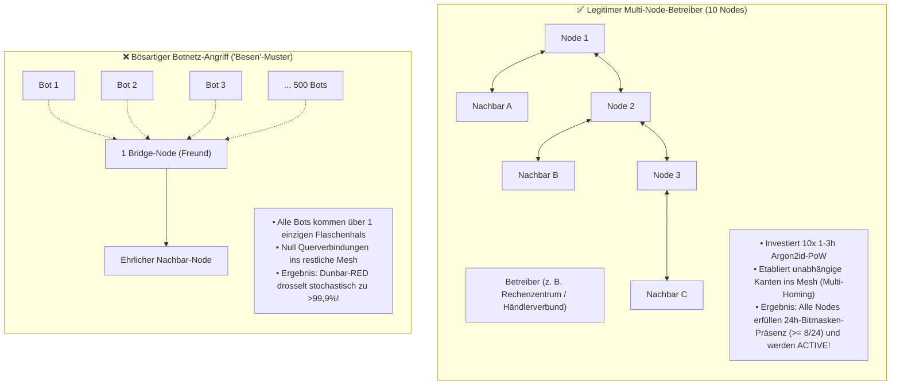
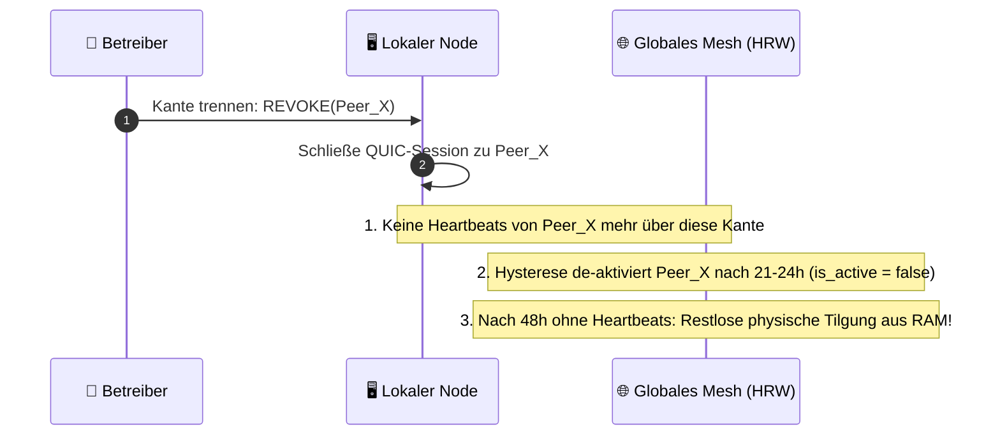

# 17. Topologie-Telemetrie & Social-Defense-Layer

> **Status:** Informativ (Operations & Tooling)  
> **Modell:** Logic & State Graph First  
> **Credo:** *"Telemetrie dient der menschlichen Transparenz und sozialen Hygiene – nicht automatischen Maschinen-Banns."*

Dieses Dokument spezifiziert die **Topologie-Telemetrie**, das **Diagnose-Dashboard** sowie den **Social-Defense-Layer** für Knotenbetreiber. Es definiert, wie Betreiber anomale Netzwerkstrukturen (z. B. Botnetz-Besen) erkennen, wie legitime Multi-Node-Setups geschützt bleiben und wie sich das Netzwerk bei menschlichen Kündigungen (`REVOKE`) organisch selbst heilt.

---

## 1. Philosophie: Telemetrie als Entscheidungs-Hilfe für Menschen

In einem zensurresistenten, dezentralen Netzwerk gibt es keine zentrale Polizei und kein weltweites Schiedsgericht. Betrüger mit mathematisch beweisbaren Doppel-Signaturen (Equivocation) werden zwar sofort automatisch per L1-Tombstone getilgt – doch subtile Angriffe (wie das Einschleusen von Schein-Identitäten über Brücken) erfordern **menschliche Wachsamkeit**.

* **Hinweise statt Willkür-Banns:** Die lokale Telemetrie liefert **Diagnose-Hinweise und Metriken**. Sie fällt keine automatischen Bann-Urteile über menschliche Freundschaften.
* **Menschliche Souveränität:** Der Betreiber entscheidet selbst, ob er eine Kante aufrechterhält, den Nachbarn kontaktiert oder die Verbindung trennt.

---

## 2. Differenzierung: Legitime Multi-Nodes vs. Bösartige Bot-Besen

Ein zentraler Grundsatz lautet: **Ein Betreiber darf mehrere Knoten betreiben (z. B. als Kalt-Reserve oder für spätere Ingress-Dienste), ohne dafür bestraft oder gebannt zu werden.**



### Der spieltheoretische Anreiz für Multi-Node-Betreiber:
1. **Kein Bann für Reserve-Nodes:** Betreibt ein Händler 10 Nodes auf Vorrat, ist das vollkommen legitim.
2. **Eigenanreiz zur Vernetzung (Multi-Homing):** Um seine Nodes zensurresistent und stabil mit dem Weltnetz zu verbinden, vernetzt der Betreiber seine 10 Nodes mit mehreren unabhängigen Nachbarn im Ort (*Multi-Homing*), statt sie über einen einzigen Flaschenhals laufen zu lassen.

---

## 3. Die Verhungerungs-Kaskade (Social Defense)

Erkennt ein Betreiber im Dashboard, dass ein Nachbar als toxischer Flaschenhals agiert oder unkooperativ ist, trennt er die Kante. Der Ausschluss erfolgt rein biologisch:



---

## 4. Telemetrie-Schnittstellen & Metriken

Jeder Knoten stellt zwei leichtgewichtige Diagnose-Schnittstellen bereit:

### 4.1 Prometheus-Metriken (`/metrics`)

| Metrik | Typ | Beschreibung |
| :--- | :--- | :--- |
| `humoco_active_nodes_total` | Gauge | Aktuell bekannte aktive Knoten im weltweiten HRW-Pool ($N_{\text{aktiv}}$). |
| `humoco_peer_connections` | Gauge | Anzahl aktiver, direkter F2F- und Co-Shard QUIC-Sessions. |
| `humoco_edge_inbound_rate{peer="id"}` | Counter | Eintreffende Heartbeats pro Minute je Nachbarkante. |
| `humoco_edge_red_drop_rate{peer="id"}` | Counter | Durch Dunbar-RED verworfene Pakete auf überlasteten Kanten. |
| `humoco_immature_nodes` | Gauge | Neu gesehene Identitäten in der 24h-Inkubationsphase. |

### 4.2 Topologie-Graph Endpunkt (`/api/v1/topology.json`)
Gibt die lokale Nachbarschafts-Struktur für Visualisierungs-Tools (z. B. integriertes Web-UI oder Cytoscape) im JSON-Graph-Format aus:
```json
{
  "local_node": "ed25519_pubkey_abc...",
  "active_peers_count": 14,
  "warnings": [
    {
      "peer": "ed25519_pubkey_xyz...",
      "level": "WARN_SINGLE_BRIDGE_BOTNET",
      "message": "Peer tunnels 85 unverified identities via single edge. Ingress throttled via Dunbar-RED."
    },
    {
      "peer": "ed25519_pubkey_local...",
      "level": "WARN_SINGLE_EDGE_CENSORSHIP_RISK",
      "message": "Node has only 1 verified F2F edge (deg=1). High risk of partition and single-edge censorship. Please peer with >= 2-3 nodes."
    },
    {
      "peer": "ed25519_pubkey_local...",
      "level": "WARN_LOCAL_CLOCK_SKEW",
      "message": "Local system clock diverges by > 45s from neighbor median. High risk of gossip dropping. Triggers auto NTP resync."
    }
  ]
}
```

### 4.3 Ingress-Transparenz & Bürgen-Frühwarnung (Plausibilitäts-Check)

Wenn ein neuer Knoten dem Netzwerk beitritt, kann er theoretisch sofort das tägliche Ingress-Kontingent für Gutscheine einspeisen (ca. 333 Fünf-Jahres-Gutscheine pro Tag).

Um Missbrauch durch böswillige neue Knoten sozial abzufangen, überwacht das Dashboard den **Ingress-Volumenverbrauch** direkter Nachbarn:

* **Plausibilitäts-Schwelle ($\ge 80\,\%$ Tageslimit am Tag 1):**  
  Schöpft ein neu aufgenommener Nachbar innerhalb der ersten 24 Stunden über $80\,\%$ seines täglichen Ingress-Budgets für Langzeit-Gutscheine aus, erhalten die bürgenden Freunde eine gelbe Dashboard-Meldung:
  ```text
  [INFO / AUDIT] Peer 'Neuer-Nachbar-Nord' beansprucht 88% seines Tages-Ingress (295 Langzeit-Gutscheine eingespeist).
                 -> Bitte Plausibilität im lokalen Umfeld prüfen (z. B. legitime Händler-Aktion vs. Spam).
  ```
* **Menschliche Handlungsoption:**  
  * Handelt es sich um eine legitime Vereinsgründung oder Kassen-Initialisierung $\rightarrow$ Alles in Ordnung.
  * Reagiert der Nachbar nicht oder handelt es sich um unplausiblen Müll $\rightarrow$ Kündigung der Kante per `REVOKE`.

### 4.4 Shard-Aktivitäts-Diagnose & Betreiber-Frühwarnung

Die Messung der Shard-Beteiligung dient primär der lokalen Ausfallsicherheit und Selbstdiagnose des Knotenbetreibers.

#### 1. Lokale Betreiber-Selbstdiagnose (Eigener Knoten)
Erkennt der lokale Node-Daemon über die internen Zähler und Quorum-Bitmasken, dass er für seinen zugewiesenen Shard unzureichend viele Signaturen geliefert hat ($< 80\,\%$ der Locks mitsigniert):
* **Lokale Dashboard- / Log-Warnung für den Administrator:**
  ```json
  {
    "level": "WARN_LOCAL_SHARD_PERFORMANCE_DEGRADED",
    "message": "Lokale Shard-Validierungsquote liegt bei nur 42% (hohe Latenz, I/O-Stau oder Paketverlust). P2P-Peering-Credits drohen zu verfallen!"
  }
  ```
* **Nutzen:** Ein ehrlicher Administrator wird sofort alarmiert, wenn seine Hardware überlastet ist, ein Router-Problem vorliegt oder Threads blockieren, noch bevor eigene Kunden unter Abbrüchen und Failover-Abwanderungen leiden.

#### 2. Nachbarschafts-Audit für F2F-Freunde (Optional)
Sollte ein Betreiber aggregierte Aktivitätsstatistiken im lokalen Web-UI für verbundene Freunde teilen:
* **Optionale Dashboard-Meldung:**
  ```json
  {
    "peer": "ed25519_pubkey_lazy...",
    "level": "INFO_NEIGHBOR_SHARD_ACTIVITY",
    "message": "Peer participated in 0/150 locks in assigned Shard 42 over the last 24h."
  }
  ```
* **Hinweis:** Da Schmarotzer durch lokale Bitmask-Isolation (HRW-Rang 21 Nachrücken) und P2P-Ratio-Credit-Drosselung bereits automatisch an Wirksamkeit verlieren, ist ein manuelles Eingreifen der Freunde nicht für die Kern-Sicherheit nötig.

---

## 5. Invarianten der Topologie-Telemetrie

1. **[INV-1701] Nicht-autoritäre Telemetrie:** Telemetrie-Auswertungen und Dashboard-Warnungen dienen ausschließlich als Entscheidungshilfe für menschliche Betreiber und dürfen keine automatischen, willkürlichen Netzausschlüsse verhängen.
2. **[INV-1702] Schutz vernetzter Multi-Node-Cluster:** Mehrere Knoten desselben Betreibers sind vollumfänglich zulässig, sofern sie den regulären Argon2id-PoW erbringen und über $\ge 3$ Kanten unabhängig im Mesh verankert sind.
3. **[INV-1703] Deterministische Verhungerung:** Das Trennen von Kanten durch menschliche Betreiber führt ohne zentrale Abstimmung zur automatischen Deaktivierung (8–16h) und physischen RAM-Tilgung (48h) des isolierten Knotens.
4. **[INV-1704] Ingress-Transparenz:** Knotenbetreiber erhalten transparente Telemetrie-Hinweise über das Ingress-Auslastungsverhalten ihrer direkt angebundenen Nachbarn, um anomales Volumen frühzeitig zu erkennen.
5. **[INV-1705] Shard-Aktivitäts-Transparenz:** Das System stellt dem Betreiber präzise Selbstdiagnose-Warnungen (`WARN_LOCAL_SHARD_PERFORMANCE_DEGRADED`) bereit, wenn die lokale Shard-Validierungsleistung abfällt.
