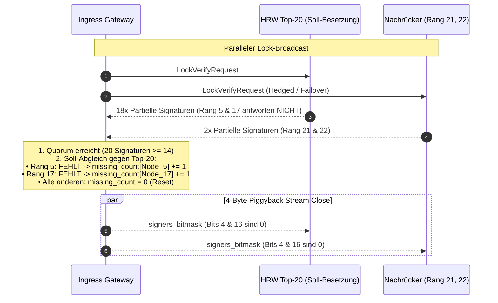
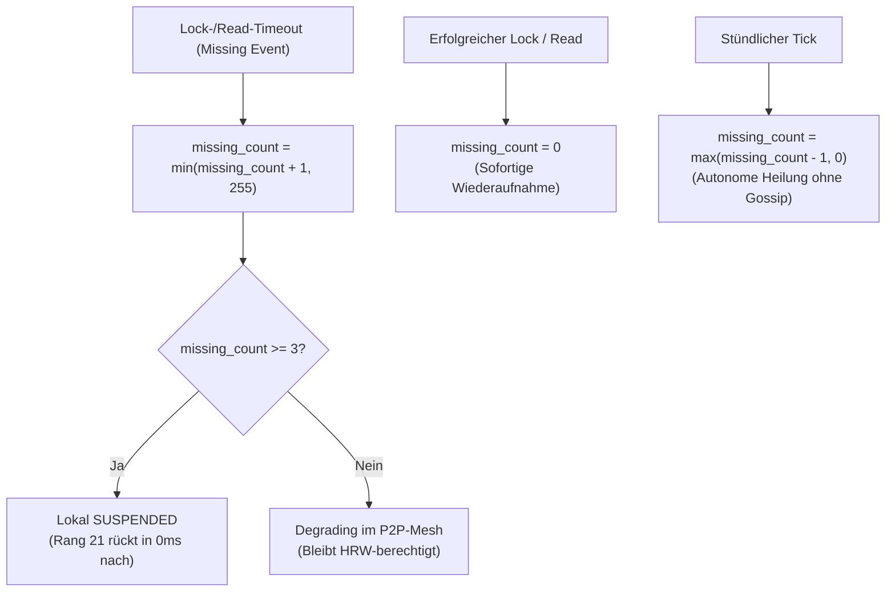

# 18. Wissens-Memo: Shard-Kollaboration, Perkolationsphysik & Ausfall-Erkennungs-Mathematik

> **Status:** Referenz- und Berechnungs-Spezifikation (Wissens-Memo)  
> **Modell:** Statistical Mechanics, Percolation Theory & Coupon-Collector Invariants  

Dieses Dokument bündelt die mathematischen Formeln, analytischen Grenzwerte und Monte-Carlo-Simulationsergebnisse für:
1. Die **Small-World-Gossip-Perkolation** (Weibull-Zerfall & 73,1%-Kipppunkt).
2. Die **Shard-Kollaboration & Nachbarschafts-Statistik** über alle Netzgrößen $N$ ($100$ bis $10.000.000$ Knoten).
3. Die **zeitliche Ausfall-Erkennungsrate** (Lazy Worker Defense) unter verschiedenen Transaktions-Lastprofilen.

---

## 1. Die mathematischen Grundformeln

### A. Shard-Mitgliedschaft & 1-Shard-Grenzgröße
Gegeben seien $S = 65.536$ Shards (2-Byte Genesis Buckets) und $K = 20$ Knoten pro Shard-Komitee (Top-20 via HRW-Hashing).

#### 1. Mittlere Anzahl der Shards pro Knoten:
$$\Large \mu_S(N) = \frac{S \cdot K}{N} = \frac{65.536 \cdot 20}{N} = \frac{1.310.720}{N}$$

#### 2. Wahrscheinlichkeit, dass ein Knoten in mindestens einem Shard aktiv ist:
$$\Large P(\text{in } \ge 1 \text{ Shard}) = 1 - \left(1 - \frac{K}{N}\right)^S \approx 1 - \exp\left(-\frac{1.310.720}{N}\right)$$

> 🎯 **Der 1-Shard-Kipppunkt ($N^* = 1.310.720 \approx 1{,}31 \text{ Millionen Knoten}$):**  
> * Für alle Netzgrößen **$N \le 1{,}31 \text{ Mio. Knoten}$** ist jeder Knoten im statistischen Schnitt in **mindestens einem oder mehreren Shards** aktiv.
> * Für $N > 1.310.720$ gibt es mehr Knoten als verfügbare Shard-Plätze ($1.310.720$). Überschüssige Knoten agieren als reine Gateway-/Relay-Knoten und rücken bei Shard-Ausfällen deterministisch nach.

---

### B. Distinkte Co-Shard-Kollegen (Netzabdeckung)
Da HRW die Knoten pro Shard pseudozufällig und unabhängig verteilt, berechnet sich die Anzahl der **verschiedenen (unique) Shard-Partner** eines Knotens $X$ über:

$$\Large U(N) = (N - 1) \cdot \left[1 - \left(1 - \frac{K - 1}{N - 1}\right)^{\mu_S(N)}\right] \approx (N - 1) \cdot \left(1 - \exp\left(-\frac{24.903.680}{N^2}\right)\right)$$

* Bei $N = 10.000$ Knoten teilt jeder Knoten mit **$2.204$ verschiedenen Knoten ($22{,}06\,\%$ des gesamten Netzwerks)** gemeinsame Shard-Pflichten.

---

### C. Die Gossip-Perkolations-Gleichung (Weibull-Modell)
Die verbleibende Gossip-Reichweite $R(x)$ (in Prozent) bei einem Anteil $x \in [0, 100]$ blockierender Knoten folgt der **komplementären Weibull-Überlebensfunktion** ($R^2 = 99{,}90\,\%$):

$$\Large R(x) = 100 \cdot \exp\left(-\left(\frac{x}{73{,}1}\right)^{19}\right)$$

* **$\lambda = 73{,}1\,\%$ (Kipppunkt):** Folgt direkt aus der Herdenimmunitäts-Schwelle $H_c = 1 - 1/R_0$ mit $R_0 \approx 3{,}7$ ($1 - 1/3{,}7 \approx 73\,\%$).
* **$k = 19$ (Weibull-Modul):** Beschreibt den extrem steilen, spröden Phasenübergang.

```
Ehrliche Erreichbarkeit R(x) [%]
100% ┼──────────────────────────────╮ (0% bis 55%: 100% - 99.5% stabil)
 90% │                              ╰──╮ (60% bis 64%: >90%)
 80% │                                 │
 70% │                                 ╰──╮ (68%: 77.9%, 70%: 64.6%)
 60% │                                    │
 50% │                                    │ (71%: 59.1%, 72%: 46.5%)
 40% │                                    ╰─► 73%: 42.8%
 30% │                                       │
 20% │                                       ╰──► 74%: 25.2% (KIPPPUNKT Δ = -17.7%)
 10% │                                          ╰──╮ (76%: 12.7%, 77%: 5.7%)
  0% ┴─────────────────────────────────────────────┴─────────────────────
      0%  10%  20%  30%  40%  50%  60%  70% 74% 80%  90%  100% (Blockierer x)
```

---

## 2. Kennzahlen über verschiedene Netzwerkgrößen ($N$)

| Netzwerkgröße ($N$) | Ø Shards / Node ($\mu_S$) | $P(\ge 1 \text{ Shard})$ | Distinkte Shard-Kollegen ($U$) | Direkte Netzabdeckung | Topologie-Zustand |
|:---|:---:|:---:|:---:|:---:|:---|
| **$100$ Nodes** | $13.107{,}2$ | $100{,}0\,\%$ | $99$ Knoten | **$99{,}0\,\%$** | 🌐 Dorf-Cluster (Voll-Überlappung) |
| **$500$ Nodes** | $2.621{,}4$ | $100{,}0\,\%$ | $499$ Knoten | **$99{,}8\,\%$** | 🌐 Hohe Dichte |
| **$1.000$ Nodes** | $1.310{,}7$ | $100{,}0\,\%$ | $999$ Knoten | **$99{,}9\,\%$** | 🌐 Fast vollständiges Mesh |
| **$5.000$ Nodes** | $262{,}1$ | $100{,}0\,\%$ | $3.153$ Knoten | **$63{,}1\,\%$** | 🌐 Starke Durchmischung |
| **$10.000$ Nodes** | **$131{,}1$** | **$100{,}0\,\%$** | **$2.204$ Knoten** | **$22{,}0\,\%$** | 🌐 Standard-Großnetz |
| **$25.000$ Nodes** | $52{,}4$ | $100{,}0\,\%$ | $977$ Knoten | $3{,}9\,\%$ | ⚖️ Regionale Verteilung |
| **$50.000$ Nodes** | $26{,}2$ | $100{,}0\,\%$ | $496$ Knoten | $1{,}0\,\%$ | ⚖️ Ausgewogene Last |
| **$100.000$ Nodes** | $13{,}1$ | $99{,}9998\,\%$ | $249$ Knoten | $0{,}25\,\%$ | ⚖️ Voll abgedeckt |
| **$500.000$ Nodes** | $2{,}6$ | $92{,}7\,\%$ | $50$ Knoten | $0{,}01\,\%$ | ⚖️ Dünner werdend |
| **$1.310.720$ Nodes** | **$1{,}0$** | **$63{,}2\,\%$** | **$19$ Knoten** | — | 🎯 **Grenz-Netzgröße ($1\text{ Shard/\O}$)** |
| **$5.000.000$ Nodes** | $0{,}26$ | $23{,}1\,\%$ | $5$ Knoten | — | 🌱 Megapool (Standby-Knoten) |
| **$10.000.000$ Nodes** | $0{,}13$ | $12{,}3\,\%$ | $2$ Knoten | — | 🌱 Megapool (Standby-Knoten) |

---

## 3. Zeitliche Ausfall-Erkennung & Isolation (Simulationsmatrix)

Die folgende Tabelle zeigt für $N = 10.000$ Knoten, wie viel Prozent des **gesamten Netzwerks** (Gateways + Co-Shard-Knoten) nach verschiedenen Zeiträumen wissen, dass ein Knoten $X$ ausgefallen ist.

> [!NOTE]
> **Definition der Transaktionsraten:**  
> Die angegebenen Raten sind **GESAMT-Netzwerk-Raten** (weltweit über alle 10.000 Knoten summiert), **NICHT** pro einzelnem Knoten.
> * $1{,}2 \text{ Tx/s netzweit} = 100.000 \text{ Transaktionen / Tag}$.
> * $115{,}7 \text{ Tx/s netzweit} = 10.000.000 \text{ Transaktionen / Tag}$.
> *(Wäre die Rate $1{,}2 \text{ Tx/s}$ pro Knoten, entspräche dies $12.000 \text{ Tx/s}$ netzweit bzw. $\approx 1 \text{ Milliarde Tx/Tag}$, womit die Isolation in $< 10 \text{ Minuten}$ abgeschlossen wäre).*

### Matrix: Zeitliche Bekanntheit des Ausfalls

| Transaktionsvolumen / Tag | Rate (Tx/s netzweit) | 5 Min | 15 Min | 30 Min | 1 Std | 2 Std | 6 Std | Zeit bis zur 73,1%-Isolation |
|:---|:---:|:---:|:---:|:---:|:---:|:---:|:---:|:---|
| **$100.000$ / Tag** *(Basislast)* | $1{,}2 \text{ Tx/s}$ | $0{,}4\,\%$ | $0{,}4\,\%$ | $0{,}8\,\%$ | $1{,}6\,\%$ | $3{,}1\,\%$ | $6{,}4\,\%$ | 💤 $> 6 \text{ Std}$ *(24h-Dormant-Pfad)* |
| **$500.000$ / Tag** | $5{,}8 \text{ Tx/s}$ | $0{,}4\,\%$ | $1{,}4\,\%$ | $2{,}8\,\%$ | $5{,}5\,\%$ | $10{,}1\,\%$ | $18{,}1\,\%$ | 💤 $> 6 \text{ Std}$ |
| **$1 \text{ Mio}$ / Tag** *(Regional)* | $11{,}6 \text{ Tx/s}$ | $0{,}6\,\%$ | $2{,}4\,\%$ | $4{,}3\,\%$ | $9{,}2\,\%$ | $17{,}7\,\%$ | $23{,}6\,\%$ | 💤 $> 6 \text{ Std}$ *(Co-Shard Sättigung)* |
| **$5 \text{ Mio}$ / Tag** | $57{,}9 \text{ Tx/s}$ | $5{,}5\,\%$ | $12{,}8\,\%$ | $18{,}8\,\%$ | $22{,}9\,\%$ | $25{,}8\,\%$ | $36{,}1\,\%$ | ⏳ $\approx 14 \text{ Std}$ |
| **$10 \text{ Mio}$ / Tag** *(Landesweit)* | $115{,}7 \text{ Tx/s}$ | $10{,}0\,\%$ | $18{,}8\,\%$ | $22{,}8\,\%$ | $26{,}1\,\%$ | $31{,}6\,\%$ | $49{,}3\,\%$ | ⏳ $\approx 8 \text{ Std}$ |
| **$50 \text{ Mio}$ / Tag** *(Großnetz)* | $578{,}7 \text{ Tx/s}$ | $20{,}6\,\%$ | $26{,}8\,\%$ | $33{,}3\,\%$ | $44{,}6\,\%$ | $61{,}9\,\%$ | **$91{,}9\,\%$** | ⚡ **$2{,}90 \text{ Stunden}$** |
| **$100 \text{ Mio}$ / Tag** *(Visa-Skala)* | $1.157{,}4 \text{ Tx/s}$ | $25{,}0\,\%$ | $33{,}7\,\%$ | $44{,}6\,\%$ | $61{,}9\,\%$ | **$82{,}0\,\%$** | **$99{,}1\,\%$** | ⚡ **$1{,}47 \text{ Stunden}$** |

---

## 4. Architektonisches Fazit

1. **Sofortige Shard-Sicherheit ($< 100\,\text{ms}$):**
   Fällt ein Knoten $X$ aus, bemerken dies die $2.204$ betroffenen Co-Shard-Knoten bei den ersten Transaktionen in seinen 131 Shards. Nach $\ge 3$ Timeouts wird $X$ shard-intern suspendiert und HRW-Rang 21 rückt nach. Für Clients entsteht **$0\,\text{ms}$ Mehraufwand oder Ausfallzeit**.
2. **Gossip-Aushungerung & Verlöschen:**
   * Bei hoher Netzaktivität ($\ge 50 \text{ Mio Tx/Tag}$) überschreitet der Anteil informierter Gateways nach **$1{,}5\text{--}3$ Stunden** die $73{,}1\,\%$-Schwelle $\implies$ Gossip-Pakete von $X$ ersticken physikalisch im Mesh.
   * Bei niedriger Netzaktivität ($< 1 \text{ Mio Tx/Tag}$) greift nach **$24\text{ Stunden}$** der reguläre stündliche Präsenzfilter (`DORMANT` nach 21–24h ohne frische Heartbeats), wodurch $X$ restlos aus dem RAM aller Knoten getilgt wird.

---

## 5. [INV-0309] Gateway-Soll-Quorum Differenzprüfung & Lazy-Node Detektion



### Die Invarianten der Gateway-Detektion:
1. **Soll-Abgleich gegen Primär-Ränge $1 \dots 20$:** Das Gateway prüft bei jedem Quorum-Abschluss nicht nur, ob $\ge 14$ Stimmen vorliegen, sondern gleicht die Unterzeichner gegen die deterministische HRW-Sollbesetzung der Ränge $1 \dots 20$ ab.
2. **Missing-Accounting:**
   * Jeder fehlende oder ungültig antwortende Primärknoten erhält einen Zähler-Inkrement (`missing_count += 1`).
   * Nach $\ge 3$ aufeinanderfolgenden Misses wird der Knoten im lokalen Gateway-Backoff-Cache als `SUSPENDED` markiert.
   * Antwortet der Knoten bei einer Folge-Transaktion wieder regulär, wird der Zähler sofort auf 0 zurückgesetzt (`missing_count = 0`).
3. **Deterministische Bitmasken-Verteilung:** Das Gateway spiegelt diese 20-Bit-Maske via 4-Byte-Piggyback an alle antwortenden Shard-Knoten zurück, sodass auch die verbleibenden Shard-Mitglieder denselben Zählerstand führen.

---

## 6. [INV-1501] Transiente missing_count Dämpfung & Autonome Heilung

Um Kaskaden-Death-Spirals und Deadlocks unter DoS oder kurzzeitigen Lastspitzen mathematisch auszuschließen, verwendet der `PeerPresenceEntry` das **transiente `missing_count`-Modell (`missing_count: u8`) mit stündlichem Zerfall**:



### Die Invarianten der transienten Dämpfung:
1. **Lokale Suspension ab $\ge 3$ Misses:** Ein einzelner Ausfall führt lediglich zu einer Vorwarnung (`Degrading`). Erst ab $\ge 3$ aufeinanderfolgenden Misses wird der Knoten lokal im Gateway-Cache als `SUSPENDED` markiert; deterministisch springt HRW-Rang 21 in $0\,\text{ms}$ ein.
2. **Sofortiger Reset bei Erfolg:** Antwortet der Knoten bei einer Folge-Transaktion erfolgreich, wird `missing_count` sofort auf 0 zurückgesetzt (`record_success()`).
3. **Autonome stündliche Heilung (`-1 / h`):** Jede Stunde baut sich der Zählerstand um $-1$ ab (`missing_count.saturating_sub(1)`). Knoten heilen autonom ohne Betreiber-Eingriff und ohne veraltete Deadlocks.
4. **Sauberer Re-Entry bei DORMANT:** Bei Übergang zu `DORMANT` wird `missing_count = 0` gesetzt, damit der Knoten bei einem Re-Entry direkt für Bewährungsproben im Shard bereitsteht. Multi-Wochen-Sperren sind physikalisch eliminiert.
