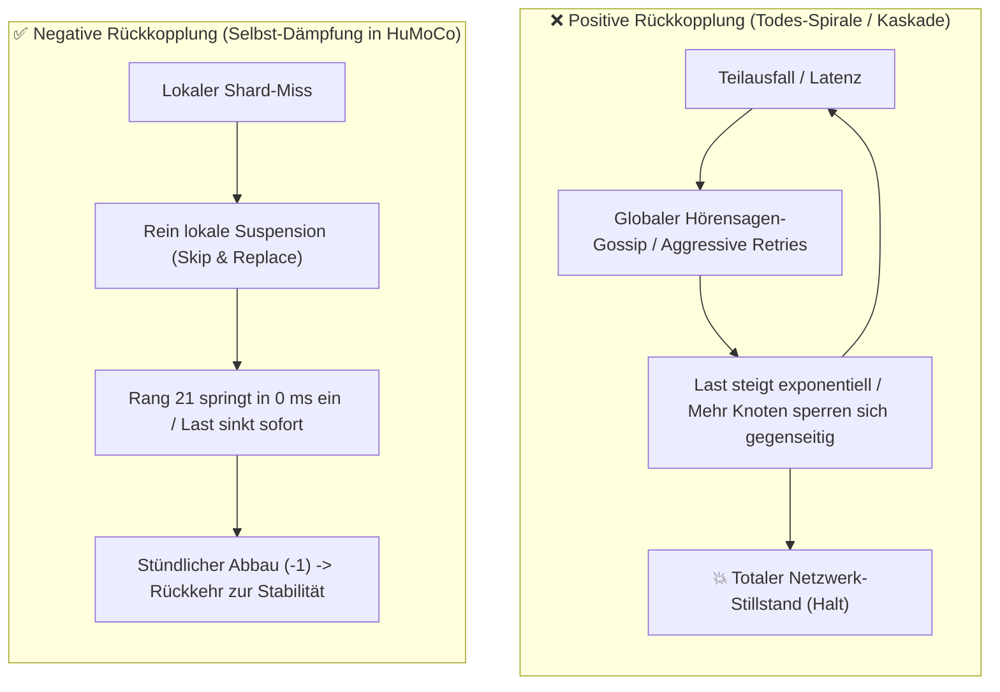

# 19. Rückkopplungs-Dynamik, Anti-Kaskaden-Architektur & Historische P2P-Post-Mortems

> **Status:** Analytisches Wissens-Memo & Systemtheoretischer Sicherheitsnachweis  
> **Modell:** Non-Linear Dynamics, Failure Cascades & First-Party Evidence Doctrine  

Dieses Dokument analysiert die systemtheoretischen Ursachen für **kaskadierende Netzwerkausfälle (Todes-Spiralen / Self-Destruction Cascades)** in verteilten Systemen. Es vergleicht historische Großausfälle bekannter P2P- und Blockchain-Netzwerke mit den Schutzmechanismen des HuMoCo Layer-2 Sperrregisters.

---

## 1. Das Kernproblem: Positive vs. Negative Feedback-Schleifen

In verteilten Systemen unterscheidet die Regelungstechnik zwischen zwei fundamentalen Zuständen:



### Die goldene Regel stabiler Netze:
> **Jede Schutzmaßnahme MUSS lokal dämpfend wirken ($\Delta \text{Last} \le 0$).**  
> Wenn die Reaktion auf einen Fehler zusätzlichen globalen Netzwerk-Traffic oder globale Reputations-Verurteilungen erzeugt, existiert ein mathematischer Resonanzpunkt, an dem sich das Netzwerk selbst zerstört.

---

## 2. Die 3 Kardinalsünden, die historische Netzwerke zerstörten

### Sünde 1: Hörensagen-Gossip & Verleumdungs-Kaskaden (Gossip-Based Slander)
* **Mechanismus:** Knoten $A$ beobachtet einen Fehler bei $B$ und sendet einen Bann-Aufruf (*„Node B ist bösartig / offline“*) per Broadcast an alle Peers. Peers leiten diesen Aufruf weiter und sperren $B$ ungeprüft.
* **Die Falle:** Ein Angreifer mit $1\,\%$ Sybils flutet das Netz mit gefälschten Verleumdungen über ehrliche Knoten. Die ehrlichen Knoten sperren sich gegenseitig aus $\implies$ **Netzwerk-Partitionierung in isolierte Dunkel-Cluster.**

### Sünde 2: Aggressive Last-Verstärkung bei Ausfällen (Retry Amplification / Avalanche)
* **Mechanismus:** Antwortet ein Server nicht rechtzeitig, verzehnfacht der Client/Knoten seine Anfragen an alle Nachbarn (*Hedged Request Avalanche*).
* **Die Falle:** Bei einer kurzen 10-Sekunden-Störung führt der 10-fache Retry-Sturm zum Zusammenbruch der noch funktionierenden Gateways $\implies$ **Kaskadierender Domino-Effekt.**

### Sünde 3: Kollektive Konsens-Bestrafung ohne mathematischen Beweis (Mob Slashing)
* **Mechanismus:** Knoten stimmen über die Zuverlässigkeit anderer Knoten ab (*Subjective Majority Voting*).
* **Die Falle:** Sobald ein byzantinisches Kartell $51\,\%$ erreicht, stimmt es kollektiv dafür, die ehrlichen $49\,\%$ als „faul“ zu deklarieren und ihr Guthaben zu vernichten.

---

## 3. Historische Post-Mortems bekannter Netzwerke

### 1. Die frühen P2P-Tauschbörsen (Gnutella & BitTorrent DHT Sybil Slander, 2000er)
* **Der Fehler:** Frühe File-Sharing-Clients führten verteilte Bad-Peer-Listen über Gossip.
* **Der Zusammenbruch:** Angreifer speisten massenhaft gefälschte IP-Sperrlisten ein. Innerhalb weniger Stunden hatten sich alle ehrlichen Knoten gegenseitig auf die Blacklist gesetzt. Das Overlay-Netzwerk zerfiel vollständig.
* **HuMoCo-Lösung:** **Kein Reputations-Gossip.** Jeder Knoten führt Zählerstände **ausschließlich im eigenen RAM**. Niemand kann einem Knoten vorschreiben, wen er zu sperren hat.

---

### 2. Solana: Der Turbine-Duplicate-Vote & Retry-Kollaps (September 2021 & Mai 2022)
* **Der Fehler:** Bei extremem Transaktionsandrang (Raydium IDO Bots mit $> 400.000\,\text{Tx/s}$) antworteten Shards verzögert. Das Protokoll hatte kein Ingress-Pacing und überflutete das Gossip-Subnetz mit ungedrosselten Retries und Validator-Votes.
* **Der Zusammenbruch:** Die Message-Queues der Validatoren liefen mit Gigabytes an Pending-Paketen voll. Validatoren konnten ihre Forks nicht mehr synchronisieren, gerieten in Out-of-Memory-Zustände und das weltweite Netzwerk **stand über 17 Stunden komplett still**.
* **HuMoCo-Lösung:** 
  * **[INV-1302] Ingress-Pacing:** Striktes Token-Bucket-Rate-Limiting an den Gateways.
  * **[INV-1502] Skip & Replace:** Bei Ausfall springt deterministisch Rang 21 ein ($0\,\text{ms}$ Wartezeit, **0 zusätzliche Retry-Pakete**).

---

### 3. BGP Internet Routing: Die Route Flap Damping Kaskade (1990er/2000er)
* **Der Fehler:** Router im weltweiten Internet-Backbone führten *Route Flap Damping* ein: Wenn eine Route kurz wackelte, wurde sie für $2^k$ Minuten global unterdrückt.
* **Der Zusammenbruch:** Bei regulären BGP-Updates (Path Exploration) erzeugten selbst gesunde Routen kurze Ankündigungs-Schwankungen. Die Damping-Algorithmen interpretierten dies fälschlicherweise als Wackeln und sperrten gesunde globale Routen für Stunden. Ganze Länder und Kontinente waren plötzlich offline.
* **HuMoCo-Lösung:** **[INV-1501] Transiente missing_count Dämpfung & Autonome Heilung:**  
  Ein einzelner Miss führt zu keiner Sperre (erst ab $\ge 3$ Misses lokale Suspension), ein Erfolg nullt den Zähler sofort, und stündlicher Zerfall ($-1/\text{h}$) garantiert stetige autonome Heilung ohne Kaskaden-Death-Spirals.

---

### 4. Bitcoin: Der CVE-2018-17144 Crash-Gossip Vektor
* **Der Fehler:** Eine Denial-of-Service-Schwachstelle im Bitcoin Core mempool erlaubte es, durch doppelte Inputs eine Panik-Exception auszulösen.
* **Der Beinahe-Zusammenbruch:** Hätte ein Miner einen solchen Block gemint, wären alle synchronisierenden Bitcoin-Nodes weltweit gleichzeitig abgestürzt $\implies$ Totaler Kettenstillstand.
* **HuMoCo-Lösung:** **[INV-1002] 100% Zustandslos & Panik-Frei:**  
  Sämtliche Verifikationen (Argon2, Ed25519, Proof-Chains, Bitmasken) sind in Rust allokationsfrei und `panic`-sicher modelliert.

---

### 5. Das FLP-Unmöglichkeits-Theorem & Die Sonderregel-Falle (Autoimmun-Kaskaden)
* **Das Theorem (Fischer, Lynch, Paterson, 1985):**  
  In einem asynchronen Netzwerk ist es mathematisch unmöglich, mit endlichen Mitteln sicher zu unterscheiden, ob ein Knoten abgestürzt ist, böswillig schweigt, unter externem DoS-Beschuss steht oder lediglich ein langsames Netzwerk hat.
* **Die Sonderregel-Falle (Complexity Spiral):**  
  Historische Systeme versuchen oft, unzuverlässige Knoten durch Strafpunkte (z. B. 8:1 Ratio-Credits, Zähler, temporäre Banns) zu „erziehen“.
  1. *Schritt 1:* Jeder Ausfall gibt $+8$ Punkte, jeder Erfolg zieht $-1$ ab.
  2. *Die Waffe des Angreifers:* Ein Botnetz fährt einen rollierenden DoS auf 20–30 % der Knoten. Die ehrlichen Opfer sammeln Strafpunkte und sperren sich gegenseitig für Minuten oder Tage aus (Autoimmun-Reaktion: Das Abwehrsystem zerstört das eigene Netz).
  3. *Schritt 2:* Man führt Sonderregeln ein (z. B. Korrelationsfilter: keine Strafen, wenn viele gleichzeitig ausfallen).
  4. *Die Gegenwaffe:* Faule Knoten (Schmarotzer) oder Botnetze verstecken sich dauerhaft hinter dem Korrelationsfilter und können nie bereinigt werden.
  5. *Schritt 3:* Man führt immer weitere Sonderregeln ein (Marker, Probes, Sonder-Heilungen) $\implies$ Man dreht sich endlos im Kreis.
* **Die HuMoCo KISS-Konsequenz („Subtraction before Construction“):**  
  * **Verzicht auf rachsüchtige Langzeit-Strafen:** Ein Timeout erzeugt niemals Tage oder Wochen an Sperren.
  * **Keine Gossip-Zensur bei Timeouts:** Shard-Timeouts führen niemals dazu, dass F2F-Gossip oder Heartbeats blockiert werden.
  * **Stoisches Skip & Replace bis Rang $20 + k$ (z. B. Rang 27):**  
    Sind in einem Shard 7 von 20 Knoten (35 %) faul, tot oder unter DoS, fragen die Gateways deterministisch bis Rang 27 an. Die 14 schnellsten ehrlichen Knoten signieren, die Kasse bleibt im Millisekunden-Bereich stabil, und der DoS verpufft wirkungslos.
  * **Gedächtnislose Selbstheilung (Memoryless Self-Healing):**  
    Das Netzwerk hegt keinen Groll. Wer im Zeitschritt $t$ antwortet, ist da. Wer in $t$ nicht antwortet, wird übersprungen – darf aber in $t+1$ sofort wieder arbeiten.

---

## 4. Die HuMoCo Zwei-Klassen-Sicherheits-Doktrin

Um jede Möglichkeit von Rückkopplungen, Verleumdung und Mob-Rule physikalisch auszuschließen, trennt HuMoCo strikt zwischen **subjektiver Arbeitsleistung** und **objektivem Betrug**:

```
                              ┌──────────────────────────────────────┐
                              │     Eingehendes Netzwerk-Ereignis     │
                              └──────────────────┬───────────────────┘
                                                 │
                        Ist das Ereignis mathematisch unbestreitbar?
                                                 │
                       ┌─────────────────────────┴─────────────────────────┐
                       ▼                                                   ▼
             [ NEIN: Subjektiv ]                                 [ JA: Objektiv ]
      (Latenz, Timeout, Paketverlust)                      (Equivocation, Double-Signing)
                       │                                                   │
                       ▼                                                   ▼
     ┌───────────────────────────────────┐               ┌───────────────────────────────────┐
     │      100 % LOKALE SANKTION        │               │      GLOBALER FRAUD-PROOF         │
     ├───────────────────────────────────┤               ├───────────────────────────────────┤
     │ • Score nur im eigenen RAM        │               │ • 21-Byte Beweis (2x Ed25519 Sigs)│
     │ • 0 Byte Gossip an Dritte         │               │ • Jeder prüft in < 100 µs selbst │
     │ • Skip & Replace auf Rang 21      │               │ • Sofortiger weltweiter Bann (O1) │
     │ • Heilt sich nach Störung selbst  │               │ • Keine Abstimmung, reine Mathe   │
     └───────────────────────────────────┘               └───────────────────────────────────┘
```

---

## 5. Mathematischer Konvergenz-Beweis gegen Selbst-Sabotage

Gegeben sei ein Netzwerk mit $N = 10.000$ Knoten. Ein Anteil $\beta \in [0, 1]$ sei byzantinisch oder verleumderisch.

1. **Lokale Isolationsgrenze:**  
   Da kein Verleumdungs-Gossip existiert, kann ein böswilliges Gateway $G$ nur seinen eigenen lokalen Gateway-Cache manipulieren.  
   $$\text{Schaden von } G = \frac{1}{N} = 0{,}01\,\% \text{ des Netzwerks}$$
2. **Kollusion von $M$ böswilligen Gateways:**  
   Selbst wenn $M = 5.000$ Gateways ($50\,\%$ des Netzes) böswillig beschließen, einen ehrlichen Knoten $X$ zu boykottieren:
   * $X$ wird bei diesen 5.000 Gateways auf Rang 21 umgangen.
   * **Aber:** Die verbleibenden 5.000 ehrlichen Gateways bedienen $X$ weiterhin mit $100\,\%$ Erfolgsquote.
   * **Perkolations-Immunität:** Da $50\,\% < 73{,}1\,\%$ (die Weibull-Kipppunktschwelle aus `docs/18`), bleibt die Gossip-Reichweite von $X$'s Heartbeats bei **$> 99{,}8\,\%$**.
   * $X$ wird **nicht isoliert** und fällt **niemals auf `DORMANT`**.
3. **Schlussfolgerung:**  
   Erst wenn eine byzantinische Übermacht von **$> 73{,}1\,\%$ aller Knoten weltweit** konzertiert handelt, kann ein ehrlicher Knoten isoliert werden. Gegen eine $73{,}1\,\%$-Mehrheit ist jedoch kein dezentrales Konsensnetzwerk der Welt immun.

---

## 6. Zusammenfassung

| Bedrohung | Konventionelle P2P-Netze | HuMoCo Layer-2 Sperrregister |
|:---|:---|:---|
| **Verleumdung / Anschwärzen** | ❌ Gossip-Bann führt zu Hexenjagden | ✅ **Immun:** 0 Reputations-Gossip, rein lokaler RAM-Zähler |
| **Flapping / Wackeln** | ❌ Schaukelt sich zu Dauer-Banns auf | ✅ **Gedämpft:** Transiente missing_count Dämpfung mit stündlichem Verfall |
| **DDoS / Last-Kaskade** | ❌ Exponential Retries blockieren CPU | ✅ **Gedämpft:** Zero-Latency Failover via Rang 21 |
| **Großstörung (z.B. ISP-Ausfall)** | ❌ Führt zu Kettenreaktion | ✅ **Selbstheilend:** $-1$ Punkt pro fehlerfreier Stunde |
