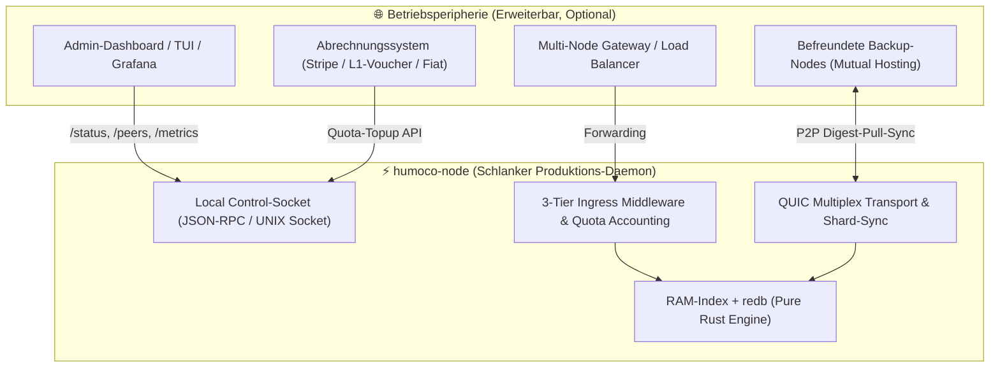
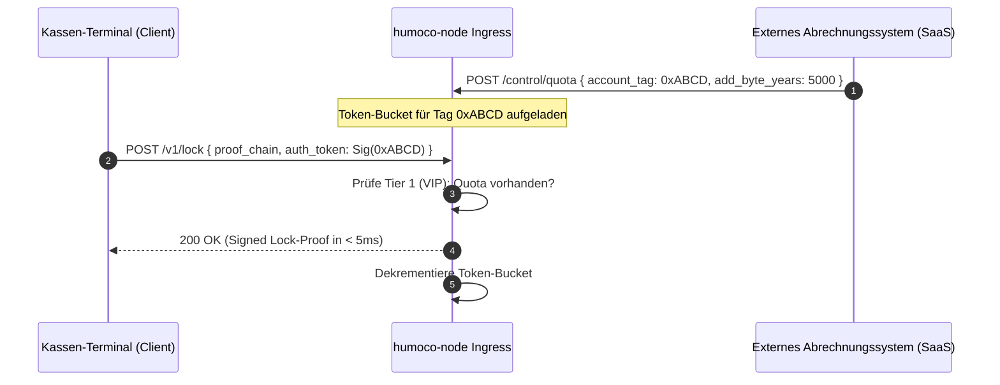

# 20. Vogelperspektive: Betrieb, Ökosystem & Zukunftssicherheit

> **Status:** Strategisches Architektur- & Roadmap-Dokument  
> **Fokus:** Node-Betrieb, Händler-Integration, Ökonomie, Cluster & Krypto-Agilität  

Dieses Dokument beschreibt die Einbettung des HuMoCo Layer-2 Sperrregisters in die reale Betriebsumgebung (Production Ecosystem). Es definiert, wie der mathematische Minimalkern mit Admin-Werkzeugen, Abrechnungsmodellen, Hochverfügbarkeits-Clustern und zukünftigen kryptografischen Standards interagiert, **ohne** den Konsenspfad mit akzidenteller Komplexität zu überfrachten (*Subtraktion vor Konstruktion*).

---

## 🧭 Das Leitbild: Kern vs. Peripherie (Separation of Concerns)

Das System trennt strikt zwischen dem **mathematischen Konsenskern** und der **Betriebsperipherie**:



---

## 1. Admin-Schnittstelle & Observability (Dashboard & Telemetrie)

### Design-Entscheidung:
Kein schwerfälliges Web-UI oder JavaScript-Framework im P2P-Daemon-Binary. Ein Web-Server im Konsenskern vergrößert die Angriffsfläche und verletzt das *Dumb Server*-Prinzip.

### Die 3 Säulen der Node-Beobachtbarkeit:
1. **Local Control-Socket (`/tmp/humoco.sock` oder `127.0.0.1:9091`):**
   * Leichtgewichtiger, lokaler JSON-RPC / REST-Endpunkt.
   * Befehle: `node.status()`, `peers.list()`, `quotas.get()`, `slashing.history()`, `maintenance.drain()`.
2. **Prometheus / OpenMetrics-Endpunkt (`GET /metrics`):**
   * Standard-Metriken für professionelle Node-Betreiber (Grafana):
     * `humoco_locks_active_total` (Füllung RAM-Index)
     * `humoco_pos_latency_seconds` (Histogramm: Latenz für Lock-Erteilung)
     * `humoco_p2p_connected_peers` (Aktive Dunbar-Verbindungen)
     * `humoco_ingress_dropped_requests` (Rate-Limiter / PoW-Verstöße)
3. **Entkoppeltes Admin-Dashboard:**
   * **CLI / TUI:** Ein integriertes Terminal-Dashboard (`humoco-node top` / `humoco-node status`).
   * **Web-UI (Optional als Sidecar):** Ein eigenständiger Micro-Service (z. B. leichtgewichtiges Go/Rust-Binary mit eingebettetem HTMX), der via Control-Socket die Daten visualisiert.

---

## 2. Kunden-Abrechnung & VIP-Nutzung (Node-as-a-Service / Kassen-Gateways)

### Das Prinzip: Kryptografisch blindes Accounting
Der Node kennt weder Kundennamen noch Währungsbeträge. Er rechnet ausschließlich in **Byte-Jahren** (Speicher-Zeit-Produkt gemäß Spec 09) und **API-Request-Kontingenten** ab.



### Ingress-Stufen (Spec 13):
* **Tier 1 (VIP / SLA):** Händler/Kassen mit vorab bezahltem API-Key oder signiertem Auth-Token. Prioritäre Abarbeitung in $< 5\,\text{ms}$.
* **Tier 2 (F2F Friends):** Befreundete Nachbarknoten. Gegenseitige kostenlose Freikontingente im Mesh.
* **Tier 3 (Public / Anonym):** Öffentliche Wallets ohne Registrierung. Schutz vor Missbrauch über zustandsloses **BLAKE3 Hashcash (PoW)** mit dynamischer Lastanpassung (*Netzwerk-Thermometer*).

---

## 3. Multi-Node Cluster & Hochverfügbarkeit (Händler & Betreiber)

Wenn ein Händler oder Service-Provider Hochverfügbarkeit (99.999 % Uptime) benötigt, betreibt er mehrere Nodes.

### Keine Paxos/Raft-Überfrachtung:
* Klassische Datenbanken erfordern komplexe Leader-Wahlen (Raft/Paxos).
* In HuMoCo sind alle Shard-Knoten gleichberechtigt:
  * Mehrere Nodes eines Betreibers nehmen als reguläre P2P-Peers teil.
  * Sie halten denselben Shard-Zustand über den automatischen **Digest-Pull-Sync** (Spec 03).

### Client-seitiges Multi-Homing (Smart Client):
Das Kassen-Terminal konfiguriert mehrere Shard-Endpunkte:
$$\text{Gateways} = [\text{Node-A:4433}, \text{Node-B:4433}, \text{Node-C:4433}]$$
* Kasse sendet primär an Node-A.
* Bleibt die Antwort $> 10\,\text{ms}$ aus (Timeout / Ausfall), geht der Request sofort an Node-B.
* Kein Single Point of Failure, kein zentraler Load-Balancer als Flaschenhals nötig.

---

## 4. Disaster Recovery & Gegenseitiges Backup (Friends-as-a-Backup)

### Warum Datenverlust bei Node-Totalausfall ausgeschlossen ist:
1. **Client-Side Custody:** Das Wallet besitzt die Historie (`ProofChain`). Der Node muss keine Kontostände aufbewahren.
2. **Shard-Redundanz ($R = 3 \dots 20$):** Jeder aktive Lock ist über mehrere unkorrelierte Nachbarknoten repliziert.

### Wiederherstellungs-Szenario (Server-Crash):
1. Node-Hardware fällt komplett aus (Brand / Plattendefekt).
2. Betreiber startet neuen Node mit dem gleichen Identity-Key auf neuer Hardware.
3. Der neue Node verbindet sich mit seinen befreundeten Peers (`F2F Friends`).
4. **Digest-First-Pull-Sync (Spec 03)** startet automatisch:
   * Node zieht die aktuellen Shard-Digests von 3 Peers.
   * Fehlende Locks werden blockweise gestreamt und in `redb` persistiert.
   * **Wiederherstellungszeit:** $< 500\,\text{ms}$ bei typischer Shard-Größe.

---

## 5. Krypto-Agilität & Zukunftssicherheit (Post-Quantum & Algorithmen-Wechsel)

Das Protokoll ist so entworfen, dass kryptografische Primitive (Hash-Funktionen, Signatur-Verfahren) ausgetauscht werden können, ohne das Netzwerk zu spalten.

### Die 3 Säulen der Krypto-Agilität:

| Ebene | Mechanismus | Zweck |
|---|---|---|
| **Wire-Header** | `crypto_suite_id` (1 Byte im WireHeader) | Kennzeichnet das verwendete Krypto-System (`0x01 = BLAKE3 + Ed25519`, `0x02 = Post-Quantum ML-DSA / Dilithium`). |
| **Domain Separation** | `BLAKE3("HuMoCo-v1-" ‖ ...)` | Verhindert Cross-Protocol- und Versions-Kollisionen bei zukünftigen Upgrades. |
| **Typ-Abstraktion (Rust)** | Generic / Enum Wrappers (`Digest`, `NodeSignature`) | Keine festen Byte-Arrays (`[u8; 32]`) tief im Konsenscode; isolierte Krypto-Schicht. |

---

## 6. Architektur-Entwurf für `crates/humoco-node`

Aus dieser Vogelperspektive ergibt sich ein glasklares, modulares Crate-Layout für die echte Umsetzung:

```text
crates/humoco-node/
├── src/
│   ├── config/              # humoco.toml, Quotas, Ports, Bootstrap-Peers
│   ├── engine/              # Verknüpfung von humoco-sim-core + redb
│   │   ├── persistence.rs   # Asynchroner Flush von RAM-Index auf Disk
│   │   └── recovery.rs      # Lazy Recovery nach Kaltstart
│   ├── network/             # Echter QUIC-Transport
│   │   ├── transport.rs     # Quinn/Iroh UDP Socket & Stream-Multiplexing
│   │   ├── ingress.rs       # 3-Tier Rate-Limiter (VIP Tokens, PoW Verifier)
│   │   └── peer_manager.rs  # Dunbar F2F Verbindungs-Verwaltung
│   ├── rpc/                 # Schnittstellen
│   │   ├── control.rs       # Local Admin Socket (JSON-RPC für TUI/Grafana/Billing)
│   │   └── client_api.rs    # PoS Kassen- & Wallet-API
│   └── main.rs              # CLI-Befehle: run, status, config-init, keygen
```

---

## 💡 Zusammenfassung

* **Der Kern bleibt minimal:** Keine Rechnungslogik, keine Webserver, kein Raft-Bloat im P2P-Daemon.
* **Saubere Entkopplung:** Administration und Abrechnung docken über lokale Control-Sockets an.
* **Unzerstörbarkeit:** Shard-Replikation und Client-Side Custody machen Backups trivial.
* **Zukunftssicher:** Krypto-Suite-IDs und Domain-Separation sichern das System gegen Quantencomputer und Protokoll-Evolution ab.
