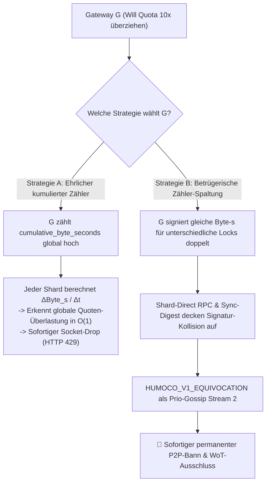
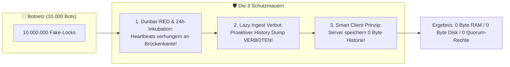
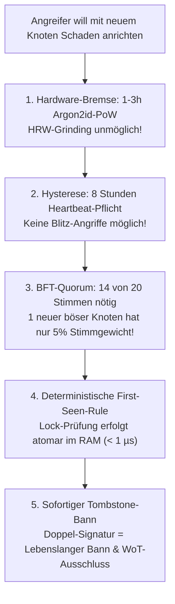
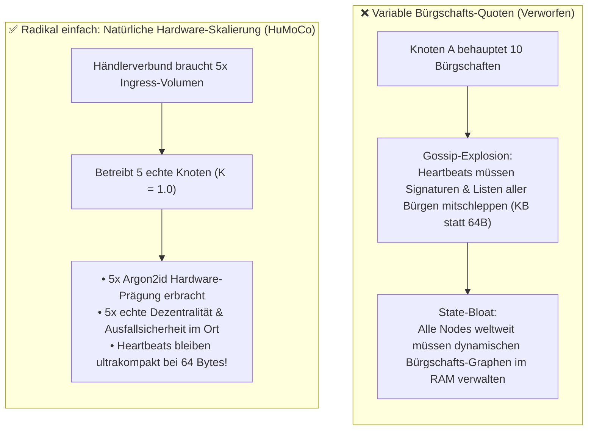
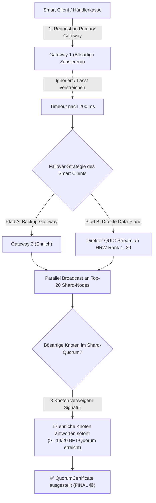
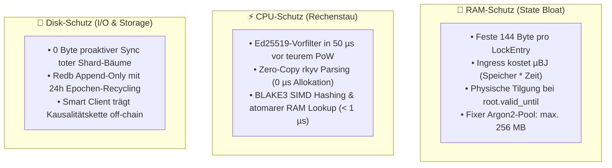
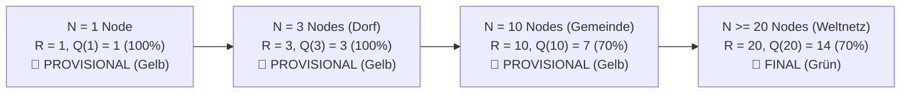
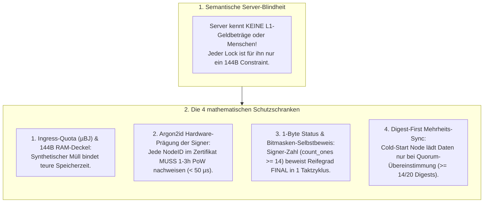
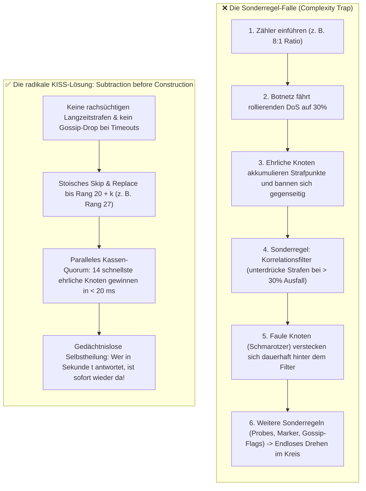

# 99. FAQ: Deep-Dive zu Angriffsvektoren & Graphentheorie

> **Status:** Standard  
> **Modell:** Logic & State Graph First  

Dieses Dokument beantwortet häufige Kernfragen zu Grenzfällen, Angriffsvektoren, Web-of-Trust-Graphentheorie und der stochastischen Betrugserkennung im HuMoCo Layer-2 Sperrregister.

---

## 1. Der Split-Shard Ingress-Betrug (Traffic-Verschleierung)

### Frage
> *„Wenn das Netzwerk 65.536 Shards hat und jeder Shard nur seinen lokalen Ausschnitt sieht: Kann ein Gateway $G$ nicht einfach an 10 verschiedene Shards jeweils eine niedrige Sequenznummer (`seq = 1..100`) melden und so unbemerkt das 10-Fache seiner erlaubten Ingress-Quota einspeisen?“*

### Antwort & Mathematischer Beweis
Nein. Das Gateway gerät in eine unlösbare mathematische Zwickmühle:



1. **Wenn $G$ ehrlich hochzählt:**  
   Jeder Shard, bei dem sich $G$ meldet, berechnet den Gradienten $\frac{\Delta \text{cumulative\_byte\_seconds}}{\Delta t}$. Steigt dieser schneller als die durch WoT erlaubte $\text{Ingress-Quota}(G)$, drosselt der Shard $G$ sofort am lokalen Socket.
2. **Wenn $G$ den Zähler spaltet oder fälscht (Double-Signing / Time-Warp):**  
   Sobald zwei kollidierende Signaturen desselben Gateways im Shard-Direct RPC oder beim Spec-03-Digest-Pull aufeinandertreffen, entsteht ein mathematisch unanfechtbarer `HUMOCO_V1_EQUIVOCATION`-Beweis. Dieser wird mit höchster Priorität über den 2. P2P-Gossip-Stream weitergeleitet und führt zum sofortigen permanenten P2P-Bann der Gateway-Identität (`NodePubKey`), zur Entwertung seines Shard-Tickets und zum vollständigen Abbruch aller WoT-Freundschaftskanten.

---

## 2. Das 10.000-Botnet-Merge-Szenario (Monster-Historien)

### Frage
> *„Ein isoliertes Botnetz aus 10.000 Bots bürgt sich gegenseitig im Kreis und erzeugt Millionen Fake-Locks. Wenn sich dieses Botnetz mit dem echten Netzwerk verbindet, flutet es dann unsere Server mit Datenmüll?“*

### Antwort & Mathematischer Beweis
Nein. Das Botnetz scheitert an **drei fundamentalen Schutzmauern**:



1. **Kanten-Drosselung & 24h-Inkubation ([`docs/07`](docs/07_admission_und_wot_buergschaften.md) & [`docs/11`](docs/11_organische_praesenz_und_dunbar_gossip.md)):**  
   Zirkuläre Bot-Cluster hinter einer Bridge scheitern an der Kanten-Drosselung ($R_{\text{soft}}$) und der 24h-Inkubationspflicht. Die Bots gelangen niemals in $N_{\text{aktiv}}$ und besitzen 0 Stimmrechte.
2. **Verbot von Historien-Dumps ([`docs/03`](docs/03_routing_und_sharding.md) & [`docs/08`](docs/08_topologie_dynamik_und_netz_merge.md)):**  
   HuMoCo ist **keine Blockchain**. Es gibt keinen globalen Ledger, den man nachsynchronisieren muss. Shard-Nodes weisen proaktive Daten-Dumps kategorisch ab (`INV-0301`).
3. **Smart Client, Dumb Server ([`docs/06`](docs/06_dumb_server_smart_client_flow.md)):**  
   Transaktionen reisen ausschließlich im Wallet des Nutzers. Erst beim Bezahlen an einer echten Kasse wird die Beweiskette on-the-fly im RAM validiert. Fake-Gutscheine ohne echte Layer-1-Genesis scheitern in $2\,\text{ms}$ an der Kasse.

---

## 3. Der Bestochene-Freund-Angriff (Kanten-Drosselung & 24h-Inkubation)

### Frage
> *„Was passiert, wenn der Angreifer einen echten Knotenbetreiber im Netzwerk besticht, damit dieser sein 10.000-Knoten-Botnetz über seine Freundeskante ins Netzwerk einspeist?“*

### Antwort & Mathematischer Beweis
Die **bio-mimetische Kanten-Drosselung ($R_{\text{soft}}$) in Kombination mit der 24h-Inkubation** verhindert diesen Angriff vollständig:

```mermaid
flowchart LR
    subgraph HonestNetwork["Echtes Netzwerk"]
        All["Tausende ehrliche Knoten"] --> H["Bestochener Knoten H"]
    end

    subgraph Cut["⚠️ Der Flaschenhals (Kanten-Budget R_soft)"]
        H -->|Einzige Kante (R_soft ~ 1-7 Heartbeats/Min)| Bot1["Bot 1"]
    end

    subgraph BotnetCluster["🦹 Dichtes Botnetz (10.000 Bots)"]
        Bot1 --> Bot2 & Bot3 & Bot4
        Bot2 <--> Bot3
        Bot3 <--> Bot4
        Bot4 --> Bot1
        Bot2 --> BotN["... 9.995 weitere Bots ..."]
    end

    HonestNetwork === Cut === BotnetCluster
```

* **Physikalische Kanten-Kapazität ([`docs/11`](docs/11_organische_praesenz_und_dunbar_gossip.md)):**  
  Die Kante zwischen $H$ und dem Botnetz besitzt ein striktes stochastisches Durchsatz-Limit ($R_{\text{soft}} \approx 1\text{--}7\,\text{Heartbeats/Minute}$).
* **Die Auswirkung:**  
  * Um $10.000$ Bots aktiv zu halten, bräuchte das Botnetz zehntausende Heartbeats pro Minute über diesen Kanal.
  * $P_{\text{drop}}$ steigt an der Kante auf $> 99{,}9\,\%$. Fast alle Heartbeats werden gedroppt.
  * Kein Bot erreicht $\ge 8/24$ stündliche Heartbeats über 24 Stunden im ehrlichen Netzwerk.
  * Alle $10.000$ Bots verharren dauerhaft auf `IMMATURE` und werden niemals in $N_{\text{aktiv}}$ aufgenommen.
* **Keine Sippenhaft:** Signiert der eine durchgelassene Bot kollidierende Quorum-Zertifikate, wird er per `ServerBann` sofort weltweit getilgt.

---

## 4. Warum keine lineare Hash-Kette zur Ingress-Prüfung?

### Frage
> *„Könnte man nicht alle Locks eines Gateways in eine lineare Hash-Kette ($H_n = \text{Hash}(H_{n-1} \parallel \dots)$) einbetten und im 24h-Heartbeat signieren?“*

### Antwort
Eine lineare Hash-Kette funktioniert bei multi-sharded Systemen nicht ohne massiven Overhead:
* Um $H_{50}$ in Shard 2 gegen den 24h-End-Hash $H_{100}$ zu prüfen, müsste Shard 2 alle $50$ Zwischen-Hashes kennen, die an Shard 1, Shard 5 etc. gesendet wurden.
* Dies würde entweder das Nachladen fremder Daten oder komplexe *Merkle Mountain Ranges (MMR)* mit großen Proof-Pfaden im Wire-Format erfordern.
* **Die überlegene Lösung (Occam's Razor):**  
  Der Kassenpfad läuft 100 % per Shard-Direct RPC und benötigt **0 Byte Zwischenzustände**. P2P-Mesh-Gossip ist streng auf stündliche Heartbeats und unanfechtbare Equivocation-Fraud-Proofs beschränkt. Betrug wird durch synchrone First-Party-Kollisionen im Shard-Direct RPC und Sync-Digest sofort erkannt.

---

## 5. Das organische 10-Knoten-Dorf vs. das 10.000-Knoten-Botnetz

| Eigenschaft | Organisches 10-Knoten-Dorf | Bösartiges 10.000-Knoten-Botnetz |
| :--- | :--- | :--- |
| **Freundschaftskanten zum Weltnetz** | Mehrere organische Kanten (Multi-Homing) | Max. 1 bestochene Kante (Single Bottleneck) |
| **Gossip-Heartbeat-Durchlass** | Verteilt sich harmonisch ($P_{\text{drop}} = 0$) | $> 99{,}9\%$ stochastischer Drop an Kante |
| **Präsenz-Status im Sharding** | Nach 24h vollwertig `ACTIVE` ($N_{\text{aktiv}}$) | Verbleibt permanent auf `IMMATURE` (0 Stimmen) |
| **L1-Deckung der Gutscheine** | Echte L1-Genesis | Keine L1-Deckung |
| **RAM-Sync-Volumen beim Merge** | $\approx 144\,\text{KB}$ (für 1.000 aktive Locks) | $0\,\text{Byte}$ (Sofortiger Drop ungültiger Hashes) |
| **Merge-Dauer** | $< 500\,\text{ms}$ (Phasenübergang zu `FINAL`) | Angriff verpufft wirkungslos |

---

## 6. Das Cross-Partition Double-Spend Szenario (Langzeit-Split & Ingress-Physik)

### Frage
> *„Kann ein Angreifer bei einer Netz-Spaltung (Split-Brain) nicht absichtlich Transaktion A in Netz-Hälfte 1 und Transaktion B in Netz-Hälfte 2 einspeisen, um nach dem Merge Verwirrung oder Schaden auf der Verlierer-Seite zu stiften?“*

### Antwort & Mathematische / Physikalische Analyse
In der Praxis ist dieses Szenario ein extremer theoretischer Randfall, der an der Physik von Netzwerk-Partitionen, dem HRW-Scoring und dem ökonomischen Slashing scheitert:

```mermaid
flowchart TD
    Split["Netzwerk-Partitionierung (Split-Brain)"] --> Physics{"Wo befindet sich der Angreifer?"}

    Physics -->|Physikalische Netztrennung| Isolated["Angreifer hat nur Zugang zu Netz-Hälfte 1<br>-> Transaktion B in Netz-Hälfte 2 unmöglich!"]
    
    Physics -->|Exklusive Brücke (Sehr selten)| DualIngress["Angreifer speist Tx A in Netz 1 und Tx B in Netz 2 ein"]
    
    DualIngress --> StatusCheck{"Status am Point-of-Sale?"}
    StatusCheck -->|Netz < 20 Nodes / Kurzer Split| Prov["Status: 🟡 PROVISIONAL (Gelb)<br>Empfänger kennt Offline-Risiko"]
    StatusCheck -->|Langzeit-Split > 24h| DoubleFinal["Beide Netze bilden HRW-Nachrücker<br>-> Beide erzeugen lokal FINAL"]

    DoubleFinal --> Merge["Späterer Netz-Merge"]
    Prov --> Merge

    Merge --> Resolve["1. min(H_canon) entscheidet Gewinner in < 500 ms<br>2. Verlierer-Zweig wird unumkehrbar VOID<br>3. Doppel-Signatur bildet HUMOCO_V1_EQUIVOCATION Proof<br>4. 🔴 Permanenter P2P-Bann & WoT-Ausschluss (Identitätsvernichtung)"]
```

1. **Physikalische Erreichbarkeit (Ingress-Physik):**  
   Wenn das Internet physikalisch getrennt ist (z. B. Seekabel-Bruch, BGP-Partitioning, regionale Netztrennung), befindet sich der Angreifer selbst in genau **einer** der beiden Netz-Hälften. Er kann physisch gar nicht zeitgleich Pakete in die abgetrennte zweite Netz-Hälfte einspeisen. Um beide Netze zu erreichen, müsste der Angreifer selbst über eine exklusive, private Brücken-Verbindung zwischen beiden Hälften verfügen – was bei einem echten Internet-Cut nicht existiert.

2. **Verhalten bei echten Dorf-Netzen (Offline-Pouch):**  
   Die relevante Praxis-Wahrscheinlichkeit liegt bei lokalen Kleinstnetzen (z. B. Dorf A mit 3 Nodes, Dorf B mit 2 Nodes). Dort ist der Status am Point-of-Sale aber zwingend **`PROVISIONAL` (Gelb)**. Der Händler kennt das Offline-Risiko.

3. **Deterministischer Merge & Identitäts-Haftung:**  
   Sollte es ausnahmsweise (z. B. bei lang anhaltender Trennung) dazu kommen, dass zwei Hälften nach HRW-Rank-Shifting konkurrierende Einträge halten:
   * Beim Merge heilt das Netz in $< 500\,\text{ms}$ deterministisch via $\min(H_{\text{canon}})$.
   * Der Betrüger hat beide Transaktionen mit seiner Identität signiert.
   * Das resultierende `HUMOCO_V1_EQUIVOCATION`-Beweisbundle führt zum sofortigen permanenten P2P-Bann und zur Entwertung des Shard-Tickets; auf Layer 1 wird der Täter via Shared-Signature-Trap (SST) de-anonymisiert und dauerhaft als `KnownOffender` geächtet (keine Kautionen, sondern Identitäts- und Reputationsvernichtung).

---

## 7. Der 1-Freund-Bootstrap im Riesennetz & Sicherheitsanalyse beim Node-Beitritt

### Frage
> *„Wenn ein neuer Knoten mit nur 1 Freund dem Millionennetz beitritt und nach 8 Stunden Sharding-aktiv wird: Kann ein Angreifer diesen unkomplizierten Sofort-Eintritt ausnutzen, um gezielt Shards zu manipulieren oder das Register lahmzulegen?“*

### Antwort & 5-fache Sicherheitsanalyse
Nein. Die Architektur schützt das Netzwerk durch **5 ineinandergreifende mathematische und physikalische Schranken**:



1. **Immunität gegen Shard-Preemption (Argon2id PoW):**  
   Ein Angreifer kann sich seine Shards nicht aussuchen. Die Zuordnung erfolgt über HRW-Rendezvous-Hashing ($\text{BLAKE3}(\text{NodeID} \parallel \text{Shard\_ID})$). Da die Erzeugung jeder `NodeID` $1\text{--}3\,\text{Stunden}$ echte CPU- und RAM-Energie bindet, ist das gezielte Grinden von Millionen Identitäten für einen Shard-Angriff astronomisch teuer.
2. **Keine Blitz-Injektion (8h Hysterese-Fenster):**  
   Ein Knoten kann nicht „in Sekunde 1“ zuschlagen. Er muss 8 Stunden lang stündliche Heartbeats über das epidemische Small-World-Netzwerk senden, damit er weltweit im $N_{\text{aktiv}}$-Pool landet.
3. **Machtlosigkeit im 14/20 BFT-Quorum:**  
   Selbst wenn der Knoten für einen Shard in die Top-20 gewählt wird, besitzt er **nur 1 von 20 Stimmen (5 %)**:
   * **Falscher Lock-Versuch:** Er kann keinen ungültigen Lock erzwingen, da die anderen 19 ehrlichen Shard-Nodes den First-Seen-Beweis prüfen und die Signatur verweigern ($1 < 14$).
   * **Zensur-/Blockade-Versuch:** Verweigert der böse Knoten die Mitarbeit, arbeiten die verbleibenden 19 Knoten einfach ohne ihn weiter (für ein gültiges Quorum reichen 14 Signaturen).
4. **Zwei-Ebenen P2P-Dynamik (Gossip vs. Data-Plane):**  
   * **Gossip-Uplink:** Der neue Knoten sendet Heartbeats an seinen Freund. Das Mesh verteilt sie per Small-World-Gossip, sodass entfernte Knoten den Heartbeat über $\ge 3$ eigene Kanten empfangen.
   * **Direkte Data-Plane:** Co-Shard-Partner kontaktieren den neuen Knoten direkt via QUIC.
   * **Abhängigkeit:** Der neue Knoten kann für seine Shards arbeiten, ist für den Gossip-Uplink aber auf seinen Freund angewiesen – was den gesunden Anreiz setzt, sich mit weiteren Freunden zu vernetzen (*Multi-Homing*).
5. **Drakonische Selbstzerstörung bei Betrug:**  
   Signiert der neue Knoten zwei kollidierende Locks, erzeugt dies einen 21-Byte `HUMOCO_V1_EQUIVOCATION`-Beweis. Der Knoten wird augenblicklich weltweit getombstoned, sein gemintes Shard-Ticket entwertet und alle Freundschaftskanten gekappt.

---

## 8. Warum keine Quoten-Steigerung nach Anzahl der Bürgschaften?

### Frage
> *„Könnte man die Ingress-Quote eines Knotens nicht daran koppeln, wie viele Freunde für ihn bürgen (z. B. 10 Freunde = 5x Ingress-Limit), um gut vernetzte Knoten zu belohnen?“*

### Antwort & System-Rationale (Occam's Razor)
Nein. Diese Idee wurde bewusst verworfen, da sie massiven Overhead und State-Bloat erzeugen würde, während die organische Lösung viel einfacher ist:



1. **Vermeidung von Gossip-Explosion:**  
   Wenn die Quota von der Bürgen-Anzahl abhängt, müsste jeder 64-Byte-Heartbeat eine variable Liste signierter Bürgschaften mitschleppen. Das würde die weltweite Gossip-Bandbreite vervielfachen.
2. **Zero State Bloat:**  
   Jeder Shard-Node müsste im RAM ständig nachhalten, wer wem wie viele Bürgschaften gegeben oder entzogen hat.
3. **Die saubere Lösung (Multi-Node Skalierung):**  
   * Jeder vollwertige Knoten hat starr **$K = 1{,}0$**.
   * Benötigt ein Supermarkt oder Händlerverbund mehr Kapazität, stellt er einfach **mehrere physische Knoten** an unterschiedlichen Standorten auf.
   * Das bringt dem Netzwerk echte Hardware-Resilienz und lässt das globale Netzwerk-Thermometer ($\text{NCB}$) ehrlich für alle steigen – ohne ein einziges Byte Protokoll-Overhead!

---

## 9. Zensur-Resilienz & Smart Client Failover-Pfade

### Frage
> *„Was passiert, wenn ein bösartiges Gateway oder ein Kartell aus 3 Shard-Knoten beschließt, Transaktionen eines bestimmten Händlers oder Kunden absichtlich zu ignorieren und ins Leere laufen zu lassen?“*

### Antwort & Mehrstufige Zensurabwehr
Im HuMoCo Layer-2 Design ist Zensur durch Server technisch wirkungslos, da der Smart Client und das BFT-Quorum Zensoren transparent umgehen:



1. **BFT-Quorum schluckt bis zu 6 Zensoren ($14/20$-Regel):**  
   Selbst wenn 6 der 20 Shard-Knoten den Lock-Request böswillig ignorieren, genügen die restlichen **14 ehrlichen Signaturen (70 %)**, um das gültige `QuorumCertificate` in $< 50\,\text{ms}$ fertigzustellen.
2. **Client-Autonomie & Hedged Fallbacks:**  
   * Ein Wallet oder Kassenterminal ist nicht an ein einziges Gateway gefesselt. Bleibt eine Antwort länger als $200\,\text{ms}$ aus, sendet der Client redundant (*Hedged Request*, `FLAG_HEDGED`) an konfigurierte Backup-Gateways.
   * Professionelle Kassenbetreiber bauen bei Bedarf direkte QUIC-Sessions zu den Top-20 Co-Shard Replicas auf.
3. **Ökonomische Selbstzerstörung des Zensors:**  
   Zensierende Gateways verlieren ihre Kunden an ehrliche Konkurrenten. Zensierende Shard-Knoten werden von Co-Shard-Partnern über die 4-Byte-Piggyback-Bitmaske als stumm markiert, durch HRW-Rang 21 ersetzt und an den P2P-Peering-Kanten gedrosselt.

---

## 10. Lazy Node Defense & HRW-Rang-21 Dynamik

### Frage
> *„Wie verhindert das System, dass faule Shard-Knoten (Lazy Nodes) zwar Ingress-Gebühren an Endkunden verdienen, sich aber weigern, fremde Shard-Locks mitzusignieren, und wie repariert sich ein Shard ohne weltweiten Konsens-Stau?“*

### Antwort & 3-Stufige Selbstheilung

```mermaid
flowchart LR
    subgraph HotPath["1. Parallel Broadcast (Hot Path)"]
        G["Gateway"] -->|Sendet Lock| Top20["Top-20 Nodes"]
        Top20 -->|19 schnelle Sigs| FastQuorum["14/20 Quorum fertig (< 50ms)"]
        Top20 -.->|Node 7 antwortet nicht| LazyNode["Node 7: Timeout"]
    end

    subgraph Piggyback["2. 4-Byte Feedback"]
        G -->|signers_bitmask (4B)| Active19["19 aktive Nodes"]
        Active19 -->|missing_count[Node 7] += 1| LocalEvict["Node 7 lokal isoliert"]
    end

    subgraph SelfHeal["3. HRW-Rang 21 & P2P-Drossel"]
        LocalEvict --> Rank21["HRW-Rang 21 rückt nach (0ms)"]
        LocalEvict --> PeerBackoff["P2P Drosselung & Suspension"]
        PeerBackoff --> ClientFailover["Clients wandern in < 200ms zu ehrlichen Gateways ab"]
    end
```

1. **Parallel-Broadcast ohne Blockade:** Das Gateway wartet nicht auf Nachzügler. Sobald 14 Teilsignaturen eintreffen, wird das Lock-Zertifikat sofort assembliert.
2. **Zero-Gossip Shard-Feedback (4-Byte Piggyback):** Beim Schließen der QUIC-Streams sendet das Gateway eine 4-Byte `signers_bitmask`. Die 19 aktiven Shard-Nodes zählen fehlende Signaturen lokal im RAM hoch (`missing_count`).
3. **Deterministisches Nachrücken (HRW-Rang 21):** Überschreitet ein Knoten die Ausfallschwelle (`missing_count >= 3`), binden die verbleibenden Knoten deterministisch den Knoten auf **HRW-Rang 21** als Ersatz ein.
4. **Reziproke Peer-Drosselung & Client-Abwanderung:** Der faule Knoten erleidet an den direkten Peering-Kanten lokale Suspension (`missing_count >= 3`). Wenn er versucht, Ingress für eigene Kunden einzuspeisen, steigen seine Latenzen dramatisch. Smart Clients bemerken die Verzögerungen und wechseln in $< 200\,\text{ms}$ zu voll kooperierenden Gateways. Der Betreiber verdient $0\,\text{EUR}$ Ingress-Gebühren.

---

## 11. Hardware-Exhaustion Deep-Dive (RAM, CPU & Disk)

### Frage
> *„Kann ein Angreifer mit 100 Millionen gefälschten Lock-Anfragen oder manipulierten Argon2id-Puzzles den RAM, die CPU oder die Festplatte eines Shard-Knotens sprengen?“*

### Antwort & 3-Dimensionale Schutzkaskade



1. **RAM-Erschöpfung unmöglich:**  
   * Jeder LockEntry belegt invariant exakt **$144\,\text{Byte}$** im kompakten RAM-Index.
   * Der Ingress-Umschlag bindet $\mu\text{BJ}$ ($\text{Speicher} \times \text{TTL}$). Das Ingress-Kontingent eines Angreifers ist in Sekunden erschöpft.
   * Nach Ablauf von `root.valid_until` wird der RAM-Eintrag restlos freigegeben.
   * Die Argon2id-Verifikation läuft in einem streng isolierten Threadpool ($\le 4$ Slots à $64\,\text{MB} = \mathbf{256\,\text{MB}}$ fixer Server-RAM).
2. **CPU-Erschöpfung unmöglich:**  
   * **Ed25519-Vorfilter ($50\,\mu\text{s}$):** Müll-Pakete werden vor dem 50-ms-Argon2id-Check blitzschnell abgewiesen.
   * **Zero-Copy Parsing:** `rkyv` liest Datenstrukturen direkt im Puffer ohne Heap-Allokationen.
   * **First-Seen RAM-Lookup:** Der Index-Check erfolgt atomar in $< 1\,\mu\text{s}$.
3. **Disk-Erschöpfung unmöglich:**  
   * Shard-Nodes lehnen unaufgeforderte Datenketten kategorisch ab (`INV-0301`).
   * Transaktionshistorien reisen ausschließlich im Wallet des Nutzers. Server persistieren nur atomare Lock-Zertifikate aktiver Gutscheine.

---

## 12. Bootstrap von $N=1$ bis $N=20$: Fraktale Stabilität ohne Sonderfälle

### Frage
> *„Wie verhält sich das Netzwerk beim allerersten Start mit nur 1 Knoten und während des Wachstums bis zu den 20 Knoten des Weltnetzes? Gibt es instabile Übergangsphasen oder Sonderfall-Code?“*

### Antwort & Mathematische Invarianz
Das System kennt **keinen Sonderfall-Code**. Sämtliche Mechanismen skalieren nahtlos über fraktale Formeln:



1. **Stufenlose BFT-Formel:**  
   $$\text{Replikation } R = \min(20, N_{\text{aktiv}}), \quad \text{Quorum } Q(R) = \left\lfloor \frac{2}{3} R \right\rfloor + 1$$
   * Bei $N=1$: $R=1, Q=1$ ($100\,\%$). Der Knoten arbeitet autark als lokaler Kassen-Pouch.
   * Bei $N=3$: $R=3, Q=3$ ($100\,\%$). Lokale Einstimmigkeit im Dorf.
   * Bei $N=10$: $R=10, Q=7$ ($70\,\%$). Standard-BFT-Mehrheit.
   * Bei $N \ge 20$: $R=20, Q=14$ ($70\,\%$). **Phasenübergang zur globalen Finalität (`FINAL` 🟢)**.
2. **Shard-Zuständigkeit im Bootstrap:**  
   Solange $N < 20$, sind alle $N$ Knoten für alle $65.536$ Shards zuständig. Es existiert keine Shard-Fragmentierung. Erst ab $N > 20$ verteilt HRW die Last räumlich auf disjunkte Shard-Quoren.

---

## 13. Der Asymmetrische Merge-Konflikt (Dorf-Lock vs. Weltnetz-Double-Spend & PULL-Sync)

### Frage
> *„Ein Knoten war in einem Offline-Dorf ($N=3$) aktiv und hat einen Gutschein lokal gesperrt ($T_{\text{Dorf}}$, gelber Status). Nun verbindet er sich mit dem Weltnetz ($N \ge 20$). Im Weltnetz versucht ein Betrüger zeitgleich denselben Gutschein auszugeben ($T_{\text{Stadt}}$). 19 Weltnetz-Knoten kennen $T_{\text{Dorf}}$ noch nicht und wollen $T_{\text{Stadt}}$ bestätigen, aber der Dorfknoten meldet einen Konflikt. Wird der Dorfknoten nun fälschlich als Lügner/faul bestraft, und wie wird der Konflikt gelöst?“*

### Antwort & Protokoll-Garantie
Der Dorfknoten wird **zu keinem Zeitpunkt bestraft**, sondern agiert als **kryptografischer Betrugsaufdecker**:

```mermaid
flowchart TD
    Cashier["🏪 Kasse von Händler Charlie (Stadt)"] -->|POST /lock(T_Stadt)| Broadcast["Parallel Broadcast an Top-20 Shard-Nodes"]

    Broadcast --> WorldNodes["19 Weltnetz-Knoten<br>(Haben Gutschein noch nie gesehen)"]
    Broadcast --> VillageNode["1 Dorfknoten D<br>(Kennt T_Dorf aus Insel-Phase)"]

    WorldNodes -->|19x APPROVE| ResponseGather["Kassen-Gateway sammelt Antworten"]
    VillageNode -->|409 ConflictWithEvidence(T_Dorf, Q_prov)| ResponseGather

    ResponseGather --> Analysis{"Liegt ein Server-Fehler oder Betrug vor?"}

    Analysis -->|Beweis liegt vor!| DoubleSpendProven["Kasse besitzt nun 2 kollidierende Signaturen desselben Inhabers:<br>T_Dorf und T_Stadt"]

    DoubleSpendProven --> Resolver["1. min(H_canon) entscheidet Gewinner in < 1 ms<br>2. Verlierer-Zweig wird atomar VOID<br>3. Täter wird permanent gebannt, Shard-Ticket entwertet & via SST de-anonymisiert<br>4. Dorfknoten D erhält KEINE Minuspunkte, sondern gilt als ehrlicher Whistleblower!"]
```

1. **Unterschied zwischen Lüge und Betrugsbeweis:**  
   * **Fauler/Lügender Knoten:** Antwortet mit Timeout oder schickt mathematisch fehlerhafte Signaturen $\rightarrow$ Erhält Minuspunkte in der Piggyback-Bitmaske.
   * **Ehrlicher Whistleblower:** Antwortet sofort mit `409 ConflictWithEvidence` und legt die **vollständige, signierte Konkurrenz-Transaktion $T_{\text{Dorf}}$ samt provisorischem Zertifikat $Q_{\text{prov}}$** vor.
2. **Mathematische Konfliktheilung:**  
   Die Kasse / das Gateway benötigt keine Jury. Der kanonische Resolver $\min(H_{\text{canon}})$ bricht die Kollision bit-identisch auf allen Knoten.
3. **PULL-Sync für neue Knoten:**  
   Wenn der Dorfknoten seinerseits Daten aus dem Weltnetz nachladen will, nutzt er `RequestActiveLocks` (PULL). Er übernimmt ausschließlich Einträge, die von mindestens 14 der 20 Weltnetz-Knoten unterschrieben wurden.
4. **Smart-Client Hintergrund-Promotion:**  
   Wallets aus dem Dorf senden bei Netz-Rückkehr automatisch ein leises `POST /promote_lock` an das Shard-Quorum, um gelbe Locks ohne Transaktionskosten in grüne `FINAL`-Zertifikate umzuwandeln.

---

## 14. Server-Blindheit, Synthetischer Müll & Historische Quoren bei Topologie-Wachstum

### Frage
> *„Für den L2-Server ist jeder Lock nur ein blinder Byte-Eintrag. Er weiß nicht, ob ein echter Mensch oder synthetischer Offline-Müll dahintersteht. Wenn das Netzwerk von 100 auf 10.000 Knoten wächst, sind die 14 ursprünglichen Signer eines alten Locks heute gar nicht mehr im Shard (oder teils offline). Wie weiß ein beitretender Server beim PULL-Sync, was echt ist, und warum gibt es kein Flapping?“*

### Antwort & Mathematische Schutzarchitektur



1. **Semantische Blindheit ist gewollt (Dumb Server Prinzip):**  
   Der Server *soll* gar nicht wissen, wer der Mensch ist oder wie viel Geld im Gutschein steckt. Der Schutz vor Datenmüll erfolgt rein strukturell:
   * **Ingress-Quota ($\mu\text{BJ}$ / ANL):** Ein Angreifer kann pro Tag nur max. $\approx 333$ Locks einspeisen.
   * **144-Byte RAM-Kosten & TTL:** Jeder Eintrag belegt feste 144 Bytes und erlischt bei `valid_until`.
2. **Prüfung beim Digest-First PULL-Sync:**  
   Wenn Node $X$ heute Shard 42 übernimmt (Cold Start):
   * **Digest-Quorum von amtierenden Peers:** Node $X$ fragt die 20 amtierenden Shard-Peers nach ihrem 32-Byte Shard-Digest.
   * **Quorum-Wahrheit:** Mindestens 14 von 20 amtierenden Peers müssen denselben Digest melden. Erst dann wird der Datenstream von einem Peer geladen und gegen den Digest verifiziert.
   * **Kein Spam durch tote Knoten:** Da nur die *heute lebendigen* Top-20 Shard-Peers (aus $N_{\text{aktiv}}$) befragt werden, haben tote historische Knoten keinen Einfluss auf den Sync.
3. **1-Byte Status & Domain-Separation:**  
   * Beim Signieren binden die Knoten den Status als 1-Byte Tag (`0x00` = PROVISIONAL, `0x01` = FINAL, `0x02` = HIGH_ASSURANCE) direkt in das Preimage ein: $\text{BLAKE3}(\text{status\_tag} \parallel \text{LockHash})$.
   * Ehrliche Knoten signieren `status_tag = 0x01` nur bei stabiler 24h-Präsenz von $N_{\text{aktiv}} \ge 20$.
4. **Warum kein periodisches Re-Signing? (Anti-Flapping):**  
   Ein zyklisches Neusignieren alter ruhender Locks würde bei normalen Peer-Ausfällen zu extremem Konsens-Flapping und Bandbreiten-Verschwendung führen.
5. **Lazy Re-Attestation am Point-of-Sale / Client-Driven:**  
   Erst wenn der Gutschein das nächste Mal am Point-of-Sale bewegt oder vom Wallet finalisiert wird, erzeugen die *aktuell amtierenden Top-20 Shard-Knoten* atomar ein frisches `QuorumCertificate`.

---

## 15. Der Heartbeat-Spam & Kanten-Verdrängungs-Angriff (Race-Condition & Budget-Starvation)

### Frage
> *„Wenn das Kantenbudget $R_{\text{soft}}$ die Anzahl weitergeleiteter Heartbeats pro Kante drosselt: Kann ein bösartiger Knoten nicht einfach alle 30 Sekunden einen neuen Heartbeat senden? Dadurch würde er das Kantenbudget der Leitung vollspammen und ehrliche Nachbarknoten, die nur 1x pro Stunde senden, aus dem Gossip verdrängen (Starvation). Wie wird dieser Wettlauf verhindert?“*

### Antwort & Mathematischer Beweis

Dieser Angriffsversuch scheitert an **drei ineinandergreifenden Protokollmechanismen**:

```mermaid
flowchart TD
    HB["Eingehender Heartbeat an Kante"] --> FreshCheck{"1. Frischefilter:<br>|Δt| <= 60 Sekunden?"}
    
    FreshCheck -->|Nein (zu alt / Zukunft)| DropSilent["Lautlos am Ingress verwerfen<br>(Zählt NICHT gegen Kantenbudget R_soft!)"]
    FreshCheck -->|Ja| EpochCheck{"2. Bereits HB für aktuelle Epoche<br>von dieser NodeID gesehen?"}
    
    EpochCheck -->|Ja (Duplikat / Spam)| AshDrop["Als 'Asche' lautlos verwerfen<br>(Zählt NICHT gegen Kantenbudget R_soft!)"]
    EpochCheck -->|Nein (Erster HB der Stunde)| SlashingCheck{"3. Zeitabstand zum vorherigen<br>validen HB < 50 Minuten?"}
    
    SlashingCheck -->|Ja (Doppel-Emission)| Slash["🔴 SÄULE 3 BETRUGSBEWEIS!<br>• FRAUD_HEARTBEAT_SPAM<br>• Permanentes Sperrregister<br>• 100% Argon2id-PoW verbrannt"]
    SlashingCheck -->|Nein (Regulär)| Forward["Im Kantenbudget R_soft weiterleiten<br>& an k Nachbarn perkolieren"]
```

1. **Strikter $\pm 60\,\text{s}$ Frischefilter & Entkopplung vom Kantenbudget:**
   * Jeder Heartbeat trägt einen Unix-Zeitstempel. Weicht dieser um mehr als **$\pm 60\,\text{Sekunden}$** von der lokalen Systemzeit des Empfängers ab, wird das Paket **am Ingress sofort lautlos gedroppt**.
   * **Der entscheidende Schutz:** Verworfene Spam-Pakete verbrauchen **kein Kanten-Budget $R_{\text{soft}}$** für andere, ehrliche Knoten. Das Kanten-Budget wird ausschließlich durch *gültige, distinkte Node-IDs* beansprucht.
2. **Kryptografische Selbstzerstörung via 128-Slot Direct-Mapped Detektor ($\approx 14\,\text{KB}$ RAM):**
   * Jeder Knoten hält ein Array mit 128 Slots (`slots[NodeID % 128]`).
   * **Fall 1 (Slot frei oder alt $> 75\,\text{Min}$):** Ist der Slot leer oder der Eintrag älter als $75\,\text{Minuten}$ (toter Knoten / „Leiche“), wird der Slot überschrieben. *Kein toter Knoten blockiert dauerhaft einen Slot!*
   * **Fall 2 (Slot enthält dieselbe NodeID):**
     * $|\Delta t| < 50\,\text{Minuten}$ $\rightarrow$ 🔴 **BETRUG!** Schnüre `FraudProofPayload` (`FRAUD_HEARTBEAT_SPAM`), leite Priority-0 Gossip ein und mache den Slot wieder frei.
     * $|\Delta t| \ge 50\,\text{Minuten}$ $\rightarrow$ ✅ **EHRLICH!** Aktualisiere den Slot.
   * **Fall 3 (Slot von anderem frischen Knoten besetzt):** Wenn der Slot belegt ist, wird das Paket regulär im Mesh weitergeleitet; andere Knoten im Pfad übernehmen die Erkennung.
   * **Konsequenz:** Der Täter wird dauerhaft ins **Sperrregister** eingetragen und verliert sein Argon2id-PoW.
3. **Reboot-Sicherheit für ehrliche Knoten:**
   * Nach einem Systemstart wartet ein ehrlicher Server **mindestens 60 Minuten** (oder bis zum nächsten vollen Epochenwechsel), bevor er seinen ersten Heartbeat aussendet.
   * Sollte die Uhr eines Servers durch NTP-Verstellung einmal falsch gehen, wird sein Heartbeat schlicht verworfen ($|\Delta t| > 60\,\text{s}$), erzeugt aber niemals einen Falsch-Positiv-Betrugsbeweis.

---

## 16. Der rollierende DoS-Angriff (Rolling Slicing), das FLP-Theorem & Die Sonderregel-Falle

### Frage
> *„Ein Angreifer beschießt immer reihum 1/3 des Netzwerks mit DoS. Wenn wir faule oder unzuverlässige Knoten mit Strafpunkten belegen (z. B. 8:1 Ratio-Zähler) und bei Fehlern für Minuten sperren oder deren Gossips stoppen, sammeln alle ehrlichen Knoten über die Zeit Ausfälle an. Löscht sich das Netzwerk dann nicht selbst aus? Und warum scheitert der Versuch, dies über immer neue Schwellwerte oder Sonderregeln zu beheben?“*

### Antwort & Mathematische Systemanalyse



#### 1. Das FLP-Unmöglichkeits-Theorem als Naturgesetz (Fischer, Lynch, Paterson, 1985)
In einem asynchronen verteilten Netzwerk ist es **mathematisch unmöglich**, von außen sicher zu entscheiden, ob:
* ein Knoten abgestürzt ist,
* ein Knoten böswillig/faul schweigt,
* ein Knoten gerade unter externem DoS-Beschuss steht,
* oder lediglich ein lokaler Paketverlust vorliegt.

Jedes System, das versucht, diese ununterscheidbaren Zustände durch Strafpunkte oder Erziehungsmaßnahmen zu bewerten, verwandelt das eigene Abwehrsystem in eine **Autoimmun-Waffe**, die vom Angreifer ferngesteuert werden kann.

#### 2. Die Lösung: Skalierendes *Skip & Replace* bis Rang $20 + k$
Statt Knoten mühsam zu bewerten, anzufeinden oder auszublenden, wendet das Gateway pure funktionale Resilienz an:
* **Parallele Anfragen:** Gateways fragen die Shard-Kandidaten parallel an.
* **Erweiterter Kandidaten-Pool bis Rang 27:**
  Selbst wenn $30\,\dots 35\,\%$ der Top-20-Knoten (also 6 bis 7 Knoten) faul sind, schlafen oder aktiv DoS't werden, fragt das Gateway deterministisch die nachfolgenden Ränge 21 bis 27 aus dem HRW-Pool an.
* **Quorum-Erfüllung ($14/20$ = $70\,\%$):**
  Sobald 14 gültige Signaturen vorliegen, wird der Kassenbon in $< 20\,\text{ms}$ als `FINAL` bestätigt.
* **Wirtschaftlicher Ruin für den Angreifer:**
  Der Angreifer muss enorme Botnetz-Bandbreite finanzieren, erreicht aber weder eine Verzögerung an der Kasse noch einen Spalt-Zustand. Hört der Angriff auf, antworten die Knoten im nächsten Taktzyklus ganz normal wieder.
