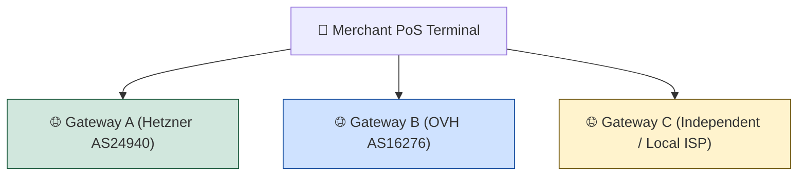
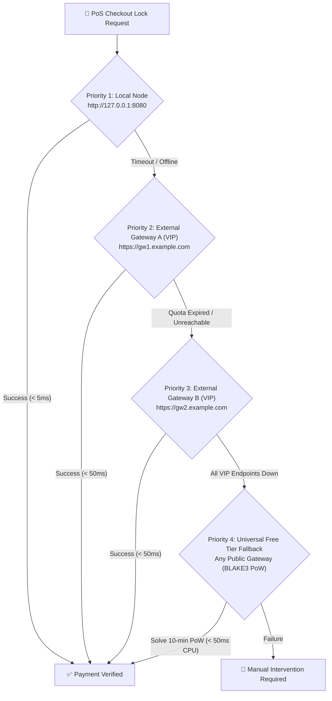

# 🛒 HuMoCo Layer-2 — Merchant & Point-of-Sale (PoS) Guide

> **Credo:** *"In decentralization there is no trust, only mathematical proofs."*  
> **Status:** Production Standard  
> **Target Audience:** Merchants, PoS terminal operators, e-commerce integrations, cashier systems.

This document serves as the canonical operations and architecture guide for **merchants**, **retailers**, and **Point-of-Sale (PoS) operators** accepting HuMoCo-based payments. It explains how to deploy and operate an ultra-fast, censorship-resistant checkout infrastructure with sub-second finality ($< 500\,\text{ms}$) and 100% uptime guarantees.

---

## 🧭 1. Executive Summary & Merchant Value Proposition

HuMoCo Layer-2 is an asynchronous, cryptographic **Collision Lock Registry**. It prevents double-spending without requiring central clearinghouses, banking intermediaries, or slow blockchain block times.

```mermaid
flowchart LR
    Customer["📱 Customer (App / Card)<br>Signs voucher transfer offline<br>(No internet required!)"]
    -->|NFC / QR Handover| POS["🏪 Merchant PoS Terminal<br>Verifies lock & releases goods"]
    -->|Hot-Path Ingress (< 5ms)| Node["⚙️ Local Node / Gateway<br>14/20 Shard Attestations"]
```

### Key Merchant Advantages:
* **Zero Transaction Fees:** No percentage-based interchange fees (0.00% base fees).
* **Instant Finality:** Hot-path processing takes $< 5\,\text{ms}$ on local nodes, with end-to-end checkout confirmed in $500\text{--}1,000\,\text{ms}$.
* **Offline-Tolerant Handover:** The customer needs no internet connection at the cashier counter; transfer intent is signed locally and handed over via NFC, BLE, or QR code.
* **Sovereignty & Anti-Censorship:** No third party can freeze merchant accounts, reverse settled transactions, or block checkout terminals.

---

## ⚡ 2. "Your Own Node in 5 Minutes" (Localhost Setup)

Operating a dedicated local node directly inside your store or branch office provides the highest level of reliability, zero WAN latency, and complete autonomy.

### Hardware Options (~30€ – 70€, ~5W Power):
* **Raspberry Pi 5 (4GB or 8GB):** ~$60–70€, idle power consumption ~4–5W (~12–15€ electricity/year).
* **Refurbished Mini PC (Intel N100 / Dell Wyse / Lenovo Tiny):** ~$40–80€, robust x86-64 architecture, ~6W idle power.
* **Existing Store Server / Router / NAS:** 0€ additional hardware, running as a lightweight Docker container or systemd service.

```mermaid
flowchart TD
    subgraph StoreLAN["🏪 Merchant Store Local Area Network (LAN)"]
        POS1["🛒 Checkout Terminal 1"] -->|HTTP http://127.0.0.1:8080| LocalNode["⚙️ Local HuMoCo Node\n(Raspberry Pi 5 / Mini PC)"]
        POS2["🛒 Checkout Terminal 2"] -->|HTTP http://192.168.1.100:8080| LocalNode
        LocalNode -->|Internal RAM Index < 1µs| RAM["⚡ RAM Cache"]
    end
    LocalNode <==>|QUIC UDP: 9090 (P2P Mesh)| WAN["🌐 HuMoCo P2P Shard Network"]
```

### 5-Minute Installation Steps:

#### Step 1: Install the binary
```bash
# Download and install the pre-compiled binary (Linux ARM64 / x86-64)
curl -sSL https://get.humoco.org/install.sh | sudo bash
```

#### Step 2: Initialize node identity
```bash
# Generate node keys and configuration
sudo -u humoco humoco init --path /etc/humoco/humoco.toml --with-key
```
> [!IMPORTANT]
> **Write down the 12 BIP-39 recovery words** displayed on the screen. Store them in a physical safe.

#### Step 3: Start the service
```bash
sudo systemctl enable --now humoco-node.service
```

#### Step 4: Verify local health
```bash
curl -s http://127.0.0.1:8080/v1/node-status
```
Response: `{"status":"ok","version":"1.0.0","active_shards":65536,...}`

Your PoS terminals can now submit locks directly to `http://127.0.0.1:8080/v1/lock` with **0 ms WAN roundtrip**.

---

## 🛡️ 3. The 3-Gateway Rule (Redundancy & Anti-Fragility)

Whether you run a local node or rely on hosted infrastructure, **never depend on a single gateway endpoint**.



### The 3 Core Requirements:
1. **At Least 3 Independent Operators:** Configure your PoS system with endpoints managed by at least three distinct organizations or operators.
2. **At Least 2 Distinct Autonomous Systems (ASNs):** Ensure gateways are hosted across different data centers / network backbones (e.g., Hetzner + OVH + AWS/Residential) to survive major cloud or BGP routing outages.
3. **Never > 50% Traffic via a Single Operator:** Distribute regular lock traffic across all configured gateways (or use primary-with-instant-failover) so that no single operator possesses operational leverage over your business.

---

## 💰 4. Cost Matrix & Total Cost of Ownership (TCO)

Choosing the optimal deployment architecture depends on transaction volume and IT infrastructure:

| Criteria | 🍓 Own Raspberry Pi 5 / Mini PC | ☁️ Cloud VPS (Hetzner / Netcup) | 🏢 Hosted Commercial Gateway | 🏆 Recommended Hybrid Model |
| :--- | :--- | :--- | :--- | :--- |
| **Initial Hardware** | ~50 € – 80 € (One-off) | 0 € | 0 € | ~50 € – 80 € (One-off) |
| **Monthly Cost** | ~1.20 € (Electricity @ ~5W) | ~3.50 € – 5.00 € / month | Pay-per-use ($\mu\text{BJ}$ tokens) | ~1.20 € + token reserve |
| **Ingress Latency** | **$< 1\,\text{ms}$** (Local LAN) | ~15 – 35 ms (WAN) | ~20 – 50 ms (WAN) | **$< 1\,\text{ms}$** (Primary LAN) |
| **Internet Outage Resilience** | **High** (Local store locks continue) | **Zero** (Requires active WAN) | **Zero** (Requires active WAN) | **Maximum** (Local + 2 WAN fallbacks) |
| **Maintenance Effort** | Low (Automatic updates/systemd) | Low (Standard Linux VPS) | Zero (Managed by third-party) | Low |
| **Sovereignty & Privacy** | **100% Local / Self-Custody** | High (Encrypted disk) | Dependent on gateway operator | **100% Local Sovereignty** |

> [!TIP]
> **The Hybrid Architecture (Gold Standard):**  
> Run a local Raspberry Pi 5 node in your store as the primary gateway (`http://127.0.0.1:8080`) and configure two reputable external public/VIP gateways as secondary fallbacks. This guarantees sub-millisecond checkouts during normal operation and uninterrupted business continuity if the local device undergoes maintenance.

---

## 🦺 5. "Your Universal Safety Net: Tier 3 Free Fallback"

HuMoCo's ingress architecture guarantees that **a merchant can NEVER be locked out of the payment network**, even if all commercial providers fail, quotas expire, or network censorship is attempted.



### The 4-Priority Fallback Cascade in PoS Terminals:

1. **Priority 1: Localhost VIP / Local Node (`http://127.0.0.1:8080`)**
   - Direct local memory check ($< 1\,\mu\text{s}$ RAM CAS), zero PoW, maximum throughput.
2. **Priority 2: Primary External VIP Gateway (`https://gw1.merchant-alliance.org`)**
   - Authenticated via blind `AccountTag`, reserved high-priority queue, zero PoW.
3. **Priority 3: Secondary External VIP Gateway (`https://gw2.backup-node.net`)**
   - Redundant failover across a separate ASN.
4. **Priority 4: Universal Free Tier Fallback (Any Public Gateway)**
   - **Stateless BLAKE3 Hashcash PoW:** If all VIP quotas are exhausted or paid endpoints are unreachable, the PoS client seamlessly calculates a stateless PoW puzzle ([`pow.rs`](crates/humoco-node/src/ingress/pow.rs)).
   - **Zero Pre-Latency:** Challenges are deterministically valid within a 10-minute time window. A modern PoS processor solves the puzzle in $< 50\,\text{ms}$.
   - **Result:** Checkouts proceed without interruption. The customer at the counter never notices an outage.

---

## 🌐 6. Why Support Gateways with Free Tier (The Game Theory of the Commons)

In the HuMoCo ecosystem, gateway operators can enable `free_tier_enabled: true` in their configuration to accept anonymous, PoW-protected transactions alongside paid VIP traffic.

### Why Merchants Should Prefer & Sponsor Free-Tier Gateways:

1. **Anti-Monopoly Insurance:** A healthy network of free-tier gateways ensures that commercial gateway providers can never form an oligopoly or artificially inflate pricing.
2. **Customer Onboarding Friction:** New customers, tourists, and casual users rely on the Free Tier for their first transactions before acquiring dedicated byte-years quotas. A thriving Free Tier maximizes merchant customer reach.
3. **Emergency Redundancy for All:** When large-scale cloud outages impact commercial providers, the decentralized commons of free-tier gateways serves as the universal evacuation net for all network participants.
4. **Game-Theoretic Alignment:** By allocating a small fraction of byte-years token sponsorship to public gateway operators who provide verified Free Tier access, merchant communities secure their own operational independence at minimal cost.

---

## 📋 7. PoS Integration Checklist

Before deploying your cashier or terminal integration to production, verify the following checklist:

- [ ] **Redundant Endpoints Configured:** At least 3 independent gateway URLs configured in PoS software.
- [ ] **ASN Diversity Verified:** Configured gateways reside on at least 2 distinct Autonomous Systems.
- [ ] **Localhost Preferred:** Primary endpoint points to local node (`http://127.0.0.1:8080`) if on-premise hardware is available.
- [ ] **Tier 3 PoW Enabled:** PoS software has BLAKE3 Hashcash solver enabled for automatic Free Tier fallback.
- [ ] **Timeout Budget Set:** Per-gateway timeout set to $500\text{--}1,000\,\text{ms}$ with fast failover abort.
- [ ] **Quota Monitoring:** Telegram / Webhook alerts configured for Byte-Years balance warnings.
- [ ] **Mnemonic Key Safekeeping:** 12 BIP-39 recovery words backed up offline in a fireproof safe.
