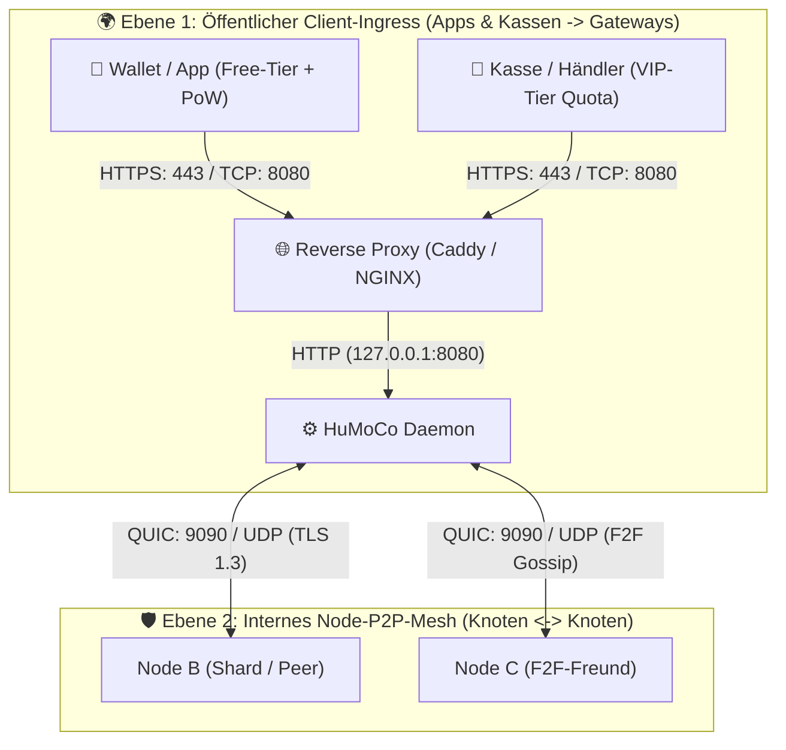

# 🛠️ HuMoCo Layer-2 — Operations & DevOps Guide

> **Credo:** *"In der Dezentralität gibt es kein Vertrauen, nur mathematische Beweise."*  
> **Gültigkeit:** Produktionsbetrieb für Bare-Metal, Linux-VPS und Container-Umgebungen (`humoco-node`).

Dieses Dokument ist das verbindliche Handbuch für **Systemadministratoren**, **DevOps-Engineers** und **Knotenbetreiber** (Node Operators) des dezentralen HuMoCo Layer-2 Sperrregisters.

---

## 🧭 1. Architektur & 2-Tier Netzwerk-Modell

HuMoCo trennt strikt zwischen zwei völlig unterschiedlichen Netzwerk-Ebenen:



* **Ebene 1 – Client-Ingress (REST-API auf TCP 8080 / Reverse Proxy 443):**
  * Öffentliche Schnittstelle für Wallets, Kassen und Apps (`POST /v1/lock`, `POST /v1/status`).
  * Jeder Client ist willkommen (Permissionless). Schutz erfolgt über zustandsloses BLAKE3-Hashcash-PoW (Free-Tier) oder VIP-Quota-Tokens.
  * **Wichtig:** Niemals den internen Port 8080 ungeschützt ins WAN exponieren; stets einen TLS-Terminierungs-Proxy (Caddy / NGINX) vorschalten!

* **Ebene 2 – Node-P2P-Mesh (QUIC auf UDP 9090):**
  * Verschlüsselte Knoten-zu-Knoten-Kommunikation via QUIC (TLS 1.3 mit Ed25519-Zertifikaten).
  * F2F-Gossip (Heartbeats, Topologie) läuft **ausschließlich** zwischen autorisierten Freunden (`f2f.trusted_pubkeys`).
  * Shard-RPCs (Lock-Verifikation) laufen direkt zwischen Shard-Knoten (`known_network_nodes`).
  * Unbekannte Initiatoren auf Port 9090 werden auf P2P-Ebene hart abgewiesen.

---

## 🔌 2. Port- & Schnittstellen-Matrix

| Port / Pfad | Protokoll | Richtung | Beschreibung & Zweck | Zugriff |
| :--- | :--- | :--- | :--- | :--- |
| **`9090/udp`** | QUIC / UDP | Inbound + Outbound | **P2P Node-Mesh:** F2F-Gossip, Shard-RPCs, Sync | **Öffentlich (Internet)** |
| **`8080/tcp`** | HTTP / TCP | Inbound (Lokal) | **Client-Ingress API:** `/v1/lock`, `/v1/status` | **Nur Localhost / Intern** |
| **`443/tcp`** | HTTPS / TCP | Inbound | **Öffentlicher Ingress-Proxy:** Caddy / NGINX | **Öffentlich (Internet)** |
| **`80/tcp`** | HTTP / TCP | Inbound | ACME Let's Encrypt Challenge & HTTPS-Redirect | **Öffentlich (Internet)** |
| **`humoco.sock`** | UNIX Socket | Lokal IPC | **Admin Control-CLI:** Status, Peers, Quota-Topup | **Nur Root / User `humoco`** |

> [!CAUTION]
> **Port `9090` nutzt ausschließlich UDP!** QUIC baut auf UDP auf. Wenn in Ihrer Firewall nur `9090/tcp` freigegeben ist, kann der Knoten **keine** P2P-Verbindungen aufbauen oder annehmen!

---

## 🧱 3. Firewall-Konfiguration (UFW & iptables)

### UFW (Ubuntu / Debian Standard)
```bash
# 1. Standard-Regeln: Eingehend blockieren, ausgehend erlauben
sudo ufw default deny incoming
sudo ufw default allow outgoing

# 2. SSH-Zugang absichern
sudo ufw allow 22/tcp comment "SSH Admin"

# 3. Web-Proxy für Client-Ingress (Caddy / NGINX)
sudo ufw allow 80/tcp comment "HTTP ACME & Redirect"
sudo ufw allow 443/tcp comment "HTTPS Client Ingress API"

# 4. HuMoCo P2P-Mesh (Zwingend UDP!)
sudo ufw allow 9090/udp comment "HuMoCo QUIC P2P Mesh"

# 5. Firewall aktivieren
sudo ufw enable
sudo ufw status verbose
```

> [!WARNING]
> Port `8080` darf **niemals** in der Firewall freigegeben werden (`ufw status` darf `8080` nicht listen), da der Client-Traffic über Caddy/NGINX geleitet werden muss.

---

## 🐳 4. 5-Minuten Quickstart mit Docker Compose

Die empfohlene Bereitstellung für automatisierte Umgebungen mit integriertem Caddy-Proxy (automatische Let's Encrypt TLS-Zertifikate).

### Schritt 1: Repository klonen
```bash
git clone https://github.com/humoco/human-money-node.git
cd human-money-node
```

### Schritt 2: Node-Identität & Konfiguration initialisieren
Führen Sie den CLI-Container einmalig aus, um den Ed25519-Node-Key und die `humoco.toml` im Volume zu generieren:
```bash
docker compose -f deploy/docker/docker-compose.yml run --rm humoco-node \
    init --path /config/humoco.toml --with-key
```
> [!IMPORTANT]
> **Notieren Sie sich sofort die 12 BIP-39-Wörter**, die bei der Initialisierung ausgegeben werden! Dies ist Ihr einziger Backup-Wiederherstellungsschlüssel.

### Schritt 3: Domain im Caddyfile anpassen
Bearbeiten Sie `deploy/caddy/Caddyfile` und ersetzen Sie `api.example.com` durch Ihre öffentliche Domain:
```caddyfile
api.ihre-domain.de {
    reverse_proxy humoco-node:8080
    ...
}
```

### Schritt 4: Stack starten
```bash
# Im Hintergrund starten
docker compose -f deploy/docker/docker-compose.yml up -d

# Live-Logs ansehen
docker compose -f deploy/docker/docker-compose.yml logs -f
```

### Schritt 5: Status überprüfen
```bash
docker compose -f deploy/docker/docker-compose.yml exec humoco-node \
    humoco status --config /config/humoco.toml
```

---

## 🐧 5. 5-Minuten Quickstart mit Systemd (Ubuntu / Debian Bare-Metal / VPS)

Für maximale I/O-Performance ($< 1\,\mu\text{s}$ RAM-Index-Latenz, direkte redb ACID-Flushes).

### Schritt 1: Binary bauen und installieren
```bash
# Rust Toolchain installieren (falls nicht vorhanden)
curl --proto '=https' --tlsv1.2 -sSf https://sh.rustup.rs | sh -s -- -y
source $HOME/.cargo/env

# Binary kompilieren
cargo build --release -p humoco-node

# Binary systemweit installieren
sudo cp target/release/humoco-node /usr/local/bin/humoco
sudo ln -sf /usr/local/bin/humoco /usr/local/bin/humoco-node
sudo chmod +x /usr/local/bin/humoco
```

### Schritt 2: Systembenutzer und Verzeichnisse anlegen
```bash
# Dedizierten System-Benutzer 'humoco' anlegen
sudo useradd -r -s /usr/sbin/nologin -d /var/lib/humoco -m humoco

# Konfigurations- und Datenverzeichnisse erstellen
sudo mkdir -p /etc/humoco /var/lib/humoco/data
sudo chown -R humoco:humoco /etc/humoco /var/lib/humoco
sudo chmod 750 /etc/humoco /var/lib/humoco
```

### Schritt 3: Node-Schlüssel und Konfiguration generieren
```bash
# Als Benutzer 'humoco' initialisieren
sudo -u humoco humoco init --path /etc/humoco/humoco.toml --with-key
```
Die Ausgabe enthält:
* 12-Word Recovery Mnemonic (unbedingt sicher sichern!)
* Public Key (Hex) & `did:key`
* Connection String: `<pubkey>@<ip>:9090`

Passen Sie bei Bedarf `/etc/humoco/humoco.toml` an (z. B. `advertised_addr = "203.0.113.10:9090"`).

### Schritt 4: Systemd-Service aktivieren und starten
```bash
# Service-Datei kopieren
sudo cp deploy/systemd/humoco-node.service /etc/systemd/system/

# Daemon neu laden, aktivieren und starten
sudo systemctl daemon-reload
sudo systemctl enable --now humoco-node.service

# Status prüfen
sudo systemctl status humoco-node.service
```

### Schritt 5: Reverse Proxy (Caddy oder NGINX) einrichten
Installieren Sie Caddy:
```bash
sudo apt install -y debian-keyring debian-archive-keyring apt-transport-https curl
curl -1sLf 'https://dl.cloudsmith.io/public/caddy/stable/gpg.key' | sudo gpg --dearmor -o /usr/share/keyrings/caddy-stable-archive-keyring.gpg
curl -1sLf 'https://dl.cloudsmith.io/public/caddy/stable/debian.deb.txt' | sudo tee /etc/apt/sources.list.d/caddy-stable.list
sudo apt update && sudo apt install -y caddy

# Caddyfile hinterlegen (auf 127.0.0.1:8080 anpassen)
sudo sed -i 's/humoco-node:8080/127.0.0.1:8080/g' deploy/caddy/Caddyfile
sudo cp deploy/caddy/Caddyfile /etc/caddy/Caddyfile
sudo systemctl restart caddy
```

---

## 🔑 6. Node-Identität & Mnemonic-Backup (BIP-39)

### Die Identität des Knotens
Ein HuMoCo-Knoten besitzt keine Benutzerkonten. Seine Identität basiert ausschließlich auf einem **Ed25519-Schlüsselpaar**:
* **Privater Schlüssel:** Liegt in `node_key.bin` (strikte POSIX-Rechte `0600`).
* **Knoten-ID:** Kanonischer `BLAKE3(pubkey)` Hash.
* **Wiederherstellung:** Standardisiertes **12-Wort BIP-39 Mnemonic** (KDF: PBKDF2-HMAC-SHA512 mit 2048 Runden).

### Backup des Schlüssels
* **Mnemonic:** Notieren Sie die 12 Wörter offline (Papier / Hardware-Safe).
* **Dateibackup:** Sichern Sie die Datei `node_key.bin` verschlüsselt:
  ```bash
  sudo cp /var/lib/humoco/node_key.bin /backup/path/
  ```

### Wiederherstellung auf einem neuen Server (Disaster Recovery)
Sie können einen ausgefallenen Knoten mit den 12 Wörtern auf jedem neuen Host in Sekunden wiederherstellen:
```bash
humoco init --path /etc/humoco/humoco.toml \
    --mnemonic "word1 word2 word3 word4 word5 word6 word7 word8 word9 word10 word11 word12" \
    --force
```
Der private Schlüssel wird identisch regeneriert und der Knoten behält seine gewohnte `NodeId` und Reputation im F2F-Mesh.

---

## 🤝 7. F2F-Peering Setup (Friend-to-Friend)

HuMoCo flutet keine Nachrichten unkontrolliert ins Internet. Das P2P-Mesh basiert auf vertrauensvollen Friend-to-Friend (F2F) Kanten (Dunbar-Gossip).

### Verbindungs-String ermitteln
Operator A ermittelt seinen Verbindungs-String:
```bash
humoco status
# Oder direkt über:
humoco peers
```
Ausgabe:
```text
Connection string: 4f8a2b...c3d1@203.0.113.10:9090
```

### Gegenseitiges Peering eintragen
Operator A und Operator B tauschen ihre Verbindungs-Strings über einen sicheren Kanal (Signal, GPG-Mail, persönliches Treffen) aus.

In `/etc/humoco/humoco.toml` von **Operator A**:
```toml
[f2f]
peers = [
    "9a7e1c...4f2a@198.51.100.42:9090",  # Operator B
]
```

In `/etc/humoco/humoco.toml` von **Operator B**:
```toml
[f2f]
peers = [
    "4f8a2b...c3d1@203.0.113.10:9090",  # Operator A
]
```

Knoten neu laden / neu starten:
```bash
sudo systemctl restart humoco-node
```

Prüfen, ob die F2F-Verbindung aktiv ist:
```bash
### Die 5-Finger-Regel für F2F-Kanten (5-Finger Rule for F2F Edges)

Bevor Sie eine F2F-Freundschaftskante in Ihre `humoco.toml` eintragen, prüfen Sie strikt die folgende 5-Punkte-Checkliste:

1. 👤 **Persönliche Bekanntschaft (Personal Acquaintance):** Sie kennen die Person hinter dem Knoten im realen Leben und haben die Identität verifiziert.
2. 📍 **Physischer Standort bekannt (Physical Location Knowledge):** Sie wissen, in welchem Ort / welcher Region der Knoten betrieben wird (Schutz vor anonymen Botnet-Clustern).
3. 🔄 **Symmetrie & Gegenseitigkeit (Symmetry):** Beide Seiten tragen den Peer gegenseitig ein. Einseitige Peering-Versuche werden ignoriert.
4. 🔍 **Bestehende Freunde prüfen (Existing Friends Check):** Prüfen Sie stichprobenartig, mit wem Ihr Peer verbunden ist, um isolierte Sybil-Inseln zu vermeiden.
5. 🚫 **Null-Handels-Politik (Zero Trade/Bribe Policy):** F2F-Slots dürfen niemals für Geld, Token oder Gefälligkeiten gehandelt werden. Sie basieren rein auf sozialem Vertrauen.

---

## 🛒 8. Für Händler & Kassenbetreiber (For Merchants & PoS Operators)

Für Händler, Filialisten und Kassenbetreiber (PoS) gelten besondere Anforderungen an Verfügbarkeit, Ausfallsicherheit und Latenz ($< 500\,\text{ms}$).

> [!IMPORTANT]
> **Vollständiger Leitfaden:** Siehe [`docs/MERCHANT_GUIDE.md`](MERCHANT_GUIDE.md) für detaillierte Hardware-Empfehlungen (Raspberry Pi 5 / Mini PC für ~30–70 €), Kosten-Matrizen und Latenz-Tuning.

### Kritische Betriebsregeln für Kassen & PoS-Systeme:
1. **Die 3-Gateway-Regel (3-Gateway Rule):**
   * Konfigurieren Sie in Kassen-Terminals **mindestens 3 unabhängige Gateway-Betreiber**.
   * Verteilen Sie die Gateways über **mindestens 2 verschiedene Autonome Systeme (ASNs)** (z. B. Hetzner + OVH + lokaler Provider).
   * Leiten Sie **niemals mehr als 50 %** Ihres Lock-Traffics über einen einzigen Betreiber.
2. **Universelles Sicherheitsnetz: Tier-3 Free Fallback:**
   * Konfigurieren Sie Terminals so, dass sie bei Ausfall aller VIP-Endpunkte oder abgelaufenen Quotas **automatisch auf das zustandslose BLAKE3-Hashcash-PoW** (Free Tier) zurückgreifen (4-Stufen-Fallback-Kaskade).
   * Dadurch wird verhindert, dass Kassen bei ISP-Störungen oder Backend-Wartungen blockieren.

---

## 💎 9. VIP-Quotas & Händler-Guthaben (Control-Socket)

Kassen und VIP-Kunden erhalten bevorzugte Bearbeitung ohne PoW über Byte-Jahre-Guthaben.

### Quota aufladen (Top-Up)
```bash
# 50 GiB-Jahre Guthaben auf Händler-Account gutschreiben
humoco quota topup --account "shop_berlin_01" --byte-years 53687091200
```

### Quota abfragen
```bash
humoco quota get --account "shop_berlin_01"
```

---

## 🔍 10. Troubleshooting & Überwachung

### 1. Log-Inspektion
```bash
# Systemd Live-Logs mit Zeitstempeln
sudo journalctl -u humoco-node.service -f -o cat

# Docker Compose Logs
docker compose -f deploy/docker/docker-compose.yml logs -f --tail=100
```

### 2. Live-Status via UNIX Control-Socket
```bash
humoco status
```
Zeigt:
* Node ID und Public Key
* Uptime und dezentrale Median-Netzwerkzeit (`SimTime`)
* Aktive Ingress-Locks im RAM-Index
* redb Storage-Größe und Flush-Queue-Füllstand
* Verbundene F2F-Peers und Shard-RPC-Verbindungen

### 3. Typische Fehler und Lösungen

#### Problem: Keine Peers verbinden sich (`humoco peers` bleibt leer)
* **Ursache 1:** Port `9090/udp` wird durch Host-Firewall oder Cloud-Provider (AWS Security Group, Hetzner Firewall) blockiert.
  * *Lösung:* Prüfen, ob UDP freigegeben ist: `sudo ufw allow 9090/udp`.
* **Ursache 2:** `advertised_addr` ist nicht gesetzt oder zeigt auf eine interne IP.
  * *Lösung:* In `humoco.toml` unter `[network]` die öffentliche WAN-IP eintragen: `advertised_addr = "<ÖFFENTLICHE_IP>:9090"`.

#### Problem: HTTP 429 Too Many Requests bei `POST /v1/lock`
* **Ursache 1:** Der Client sendet unzureichendes BLAKE3-PoW bei hoher Netzwerklast.
  * *Lösung:* Client muss den Header `X-Required-Difficulty` auswerten und die Nonce berechnen (`GET /v1/pow-challenge`).
* **Ursache 2:** Asynchrone Flush-Queue ist voll (Reservation-First Backpressure).
  * *Lösung:* I/O-Performance des Datenträgers prüfen (SSD/NVMe empfohlen).

#### Problem: `Permission Denied` auf `node_key.bin`
* **Ursache:** Die Datei gehört nicht dem Benutzer `humoco` oder besitzt unsichere POSIX-Rechte.
  * *Lösung:*
    ```bash
    sudo chown humoco:humoco /var/lib/humoco/node_key.bin
    sudo chmod 600 /var/lib/humoco/node_key.bin
    ```

#### Problem: Uhrzeit weicht ab (`ClockSkew`)
* **Ursache:** Die Systemuhr des Hosts weicht mehr als 60 Sekunden von der Medianzeit der F2F-Nachbarn ab.
  * *Lösung:* NTP/Chrony aktivieren:
    ```bash
    sudo timedatectl set-ntp true
    sudo systemctl restart systemd-timesyncd
    ```

---

## 📈 11. Prometheus Monitoring

Der Node stellt unter `http://127.0.0.1:8080/metrics` standardkonforme Prometheus-Metriken bereit:
* `humoco_locks_total`: Gesamtzahl verifizierter Locks
* `humoco_ram_index_entries`: Anzahl aktiver Einträge im RAM-Index
* `humoco_peers_connected`: Anzahl aktiver P2P-Verbindungen
* `humoco_disk_flush_queue_depth`: Füllstand der asynchronen Disk-Flush-Queue
* `humoco_pos_latency_seconds`: Histogramm der PoS-Bearbeitungslatenz ($< 5\,\text{ms}$)
